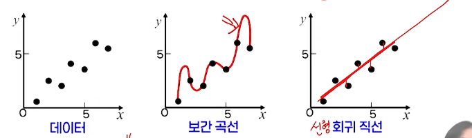
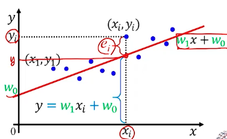
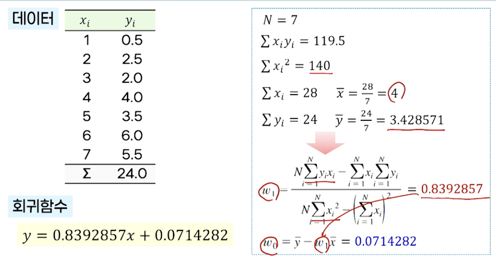

# 3강. 지도학습: 회귀

## 1. 회귀의 개념

### 회귀

- 입력변수와 출력변수 사이의 매핑 관계를 찾는 것
- 예: 시계열 예측 > 주가 예측, 환율 예측, 시장 예측, 판매 예측 등

### 회귀 시스템

- 입 출력의 관계

  - 분류 문제라는 것은 회귀의 특별한 경우로 간주할 수 있다

  

- 학습 목표

  - 예측 오류를 최소화하는 최적의 회귀함수를 찾는 것

  - 오차함수

    

### 보간법과 회귀

- 데이터의 입력과 출력의 관계를 가장 잘 표현하는 직선/곡선을 찾는 경우
- 보간법 → 제곱 오차가 0, 하지만 매우 복잡한 곡선
- 회귀 → 어느 정도 오차 존재, 데이터의 전체적 경향을 보여주는 입출력 관계 표현에 적합
- 회귀 → "데이터의 경향을 일종의 평균과 같은 값으로 되돌려준다"

## 2. 선형 회귀

### 선형회귀란?

- 입력과 출력의 관계를 선형 모델로(일차원적인 직선 형태로) 예측
- 데이터 집합 D에 대해 (x, y) 관계를 설명할 수 있는 선형함수 y=w1x + w0 = e를 찾는 것
  - w1 → 기울기
  - w0 → 절편
  - e → 오차 또는 잔차(residual)

### 좋은 선형 회귀 모델이란?

- 모든 데이터에 대한 잔차가 가능한 작아야 함

  - ei = yi - (w1xi + w0)

- 잔차의 평가 기준

  - 모든 데이터에 대한 잔차의 합(부적합)

  - **⭐️ 잔차의 제곱의 합 → 평균 제곱 오차(MSE: Mean Squared Error)** 

    - 잔차의 제곱의 합을 오차 함수로 사용

      

    - 주어진 데이터 집합에 대해 유일한 직선 생성 

- 좋은 선형 회귀 모델이란, <u>**오차함수 E(w1, w0)를 최소화하는 매개변수 w1, w0를 가진 선형함수**</u>

### 선형회귀의 최적 매개변수

- 오차함수

   

- 최적의 매개변수

  - w0, w1이 오차함수로부터 어떻게 이와 같은 매개변수를 얻었을까?

### 최적의 매개변수 계산 과정

- 오차함수

   

  - 오차함수를 w1, w0에 대해서 최소화하려면

  - 오차함수를 각 **매개변수에 대해 편미분을 수행해서 0이 되는 점을 찾음**

  - w1, w0에 대한 연립방정식 형태로 정리 

     

 

### 선형회귀의 예제

- 회귀함수 구하기

 

- 잔차의 제곱

 

### 예측과 평가

- 회귀함수를 구한 후 새로운 데이터 xnew에 대한 예측
- 테스트 데이터 집합에 대한 평가 기준
  - 평균 제곱 오차(MSE: Mean Squared Error)
  - 평균 제곱근 오차(RMSE: Root Mean Square Error)
    - 실제 차이값이 뭔지 직관적으로 이해하기 위해서
    - 제곱한 값에 > 제곱근 씌워서 값 보정하는 것

### 다변량 선형회귀

- **여러 개의 입력**을 사용해 하나의 출력을 예측하는 방법
  - 입력이 여러 개의 값으로 구성 → n차원 입력 벡터 x = {x1, x2, ..., xn}
- 입출력 관계를 설명하는 n차원 공간에서 초평면을 찾는 문제
  - 회귀 함수 → (n+1)개의 파라미터 추정이 필요

- 행렬 형태의 표현

  - 하나의 데이터에 대한 행렬 표현

   

  - 데이터 집합

     

- 오차함수 
  - E(w)
- 최적의 파라미터 w
  - 편미분
- 새로운 데이터에 대한 예측
  -  

## 3. 로지스틱 회귀

### 로지스틱 회귀

- 선형회귀분석의 종속변수(출력)을 범주형으로 확장한 것
  - 종속변수의 결과가 범주형으로 제한 → 분류 문제 적용 가능
  - 입력값이 각 클래스에 속하는 확률값을 회귀분석으로 예측

### 로지스틱 함수

- 입력 x ∈ (-∞, ∞)를 항상 (0,1) 범위로 매핑하는 S자 모양의 함수

- 로지스틱 함수를 이용한 분류

  - 로지스틱 함수의 출력값(0~1 사이의 실수값)
  - 클래스 레이블에 대한 사후 확률 P(y=1|x)로 간주
  -  
  - 로지스틱 함수를 이용한 사후확률 추정
    - 파라미터 m과 b를 가진 선형함수 활용

- 선형함수의 파라미터 **m**과 **b**값이 따라 로지스틱 함수의 형태가 달라짐

  

### 오즈비, 로짓 함수, 결정 경계

- 오즈비(odds ratio)

   

- 로짓 함수(logit function)

   

  - 오즈비에 대해 로그를 취한 것
  - 0.5 기준으로, 0.5보다 작으면 C1, 크면 C2에 속함

- 로지스틱 회귀의 결정 경계

   

### 매개 변수 m, b 추정

- 로지스틱 회귀의 매개변수 추정 - 베르누이 분포 따름
  - 베르누이 분포: 베르누이 시행은 시행 결과가 2가지(성공, 실패)로 나타나는 확률
- 새로운 목적함수 필요
  - 데이터 집합 D에 대한 로그 우도(log likelihood)
- 추정 → 최대 우도 추정법(maximum likelihood estimateion)
- 복잡한 비선형함수 → 수치적 최적화 방법으로, 반복적 추정을 통해 최적화

- 파라미터 추정 후 새로운 데이터 x의 분류 과정

   

