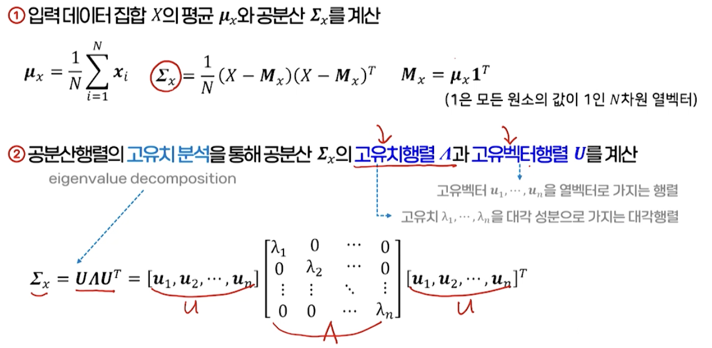
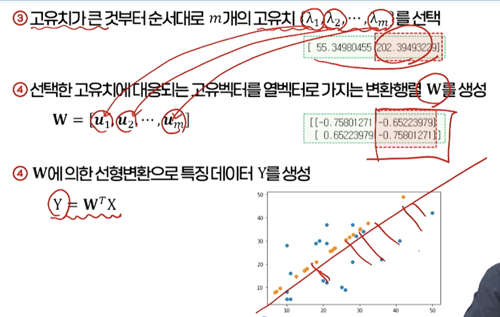
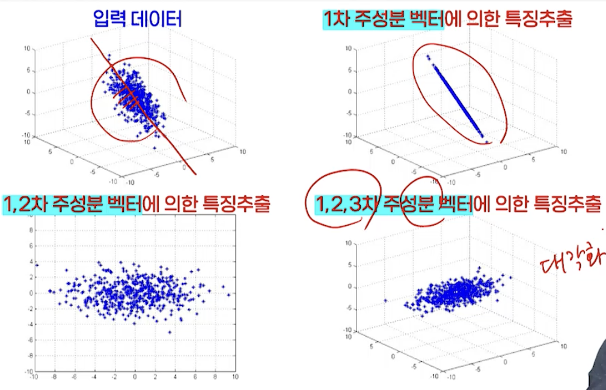
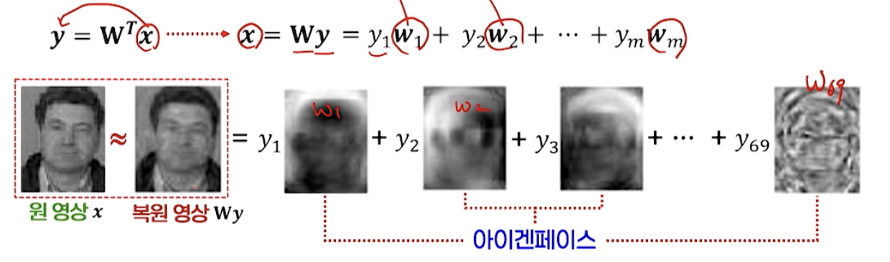
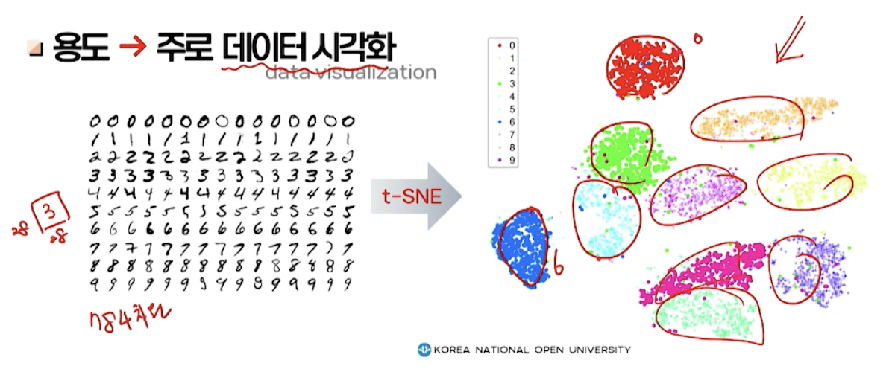

# 5강. 데이터 표현: 특징 추출

## 1. 선형 변환에 의한 특징 추출

### 특징 추출

- 주어진 원래 데이터 x를 변환해, 새로운 특징 벡터 y로 표현하는 것

   

- 목적

  - 데이터 분석에 불필요한 정보를 제거하고, 핵심이 되는 정보만 추출
  - 차원 축소를 통한 학습 시스템의 효율 향상

### 변환 함수

- 변환함수의 종류
  - **선형변환**
    - n차원 열벡터 x에 변환행렬 W(nxm)을 곱해 m차원 특징을 획득
    - 통계적 방법을 사용해 특징벡터 y가 원하는 분포가 되도록 하는 W를 찾는 것이 목적
  - 비선형 변환
    - 복잡한 비선형함수를 이용해, n차원 벡터를 m차원 벡터로 매핑하는 것
    - 접근 방법 → 수작업에 의한 특징 추출, 표현학습

### 특징 추출을 위한 접근 방법

- 수작업에 의한 특징 추출

  - 입력 데이터의 종류, 특성과 분석 목적에 맞는 적절한 특징을 개발자가 일일이 설계

  - 숫자 인식을 위한 특징

     

  - 영상 분석을 위한 특징 → 에지, 가로/세로방향 성분 등

  - 문서 분석을 위한 특징 → 단어의 발생 빈도 등

- 표현학습(representative learning)

  - 특징 추출을 위한 비선형 변환함수를 신경망 등의 머신러닝 모델로 표현

  - 학습을 통해 분석이 잘 되도록 하는 최적화된 변환함수를 찾는 것

  - 예: 딥러닝 모델을 이용한 얼굴인식용 특징추출

    

### 선형변환에 의한 특징 추출

- 차원축소 관점에서의 특징추출

  - 부분공간분석 subspace analysis

     

  - 행렬의 곱셈

     

  - 특징값

     

- 2차원 데이터 x를 1차원 특징값 y로 변화

  

  

## 2. 주성분분석법

### 주성분분석

- 목적
  - 변환 전의 데이터 X가 갖고 있는 정보를 차원 축소 후에도 최대한 유지하는 W를 찾는 것
  - 데이터 집합이 가능한 넓게 퍼질 수 있는 방향으로 사영 수행
  - 데이터 집합의 분산이 가장 큰 방향으로 선형변환을 수행
  - 데이터 집합의 분산이 가장 큰 방향
    - 공분산행렬의 고유벡터 중 그 고유치가 가장 큰 것으로 정해지는 방향
- 데이터 집합의 공분산행렬에 대한 고유치분석을 통해 고유치와 고유벡터를 찾은 후, 고유치가 가장 큰 값부터 순서대로 이에 대응하는 m개의 고유벡터를 찾아서 행렬 W를 구성

### PCA 알고리즘의 수행 단계

### PCA 적용의 예

### PCA의 수학적 유도

- 축소되는 차원 m을 선택하는 기준

   

### [예] 얼굴 영상의 표현

- n차원의 얼굴 영상을 m개의 기저벡터를 사용해서 표현

  - n차원을 m차원으로 축소(n>>m)

  - 좋은 기저벡터(w를 구성하는 각 열벡터) > Eigenface

    - Eigenface > 얼굴 영상에 PCA를 적용해 찾아진 고유벡터를 영상으로 표현한 것

      

### PCA의 특성과 문제점

- 데이터 분석에 대한 특별한 목적이 없는 경우에 가장 합리적인/일반적인 차원 축소 방법으로 사용

- 선형 변환의 한계

  - 근본적 문제: 데이터의 비선형 구조를 반영하지 못함

  

- 비지도학습

  - 클래스 레이블 정보를 활용하지 않음

  - 즉, 분류의 핵심 정보의 손실 초래 가능성 있음

     

  - 분류에 적합한 특징 추출을 하려면
    - 데이터의 클래스 정보를 활용하는 지도학습이 필요
    - 선형판별분석(LDA)

  

## 3. 선형판별분석법

### 선형판별분석

- 목적

  - 클래스 레이블 정보 적극 활용 > 클래스간 판별이 잘 되는 방향으로 차원 축소

     

  - 분류에 적합한 특징의 방향이란?
    - 각 클래스가 가능한 서로 멀리 떨어질 수 있도록 거리를 유지하는 방향

### LDA: 이진 분류

- 클래스간 거리에 대한 목적함수

### LDA: 다중 클래스 분류

- 목적함수: 각 클래스 내의 산점도는 작게, 클래스 간의 산점도는 크게

  

- 목적함수를 최대로하는 변환행렬 W

  

### LDA 알고리즘의 수행 단계

1. 입력 데이터 집합 X를 각 클래스 레이블에 따라 M개의 클래스로 나누어 각각 평균 mk와 클래스간 산점행렬 SB, 그리고 클래스 내 산점행렬 Sw를 계산

2. 고유치 분석을 통해 행렬 의 고유치행렬과 고유벡터행렬을 계산

3. 고유치가 큰 것부터 순서대로 m개의 고유치를 선택

4. 선택한 고유치에 대응되는 고유벡터를 열벡터로 가지는 변환행렬 W를 생성

5. W에 의한 선형변환으로 특징 데이터 Y를 생성

    

### LDA의 특성과 문제점

- 지도학습 능력
- 선형변환의 한계
  - 복잡한 비선형 구조를 가진 경우에는 적절한 변환이 불가능
    - 해결 방안 → 커널법, 비선형 매니폴드 학습법 등 활용
- 선택하는 고유벡터의 개수(축소된 특징 차원) m의 결정
  - 일반적 방법  → 직접 분류를 통해 얻어지는 데이터에 대한 분류율을 기준으로 결정
  - 행렬
    - 클래스 개수 = M개 → 특징 벡터는 최대 (M-1) 차원

- 작은 표본집합의 문제

  - 입력 데이터의 수가 입력 차원보다 작은 경우

    - 클래스 내 산점행렬의 역행렬이 존재하지 않음
    - (실용적 접근법) PCA로 먼저 차원축소 후 이에 대해 LDA 적용

    

## 4. 거리 기반 차원 축소 방법

### 거리 기반 차원 축소 방법

- 목적  → 두 데이터 쌍 간의 거리를 최대한 유지하는 방향으로 차원 축소

   

- 거리 함수의 정의에 따라 다양한 방법이 존재

  - 다차원 척도법(MDS: Multi-Dimensional Scaling)
    - 유클리디안 거리 사용
  - t-SNE(t-Stochastic Neighbor Embedding)
    - 확률밀도함수를 활용해 거리를 정의
  - Isomap
    - 측지 거리(geodesic distance)

### 다차원 척도법

- 거리행렬 D가 값으로 정의되거나, 입력값에 의해 유클리디안 거리 사용

### t-SNE

- 데이터 간의 거리와 특징 간의 거리를 조건부확률을 이용한 유사도로 정의

  - 입력 데이터: 가우시안 분포 가정

     

  - 특징 데이터: t-분포 사용  → 거리가 멀리 떨어진 데이터 사이의 관계를 더 잘 반영하도록 개선

     

- 반복적으로 특징값을 업데이트하는 학습 과정을 통해 두 분포가 서로 가까워지도록 하는 특징값을 찾음

  - 얻어진 특징값은 원래 데이터가 가지는 확률적 유사도를 잘 표현

### Isomap

- 측지 거리를 사용하는 차원축소 방법

  - 데이터를 정점으로 가지는 그래프 간의 경로를 다익스트라 알고리즘으로 계산

  

### 거리 기반 차원 축소 방법의 특징

- 입력 데이터와 특징 데이터 간의 매핑 함수를 정의하지 않음

  - 저차원 특징값에 대한 목적함수를 정의하고, 이를 최적화하는 특징값을 찾는 과정

    - 새로운 데이터에 대해서는 그에 대응하는 특징값을 찾을 수 없음

  - 용도  → 주로 데이터 시각화

    

