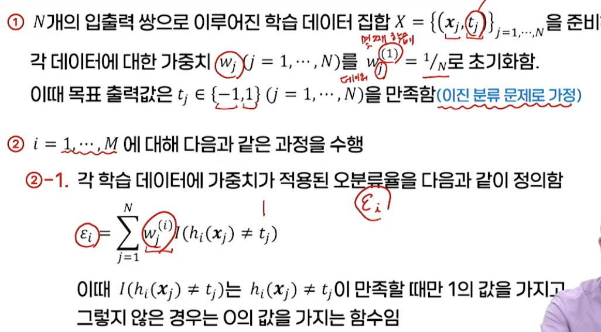
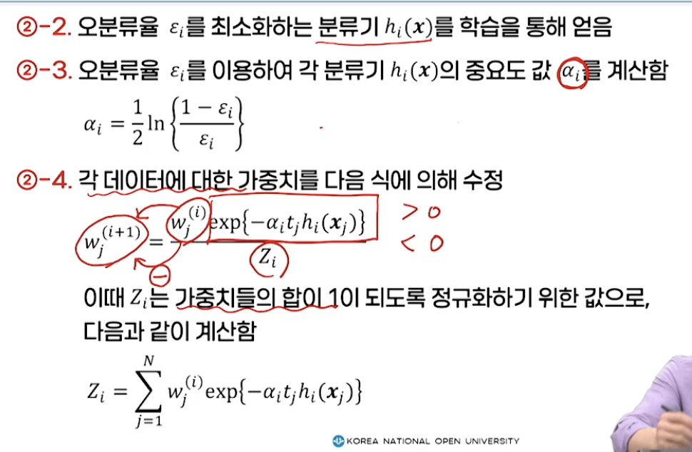
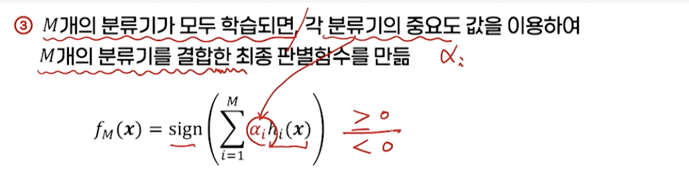
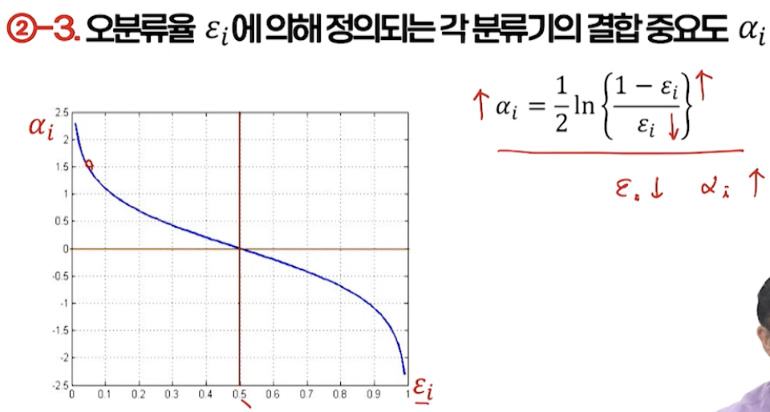
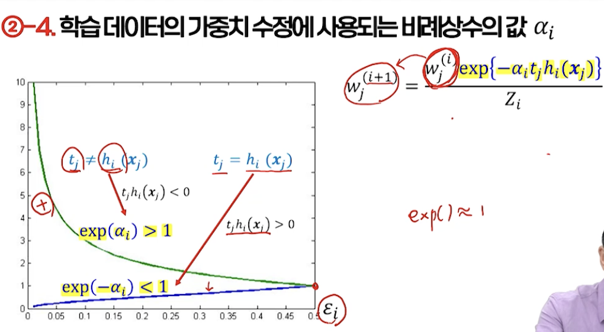

# 6강. 앙상블 학습

## 1. 앙상블 학습의 개념

### 학습기 결합

- 앙상블 학습(ensemble learning)

  - 선형 분류기와 같은 간단한 학습기로 학습을 수행하지만, 복수 개의 간단한 학습기를 결합함으로써 결과적으로 더 좋은 성능을 가진 학습기를 만드는 방법

  

### 학습기 결합에서 고려사항

- 학습기의 차별화 방법
  - 학습 알고리즘의 차별화
    - 접근 방법 자체가 서로 다른 학습기 선택
    - 베이즈 분류기 & K-NN, 신경망, SVM 등
  - 모델 선택과 관련된 파라미터의 차별화
    - K 값이 서로 다른 복수개의 K-NN, 은닉층의 뉴런 수가 서로 다른 복수 개의 신경망 등
  - 학습 데이터의 차별화
    - 같은 모델을 사용하되 학습 데이터 집합을 달리하여 복수 개의 학습기를 생성
- 학습기 결합 방법
  - 병렬적 결합
    - 각 학습기의 결과를 한 번에 모두 함께 고려하여 하나의 최종 결과를 생성
  - 순차적 결합
    - 각 학습기의 결과를 단계별로 나누어 결합

### 앙상블 학습 관련 개념의 수학적 정의 및 표현

### 학습 데이터 생성 방법의 구분

- 필터링(filtering)에 의한 방법**(초기 부스팅, 캐스케이딩)**
  - 각 학습기의 학습 떄마다 새로운 데이터 생성
  - 이를 바로 학습에 적용하기 앞서, 이미 학습이 완료된 학습기에 적용해 제대로 처리되지 못하는 데이터들만 필터링해 학습
- 리샘플링(resampling)에 의한 방법**(배깅, MadaBoost)**
  - 각 학습기의 학습 때마다 학습 데이터를 매번 새로 생성하지 않고,
  - 주어진 전체 학습 데이터로부터 일부 집합을 추출해 각 학습기를 학습
- 가중치 조정(reweighting)에 의한 방법**(AdaBoost)**
  - 모든 학습기에 대해 같은 학습 데이터를 사용
  - 각 데이터에 대해 가중치를 주어 학습에 대한 영향도 조정

## 2. 배깅(리샘플링)과 보팅

### 배깅에 의한 학습

- 부트스트랩 방법을 앙상블 학습에 적용한 것

  - Bagging  → "**B**ootstrap **AGG**regat**ING**"의 약자
  - 부트스트랩  → 원래 제한된 데이터 집합을 이용해, 시스템의 학습과 평가를 동시에 수행하기 위해 제안된 리샘플링 기법

- 배깅에 의한 M개의 서로 다른 학습기의 학습 과정

  - N개의 데이터로 이루어진 학습 데이터 집합 X를 준비하고, 학습을 위한 학습기 모델을 정의
  - M개의 각 학습기를 학습시키기 위해 사용될 데이터의 집합 크기 정함
  - i번째 학습기  모델의 파라미터를 초기화하고, 학습 데이터 집합 X로부터 Ñ개의 데이터를 랜덤하게 선출해 데이터 집합 Xi를 만듦. 이 때 같은 데이터가 중복해서 선출되는 것도 허락(복원 추출)
  - 데이터 집합 Xi를 이용한 학습을 수행하여 최적화된 파라미터 θi를 찾아 i번째 학습기를 위한 판별함수 hi(x, θi)를 얻는다
  - 2~3 과정을 M번 반복해 서로 다른 M개의 학습기를 생성하고, 이들을 결합해 최종 판별함수를 찾는다

- 고려사항

  - 데이터 집합의 크기 Ñ

     

  - 학습에 사용될 학습기의 모델

    - 학습기에 의해 찾아지는 판별함수가 데이터 집합의 변화에 민감한 모델 선택하는 것이 바람직함
    - K-최근접이웃 분류기, 다층 퍼셉트론 등

### 보팅에 의한 결합

- 보팅법 voting, "committee machine"

  - M개의 학습기 결과를 모두 동일한 저옫로 반영해 평균한 결과를 얻는 방법

    - 단순평균법

  - 보팅에 의한 결합함수

     

    - 연속된 실수값을 내야 하는 함수 근사 문제에 적합
    - 분류 문제의 경우, 결합 함수의 결과를 이용해 최종 분류 결과를 정리해 주는 추가 처리 과정이 필요

### 배깅과 보팅에 의한 효과_결정경계

- 이진분류

  

### 배깅과 보팅에 의한 효과_일반화 오차

## 3. 부스팅

### 부스팅 Boosting

- 간단한 학습기들이 상호보완적 역할을 할 수 있도록 단계적으로 학습을 수행하여 결합함으로써 성능을 증폭시키기 위한 방법
  - 학습기들을 순차적으로 학습하도록 하여 먼저 학습된 학습기의 결과가 다음 학습기의 학습에 정보를 제공하여 이전 학습기의 결점을 보완하는 방향으로 학습을 진행

### 필터링에 의한 부스팅 boosting by filtering

- 가장 처음 제안된 부스팅 방법(by Schapire)

   

- 학습 데이터 규모가 매우 커야 함 → AdaBoost 등장

### AdaBoost 알고리즘

- 특징
  - **같은 데이터 집합**을 반복해서 사용
  - 학습할 때 마다 각 데이터에 대한 중요도(가중치)를 조정해 학습에 변화를 줌
    - 데이터의 중요도가 적응적으로 변함 
    - Adaptive + Boost = AdaBoost
  - 학습 방법 + 결합 방법
    - **분류기의 중요도** → 각 학습기의 전체 결합 과정에서 결합 계수로 사용
    - **결합 방법** → 가중치(분류기의 중요도)를 가진 보팅 방법

### AdaBoost에 의한 분류기의 학습과 분류 과정

- 2-3

  

- 2-4

  

### AdaBoost 알고리즘의 결합 방법

- 단순한 보팅법에 가중치("분류기의 중요도")를 적용한 형태

  

### AdaBoost 알고리즘

- 이전 단계의 분류기의 학습 결과를 활용해 다음 단계의 학습에 사용될 데이터에 가중치를 부여함으로써 분류기 간의 차별성 부여
- 각각의 간단한 분류기의 오분류율이 0.5보다 작은 조건만 만족하면, 분류기의 결합을 통해 학습 데이터에 대한 오차를 기하급수적으로 감소시킬 수 있음을 보임(by Fruend & Schapire)
- 최적화된 결합 가중치를 찾아 분류기 결합
- 이진 분류 문제에 적합한 방법
  - 다중 클래스의 경우
    - 클래스별 판별함수 만들거나
    - 클래스 쌍에 대한 판별함수를 만들어 사용하는 방법

## 4. 결합 방법

### 기본적 결합 방법

- 대표적 결합 방법: 평균법, 보팅법(투표법)

- 평균법

  - 학습기의 출력이 수치형일 때 적합

  - 단순평균

     

  - 가중평균

     

- 보팅법

  - 분류 문제에서 주로 사용

    - 다수결 투표

       

    - 가중 보팅

       

       

- **기본 학습기의 결과를 결합하는 또 다른 학습기(결합기)를 사용하는 방법**

  - 기본 학습기의 학습 완료 후 결합기를 위한 학습 데이터의 구성 방법

    - 기본 학습기의 학습에 사용되지 않는 새로운 학습 데이터 집합을 준비하고

    - 새로운 학습 데이터 (xi, yi)에 대해 기본 학습기 hj의 출력값을 zij라고 하면, 결합기의 학습 데이터 

       

### 캐스케이딩 cascading

- 여러 가지 복잡도를 가진 학습기들의 순차적인 결합에 중점을 둔 전략

  - 계산 효율을 높이면서 안정적인 성능을 얻기 위함

    

### 전문가 혼합 Mixture of experts

- 복수 개의 학습기를 가중합하여 최종 학습기를 만드는 결합 방법

  - 가중합에 사용되는 계수가 "함수"

   

### 앙상블 학습 결과의 예시

- AdaBoost 방법을 이용한 퍼셉트론 분류기의 결합

   

- 결합하는 분류기의 개수 변화에 따른 **분류 오차**의 변화

   

- 결합하는 분류기의 개수 변화에 따른 **결정경계**의 변화

   