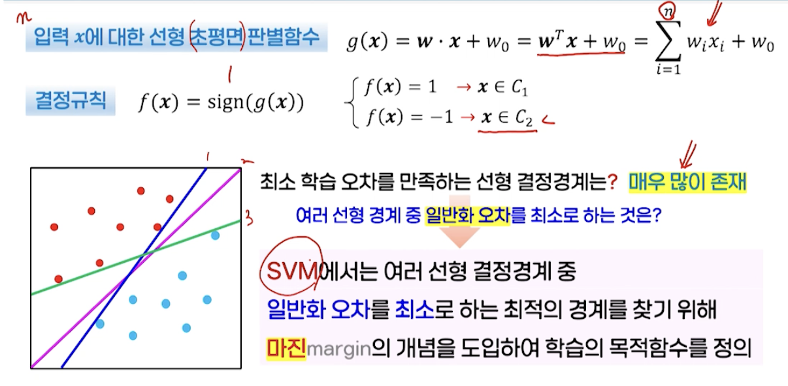
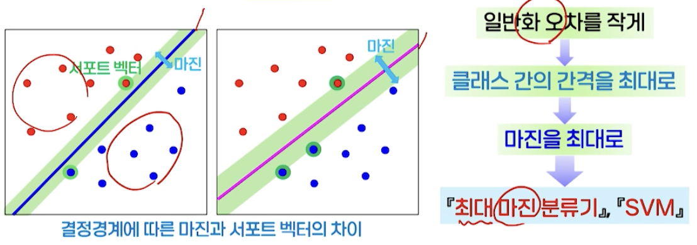
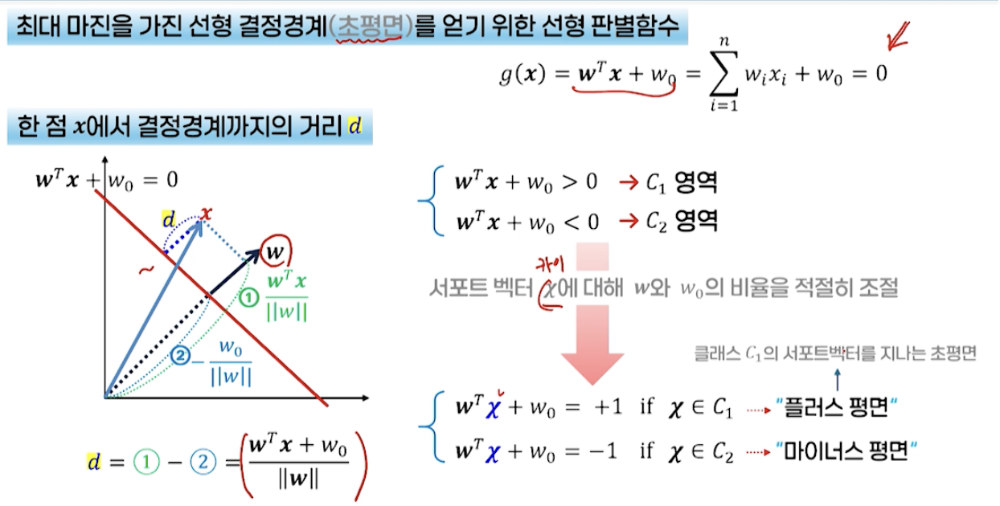
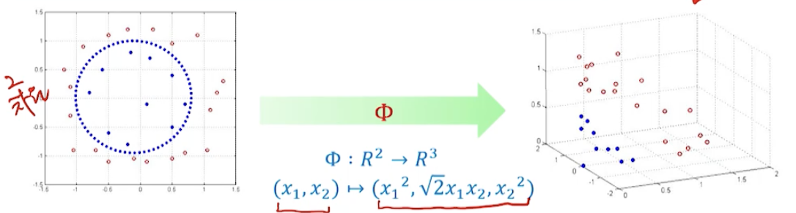

# 8강. SVM과 커널법

## 1. 선형 분류기

### 학습 시스템의 복잡도와 일반화 오차의 관계

- 비선형 분류기가 더 큰 일반화 오차를 가지는 경우 발생 가능
- 과다적합
  - 과다학습 피하고, 일반화 오차를 줄이기 위해서는 학습 시스템의 복잡도를 적절히 조정하는 것이 중요

### 선형 초평면 분류기

- 선형 분류기 linear classifier
  - 선형 판별함수를 기반으로 분류를 수행하는 학습 시스템
  - 특징
    - 분류 시스템의 복잡도가 가장 낮고, 분류 성능은 좋지 못함
    - 과다 적합의 발생을 피할 수 있음
  - SVM 등장
    - 일반화 오차를 최소화할 수 있는 방향으로 학습이 이루어지도록 설계된 선형 분류기

- SVM

  

  - 마진(margin)의 개념을 도입해 학습의 목저함수 정의

## 2. SVM 분류기

### SVM(Support Vector Machine)

- 최대 마진 분류기(maximum margin classifier)
  - 마진: 학습 데이터들 중 결정경계에 가장 가까운 데이터로부터 결정경계까지의 거리
    - 결정경계: 서포트 벡터
- SVM
  - 일반화 오차를 작게
  - 클래스 간의 간격 최대
  - 마진 최대

### 다중 클래스 분류 문제 적용

- SVM → 이진 분류기
- 1대 나머지 방법 one versus the rest
  - 가장 보편적인 방법 → k개의개별적인 SVM 분류기 사용
  - k번째 SVM → k번째 클래스와 나머지 (k-1)개의 클래스 분류 담당
    - 클래스 Ck에 해당되는 데이터만 +1이 되고, 나머지 클래스의 데이터는 -1이 되도록 학습
    - 분류 → k 개의 분류기 중 양수에 해당하는 클래스로 할당
  - 문제 → 애매모호한 결정영역, 학습 데이터 집합의 크기가 불균형
- 1대 1 방법
  - 가능한 모든 클래스의 쌍에 대한 서로 다른 k(k-1)/2개의 보팅으로 결합
  - 문제 → 애매모호한 결정영역, 계산 비용이 많이 소요(학습/테스트 하는데)

### 슬랙변수를 가진 SVM

-  **선형 분리가 불가능한 데이터 처리**를 위해 슬랙변수 도입
  - 잘못 분류된 데이터로부터 해당 클래스의 경계까지의 거리
  - 값이 클수록 더 심한 오분류 허용
  -  

## 3. 커널법

### 비선형 분류 문제의 해결 방법

- 저차원 입력 x를 좀 더 고차원의 공간의 값 Φ(x)로 매핑시키는 함수 Φ
- 계산량이 증가하는 부작용 생길 수 있음
- **커널법으로 해결**
  - 고차원 매핑을 통해 비선형 문제를 선형화하여 해결하면서, 커널 함수를 통해 계산량 증가의 문제를 해결하는 방법

###  커널법과 SVM

- n차원의 입력 x를 m차원의 특징 데이터 Φ(x)로 매핑시킨 후 SVM으로 분류
- 두 벡터의 내적 Φ(x), Φ(y)를 사용 → k(x,y) 커널 함수

### 주로 사용되는 커널 함수

- 선형
- 다항식
- 시그모이드
- 가우시안

### 슬랙변수와 커널을 가진 SVM 분류기의 학습과 인식 과정

- 하이퍼파라미터 c
  - 슬랙변수와 관련 있음 
  - 가능한 최소화 시켜서, 오분류를 낮추기 위해 추가된 항
  - 그 항을 어느정도 반영할지 결정하는 매개변수
- 나머지는 SVM 학습과 동일