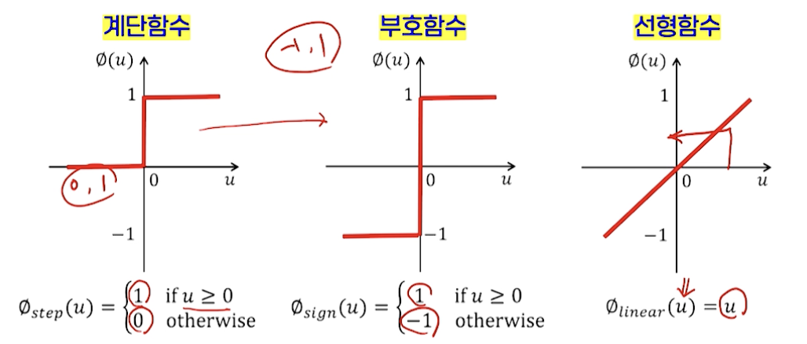
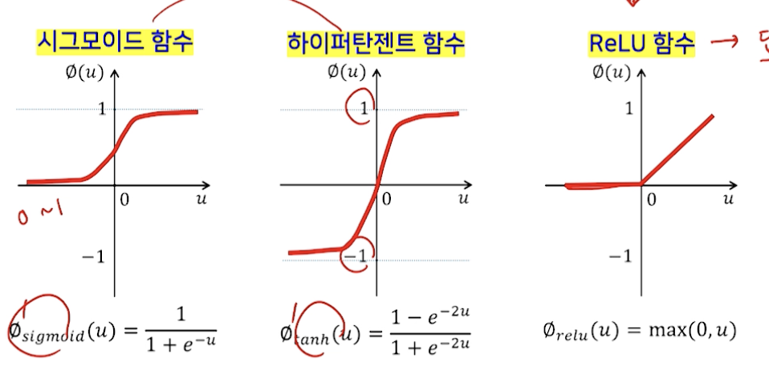
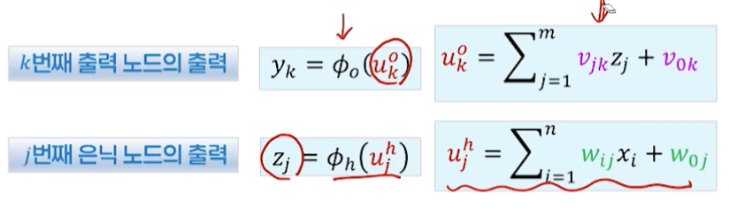
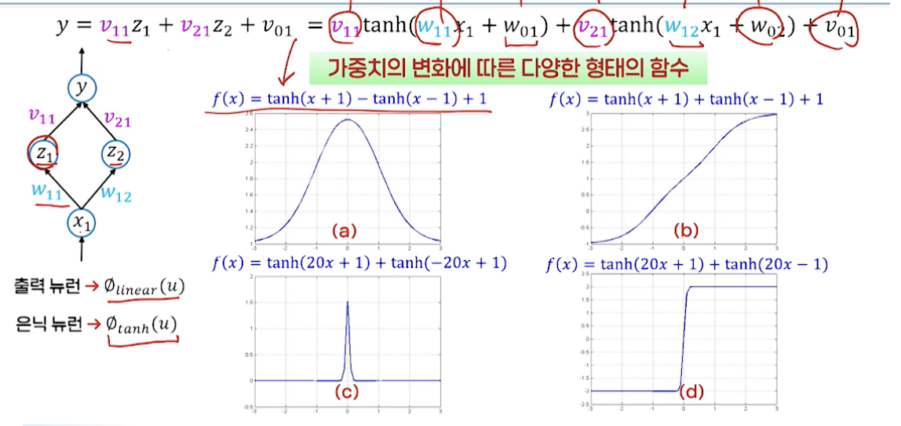

# 9강. 신경망 (1)

## 1. 신경망 개요

### 인공지능의 두가지 접근법

- Symbolic AI
  - 부울 논리, 규칙 기반 지식 표현, PROLOG, IBM Deep Blue, Chess AI
- Connnectionist AI: Artificial Neural Networks 
  - 뇌에서 영감을 받은 계산 모형
  - 신경망: 퍼셉트론
  - 다층 퍼셉트론
  - 딥러닝

### 신경망과 딥러닝

- 신경망(신경회로망 neural networks)

  - 생물학적 신경회로망을 모델링한 수학적 함수
  - 데이터를 이용해 원하는 입출력 매핑 함수의 형태를 스스로 찾는 학습 능력을 가짐

  - 학습 방식 및 구조에 따라 다양한 모델 존재

- 심층 신경망 deep networks

  - 신경망 모델 중 가장 발전된 형태

- 딥러닝

  - 심층 신경망을 이용한 데이터 분석(학습)에 초점을 둔 머신러닝 기술
  - 심층 신경망 기반의 머신러닝

### 생물학적 신경망

- 생물학적 신경망
  - 인간 뇌 구조와 뇌에서 수행되는 정보처리방식을 모방
  - 입력, 연산, 출력
  - 계층연결, 층상 연결(layered connection)
- 인공신경망(artificial neural networks)
  - 인간 뇌의 정보처리방식을 모델링하는 방법
    - 신경세포
    - 신경망의 구조
    - 학습 메커니즘

### From 생물학적 신경망 To 인공신경망

- **3가지 핵심 구성 요소**
- **신경세포** neuron, node, unit
  - 하나의 신경세포가 수행하는 기능적 측면을 수학적 함수로 정의
- **신경망 구조** network structure
  - 신경세포들 간의 정보 전달을 위한 연결 구조
- **학습 알고리즘** learning algorithm
  - 신경망이 원하는 기능을 수행할 수 있도록 신경세포들 간의 연결 강도(가중치)를 조정하는 방법

### 신경망의 구성 요소: (1) 인공 신경세포

- 활성화 함수

  - 뉴런의 핵심 → 하나의 뉴런의 특성을 결정하는 역할

    

    

### 신경망의 구성 요소: (2) 연결 구조

- 신경 세포들 간의 대표적 연결 방식
  - 다층 전방향 신경망 multi-layer feed-forward neural network
- 층수의 변화
  - 출력층, 은닉층, 입력층
- 정보 흐름의 방향
  - 전방향 신경망, 회귀 신경망

### 신경망의 구성 요소: (3) 학습 

- 인간 뇌에서의 학습
  - 성장하면서 뇌 세포들 간의 연결이 형성되어 여러가지 기능을 수행하게 되는 과정
  - 세포들간의 연결 형성 규칙
    - 연결된 두 신경세포가 동시에 활성화되면 연결 강도는 강해지게 됨
    - 파블로프의 개 실험

- 인공신경망에서의 학습이란?
  - 신경망이 원하는 기능을 수행할 수 있도록 만드는 것
  - 신경망에서 어떤 입력 x가 주어졌을 때, 최종적으로 내는 출력 y가 원하는 값이 되도록 가중치(연결강도)  w를 조정
  - 반복적인 가중치 수정을 통해 점점 원하는 기능에 근접
  - 가중치 변화량을 결정하는 방법(학습 알고리즘) → 학습 데이터 사용
- 학습의 종류
  - 지도학습(교사학습)
    - 오류 역전파 학습 알고리즘
  - 비지도학습(비교사학습)
    - Self-organizing feature map, Boltzmann machine
  - 강화학습
    - 입력에 대한 신경망의 출력값의 보상이 최대가 되도록 가중치 수정

### 신경망의 특성

- 응용 관점에서의 신경망에 대한 이해
  - 신경망은 하나의 함수
- 함수 f를 결정하는 요소
  - 신경세포의 활성화 함수, 연결 구조 → 고정된 형태
  - 연결 가중치 → 주어진 데이터를 이용한 학습을 통해 함수 f의 형태를 결정
- **왜 신경망인가? 신경망의 능력은?**
  - 표현 능력
    - 입출력을 매핑하는 어떤 형태의 함수도 원하는 오차 수준까지 근사해서 표현 가능
  - 학습 능력
    - 데이터를 이용한 학습 을 통해 최적의 함수를 스스로 찾을 수 있음
  - 일반화 능력
    - 학습 데이터에 대한 단순 암기 뿐 아니라, 데이터에서 일반화된 규칙 찾음
    - 새로운 데이터에 대해서도 처리 가능

## 2. 다층 퍼셉트론

### M-P 뉴런

- 단일 신경세포에 대한 첫 번째 모델 → 신경망 연구 첫 시도
  - 1943 MaCulloch & Pitts → 논리 함수 구현
- M-P 뉴런을 여러 개 결합해 네트워크 형태를 갖춘 신경망
  - 1958 Rosenblatt → 최초의 신경망 모델
  - 패턴 분류를 수행하는 단층 전방향 신경망
- 뉴런
  - M-P 뉴런 → 계단함수
- 연결 구조
  - 단층, 전방향, 완전 연결
- 학습 규칙
  - 이진 입출력을 사용한 지도학습

### 퍼셉트론

- 학습 규칙

   

### 퍼셉트론의 한계

- 선형 판별함수 사용
  - 비선형 결정경계 표현 어려움
- XOR 문제
  - Minsky & Papert - 퍼셉트론은 XOR 문제를 해결할 수 없음

### 다층 퍼셉트론

- MLP, Multi-Layer Perceptron
  - 1개 이상의 은닉층 가짐
- 뉴런
  - 비선형 매핑을 위한 활성화 함수 사용
- 연결구조
  -  다층, 전방향, 완전연결
- 학습 알고리즘
  - 지도학습 → 오류 역전파 알고리즘

### 다층 퍼셉트론의 구조와 함수식

### MLP의 표현 능력

-  하나의 은닉층을 가진 MLP는 어떠한 연속 함수도 원하는 오차만큼 가깝게 표현 가능

- 입력 1개 - 출력 1개

   

  - 하나의 은닉층(충분한 은닉 뉴런)을 가진 MLP는 임의의 정확도로 모든 연속함수의 근사 표현이 가능
  - 복잡한 비선형 결정경계도 표현
    - 복잡한 분류문제도 성공적으로 해결 가능
    - 표현 능력 자체는 더이상 문제 없음