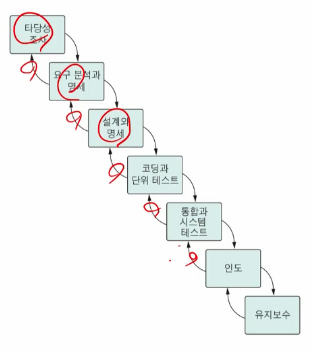
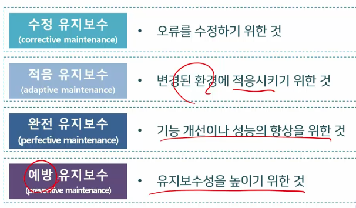
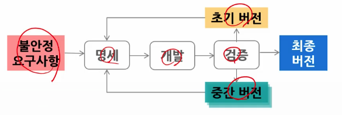
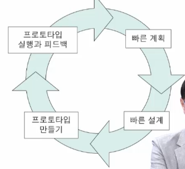
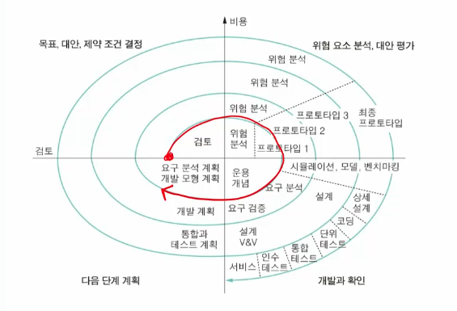
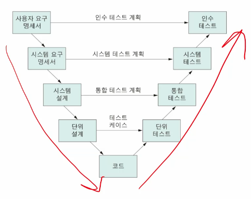
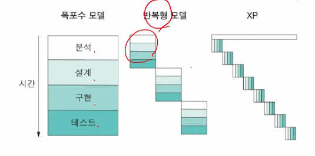
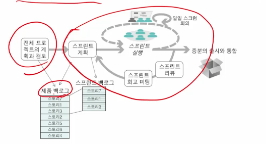

# 2강. 소프트웨어 프로세스

## 1. 소프트웨어 프로세스

### 소프트웨어 프로세스

- 소프트웨어 시스템을 개발하거나 유지보수할 목적으로 수행되는 활동 일체 또는 절차
- 활동이란 누가 언제 하는지, 어떤 결과물을 만드는지
- 개발 조직은 적당한 프로세스 모델을 보유하여 공통의 개발 문화와 공통의 기술을 제공해야 함

- 프로세스 모델이 존재해야 하는 이유
  - 전체 프로세스의 이해에 도움
  - 구조화된 방법을 개발에 적용
  - 자원 사용에 대한 사전 계획을 가능하게 함
  - 자원 사용을 통제할 수 있음
  - 시스템 개발 과정을 추적하고 관리할 수 있음

### 주요 프로세스 활동

- 프로세스 모델 선택 시 고려 사항
  - 개발 조직마다 프로세스가 다름
  - 프로젝트 유형에 따라 다름
  - 대형 시스템의 경우에는 부분마다 다른 프로세스를 적용
- 4가지 활동(명세, 개발, 검증, 진화)
  - 명세
    - 소프트웨어의 기능과 운영상 제약 조건
  - 개발
    - 소프트웨어를 설계하고 프로그래밍
  - 검증
    - 고객이 원하는 것을 수행하는지 검사
  - 진화
    - 소프트웨어 변경

## 2. 폭포수 모델

### 폭포수 모델

- 7단계

- 선형 순차 모델, 고전적 소프트웨어 생명주기
- 기본적으로 각 단계는 병행 수행되지 않고, 거슬러 반복되지 않으며 한 방향으로 진행됨
- 실제로 수정을 위한 재작업을 위해 앞 단계로의 피드백이 불가피

#### (1) 타당성 조사

- 문제점을 파악하고 해결 방안을 제시하여 투입 비용 대비 이익을 평가
  - 조직 측면의 타당성: 조직의 전략적 목표
  - 경제적 타당성: 비용 대비 수익
  - 기술적 타당성: 정해진 시간 안에, 현재의 기술 수준으로
  - 운영의 타당성: 운영/사용 능력과 다른 시스템과의 연동 가능성
- 시간적 제약과 정신적 압박감 존재
- 타당성 조사 보고서: 문제의 정의, 기술적/경제적 타당성, 해결 방안과 기대 효과, 비용과 인도 날짜 등을 포함

#### (2) 요구 분석과 명세

- 프로젝트의 성패를 좌우하는 중요한 단계로 무엇을 개발할지 결정
- 요구사항이란?
  - 문제의 해결을 위해 시스템이 갖추어야 하는 조건이나 능력
  - 요구사항 명세서나 계약서에 명시되어야 함
- 요구사항 명세서(SRS)
  - 의뢰자와 개발자 간의 의사소통 수단으로 정확하고 일관성 있으며 완전해야 함
- 요구사항 명세서의 구성
  - 시스템 목적과 범위: 문제점을 구체적으로 기술하고 대안을 제시
  - 기능적 요구사항, 비기능적 요구사항
  - 기타 제약 조건 등

#### (3) 설계와 명세

- what을 how로 변환하는 작업
  - 요구사항을 명확하고 조직화된 구조로 바꾸는 것
- 설계 단계의 구분
  - 아키텍쳐 설계, 인터페이스 설계, 프로그램 설계
- 설계 방법
  - 전통적 설계 방법: 구조적 분석의 수행 결과에, 구조적 설계 방법을 적용
  - 객체지향 설계 방법: 객체 지향 기술을 적용해 설계

#### (4) 코딩과 단위 테스트

- 설계 결과를 프로그램으로 작성함
- 구현된 모듈이 명세서를 만족하는지 테스트하여 확인함
- 고려 사항
  - 코딩 표준의 준수
    - 조직이 정한 레이아웃, 주석의 사용, 변수나 함수 이름 등
  - 테스트 절차의 준수
    - 테스트 계획의 작성, 테스트 방법과 테스트 수준의 결정 등
  - 코드 인스펙션
    - **코드의 정적 분석 방법**

#### (5) 통합과 시스템 테스트

- **통합 테스트**
  - 모듈들을 통합해 점증적으로 시스템을 구축
  - 통합과 테스트 작업은 점증적 방식으로 함
- **시스템 테스트**
  - 모든 모듈을 통합한 후, 
  - 최종적으로 완성된 시스템이 요구사항을 만족하는지 확인

- **알파 테스트**
  - 소프트웨어 **개발 현장**에서 수행
  - 일반 소프트웨어의 경우, 독립적인 테스트 팀이 먼저 알파 테스트를 수행한 후(내부적 인수 테스트), 베타 버전을 릴리스 함
  - 주문형 소프트웨어의 경우 개발자 플랫폼에서 실제 사용 환경을 시뮬레이션 한 후, 개발자 플랫폼에서 실제 사용 환경을 시뮬레이션 한 후, 개발자와 고객 사이에서 제품의 인수에 대한 동의가 이루어질 때 까지 수행(인수 테스트)
- **베타 테스트**
  - **고객의 실제 사용 환경**에서 수행
  - 일반 소프트웨어 제품 출시 전에 가망 사용자로부터 미리 제품 평가 받음

#### (6) 인도

- 실제 사용을 위해 고객에게 소프트웨어를 배포하는 것

#### (7) 유지보수

- 수정, 적응, 완전, 예방 유지보수(4가지)

- 고객이 사용한 후 폐기되기 전까지 일어나는 수정 및 보완 활동
- 유지보수 대신 소프트웨어 진화라는 표현을 사용하기도 함
  - 일반 소프트웨어에 사용되는 용어
- 유지 보수 노력이 적게 드는 소프트웨어를 개발하는 것이 중요하다

### 폭포수 모델의 장단점

- 장점
  - 선형 모델로 단순하고 이해가 쉬움
  - 단계별로 정형화된 접근 방법과 체계적 문서화가 가능
  - 프로젝트 진행 상황을 명확히 알 수 있음
- 단점
  - 요구사항을 완벽히 작성해야 함
  - 변경을 수용하기 어려움
  - 시스템의 동작을 후반에나 볼 수 있음
  - 대형 프로젝트에 적용하기 어려움
  - 문서화를 위한 노력이 지나침
  - 위험 분석 결여, 일정의 지연 가능성이 큼

## 3. 반복진화형 모델

### 반복 모델

- 초기 버전을 만들고, 요구사항을 정제하여 새로운 버전을 개발하는 작업을 **반복**하면서 시스템을 완성해 나가는 방식
  - 분명한 요구 사항과 시스템의 범위를 정하는 노력이 선행됨
  - 한 번의 진화 단계에서 프로토타이핑을 통해 요구사항을 보완
  - 최종 버전이 나온 후 유지보수 단계로 들어감

### 반복진화형 모델의 장단점

- 장점
  - 요구사항이 완성되지 못한 경우에도 초기 버전을 만들고 점차적으로 명확한 요구사항을 도출함
- 단점
  - 관리적 관점에서 개발 비용의 예상이 힘들고, 재작업이 잦아지면 종료 시점이 늦춰질 가능성이 큼
  - 공학적 관점에서 잦은 수정 작업은 소프트웨어 구조에 악영향을 주어 유지보수성에는 문제가 생기게 됨

### 점증적 모델과의 차이점

- **반복진화형 모델**은 **요구사항이 불안정하고 명확하지 못할 때** 사용
  - 개발이 진행되면서 요구의 변화를 수용함
  - 명확히 이해할 수 없는 새로운 기술을 적용할 때 사용
  - 한꺼번에 모든 기능을 포함해 인도해야 하는 경우 사용
- **점증적 모델**은 **요구사항의 중요도**에 따라 요구사항을 나누고 작업 순서를 정함
  - 중요한 요구사항을 먼저 개발함
  - 조금씩 개발하면서 여러 번의 릴리스가 일어남

### 프로토타이핑 방법

- 소프트웨어 요구사항을 파악하기 위한 좋은 방법
  - 일반적으로 사용자는 소프트웨어의 입출력과 처리 기능을 자세히 요구하지 못함
  - 개발자도 알고리즘의 효율성이나 운영체제 호환성 및 상호작용 형태를 정확히 파악하기 힘듦

### 프로토타이핑의 종류

- throwaway prototyping
  - 프로토타입을 고객과의 의사소통 수단으로만 사용하는 경우
  - 요구가 확인되면 프로토타입을 버리고 새로 시스템을 개발함
- evolutionary prototyping
  - 잘 알고 있는 부분부터 시작해 계속적으로 발전시켜 완제품을 만드는 방법

### 프로토타이핑 방법의 장단점

- 장점
  - 프로젝트 실현 가능성, 소프트웨어 개발 가능성 판단 가능
  - 개발자와 사용자 간의 의사소통이 명확해짐
  - 기능적 요구사항 외에도 성능이나 유용성 등의 품질 요구를 분명히 할 수 있음
  - 시스템을 미리 사용함으로써 사용자 교육 효과가 있음
  - 개발 단계에서 유지보수가 일어나는 효과가 있음
- 단점
  - 문서화가 힘들며, 관리자는 진척 사항을 제어하기 힘듦

## 4. 점증적 모델

### 점증적 모델

- 여러 개의 모듈들로 분해하고, 각각을 점증적으로 개발하여 인도
  - **선형 순차 모델**을 여러 번 적용하고, 그 결과를 조합
  - 각 모듈을 **증분(increment)**이라 함
  - 핵심 모듈을 먼저 개발하고 인도함

### 점증적 모델의 장단점

- 장점
  - 중요한 증분이 먼저 개발되므로 **사용자는 시스템을 이른 시기**에 사용
  - 릴리스 방식이 요구사항 변화에 대응하기 용이
  - 증분들은 점차로 규모와 기능이 축소되어 관리가 어렵지 않음
  - 먼저 개발되는 중요 부분이 반복적으로 테스트됨
- 단점
  - 기능적으로 분해하기 어려울 수 있음
  - 적당한 크기의 증분들로 나누기 어려움
  - 증분을 개발하기 전에 명확한 요구사항을 정의해야 함

## 5. 나선형 모델

### 나선형 모델

- **반복 진화형 모델의 확장 형태**
- 전체 생명주기에 위험분석과 프로토타이핑을 계획하고 사용하여 위험을 최소화하려는 목적을 가짐
- 가장 중앙의 원을 **타당성 조사 단계**, 다음 원의 **요구사항 정의 단계**, 그 다음 원을 **설계 단계**
  - 각 단계는 목표와 대안의 결정, 대안의 평가(위험 요소 분석), 개발과 확인, 다음 단계의 계획으로 구성됨

### 고려 사항

- 나선형 모델은 위험 관리를 지원하는 프로세스의 프레임워크(프로세스 생성기)
- **위험 관리에 비용이 들지만 가치가 있음**
  - 위험은 프로젝트 수행이나 제품의 품질에 악영향을 주는 잠재 요소
- **실험적**이고 복잡한 대형 프로젝트에 적합

### 나선형 모델의 장단점

- 장점
  - 대형 프로젝트에서 **위험 관리**를 통해 성공 가능성을 높일 수 있음
  - 프로젝트 특성이나 개발 조직에 맞게 변형해서 적용 가능
- 단점
  - 경험이 부족해 충분히 검증되지 못함(사례 부족)
  - 모델 자체가 복잡
  - 프로젝트 관리가 어려움

## 6. V 모델

### V 모델

- 폭포수 모델의 확장 형태로 생명주기 단계별로 상응하는 테스트 단계가 존재
- 아래 방향으로 진행하다가, 코딩 단계를 거치면서 위로 향함
- 테스트 작업을 중요시하여 적정 수준의 품질 보증을 지원

### V 모델의 특징

- 각 개발 단계의 작업을 확인하기 위해 상응하는 테스트 작업을 수행
  - 코드 뿐만 아니라 **요구사항**과 **설계 결과**도 테스트할 수 있어야 함
- 생명 주기 초반부터 테스트 작업을 지원
- 폭포수 모델에 비해 **반복과 재처리 과정이 명확**함
- 테스트 작업을 단계별로 구분하므로 **책임이 명확**해짐

## 7. 애자일 방법

### 애자일 방법

- 변화를 수용하고, 협업을 강조하며, 제품의 빠른 인도를 강조하는 반복적 개발 방법
  - 문서화 작업보다, 코드를 강조
  - 문서보다 소프트웨어 자체를 중요시함
  - 요구사항의 변화는 불가피하고, 이것에 대응하는것이 현실적이다
  - 기존의 개발 프로세스는 설계 기간이 길며, 재작업시 오버헤드가 크다
  - 환경의 빠른 변화에 대응하고, 빠른 인도가 중요하다
- 애자일 선언문(Agile Manifesto)
  - 개개인/상호작용, 작동하는 SW, 고객과의 협력, 변화에 대응
- 요구사항이 바뀌기 쉬운 중소형의 비즈니스 시스템이나 전사 상거래 응용에 적합

### (1) 익스트림 프로그래밍(XP)

- XP는 대표적인 애자일 방법의 하나
- 좋은 실천 지침들(good practices)을 적극적으로 적용할 것을 주문

#### XP의 실천 지침

- 작고 빈번한 릴리스, 빠른 피드백과 지속적 개선
- 고객도 개발 팀의 일원이 됨
- 프로세스 중심이 아닌 사람 중심의 작업과 짝 프로그래밍
- 단순한 설계와 테스트 선행 개발
- 코드의 품질 개선을 위해 리팩토링을 제안

### (2) 짝 프로그래밍

- 두 사람이 짝이 되어, 한 사람이 코딩을 하고 다른 한 사람이 검사를 수행
  - 30분마다 역할을 바꿈
- 장점
  - 코드에 대한 책임을 공유
  - 비형식적 검토를 수행
  - 코드 개선을 위한 리팩토링 장려
  - 생산성이 떨어지지 않음

### (3) 테스트 선행 개발

- 테스트 케이스를 먼저 작성하고, 이를 통과하는 코드를 만드는 것
- 태스크 별로 테스트 케이스를 만듦
  - 요구사항은 스토리카드로 표현되고, 스토리 카드는 태스크들로 분해됨
  - 요구사항과 코드와의 관계가 명확해짐
- 통합 테스트를 강조하며, 통합 과정에서 기존 소프트웨어 오류가 유입되지 않도록 함
  - 기존 테스트 케이스의 재사용

### (4) 스크럼

- 애자일 개발 과정의 관리에 초점을 둔 '프로젝트 관리 프레임워크' 또는 소프트웨어 개발 '프로세스의 프레임워크'
- 스크럼 프로세스는 계획과 스프린트의 반복으로 이루어짐
- 프로젝트 계획(제품 백로그)
- 스프린트 사이클
  - 제품 증분을 개발하는 작은 프로젝트
  - 3-9명의 스크럼 팀에서 한 달 이내로 개발
  - 스프린트 계획(스프린트 백로그)
  - 일일 스크럼 회의
  - 스프린트 리뷰와 회괴
- 스프럼 팀의 구성
  - 개발팀, 제품 책임자, 스크럼 마스터