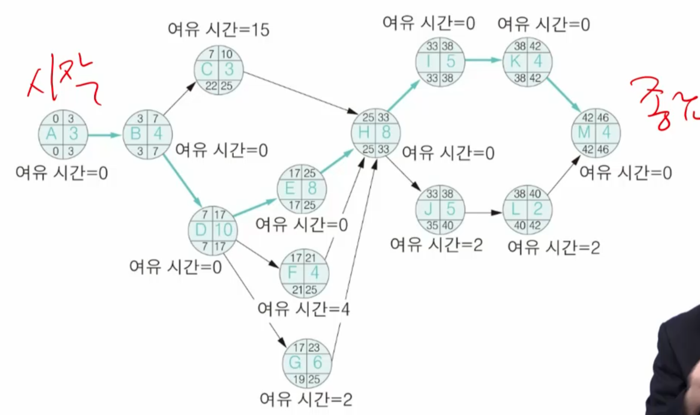
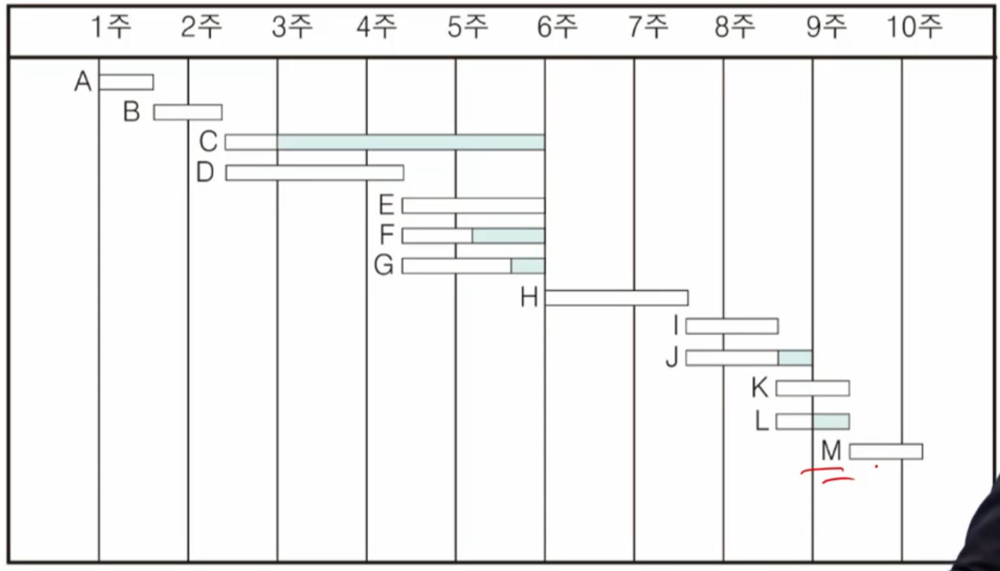
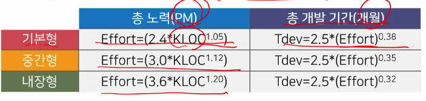
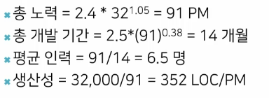
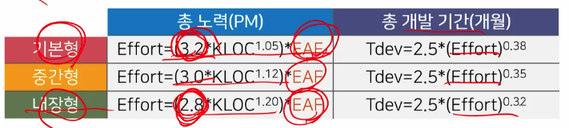
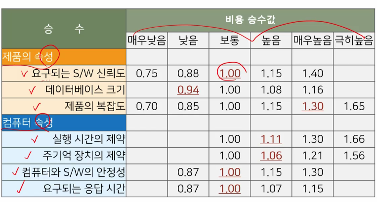
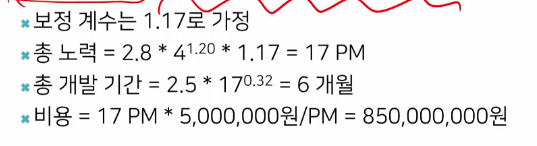
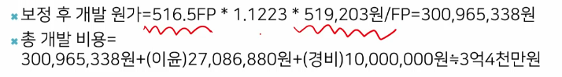
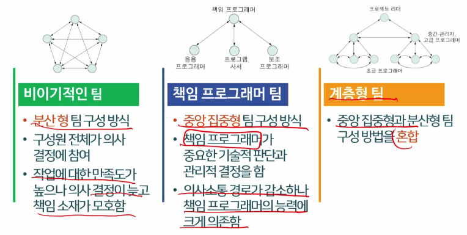

# 3강. 프로젝트 관리

## 1. 프로젝트 관리 개요

### 프로젝트 관리의 필요성

- 예산과 일정의 제약으로 관리 필요
- 프로젝트 관리란 프로젝트를 계획하고 감독하는 일
  - 계획 수립
  - 고객의 요구, 지켜야 하는 표준을 따르는지 확인
  - 시간과 예산에 맞추어 개발되는지 사람과 프로세스를 제어
- 소프트웨어 프로젝트 관리가 어려운 점
  - 진척 관리를 위해 문서에 의존함
  - 소프트웨어 개발 프로세스에 관한 명확한 표준이 없음
  - 기술 발전 속도가 빨라 프로젝트 경험을 살리기 어려움

### 프로젝트 관리자의 업무

- 프로젝트 착수
  - 제안서 작성
- 프로젝트 계획
  - 일정, 비용, 자원, 위험 계획
- 프로젝트 실행
  - 계획에 기초한 프로젝트 감시와 통제
- 프로젝트 종료
  - 보고서 작성, 프로젝트 평가

### 프로젝트 계획

- 어떤 일을, 어느 정도 비용으로, 누구에 의해, 언제까지 행해져야 하는가를 결정하는 일
- 계획에 기초하여 산출물과 개발 절차를 관리
- 브룩스의 법칙
  - 가장 흔한 프로젝트 실패는 일정의 지연
  - "일정이 늦어진 소프트웨어 프로젝트에 인력을 추가하는 것은 일정을 더욱 늦추는 결과를 낳는다"
  - 기존 업무의 이해, 의사소통 경로의 증가, 작업의 재분할이 필요하기 때문

### 프로젝트 계획서의 구성

- 개요
- 개발 절차 계획
- 인원, 예산 및 일정 계획
- 문서화 계획
- 하드웨어와 소프트웨어 자원 계획
- 위험 관리 계획

## 2. 소프트웨어 일정 계획

### 일정 계획과 작업

- 일정계획은 작업의 분할, 작업들 간의 관계, 인적/물적 자원의 배정 등을 계획하는 것
- 작업의 분할
  - 요구명세서에 기초하여 전체 작업을 관리 가능하고 측정 가능한 소작업들로 분할
  - 작업 분해 구조(WBS: Work Breakdown Structure)
- 작업의 명세화
  - 소작업에 대해 일의 양, 필요한 산출물과 컴퓨터 자원 등을 결정
  - 작업의 양을 인원-월(PM: Person Month/Man Month)로 표시함, 1PM은 중급 수준 개발자의 한 달간 작업량
  - 19일 * 8시간 = 152시간

### 일정 계획과 작업

- 작업 진행 순서의 정의
  - 작업들의 선후 관계를 분석해 순서 정함
  - PERT/CPM
- 인력 배정
  - 작업의 양과 특성에 맞도록 개발자 배정
- 작업 비용의 산정
  - 작업의 양과 인력에 따른 비용을 산정
- 개발 일정의 수립
  - 작업별로 시작 시점과 종료 시점을 설정
  - CPM으로 분석하고, 간트(Gantt)차트로 도표화

### WBS

- 작업 분할 구조(Work Breakdown Structure)
  - 프로젝트 수행을 위해 개발 업무를 분할해 계층 구조로 표현
- 최하위 수준의 작업을 작업 패키지(work package)
  - 비용이나 기간의 정량적 측정이 가능한 입력물과 출력물을 가짐
- 프로젝트 계획과 관리를 위한 기초자료

### PERT와 CPM

- PERT
  - 작업들의 선후 관계를 표현한 사이클이 없는 방향 그래프
- CPM - 임계 경로 방법
  - 일정 계획을 위한 알고리즘적 분석 방법
  - **임계 경로**는 시작에서 종료 작업까지의 경로 중 **가장 긴 경로**
  - 임계 경로상의 작업들은 프로젝트의 일정 준수를 위해 **지연이 허용되지 않는 작업**
    - 따라서 여유 시간 = 0
  - 임계 경로상에 있지 않은 작업들은 여유 시간을 가짐

### CPM 네트워크

### 간트 차트

- 막대 모양으로 프로젝트 작업들의 순차 또는 병행 순서를 보여주는 차트
  - 상단에 시간축 표시, 작업별로 막대를 가로방향으로 표시
  - 막대는 작업 시간에 맞추어지며, 길이는 소요 시간을 의미
- 일정 조정, 인력 배정 계획에 사용됨
  - 작업별로 진척 비율이나 인력 배정을 표시할 수 있음

## 3. 소프트웨어 규모의 산정

### 소프트웨어 프로젝트 산정

- 규모 추정 → 개발 노력(비용) 추정, 일정 계획
- 규모 산정의 정확성이 다른 부분에 영향 줌
  - 고객 요구사항과 시스템 명세 참고
  - 라인수(LOC)를 추정하는 방법, 기능 점수(FP) 방법
- 노력 추정에 과거 데이터와 프로젝트의 특성을 고려
- 일정 계획에는 투입 되는 인력을 고려
- 추정의 정확성은 과거 프로젝트 데이터의 정확성, 제공되는 인력의 정확성, 개발 조직에서 프로세스의 성숙도에 좌우

### 기능 점수

- 기능 점수는 기능의 규모를 측정하기 위한 단위
  - 소프트웨어 기능을 다섯 가지 유형으로 분류하여 계산
- 프로그램의 기능에 초점을 맞춘 논리적 규모 척도
  - 기능적 사용자 요구사항을 양으로 표시
- 구현 기술이나 구현 언어와 무관
- 사무 정보 시스템의 규모 산정에 적합
- 보정 기능점수(AFP)는 미보정 기능 점수(UFP)와 보정 계수
- 미보정 기능 점수(UFP)
  - 프로그램에서 표현되거나 사용되는 데이터의 총량을 계량화
  - 데이터 기능(내부 논리 파일, 외부 인터페이스 파일)과 트랜잭션 기능(외부 입력, 외부 조회, 외부 출력)의 갯수를 측정
  - 각각의 복잡도에 따른 가중치를 곱해 계산
- 보정 기능 점수(AFP)
  - AFP = UFP * VAF
  - VAF = 0.65 _ 0.01 * TDI(총 영향도)
  - VAF는 보정 계수이며(0.65 ~ 1.35), TDI는 기술적 복잡도를 반영하기 위해 14개 항목의 영향도(0~5)를 모두 합한 것(0~70)

### 기능점수 고찰

- 프로그래밍 언어벌로 LOC/FP 
- 즉, 기능 점수 1점을 구현하기 위해 필요한 라인 수 존재
- 기능 점수로부터 라인 수를 계산할 수 있음
- 초기 단계에서 라인 수 추정에 효과적
- 프로그래머의 평균 생산성(FP/PM)을 안다면, 전체 PM을 계산가능
- 사무 정보 시스템의 규모 산정에 적합
- 사례는 교재 참고

## 4. 소프트웨어 개발 비용 산정

### 비용 산정 방법의 분류

- 판단에 의한 방법
  - 전문가의 판단, 델파이 방법, 작업 분해에 의한 방법
- 수학적 모델을 이용한 방법
  - 알고리즘 모델, 유추에 의한 산정
- COCOMO
  - 가장 잘 알려진 소프트웨어 비용 산정 모델(COnstructive COst Model)
  - 프로젝트 유형을 3가지로 구분(기본/중간/내장형)
  - 분석 정도에 따른 3가지 모델을 제시(기본/중급/상세)

### COCOMO

- 효과적 산정을 위해 규모 추정 필요
- 기본 COCOMO는 라인 수 만으로 비용 추정
  - 대략적으로 개발 노력은 소프트웨어 규모에 선형적으로 비례
- 라인수(LOC)
  - 간단하며 비용 산정 방법과의 연결이 용이하고 직관적임
  - 계획단계에서 산정하기 어렵고, 프로그래밍 언어에 따라 다름
  - 과거의 경험, 전문가의 판단, 구성요소별 산출한 후 합산

#### (1) 기본 COCOMO

- 프로젝트 유형
  - 기본형
    - 소규모 프로젝트(~50KDSI)
    - 경험 있는 개발자
    - 까다롭지 않은 요구사항
  - 중간형
    - 중규모 프로젝트(~300KDSI)'
    - 중간정도의 경험
    - 요구사항의 혼재
  - 내장형
    - 대규모 프로젝트
    - 제한된 하드웨어
    - 엄격한 운영조건

- 32,000 LOC 기본형 소프트웨어의 추정 예

  

- 프로젝트 크기와 노력

#### (2) 중급 COCOMO

- 15개의 비용 승수를 곱해 노력 보정 계수(EAF)를 계산
- 각 비용 승수는 6개의 등급으로 나뉨
- 총 노력을 계산할 때 EAF를 곱함

#### COCOMO 비용 승수

- 중급 COCOMO 예

  - 4,000 LOC 내장형 소프트웨어의 추정 예

  

### 소프트웨어 수정을 위한 노력

- 설계, 코드, 통합과 테스트 부분에서 수정이 필요한 비율을 구하여 수정 보정 계수(AAF)를 계산
- AAF = 0.4 * (설계 수정 비율) + 0.3 * (코드 수정 비율) + 0.3 * (통합과 테스트 수정 비율)
  - 전체에서 수정이 요구되는 비율을 의미
- 상응 LOC = 기존 LOC * AAF
  - AAF를 이용하여 수정이 요구되는 LOC를 계산한 후 공식에 대입

### 기능 점수에 기초한 개발비 산정 사례

- 총 개발 비용은 (보정 후 개발 원가 + 이윤 + 경비)

- 보정 후 개발원가는 (기능점수 * 기능 점수당 단가) * 보정계수

- 사례

  

## 5. 팀 구성 방식

### 매트릭스 조직

- 프로젝트 조직과 기능별 조직의 장점을 조합한 형태
  - 프로젝트 조직은 프로젝트 동안 유지되는 팀
  - 기능별 조직은 분석/설계/구현 등 기능별로 전문화된 팀
- 개발자는 전문 기능 부서에 속하되, 일정 기간 프로젝트에 소속되는 형태
- 팀 구성원들 간에 정보와 경험을 공유할 수 있으나, 기능 부서 관리자와 프로젝트 관리자 양쪽의 지배를 받음

### 의사결정 방법에 따른 팀 구성

- 비이기적인 팀
- 책임 프로그래머 팀
- 계층형 팀

## 6. 위험 분석과 관리

### 위험

- 위험은 불확실성으로 인해 잠재해 있는 문제
  - 불분명한 요구사항, 요구 변경, 추정의 어려움 등 불확실성 존재
  - 위험이 발생하면 제품의 품질, 프로젝트 일정이나 비용, 조직 등에 부정적 영향을 줌
- 위험 관리
  - 가능한 위험 요인들을 예측하고 발생 가능성과 영향력을 분석해 대책을 계획하고 위험을 관리하는 것

### 위험의 분류

- 제품 위험, 조직 위험, 프로젝트 위험
- 제품 위험
  - 제품의 품질이나 성능에 영향을 주는 위험
  - 불안정한 요구사항이나 성능이 낮은 도구 등
- 조직 위험
  - 조직의 비즈니스에 영향을 주는 위험
  - 기술의 변화나 경쟁사 제품의 출시 등
- 프로젝트 위험
  - 프로젝트 일정이나 자원 활용에 영향을 주는 위험
  - 미흡한 조직의 지원, 중요 프로젝트 요원의 이직 등

### 위험 관리 프로세스

- 위험 식별, 분석, 계획, 위험 제어와 모니터링(반복)
- 위험 식별
  - 발생 가능한 위험 요인을 나열
- 위험 분석
  - 위험 요인 별로 발생가능성과 결과의 심각성을 평가
  - 우선순위를 정하여 대책이 필요한 위험 요인들을 정리
- 위험 계획
  - 회피 전략: 발생 가능성을 줄이는 것
  - 최소화 전략: 위험 발생시 충격을 줄이는 것
  - 긴급 대책: 최악의 상황에 대비하는 것
- 위험 제어와 모니터링