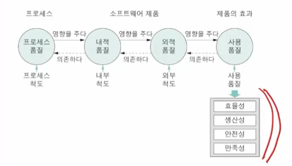
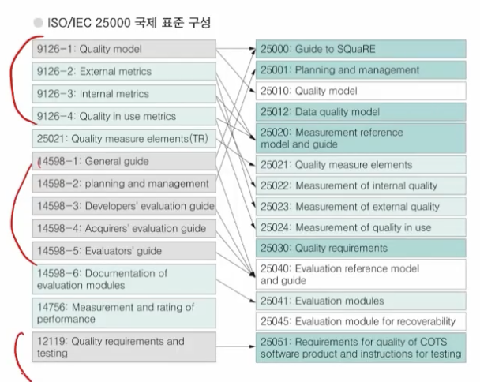

# 4강. 소프트웨어 품질

## 1. 소프트웨어 품질 개요와 분류

### 1. 소프트웨어 품질 개요

- 품질의 정의
  - 제품이나 서비스가 가지는 수월서에 관한 종합적 특성
  - 생산자 입장에서의 품질: 명시된 요구사항을 만족시키는 정도
  - 고객 임장에서의 품질: 고객의 기대나 사용 목적에 부합하는 정도
- 소프트웨어 품질
  - 소프트웨어 공학의 목표 중 하나
  - 명확히 기술된 요구사항을 만족하고, 묵시적인 좋은 품질 특성을 가지는 것
  - 소프트웨어 제품과 프로세스에 적용되는 많은 구체적인 품질 특성이 중요

### 2. 품질 관점

- 사용자 관점
  - 제품의 신뢰성, 효율성, 사용 용이성 등
- 개발자 관점
  - 검증가능성, 유지보수성, 이식성 등
- 관리자 관점
  - 프로세스의 생산성과 제어 용이성

### 3. 소프트웨어 품질의 분류

- **외부특성/내부특성: 소프트웨어 제품의 품질 특성**
  - 내부 특성이 외부 특성이 영향을 줌
  - 외부 특성과 내부 특성이 분명히 구분되는 것은 아님
  - 외부 특성
    - 사용자 관점의 품질 특성
    - 실행, 행위를 측정해 평가
    - 신뢰성/사용성
  - 내부 특성
    - 개발자 관점의 품질 특성
    - 개발자가 외부 특성을 개선하고자 할 때 도움 줌
    - 개발 문서나 코드에 대해 정적으로 측정, 평가

- **제품 특성/프로세스 특성: 프로세스의 품질이 제품의 품질에 영향 줄 수 있음**
  - 제품 특성
    - 고객 관점에서 제품이란 고객에게 전달되는 것
    - 개발자는 요구사항, 설계 문서, 소스 코드, 사용자 매뉴얼 등을 모두 제품으로 생각
  - 프로세스 특성
    - 체계적인 프로세스가 정의되고 개발 과정에 적용되는 것
    - 프로세스 품질은 소프트웨어 품질에 영향 줌
    - 프로세스 품질 관리와 노력이 필요

## 2. 소프트웨어 제품의 품질 표준

### 1. 제품 품질의 표준 - ISO/IEC 9126

- 소프트웨어 제품의 품질 분류와 메트릭을 정의한 표준

- 사용자 관점에 따라 제품 품질 특성을 6가지로 분류(9126-1)

- 6가지 주 품질 특성들은 각각 여러 부특성들로 구성

  

  1. 기능성
  2. 신뢰성
  3. 사용성
  4. 효율성
  5. 유지보수성
  6. 이식성

### 2. ISO/IEC 9126에서 부특성의 설명

### 3. 외부 메트릭과 내부 메트릭

- 부특성을 측정하는 메트릭이 정의됨
- 예. 신뢰성을 높이려면 검토 과정에서 많은 결함을 발견하여 사용 중에 고장으로 연결되지 않도록 ㅎ애ㅑ 함
  - 외부 메트릭으로 평균 고장 간격(MTBF), 내부 메트릭으로 검토 중 발견된 결함의 밀도를 사용

- 외부 메트릭(9126-2)
  - 완성된 소프트웨어를 실행하여 제품의 품질을 측정하기 위한 것
- 내부 메트릭(9126-3)
  - 개발 과정 중에 나오는 소프트웨어 산출물의 품질을 측정하기 위한 것

### 4. 사용 품질

- 사용자가 느끼는 제품의 실제 효과

  - 실제 사용 환경에서 효율성, 생산성, 안전성, 만족성을 가지고 명시된 목표를 달성하는 소프트웨어 제품의 능력

  - 소프트웨어 자체 특성이 아니라, 사용해 본 결과를 사용자가 측정

  - 사용 품질 관련 4가지 특성과 메트릭을 정의(9126-4)

    

- 사용 품질 관련 4가지 특성

  1. 효율성
  2. 생산성
  3. 안전성
  4. 만족성

### 5. ISO/IEC 25000

- SQuaRE(Software product Quality Requirements and Evaluation)
  - 품질 관리
  - 품질 모델
  - 품질 메트릭
  - 품질 요구사항
  - 품질 평가

### 6. 맥콜의 제품 품질 특성

- 11개의 품질 요인 제시
  - 제품 운영
    - 정확성, 신뢰성, 효율성, 무결성, 사용성
  - 제품 개선
    - 유지보수성, 시험성, 유연성
  - 제품 전이
    - 이식성, 재사용성, 상호운영성
- 23개의 품질 기준을 제시(개발자 관점의 내부 품질 기준)
- 메트릭을 제시함
  - 품질 기준을 정량적으로 측정하는 방법과 단위

## 3. 프로세스 품질 표준

### 1. 프로세스 품질 표준

- 프로세스 품질
  - 품질 목표의 달성을 위해 고품질 소프트웨어 개발을 유도한느 시스템을 갖추어야 함
  - 원칙과 실무 지침을 갖춘 성숙한 개발 프로세스가 필요
- SPICE - ISO/IEC15504
  - Software Process Improvement and Capability Determination
  - 개발 조직의 능력을 평가하고, 개발 공정을 개선하여 품질과 생산성을 높이기 위한 **프로세스 평가** **프레임워크**
- ISO/IEC 12207
  - 소프트웨어의 구입, 공급, 개발, 운영, 유지보수를 위한 소프트웨어 **생명주기 프로세스의 공통 프레임워크**를 제공
- CMMI
  - 조직의 **프로세스 역량 성숙도**를 평가하고 개선하기 위한 모델
- ISO 9001
  - 조직에 **품질 경영체제**를 도입하고, 프로세스 품질 인증 획득을 위한 모델

## 4. 소프트웨어 품질 보안

## 5. 신뢰도

