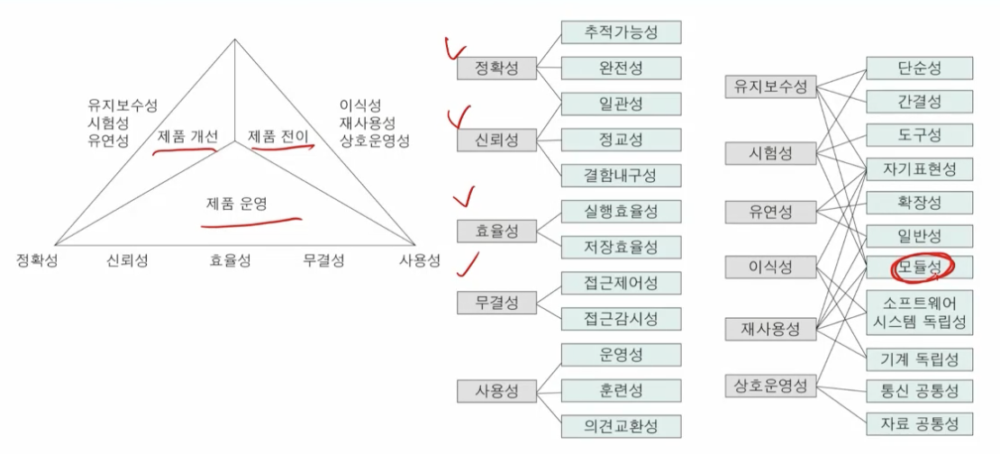
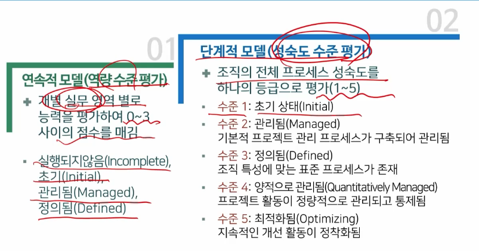

# 4강. 소프트웨어 품질

## 1. 소프트웨어 품질 개요와 분류

### 1. 소프트웨어 품질 개요

- 품질의 정의
  - 제품이나 서비스가 가지는 수월서에 관한 종합적 특성
  - 생산자 입장에서의 품질: 명시된 요구사항을 만족시키는 정도
  - 고객 임장에서의 품질: 고객의 기대나 사용 목적에 부합하는 정도
- 소프트웨어 품질
  - 소프트웨어 공학의 목표 중 하나
  - 명확히 기술된 요구사항을 만족하고, 묵시적인 좋은 품질 특성을 가지는 것
  - 소프트웨어 제품과 프로세스에 적용되는 많은 구체적인 품질 특성이 중요

### 2. 품질 관점

- 사용자 관점
  - 제품의 신뢰성, 효율성, 사용 용이성 등
- 개발자 관점
  - 검증가능성, 유지보수성, 이식성 등
- 관리자 관점
  - 프로세스의 생산성과 제어 용이성

### 3. 소프트웨어 품질의 분류

- **외부특성/내부특성: 소프트웨어 제품의 품질 특성**
  - 내부 특성이 외부 특성이 영향을 줌
  - 외부 특성과 내부 특성이 분명히 구분되는 것은 아님
  - 외부 특성
    - 사용자 관점의 품질 특성
    - 실행, 행위를 측정해 평가
    - 신뢰성/사용성
  - 내부 특성
    - 개발자 관점의 품질 특성
    - 개발자가 외부 특성을 개선하고자 할 때 도움 줌
    - 개발 문서나 코드에 대해 정적으로 측정, 평가

- **제품 특성/프로세스 특성: 프로세스의 품질이 제품의 품질에 영향 줄 수 있음**
  - 제품 특성
    - 고객 관점에서 제품이란 고객에게 전달되는 것
    - 개발자는 요구사항, 설계 문서, 소스 코드, 사용자 매뉴얼 등을 모두 제품으로 생각
  - 프로세스 특성
    - 체계적인 프로세스가 정의되고 개발 과정에 적용되는 것
    - 프로세스 품질은 소프트웨어 품질에 영향 줌
    - 프로세스 품질 관리와 노력이 필요

## 2. 소프트웨어 제품의 품질 표준

### 1. 제품 품질의 표준 - ISO/IEC 9126

- 소프트웨어 제품의 품질 분류와 메트릭을 정의한 표준

- 사용자 관점에 따라 제품 품질 특성을 6가지로 분류(9126-1)

- 6가지 주 품질 특성들은 각각 여러 부특성들로 구성

  

  1. 기능성
  2. 신뢰성
  3. 사용성
  4. 효율성
  5. 유지보수성
  6. 이식성

### 2. ISO/IEC 9126에서 부특성의 설명

### 3. 외부 메트릭과 내부 메트릭

- 부특성을 측정하는 메트릭이 정의됨
- 예. 신뢰성을 높이려면 검토 과정에서 많은 결함을 발견하여 사용 중에 고장으로 연결되지 않도록 ㅎ애ㅑ 함
  - 외부 메트릭으로 평균 고장 간격(MTBF), 내부 메트릭으로 검토 중 발견된 결함의 밀도를 사용

- 외부 메트릭(9126-2)
  - 완성된 소프트웨어를 실행하여 제품의 품질을 측정하기 위한 것
- 내부 메트릭(9126-3)
  - 개발 과정 중에 나오는 소프트웨어 산출물의 품질을 측정하기 위한 것

### 4. 사용 품질

- 사용자가 느끼는 제품의 실제 효과

  - 실제 사용 환경에서 효율성, 생산성, 안전성, 만족성을 가지고 명시된 목표를 달성하는 소프트웨어 제품의 능력

  - 소프트웨어 자체 특성이 아니라, 사용해 본 결과를 사용자가 측정

  - 사용 품질 관련 4가지 특성과 메트릭을 정의(9126-4)

    

- 사용 품질 관련 4가지 특성

  1. 효율성
  2. 생산성
  3. 안전성
  4. 만족성

### 5. ISO/IEC 25000

- SQuaRE(Software product Quality Requirements and Evaluation)
  - 품질 관리
  - 품질 모델
  - 품질 메트릭
  - 품질 요구사항
  - 품질 평가

### 6. 맥콜의 제품 품질 특성

- 11개의 품질 요인 제시
  - 제품 운영
    - 정확성, 신뢰성, 효율성, 무결성, 사용성
  - 제품 개선
    - 유지보수성, 시험성, 유연성
  - 제품 전이
    - 이식성, 재사용성, 상호운영성
- 23개의 품질 기준을 제시(개발자 관점의 내부 품질 기준)
- 메트릭을 제시함
  - 품질 기준을 정량적으로 측정하는 방법과 단위

## 3. 프로세스 품질 표준

### 1. 프로세스 품질 표준

- 프로세스 품질
  - 품질 목표의 달성을 위해 고품질 소프트웨어 개발을 유도한느 시스템을 갖추어야 함
  - 원칙과 실무 지침을 갖춘 성숙한 개발 프로세스가 필요
- SPICE - ISO/IEC15504
  - Software Process Improvement and Capability Determination
  - 개발 조직의 능력을 평가하고, 개발 공정을 개선하여 품질과 생산성을 높이기 위한 **프로세스 평가** **프레임워크**
- ISO/IEC 12207
  - 소프트웨어의 구입, 공급, 개발, 운영, 유지보수를 위한 소프트웨어 **생명주기 프로세스의 공통 프레임워크**를 제공
- CMMI
  - 조직의 **프로세스 역량 성숙도**를 평가하고 개선하기 위한 모델
- ISO 9001
  - 조직에 **품질 경영체제**를 도입하고, 프로세스 품질 인증 획득을 위한 모델

### ISO 9000 시리즈

- 품질 경영을 위한 기본 요소를 규정하고 실천을 위한 활동지침을 제시
- ISO 9000
  - 품질 관리 시스템의 기본과 관련 용어들을 설명
- ISO 9001
  - 품질 관리 시스템의 요건을 설명
  - ISO 9001 인증은 정형화된 업무 프로세스가 적용되어 품질 문화가 정착되었다
- 특징
  - 프로세스 평가 보다 품질 관리 자체이 중점을 둠
  - 평가를 등급화하지 않고 ISO 9001의 인증 여부만을 결정

### CMMI

- 조직의 프로세스 성숙도를 평가하는 모델
  - 개발을 위한 CMMI, 발주를 위한 CMMI, 서비스를 위한 CMMI가 존재
- 다양한 기업에 프로세스의 구축, 평가, 개선을 위한 프레임워크를 제공
- ISO 9001과 ISO 15504(SPICE)의 관심사를 포함한 통합 모델
- CMMI의 모델의 구조
  - 단계적 모델(성숙도 수준 평가)
    - 조직 전체의 프로세스 성숙도를 1~5 수준으로 평가
  - 연속적 모델(역량 수준 평가)
    - 20여개의 실무 영역에 대해 각각 0~3 사이의 등급을 부여

### CMMI 모델의 구성 요소

- 개발을 위한 CMMI-DEV는 20개의 실무 영역(PA)으로 구성됨
  - 평가 영역을 여러 실무 영역으로 구분함
  - 개별 실무 영역에서 수준(1~5) 별로 분리된 지침 그룹(PG)이 존재함
- 실무 영역은 4개 범주, 9개 역량 영역(CA)로 분류됨
  - 범주로는 이행(Doing), 관리(Managing), 지원(Enabling), 개선(Improving)이 있음

### CMMI와 평가

## 4. 소프트웨어 품질 보증

### 소프트웨어 품질 보증(SQA)

- 소프트웨어 품질 요구가 만족됨을 보증하는 품질 관리 활동
  - 개발자나 품질 보증 팀이 수행하는 체계적 품질 관리 활동으로 개발 과정 전체에 적용
  - 궁극적 목적은 사용자가 제품을 사용할 때, 기대했던 기능과 성능을 보일 것임을 고객에게 보증하는 것
- 품질 보증 활동의 예
  - 개발 팀이 준수해야 하는 제품과 프로세스의 표준을 정하고 시스템에서 요구되는 품질 속성을 정의
  - 사용한느 절차, 도구 및 기술들이 적정 수준 이상임을 보증
  - 표준에 기초하여 필요한 활동을 취함(QC: 품질제어)

### SQA 계획의 구성

- 품질 보증 조직의 구성
- 제품과 품질 프로세스 표준
- 검토와 감사 방법
- 테스트 계획과 절차
- 형상 관리 방법, 위험 관리 방법 등

### 품질 제어(QC)

- 개발 프로세스, 코드 및 관련 문서가 품질 보증 절차에 따라 수행되고, 표준을 따르며 품질 목표를 만족하도록 필요한 활동을 취하는 것
  - 프로세스에 따라 활동을 수행하는지 검토
  - 요구 명세서, 설계 문서, 코드 등을 검토
  - 테스트 계획이나 형상 관리 절차에서 나오는 문서들을 검토
- 용어의 혼용
  - 품질 제어는 결함을 발견하고 수정하는 목적을 가지며, 품질 보증은 사전 예방 활동의 의미가 있음
  - 제품을 대상으로 하는 것을 품질 제어, 프로세스를 대상으로 하는 것을 품질 보증으로 보기도 함

### 확인과 검증(V&V)

- 요구사항 명세서의 검토, 설계 문서와 코드의 인스펙션, 프로그램의 테스트를 모두 포함하는 개념(정적 검토와 동적 테스트를 포함)
- 확인(Verification)
  - 확인은 소프트웨어가 명세서와 일치하는지 검사하는 것
- 검증(Validation)
  - 검증은 소프트웨어가 고객의 기대를 충족하는 검사하는 것

### 검토

- 정적 테스트라고 함
  - 프로그램을 실행하지 않고 검토하는 회의
  - 정적 분석 도구를 사용하여 분석할 수 있음
  - 적은 노력으로 빠르게 결함을 발견할 수 있다고 알려짐
- 목적
  - 소프트웨어 요 소가 요구 명세서와 일치하는지 확인
  - 계획, 표준 및 지침에 맞게 개발되었는지 확인
  - 소프트웨ㅐ어 요소의 변경이 적절히 구현되었는지 확인

### 검토 방법

## 5. 신뢰도

### 신뢰도

- 의도된 기능을 고장 없이 실행할 수 있는 프로그램 능력
  - 가장 중요한 소프트웨어 품질 특성의 하나
  - 서비스를 요청할 때, 시슽메이 고장 없이 정확하게 작동할 확률
- 신뢰도는 사용 환경과 고장의 결과에 따라 다르게 인식될 수 있음
  - 내재된 결함(fault)이 있더라도 고장(failure)으로 연결되지 않을 수 있음
  - 사용 호나경에 따라 고장 빈도가 다를 수 있음
  - 고장의 결과가 심각하지 않다면 신뢰성이 있다고 할 수 있음

### 신뢰도 메트릭

- MTTF(Mean Time to Failures)

  - 가동되어 고장이 발생할 때까지의 평균 시간(평균 수명)
  - 고장의 복구를 고려하지 않음
  - MTTF = (a1 + a2 + a3) / 3

- MTBF(Mean Time Between Failure)

  - 고장이 수리되어 가동된 후 다시 고장이 일어날 때 사이의 평균 간격(MTTF)

  - 고장의 복구를 고려함

  - 또는 MTTF에 평균 복구 시간 (MTTR)을 더한 것으로 정의함(아래)

  - MTBF = ((a1 + a2 + a3) + (r1 + r2 + r3) / 3)

    

- AVAIL(가용성)

- ROCOF(Rate of Occurrences Of Failures)

  - 고장의 발생 비율
  - 규칙적이고 빈번한 서비스 요청이 들어오는 시스템의 신뢰도 측정
  - 예: 예약 시스템의 ROCOF가 0.002라면 1000회의 요청에서 2회 오류가 발생한다느 ㄴ것
