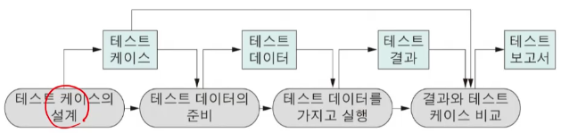
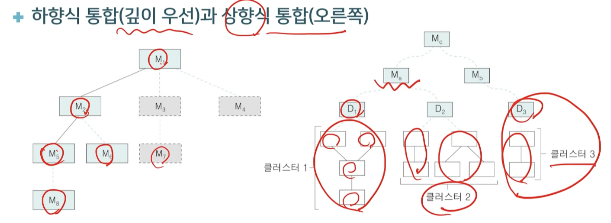

# 5강. 소프트웨어 테스트

## 1. 소프트웨어 테스트 개요

### 소프트웨어 테스트

- 소프트웨어 품질 보증을 위한 활동
  - V&V 활동의 하나
  - 품질 확보를 위해 개발과정에서 테스트 비중이 큼
- 프로그램을 실행시켜 요구 사항의 만족을 보이거나 결함을 찾기 위한 활동
  - 입력 데이터를 가지고 실행시키며 동적 테스트라고 함
  - 오류를 찾기 위한 것이며, 오류가 없음을 증명하는 것이 아님
- 성공적인 테스트란 발견되지 못했던 결함을 찾는 테스트임

### 결함 테스트와 검증 테스트

- 결함 테스트
  - 소규모 코드에서 결함을 찾고자 하는 것
  - 부정확한 계산이나 데이터 오류 등이 발생하는지 확인
  - 좁은 의미에서의 테스트라고 할 때, 결함 테스트를 의미
- 검증 테스트
  - 주요 시스템의 기능을 검증하기 위한 것
  - 주어진 요구 명세의 만족을 보이는 인수 테스트와 같은 고수준 테스트

### 테스트 작업의 원칙

- 테스트 케이스는 입력값 외의 결과 값을 포함해야 함
- 자신이 작성한 프로그램을 스스로 테스트하지 말 것
- 프로그래밍 조직이 자체적으로 테스트하지 말 것
- 테스트 작업의 후반부로 가서도 소홀히 하지 말 것
- 올바르지 못한 입력 값이나 예상하기 힘든 입력 값을 고려해야 함
- 정상적 동작의 확인은 물론, 절대로 해서는 안되는 행위를 하지 않았는지 확인할 것
- 테스트 케이스를 버리지 말고 재사용 할 것
- 오류가 없을 것이라는 가정을 하지 말 것
- 오류가 발견된 곳에서 추가적인 오류가 발생할 가능성이 높음

### 소프트웨어 테스트 프로세스

- 테스트 케이스
  - 테스트를 위한 입력과 기대되는 출력, 무엇을 검사할 지에 관한 설명을 포함함
- 테스트 데이터
  - 테스트에 사용되는 입력 데이터

### 테스트 작업의 고려사항과 우선 순위

- 고려 사항
  - 모든 가능한 실행 경로나 모든 가능한 테스트 데이터를 테스트하는 것은 현실적으로 불가능
  - 가능한 테스트 케이스들 중 일부만을 실행
  - 오류의 발견 확률이 높은 입력 값을 구해서 테스트해야 함
  - 어느 수준까지 테스트할 것인지 정함
- 테스트 작업의 우선순위
  - 전체 시스템을 테스트하는 것이 모듈 하나보다 중요함
  - 기존 기능을 테스트하는 것이 새로운 기능보다 중요함
  - 일반적 상황을 테스트하는 것이 예외적인 경우보다 중요함

## 2. 단계별 테스트

### 단위 테스트

- 시스템을 구성하는 기본 단위를 테스트
  - 결함 발견을 위해 개별적 모듈을 독립적으로 확인하는 작업
- 다른 모듈과 통합되기 전에 수행함
- 드라이버(driver)와 스텁(stub)을 사용
  - 드라이버는 테스트되는 모듈을 호출하며 결과를 출력한 출력해 주는 프로그램
  - 스텁은 테스트되는 모듈에 의해 호출되는 모듈

### 통합 테스트

- 테스트된 개별 모듈들을 통합하여 상호작용으로 인한 문제가 있는지 테스트
  - 주로 상호작용에서 생기는 결함을 발견하기 위함
  - 모듈들이 정확히 호출되며, 함께 동작하고, 올바른 데이터가 인터페이스를 통해 적시에 전달되는지 검사
  - 테스트 케이스는 모듈 간의 인터페이스를 검사할 목적으로 개발됨
- 통합 테스트는 프로그램을 구축해 가는 기술이며, 최종적으로 시스템이 구축됨
- 주로 블랙박스 테스트 기법을 사용

### 시스템 통합 방식

- 빅뱅 통합

  - 모듈들을 모두 개발한 후 한꺼번에 통합

- 점증적 통합

  - 모듈을 하나씩 추가해 통합한 후 테스트

- 하향식 통합

  - 점증적 통합 방식으로 제어 계층 구조상에서 최상위 모듈부터 시작해 아래 모듈들을 차례로 통합시킴
  - 통합되어 테스트되는 모듈들의 하위 모듈에 대해 스텁이 필요
  - 깊이 우선 방식과 너비 우선 방식
  - 장단점
    - 초기에 소프트웨어 구조가 갖추어지고 개발자에게 심리적인 안정감을 줌
    - 병행 통합 작업이 어렵고, 입출력 모듈이 하위에 위치하므로 테스트 작업이 어려움

- 상향식 통합

  - 프로그램 구조에서 최하위 모듈들을 먼저 만들어 테스트하고 상위 수준으로 올라가며 통합과 테스트를 함
  - 하위 모듈들을 통합하다보면 클러슽어 형성
  - 통합되는 모듈을 제어하기 위해 드라이버 필요
  - 장단점
    - 초기 단계에서 병행 작업이 가능하며 대규모 시스템을 통합할 때 적당
    - 골격을 갖추는 데 오랜 시간이 걸리고, 같은 수준의 모듈들이 준비되어야 테스트 가능

- 하향식 통합 vs 상향식 통합 비교

  

- 샌드위치 테스트
  - 상향식 + 하향식 조합

## 3. 화이트박스 테스트

## 4. 블랙박스 테스트

## 5. 비기능성 테스트