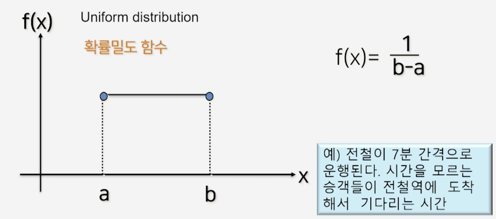
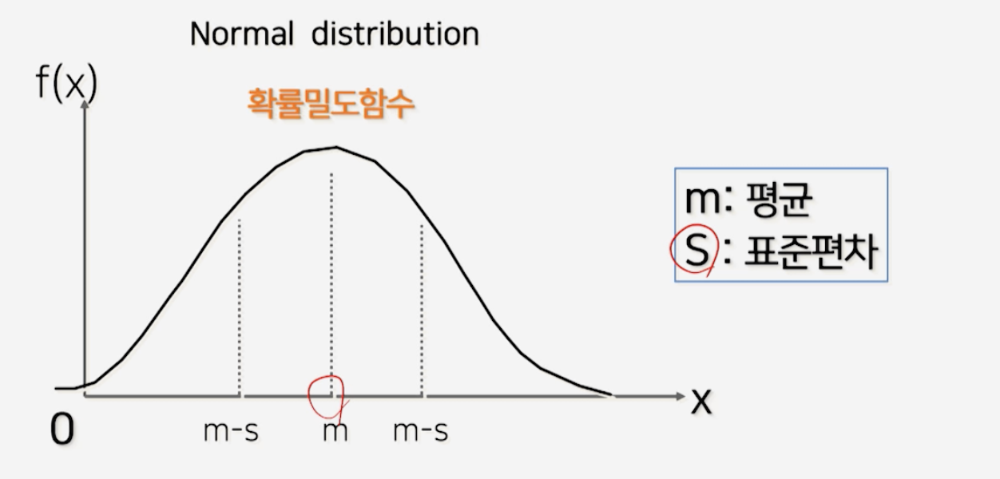

# 2강. 확률적 시뮬레이션

## 확률적 시뮬레이션

- probabilistic / stochastic simulation 

- 확률 변수(random variable) 사용

### 확률적 상황

- 저축 문제

  - 연봉의 인상율: 5% 가정
  - 실제 상황은 가변적이므로 확률 변수로 가정
    - 일양 분포/균등분포
    - 정규 분포
    - 지수 분포

  

### 확률적 상황 예

- **일양 분포/균등분포**
  - 승객들이 전철역에 도착해서 기다리는 시간(전철 간격 7분)
- **정규 분포**
  - 시뮬레이션 성적 분포
- **지수 분포**
  - 은행에 도착하는 고객의 봉사시간
- **Poissn 분포**
  - 어느 도시에서 하루 동안 발생하는 출생자 수

### 연속형 일양분포(Uniform distribution)

### 정규 분포(Normal distribution)

