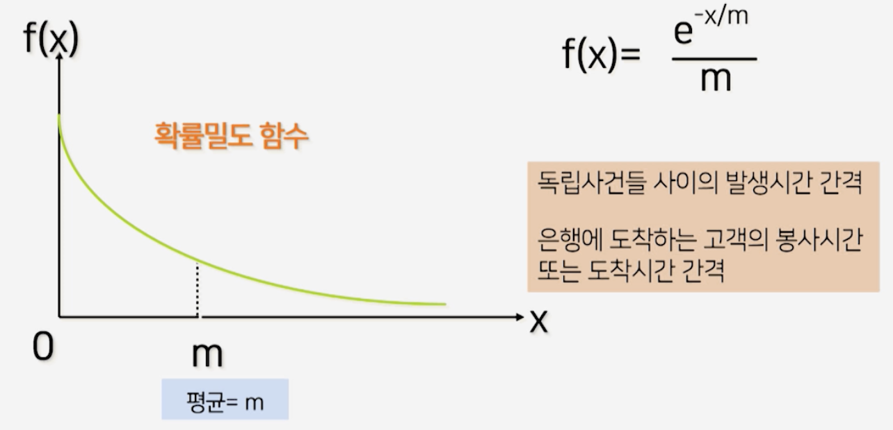
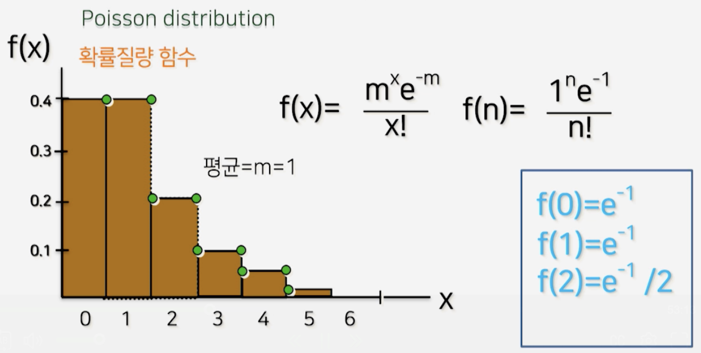
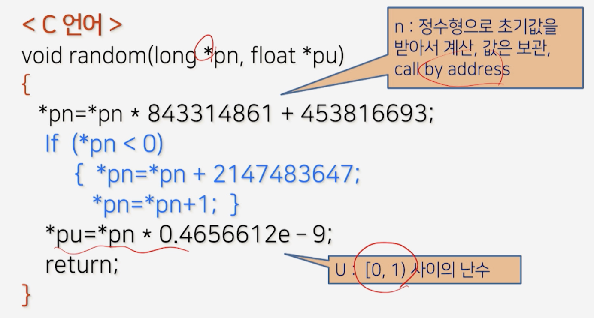

# 2강. 확률적 시뮬레이션

## 확률적 시뮬레이션

- probabilistic / stochastic simulation 

- 확률 변수(random variable) 사용


### 확률적 상황

- 저축 문제

  - 연봉의 인상율: 5% 가정
  - 실제 상황은 가변적이므로 확률 변수로 가정
    - 일양 분포/균등분포
    - 정규 분포
    - 지수 분포

  

### 확률적 상황 예

- **일양 분포/균등분포**
  - 승객들이 전철역에 도착해서 기다리는 시간(전철 간격 7분)
- **정규 분포**
  - 시뮬레이션 성적 분포
- **지수 분포**
  - 은행에 도착하는 고객의 봉사시간
- **Poissn 분포**
  - 어느 도시에서 하루 동안 발생하는 출생자 수


### 연속형 일양분포(Uniform distribution)


### 정규 분포(Normal distribution)


### 지수분포(Expoential distribution)




### 포아송 분포

- 이산형




### 확률적 상황

- 저축문제
  - 연봉의 인상율: 5% 가정
- 실제 상황: 가변적; 
  - 확률 변수로 가정(난수U[0,1))
    - 일양 분포
    - 정규 분포
    - 지수 분포


### 난수의 개념

- 발생 확률이 같다
- 예측할 수 없다(임의성)
  - 난수(Random number)


### [0, 1) 난수 발생

- 다양한 확률변수 발생공식 적용
- 일양/지수/정규/포아송 ... 확률변수 발생


### [0,1) 난수 발생 알고리즘

- n = 초기값, U = 1과 0 사이의 난수

```python
Subprogram random(n, U)
# call by address
# n 값은 주소값임
{ n = n * 843314861 + 453816693
  if (n < 0) then
    { n = n + 2147483647 + 1}
 
  # [0, 1) 사이의 난수
  U = n * 0.4656612E-9
}
```

#### <C 언어>




## 난수발생기 예

### 난수발생기 예

- 5000개의 난수 U[0,1) 발생과정

  ```C
  for i = 1, 5000
  { call random(n, U)
    print U
  }
  ```

- 알고리즘

  - 난수의 성격을 만족하는가?

  ```c
  for i = 1, 5000
  { call random(n, U)
    print U
    r1 = 0.0
    r2 = 0.2
  }
  ```

  ```c
  // COUNT = []
  for j = 1,5
  { if r1 <= U <= r2 then
    { COUNT[j] = COUNT[j] + 1 }
      r1 = r1 + 0.2
      r2 = r2 + 0.2
  }
  ```

- 실행결과

  

  - 비슷한 확률에 수렴


### 주사위 문제 응용

- 난수를 어떻게 활용하느냐?

```c
0 <= U < 1 U[0,1)

call random(seed, U)
side = int(U * 6) + 1 = [1, 6]
     = int[0,6) + 1
     = [0,5] + 1 = [1,6]
```

```C
i = 0
while i < nrooos do
{ call random (seed, U)
  side = int(U*6) + 1
  COUNT[side] = COUNT[side] + 1
  i = i + 1
}
```


- 거의 500 근처에서 수렴하는 것을 볼 수 있음

