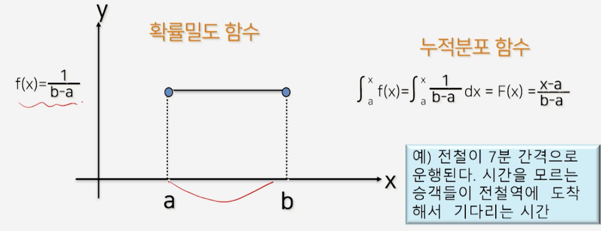
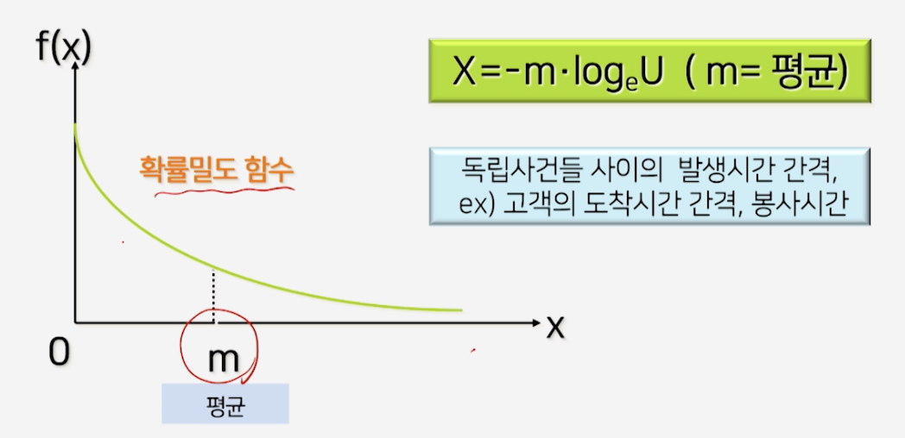
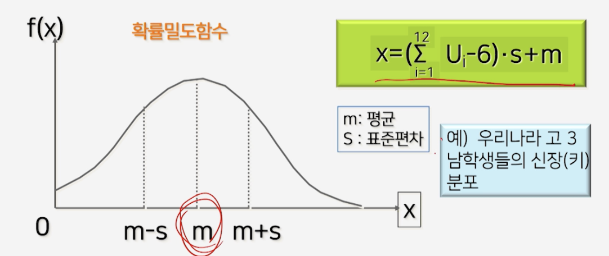
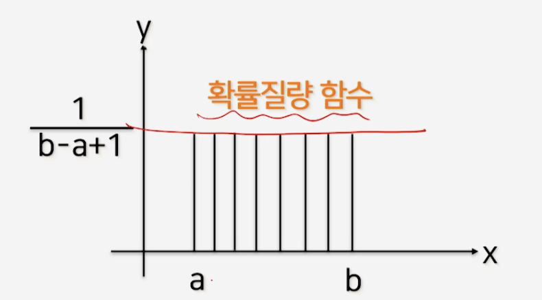
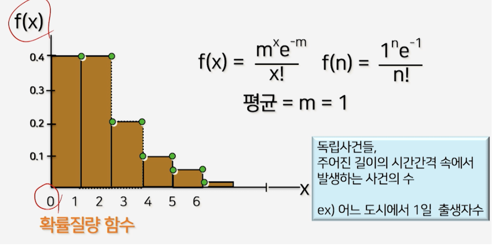

# 3강. 확률변수의 발생

## 1. 저축 문제 2

### 저축 문제1: 결정적 시뮬레이션


- 0-10% 이산형 일양 분포


### 확률변수 발생과정


- 난수 U[0,1) 발생
- 확률변수 발생공식 적용
- 확률변수 발생


## 2. 주사위 문제

- 이산형 확률변수(1~6 범위)

```python
while i < nrolls do
{ call random (seed,U)
	side = int(U*6) + 1
  COUNT[side] = COUNT[side] + 1
  i = i + 1 }
			i = 1
  while i <= 6 do { print COUNT[i]}; i = i + 1
}
```


## 3. 확률변수 발생(이산형/연속형 확률변수)

### 연속형 일양분포




### 연속형 일양확률변수 유도과정


### 연속형 일양확률변수 변형식


### 지수분포




### 정규분포




### 이산형 일양분포




### 포아송 분포


