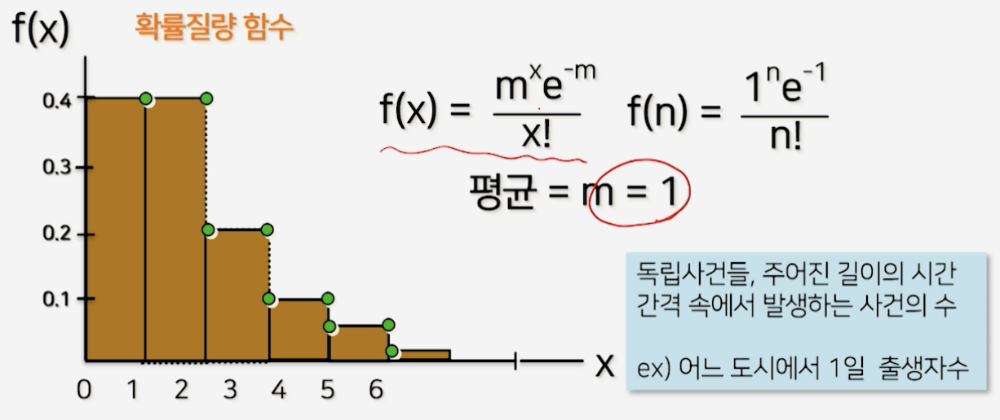

# 4강. 시뮬레이션 응용문제

## 1. 단일창구 대기행렬 문제

### 포아송 확률변수




### 포아송 확률변수 발생

- 이산적인 값이 나옴


```c
void poissn(long *np, float mean, int *pp)
{
  float prod, b, u;
  *pp=0;
  b = exp(-mean);
  prod=1;
  random(np, &u);
  
  prod = prod*u;
  
  while (prod >= b)
  {
    random(np, &u);
    prod = prod*u;
    ++(*pp);
  }
}
```


## 2. 도착상황/봉사시간/출발상황

### 고객 도착사건 알고리즘


## 3. 일양/포아송 확률변수


## 4. 알고리즘과 시뮬레이션 결과 분석

