# 10강. 그래프(3)

## 1. 벨만-포드 알고리즘

### 벨만 포드 알고리즘이란?

- 단일 출발점 최단 경로를 구하는 알고리즘
- 음의 가중치를 갖는 간선이 존재해도 처리 가능
  - 단, 음의 사이클이 없는 경우에 한함
- G=(V, E)에서 |V|=n 일 때, 단계적으로 최단 경로를 구해 나가는 방법
  - 간선을 최대 (n-1)개 사용하는 최단 경로

### 벨만 포드 알고리즘 수행과정

### 코드

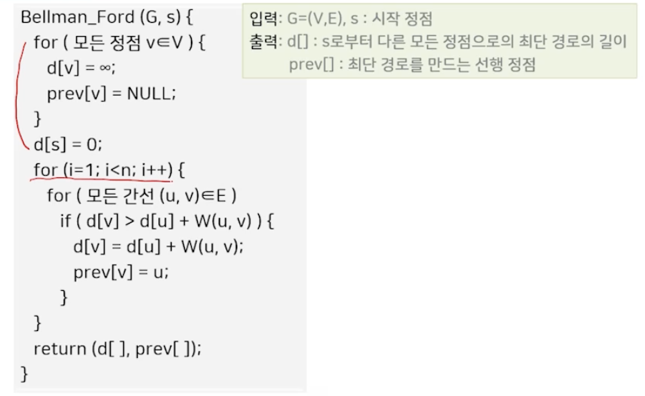

### 성능과 특징

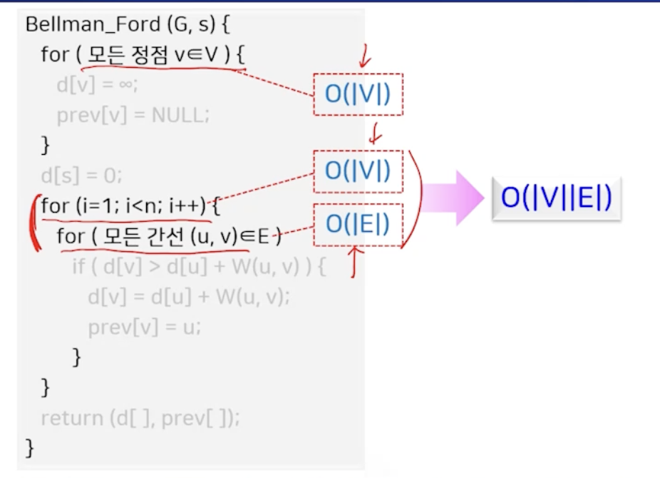

- 음의 가중치를 갖는 간선이 있는 경우

  - 단, 음의 사이클이 존재하면 적용 불가

- 음의 가중치를 갖는 간선이 없는 경우

  - 성능이 데이크스트라가 더 좋음

    

## 2. 플로이드 알고리즘

### 플로이드 알고리즘이란?

- 모든 쌍 최단 경로 알고리즘
- Floyd-Warshall 알고리즘
- 가정: 경로의 길이가 음인 사이클이 존재하지 않음
- 적용 기법: 동적 프로그래밍 방법
- 경유할 수 있는 정점의 범위가 1인 경로로부터 시작해서 |V|인 경로까지 하나의 정점의 범위를 늘려 가면서 모든 정점 간의 최단 경로를 한꺼번에 구함

### 인접 행렬 표현 활용

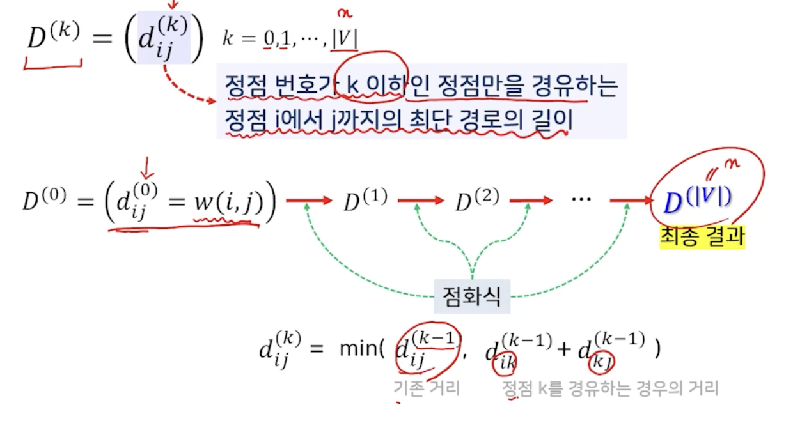

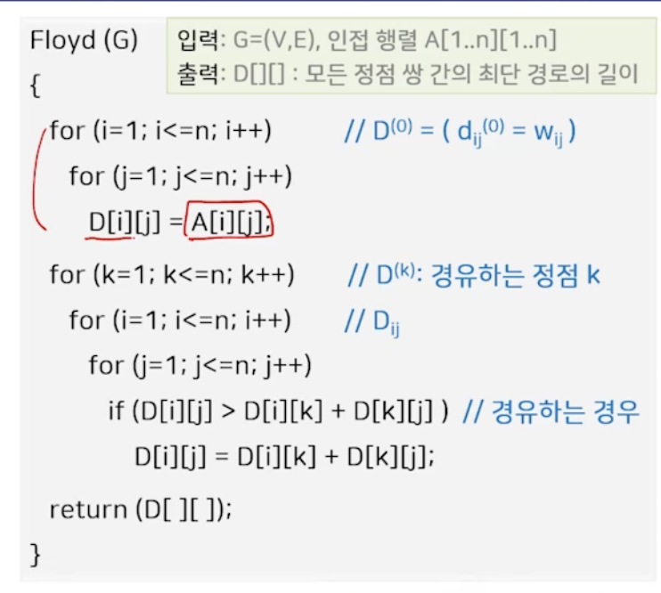

### 플로이드 알고리즘의 성능과 특징

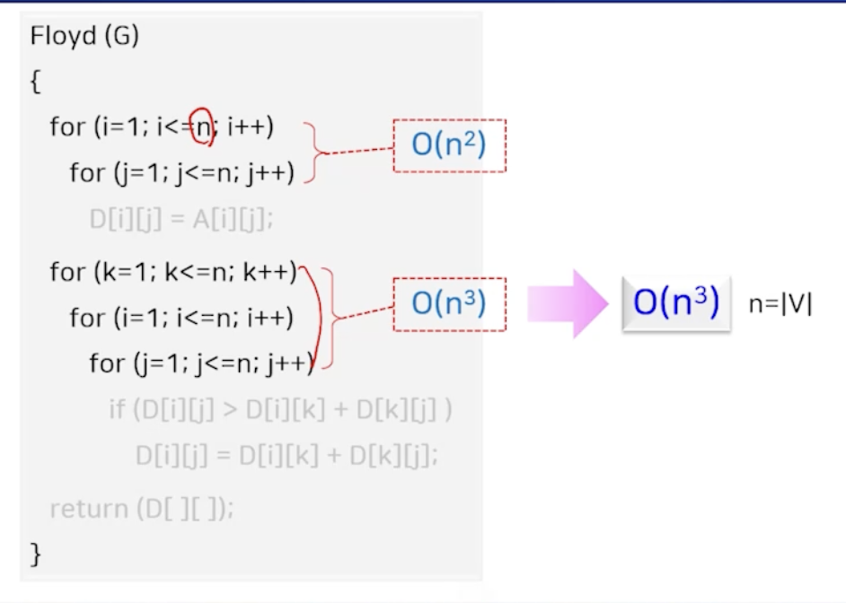

- 동적 프로그래밍 방법을 적용한 알고리즘

  - 

- 데이크스트라 알고리즘으로 모든 쌍 최단 경로를 구할 수 있음

  - 각 정점에 대해서 반복적으로 적용해서 해결 가능  
  - 데이크스트라 보다는 플로이드 알고리즘이 더 간단하므로 빠르게 수행됨
    - 

- P[1..n]\[1..n]을 활용하면 최단 경로 자체를 구할 수 있음

  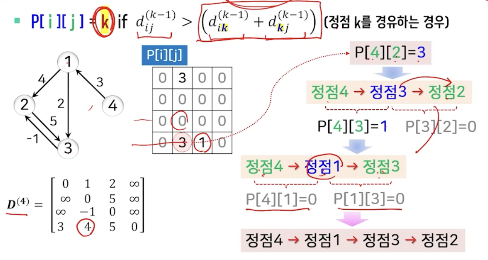

 

## 3. 포드-풀커슨 알고리즘

### 네트워크 플로 문제?

- 주어진 네트워크에서 플로를 최대로 하는 값을 찾는 문제

  - 소스에서 싱크로 보낼 수 있는 플로 값을 최대로 하는 문제 "최대 플로 문제"

- 네트워크 N = (V, E, s, t, c)

  

  

  - 방향 그래프 G = (V, E)
  - **s** 소스(시작점, 진입 차수가 0인 정점)
  - **t** 싱크(도착점, 진출차수가 0인 정점)
  - **c** 간선의 가중치 (간선의 용량)
    - **c(u, v)** 간선 <u, v>를 통해 보낼 수 있는 최대의 양/값

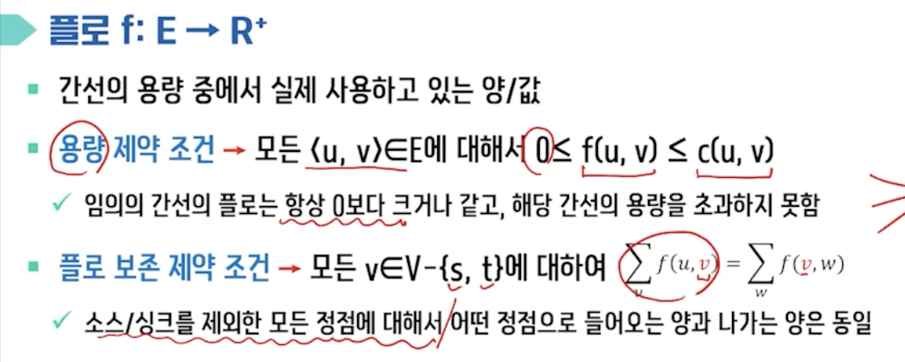

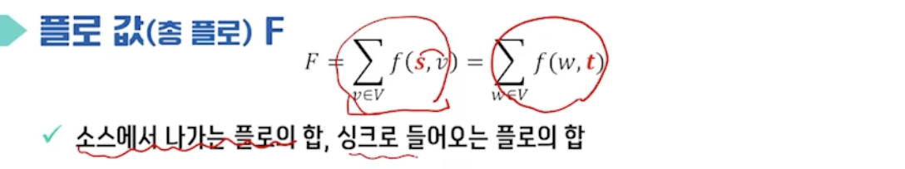

### 포드-풀커슨 알고리즘 개요

- 최초로 제시된 가장 기초적인 해결 방법 by Ford & Fulkerson
  - 단순히 플로 값을 증가시킬 수 있는 모든 경우의 수를 탐색해서 적용
    - 종료가 보장되지 않음
    - 에드몬즈-카프 알고리즘으로 발전
- 모든 간선의 플로를 0으로 둔 상태에서 시작해서, 증가 경로가 더 이상 존재하지 않을 때 까지 반복적으로 경로를 찾아서 최대 플로 값을 구하는 방법

### 포드-풀커슨 알고리즘

- 증가 경로 augmenting path
  - 소스에서 싱크까지 더 많은 플로를 보낼 수 있는 경로
  - 경로상의 간선은 네트워크 N의 간선 방향과 일치하지 않을 수 있음
    - 순방향 간선
    - 역방향 간선

- 잔여 용량 r(u, v)

  - 간선 <u, v> 에서 추가로 플로를 증가시킬 수 있는 여유 용량

    

- 증가 경로의 여유량

  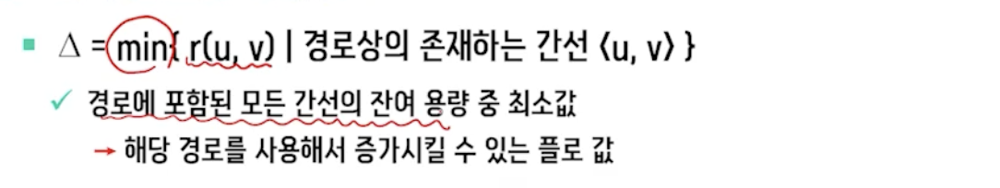

### 코드

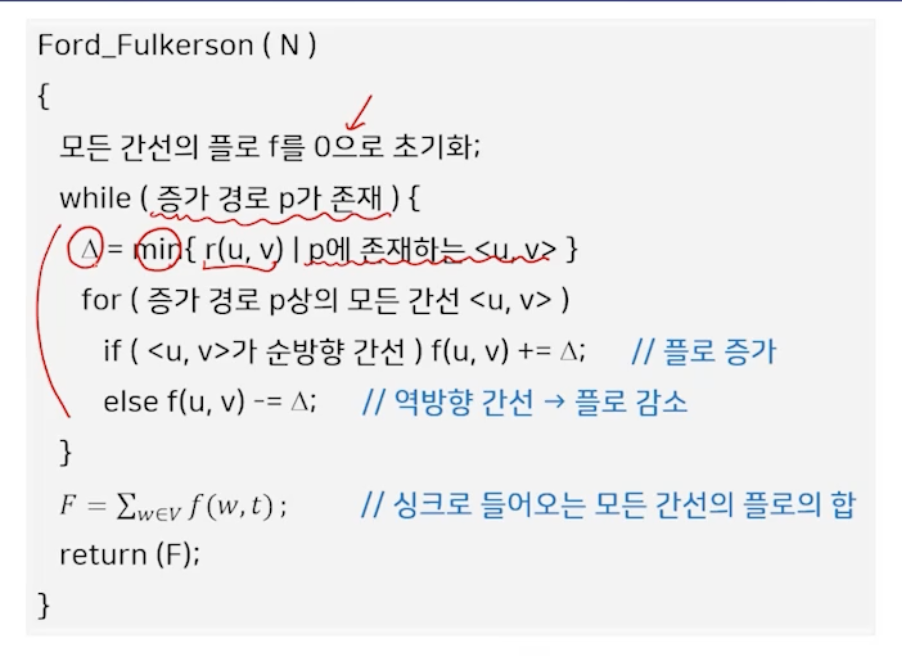

### 예시

- 초기화
  - 증가 경로를 찾고, 해당 경로의 여유량으로 모든 간선의 플로를 조정하는 과정을 반복

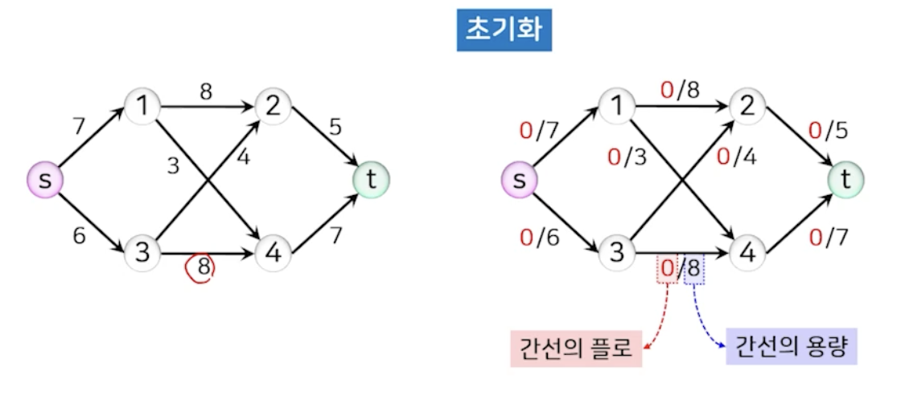

### 성능과 특징

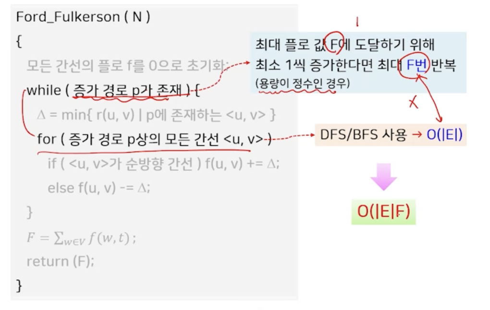

- 문제점

  - 용량으로 무리수를 사용

    - 알고리즘의 종료가 보장되지 못함

  - 용량 M이 매우 큰 값이면 비효율적

    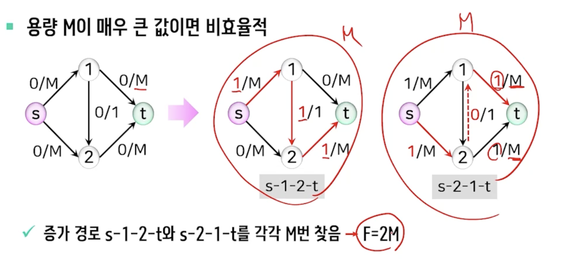

- 증가 경로의 선택은 DFS/BFS 적용

  - 포드 풀커슨 알고리즘
    - 기본적으로 DFS를 적용해 증가 경로 선택
  - 에드몬즈-카프 알고리즘
    - BFS

- 커트 cut

  - 어떤 커트의 용량은 최대 플로의 값과 같다
  - 정확성 증명하는데 많이 사용되는 개념

  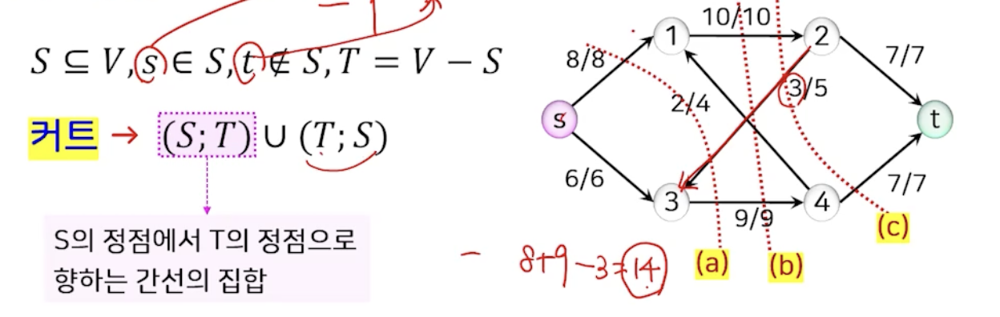

  