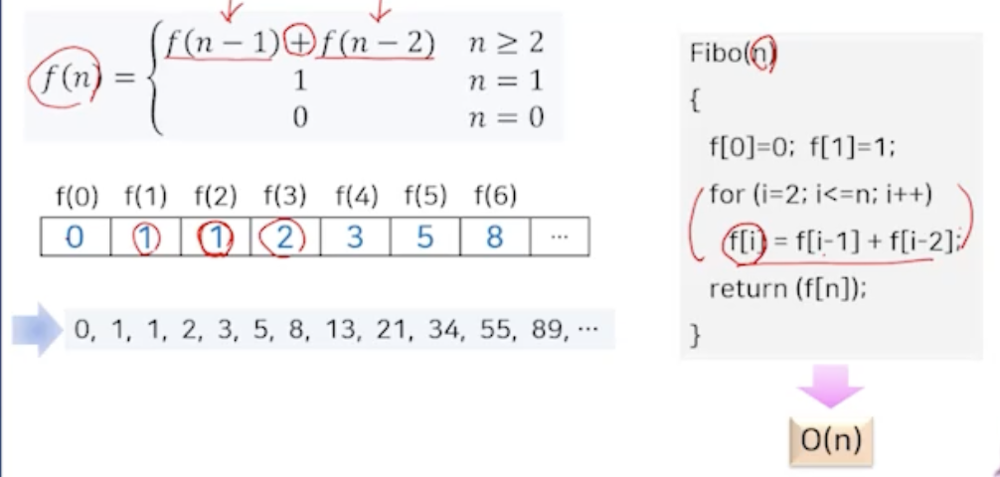
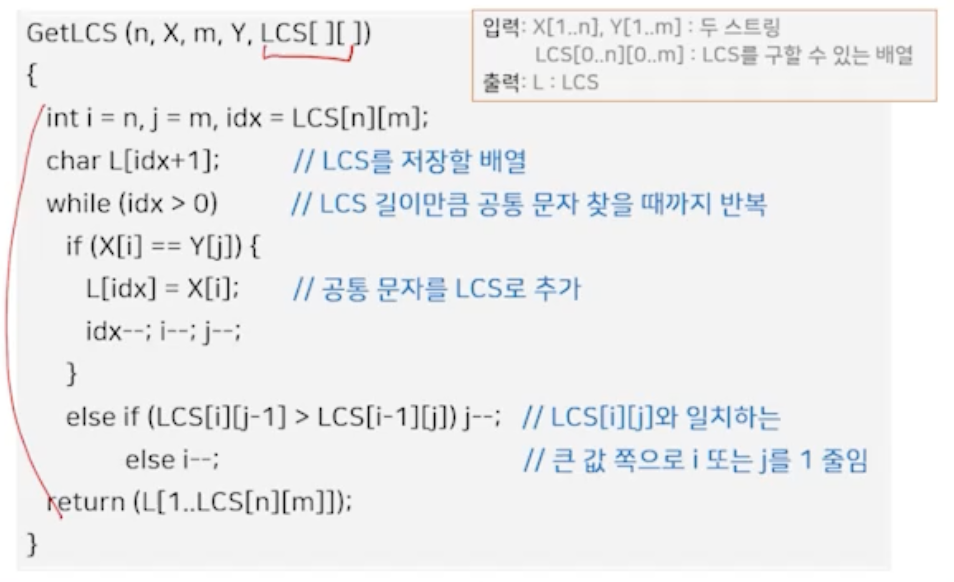

# 11강. 동적 프로그래밍

## 1. 기본 개념

### 동적 프로그래밍?

- 문제의 크기가 작은 소문제에 대한 해를 테이블에 저장해 놓고 이를 이용해서 크기가 보다 큰 문제의 해를 점진적으로 만들어가는 상향식 접근 방법
  - 각 소문제는 원래 주어진 문제와 동일한 문제 > 입력 크기만 작아진 문제
  - 소문제들은 서로 독립일 필요는 없음
  - 동적 프로그래밍
    - 컴퓨터 프로그램과는 무관, 해를 구축하는 데 테이블을 이용한다는 의미
  - 최솟값/ 최댓값을 구하는 최적한 문제에 주로 사용
    - 최적성의 원리(principle of optimality)를 반드시 만족하는 문제에만 적용 가능
- 최적성의 원리
  - 주어진 문제에 대한 최적해는 **주어진 문제의 소문제에 대한 최적해**로 구성됨
- 동적 프로그래밍 방법의 처리 과정
  - 최적성의 원리가 주어진 문제에 성립하는지 확인
  - 주어진 문제에 대해 최적해를 제공하는 점화식 도출
  - 가장 작은 소문제부터 점화식의 해를 구한 뒤 이를 테이블에 저장
  - 테이블에 저장된 소문제의 해를 이용해 점차적으로 입력의 크기가 큰 상위 문제의 해를 구해 나감

### 피보나치 수열

- 분할 정복 방법을 적용하면
  - 순환 알고리즘 형태
  - 소문제가 독립이 아니므로 중복된 계산 필요 => 따라서 매우 비효율적

## 2. 행렬의 연쇄적 곱셈

### 행렬의 연쇄적 곱셈

- 기본 곱셈

  - 행렬 원소끼리의 곱셈

    

  

- 최적성의 원리

  - n개의 행렬을 곱하는 최적의 순서는 n개 행렬의 연쇄적 곱셈 중 일부분에서의 최적의 곱셈 순서를 포함

    

### 연쇄 행렬 곱셈 문제의 점화식

### 행렬의 연쇄적 곱셈 알고리즘

 ### 성능 및 특징

- 시간 복잡도 O(n^3)
- 최적의 행렬 곱셈 순서를 구하는 알고리즘 O(n)

## 3. 최장 공통 부분 수열(LCS)

### Longest Common Subsequence

- 두 스트링의 공통된 부분 수열 중 가장 긴 수열을 구하는 것
  - 부분 수열 => 스트링에서 연속일 필요는 없지만 순서는 유지되는 스트링의 일부분

### LCS에서의 최적성의 원리

- 두 스트링 X와 Y 사이의 LCS는 이들의 어떤 서브스트링 사이의 LCS를 포함

### LCS의 점화식

### 알고리즘

-  LCS의 길이와 관련된 정보

- 출력

### 성능 및 특징

- 길이 n과 m인 두 스트링의 LCS 의 길이 => O(nm)

  - 각각 길이 n 과 m을 사용하는 중첩된 이중 루프

- 테이블 CLS\[][]로부터 LCS를 구하는 알고리즘 => O(n+m)

  	- idx가 LCS 길이만큼 줄어들 때까지 반복하는 형태의 루프로 구성

  	- 실제로는 i=n, j=m부터 최대 i=0, j=0까지 도달 가능