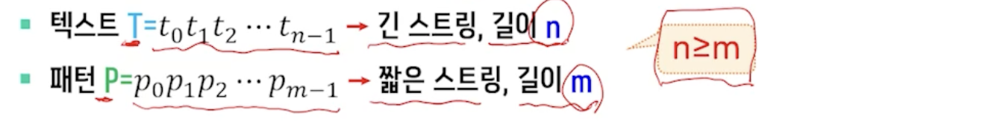
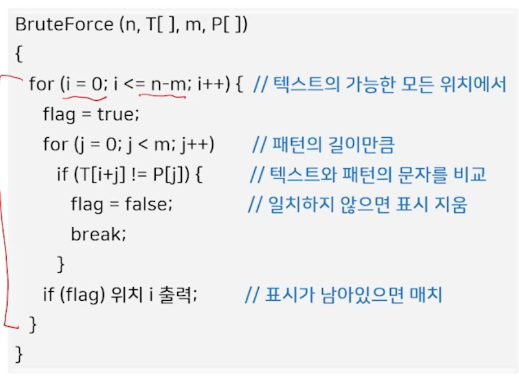
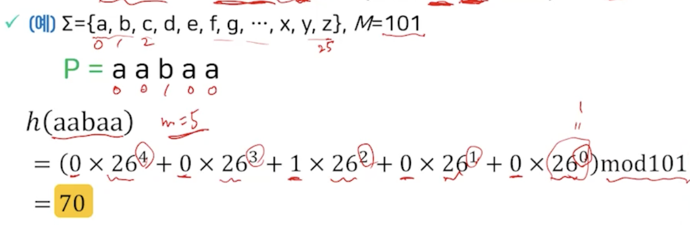
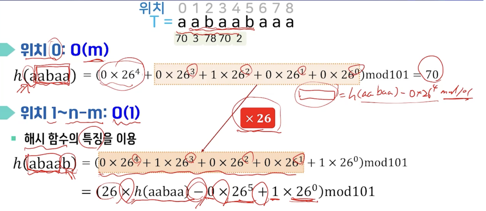
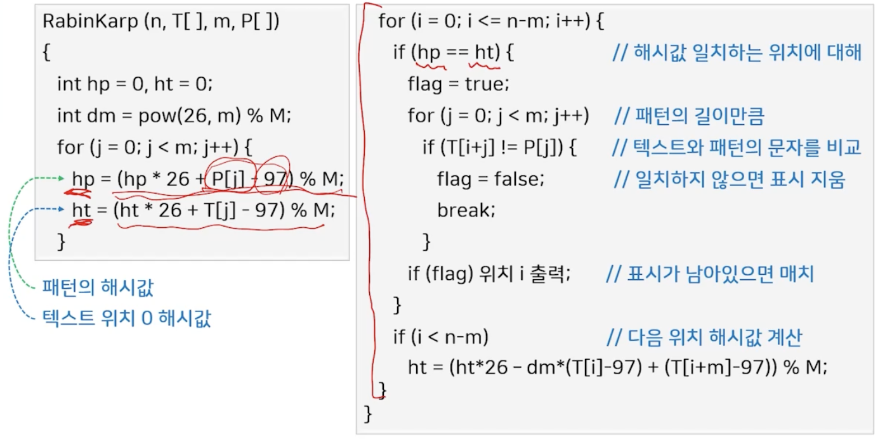
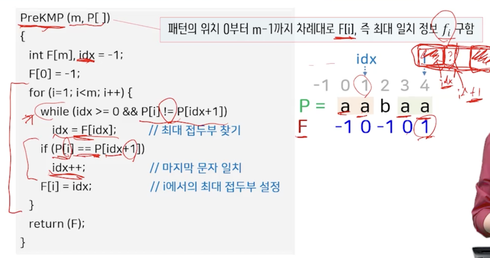
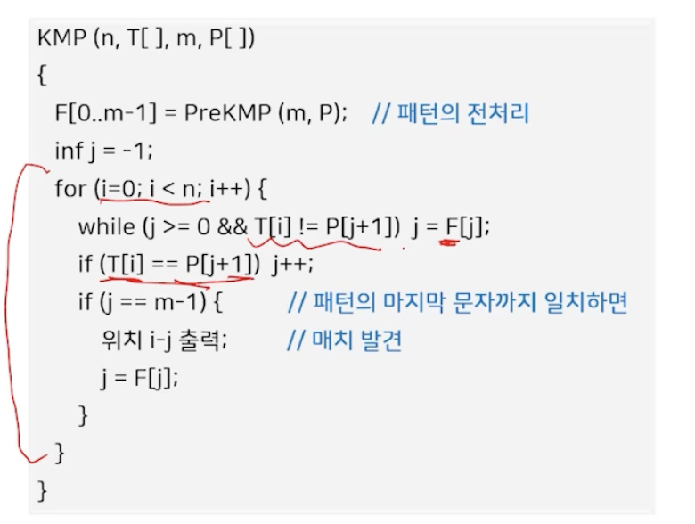
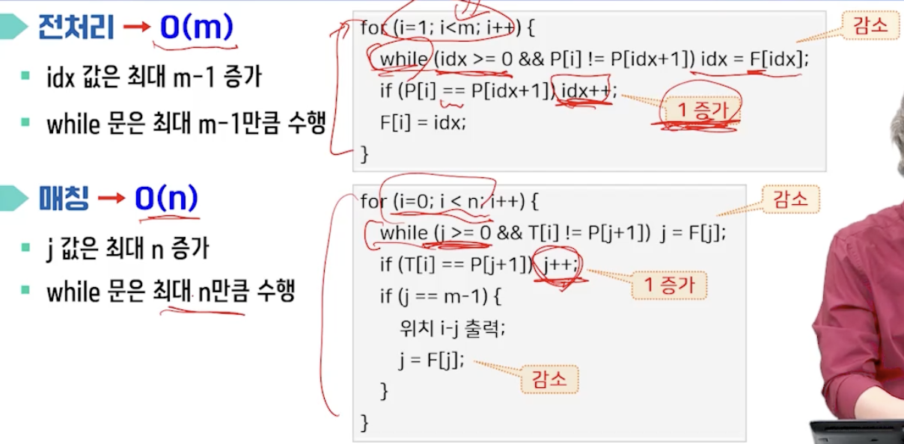

# 12강. 스트링 알고리즘(1)

## 1. 기본 개념

### 스트링 알고리즘이란?

- 스트링
  - 문자가 연속적으로 나열된 문제열
- 알파벳
  - 스트링에 사용되는 문자들의 집합

- 스트링 매칭 / 스트링 압축에 대해 다룰 예정

### 스트링 매칭이란?

- 텍스트에서 패턴이 나타내는 위치를 찾는 것

  

### 브루트 포스 스트링 매칭 알고리즘

- Brute-force / Naive algorithm 
  - 텍스트의 각 위치에서부터 패턴의 길이만큼 문자를 비교하여 매치를 찾는 방법

### 스트링 매칭 알고리즘

- 패턴을 전처리
  - 라빈-카피 알고리즘
  - KMP 알고리즘
  - 보이어-무어 알고리즘
- 텍스트 전처리
  - 접미부 트리
  - 접미부 배열

## 2. 라빈-카프 알고리즘

### Rabin-Karp 알고리즘 개념

- 패턴의 **해시값**으로 매치의 후보를 찾고, 후보에 대해서만 문자별로 비교해서 매치를 찾는 방법

  - 해시 함수: 문자 열을 위한 가중 합

  

### 텍스트 위치별 해시값 계산

### 라빈 카프 알고리즘

### 성능과 특징

- 성능 
  - O(n+km)
  - 전처리 O(m)
  - 텍스트에서 해시값 계산(O(n))
  - 후보 위치는 문자 직접 비교. 매치 개수 k (O(km))

- 매치 개수가 상수 O(n)
- 모든 위치에서 매치 O(nm)

## 2. 라빈-카프 알고리즘

## 3. KMP 알고리즘

### KMP 알고리즘

- Knuth-Morris-Pratt 알고리즘
  - 패턴 내의 문자들의 관계를 이용해 매칭 시 중복된 비교를 줄임
  - 텍스트의 첫 위치에서 패턴의 앞부분부터 문자 비교

- 일치한 서브스트링에 대한 접두부와 접미부의 최대 일치 정보
  - fi에 패턴의 서브스트링에서 최대 일치인 접두부의 끝 문자 위치 저장
    - 접두부와 접미부의 최대 일치가 없으면 -1저장

### 알고리즘 전처리

### 성능과 특징

- 전처리 O(m)
- 매칭 O(n)
- n >= m 전체 성능 O(n)

