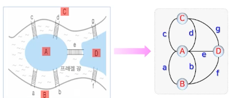

# 1강. 알고리즘 소개(1)

## 기본 개념

### 알고리즘이란?

>  알고리즘의 단계적인 처리 절차를 따르면 주어진 값을 구할 수 있음
>
> 효율적인 알고리즘을 찾는 것이 우리의 목표

- 오일러 경로를 찾는 문제

  - 퀘닉스버그 다리 문제

    

  - 7개의 다리를 오직 한 번씩만 지나면서 원래의 자리로 돌아올 수 있는가?

  - 오일러 경로

    - 그래프의 모든 간선을 오직 한 번씩만 지나가는 경로
    - 이 문제는 오일러 경로가 존재하지 않음

  - 오일러 경로를 찾는 규칙

    - 각 정점의 차수가 홀수인 정점이 0개 혹은 2개여야 한다
    - 홀수점이 2개일 경우에는 홀수점에서 시작해야 한다

- 최단 경로를 찾는 문제

  - 고속도로를 이용해 서울에서 부산까지 가장 짧게(거리, 시간) 가는 방법

    

### 알고리즘의 정의

- 주어진 문제를 해결하거나 함수를 계산하기 위해 따라야 할 명령어들을 단계적으로 나열한 것
  - (입출력) 0개 이상의 외부 입력과 1개 이상의 출력을 생성
  - (명확성) 각 명령은 모호하지 않고 단순 명확해야 함
  - (유한성) 한정된 수의 단계를 거친 후에는 반드시 종료함
  - (유효성) 모든 명령은 컴퓨터에서 수행할 수 있어야 함
- 주어진 문제에 대한 하나 이상의 결과를 생성하기 위해 모호하지 않고 단순 명확하며 컴퓨터가 수행할 수 있는 유한개의 일련의 명령어들을 순서에 따라 구성한 것
- 실용적 관점 => (효율성) 알고리즘은 효율적이야 함

### 알고리즘의 생성 단계

- 설계 > 표현/기술 > 정확성 검증 > 효율성 분석

  

### 알고리즘의 표현/기술 방법

- 일상 언어
- 의사 코드(pseudo code)
- 순서도(flow chart)

## 알고리즘 설계

### 대표적인 알고리즘

- 최솟값 찾기 알고리즘
- 탐색 알고리즘
  - 순차 탐색 알고리즘
  - 이진 탐색 알고리즘
- 주어진 문제와 조건 등이 매우 다양
  - 일반적/범용적인 설계 기법은 미존재
- 대표적인 알고리즘 설계 기법
  - 욕심쟁이 방법(Greedy)
  - 분할정복 방법(Divide and conquer)
  - 동적 프로그램이 방법(DP)

### 욕심쟁이 방법

- 탐욕적 방법, 탐욕 알고리즘, 그리디 알고리즘
- 해를 구하는 일련의 선택 과정에서 전후 단계의 선택과는 상관없이, 각 단계마다 "가장 최선"이라고 여겨지는 국부적인 최적해를 선택해 나가면 결과적으로 전체적인 최적해를 구할 수 있을 것이라는 희망적인 전략을 취하는 방법
  - 희망적 > 각 단계마다 선택한 국부적인 최적해가 항상 전체적인 최적해를 만들지 못할 수도 있음
  - 간단하면서 효율적인 알고리즘을 만들 수 있는 강력한 기법

- 한계
  - 국부적인 최적해들이 전체 최적해를 구성하지 못하는 경우도 있다
- 대표적인 응용 문제
  - 1장 거스름돈 문제, 배낭 문제
  - 4장(그래프) 
    - 크루스칼 알고리즘, 프림 알고리즘
    - 단일 출발점 최단 경로: 다익스트라 알고리즘

#### (1) 거스름돈 문제

> 가게에서 고객에게 돌려줄 거스름돈이 T만큼 있을 때, 고객이 받을 동전의 개수를 최소로 하면서 거스름돈을 돌려주는 방법을 찾는 문제

- 기본 해결 방법

  

  - 거스름돈의 액수를 초과하지 않으면서, 동전의 액면가가 단순히 큰 것부터 "욕심을 부려서" 최대한 뽑아서 거스름돈을 만듦
  - 가정 > 동전의 종류: 500원, 100원, 50원, 10원

- 동전의 종류: 500원, 120원, 100원, 50원, 10원

  

#### (2) 배낭문제

> 최대 용량 M인 하나의 배낭, n의 물체가 있다고 가정
>
> 각 물체 i에는 물체의 무게 wi와 해당 물체를 배낭에 넣었을 때 얻을 수 있는 이익 pi가 부여됨
>
> 배낭의 용량을 초과하지 않는 범위 내에서, 배낭에 들어 있는 물체들의 이익의 합이 최대가 되도록 물체를 넣는 방법(또는 최대 이익)을 찾는문제
>
> 가정: 물체를 쪼개서 넣을 수 있음

- 기본 해결 방안

  - 물체의 무게는 적으면서도 이익이 가장 큰 물체부터 골라서 '욕심을 내어' 최대한 넣는 과정을 반복
  - 단위 무게당 이익이 가장 큰 물체부터 최대한 넣는 과정을 반복
    - 물체를 통째로 넣을 수 없으면 배낭의 남은 용량에 맞게 물체를 쪼개서 넣을 수 있음

- 문제 표현

  

  

-

- 0/1 배낭 문제

  - 물체를 쪼갤 수 없는 형태의 배낭 문제

  

### 분할정복 방법

- 순환적으로 문제를 푸는 하향식(top-down) 접근 방법
  - 주어진 문제의 입력을 더 이상 나눌 수 없을 때 까지 2개 이상의 작은 문제들로 순환적으로 분할하고, 이렇게 분할된 작은 문제들을 각각 해결한 후, 이들의 해를 결합하여 원래 문제의 해를 구하는 방식
- 특징
  - 분할된 작은 문제는 원래 문제와 동일
    - 입력의 크기만 작아짐
  - 분할된 문제는 서로 독립적
    - 순환적인 분할 및 결과의 결합이 가능
- 각 순환 호출마다 세 단계의 작업 수행
  - 분할
    - 주어진 문제의 입력을 여러 개의 작은 문제로 분할
  - 정복
    - 작은 문제들을 순환적으로 분할. 만약 작은 문제가 더 이상 분할되지 않을 정도로 크기가 충분히 작으면 순환 호출 없이 작은 문제에 대한 해를 구함
  - 결합
    - 작은 문제에 대해 정복된 해를 결합하여 원래 문제의 해를 구함

#### (1) 이진 탐색

- 이진 탐색 알고리즘과 분할정복 방법의 관계
  - 분할
    - 배열의 가운데 원소를 기준으로 왼쪽과 오른쪽 부분배열로 절반씩 분할. 탐색 키와 가운데 원소가 같으면, 해당 원소의 배열 인덱스를 반환/종료
  - 정복
    - 탐색 키가 가운데 원소보다 작으면, 왼쪽 부분배열을 대상으로 이진 탐색을 호출, 크면 오른쪽 부분배열을 대상으로 이진 탐색을 순환 호출
  - 결합
    - 부분 배열에 대한 탐색 결과가 직접 반환되므로 결합이 불필요

### 동적 프로그래밍 방법

- 입력의 크기가 가장 작은 부분부터 해를 구해 테이블에 저장해 놓고 이를 이용해서 입력 크기가 보다 큰 문제의 해를 점진적으로 만들어가는 상향식(bottom-up) 접근 방법
  - 각각의 작은 문제는 원래 문제와 동일, 입력의 크기만 작음
  - 작은 문제들은 서로 독립일 필요가 없음

- 대표적인 적용 문제
  - 플로이드 알고리즘
  - 행렬의 연쇄적 곱셈 문제, 최장 공통 부분 수열 문제