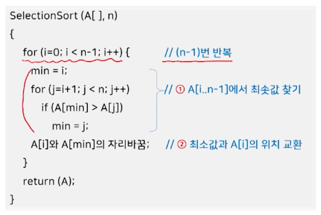
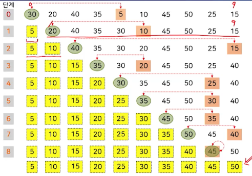
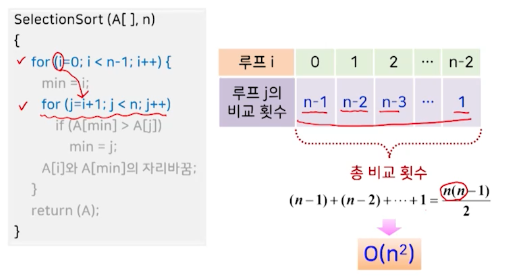

# 3강. 정렬(1)

## 1. 기본 개념

### 정렬?

- 주어진 데이터를 값의 크기 순서에 따라 재배치
  - 오름차순, 내림차순
- 정렬 구분 > 정렬 수행 시점에 데이터가 어디에 저장되어 있는가?
  - 내부 정렬
    - 전체 데이터를 주기억장치에 저장 후 정렬 수행
  - 외부 정렬
    - 모든 데이터를 주기억장치에 저장할 수 없는 경우
    - 모든 데이터를 보조기억장치에 저장하고, 그 중 일부 데이터만을 반복적으로 주기억장치로 옮겨와 정렬 수행

### 내부 정렬 알고리즘

### 정렬 관련 개념

- 안정적(stable) 정렬

  

  - 동일한 값을 갖는 데이터가 여러 개 있을 때, 정렬 전의 상대적 위치가 정렬 후에도 그대로 유지되는 정렬

- 제자리(in-place) 정렬

  - 입력 배열 이외에 별도로 필요한 저장 공간이 상수 개를 넘지 않는 정렬
    - 입력 크기 n이 증가함에도 불구하고 추가적인 저장 공간은 증가하지 않음

### 정렬 알고리즘의 기본 가정

## 2. 선택 정렬

### 선택 정렬

- 입력 배열에서 가장 작은 값부터 순서대로 선택해서 나열하는 방식

### 선택 정렬의 처리 과정

### 선택 정렬 알고리즘

### 선택 정렬의 예

### 성능과 특징

## 3. 버블 정렬

## 4. 삽입 정렬

## 5. 셀 정렬