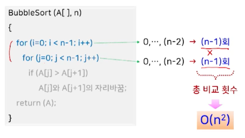
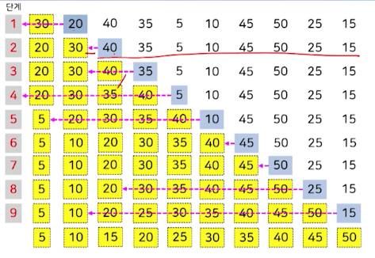

# 3강. 정렬(1)

## 1. 기본 개념

### 정렬?

- 주어진 데이터를 값의 크기 순서에 따라 재배치
  - 오름차순, 내림차순
- 정렬 구분 > 정렬 수행 시점에 데이터가 어디에 저장되어 있는가?
  - 내부 정렬
    - 전체 데이터를 주기억장치에 저장 후 정렬 수행
  - 외부 정렬
    - 모든 데이터를 주기억장치에 저장할 수 없는 경우
    - 모든 데이터를 보조기억장치에 저장하고, 그 중 일부 데이터만을 반복적으로 주기억장치로 옮겨와 정렬 수행

### 내부 정렬 알고리즘

### 정렬 관련 개념

- 안정적(stable) 정렬

  

  - 동일한 값을 갖는 데이터가 여러 개 있을 때, 정렬 전의 상대적 위치가 정렬 후에도 그대로 유지되는 정렬

- 제자리(in-place) 정렬

  - 입력 배열 이외에 별도로 필요한 저장 공간이 상수 개를 넘지 않는 정렬
    - 입력 크기 n이 증가함에도 불구하고 추가적인 저장 공간은 증가하지 않음

### 정렬 알고리즘의 기본 가정

## 2. 선택 정렬

### 선택 정렬

- 입력 배열에서 가장 작은 값부터 순서대로 선택해서 나열하는 방식

### 선택 정렬의 처리 과정

### 선택 정렬 알고리즘

### 선택 정렬의 예

### 성능과 특징

- 입력 데이터의 순서에 민감하지 않음

  - 최솟값 찾기 → 미정렬 부분 A[i..n-1]에서 항상 (n-1)-i 번의 비교가 필요

    → 입력 데이터의 상태와 상관없이 항상 동일한 성능 O(n^2)을 가짐

- 제자리 정렬 알고리즘

  - 입력 배열 A[] 이외의 상수 개의 저장 공간(i, j, tmp)만 필요

- 안정적이지 않은 정렬 알고리즘

  

## 3. 버블 정렬

### 버블 정렬

- 모든 인접한 두 데이터를 차례대로 비교해서 왼쪽 데이터가 더 큰 경우에는 오른쪽 데이터와 자리를 바꾸는 과정을 반복해서 정렬을 수행하는 방식
- 비교를 진행하는 방향
  - 왼쪽에서 오른쪽으로 진행
    - 가장 큰 값부터 찾아서 오른쪽 끝에서부터 위치시킴
  - 오른쪽에서 왼쪽으로 진행
    - 가장 작은 값부터 찾아서 왼쪽 끝에서부터 위치시킴

### 버블 정렬의 비교 진행 방향

### 기본 형태의 버블 정렬 알고리즘

### 버블 정렬의 예

- 왼쪽 → 오른쪽

  

- 오른쪽 → 왼쪽

  

### 버블 정렬의 성능과 특징

- 안정적인 정렬 알고리즘
  - 인접한 두 데이터가 동일한 경우 → 위치 교환이 미발생
- 제자리 정렬 알고리즘
  - 입력배열 A[] 이외에 상수 개의 저장 공간(i,j,tmp)만 필요
- 선택 정렬에 비해 데이터 교환이 많이 발생
  - 선택 정렬보다 비효율적

### 개선된 버블 정렬 알고리즘

- 각 루프의 반복 횟수를 줄여서 개선 가능

  

- 알고리즘

  

### 개선된 알고리즘의 성능과 특징

## 4. 삽입 정렬

### 삽입 정렬

- 주어진 데이터를 하나씩 뽑은 후 이미 나열된 데이터가 항상 정렬된 상태를 유지하도록 뽑은 데이터를 바른 위치에 삽입해서 나열하는 방식

  

- 정렬 부분에서 제자리를 찾는 과정

  

### 삽입 정렬 알고리즘

### 삽입 정렬 예

### 성능과 특징

- 안정적인 정렬 알고리즘

  - 인접한 두 데이터가 정렬되지 않은 경우에만 위치 교환이 발생

- 제자리 정렬 알고리즘

- 입력 데이터의 원래 순서에 민감

  

  - 원하는 정렬 순서의 역순으로 주어지는 경우 O(n^2)
  - 원하는 순서의 정렬된 상태로 주어지는 경우 O(n)

## 5. 셸 정렬

### 셸 정렬

- 삽입 정렬의 단점 보완 by Donald L. Shell
  - 현재 삽입하고자 하는 데이터가 삽입될 제 위치에서 많이 벗어나 있어도 한 번에 한 자리씩만 이동해서 찾아가야 함
- 기본 아이디어
  - 멀리 떨어진 데이터와의 비교/교환으로 한 번에 이동할 수 있는 거리를 늘려서 처리 속도 향상
  - 처음에는 멀리 떨어진 두 데이터를 비교해서 필요시 위치를 교환하고, 점차 가까운 위치의 데이를 비교/교환한 뒤, 맨 마지막에는 인접한 데이터를 비교, 교환하는 방식
  - 입력 배열을 부분 배열로 나누어 삽입 정렬을 수행하는 과정을 부분배열의 크기와 개수를 변화시켜 가면서 반복

- 부분 배열의 개수를 정하는 방법

  

- 순열값 hk의 의미

  - 부분배열의 개수
    - 전체 배열을 hk개의 부분배열로 나누어 각 부분배열에 대해 삽입정렬을 적용
  - 각 부분배열 내에서 이웃한 데이터 간의 거리
    - i번째 부분배열을 구성하는 데이터
      - 배열 인덱스를 hk로 나누었을 때 나머지가 i-1인 데이터

### 셸 정렬 알고리즘

- 각 부분배열을 번갈아 가면서 미정렬 부분의 첫 번째 데이터를 뽑은 후, D 만큼씩 떨어진 정렬 부분에서 제자리를 찾아 삽입하는 방식!

### 셸 정렬의 예 (1)

- 8

- 4

  

- 2

  

- 1 (최종)

  

### 셸 정렬의 예 (2)

- 13

- 4

  

- 1

  

### 성능과 특징

- 사용하는 순열에 따라 성능이 달라짐

  

- 순열값의 역순으로 차례대로 적용

  

- 제자리정렬 알고리즘
- 안정적이지 않은 정렬 알고리즘

