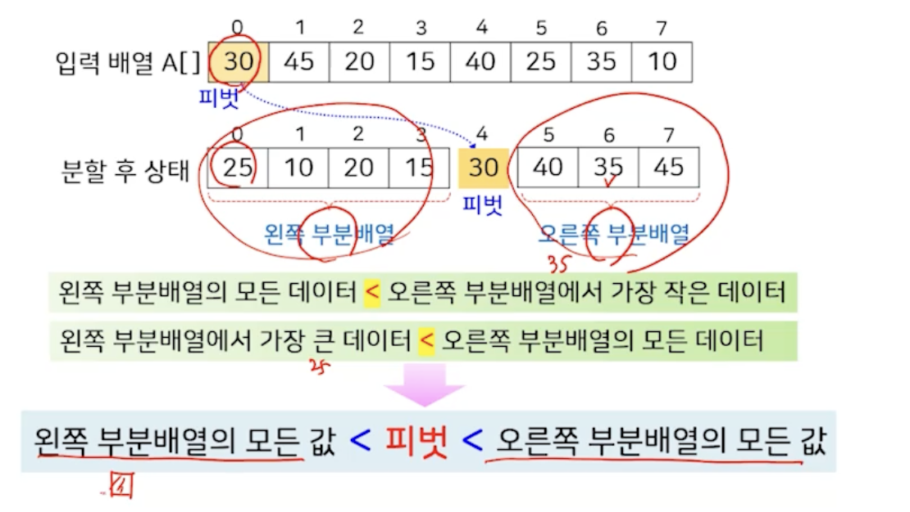

#  4강. 정렬(2)

## 1. 퀵 정렬

### 퀵정렬

- 특정 데이터를 기준으로 주어진 배열을 2개의 부분배열로 분할하고, 각 부분배열에 대해서 퀵 정렬을 순환적으로 적용하는 방식
- 피벗(pivot,  분할 원소)
  - 주어진 배열을 두 부분배열로 분할하는 기준이 되는 특정 데이터
    - 보통 주어진 배열의 첫 번째 데이터로 지정

### 퀵 정렬의 원리

- 피벗이 제자리를 잡도록 하여 정렬하는 방식

  

## 2. 합병 정렬

