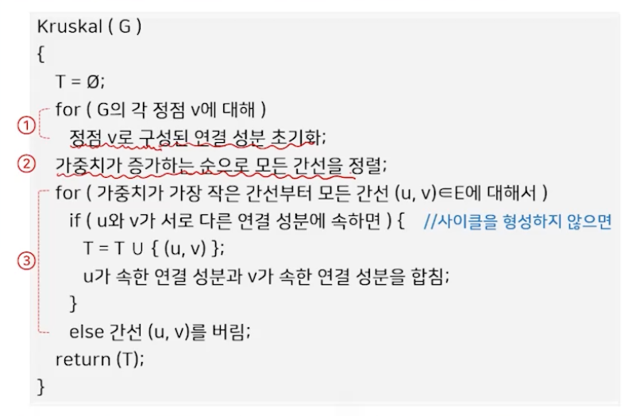
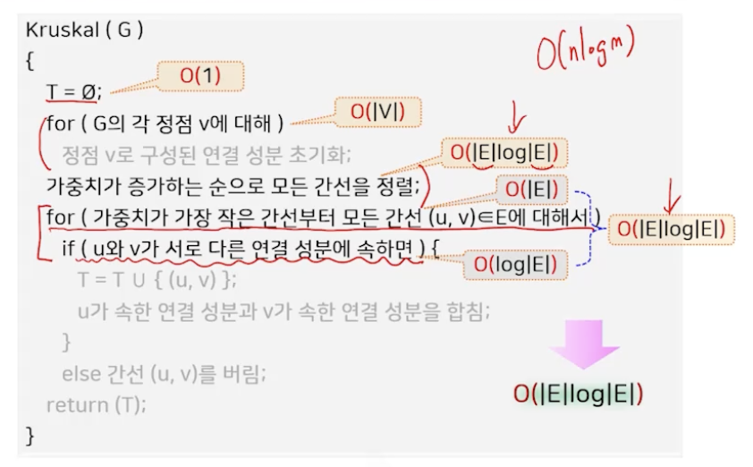
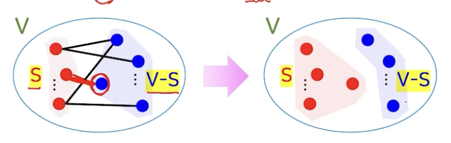
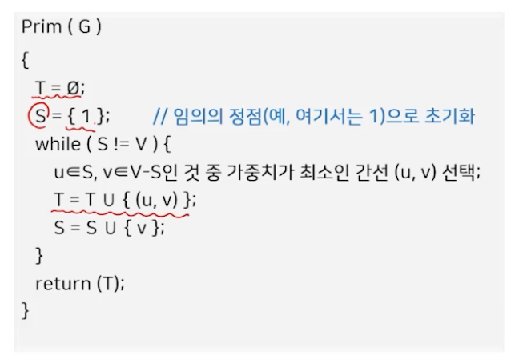
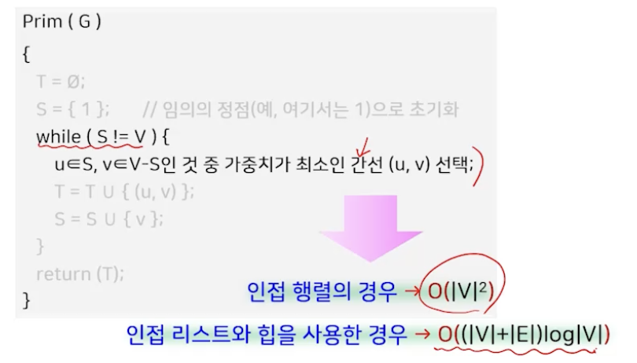
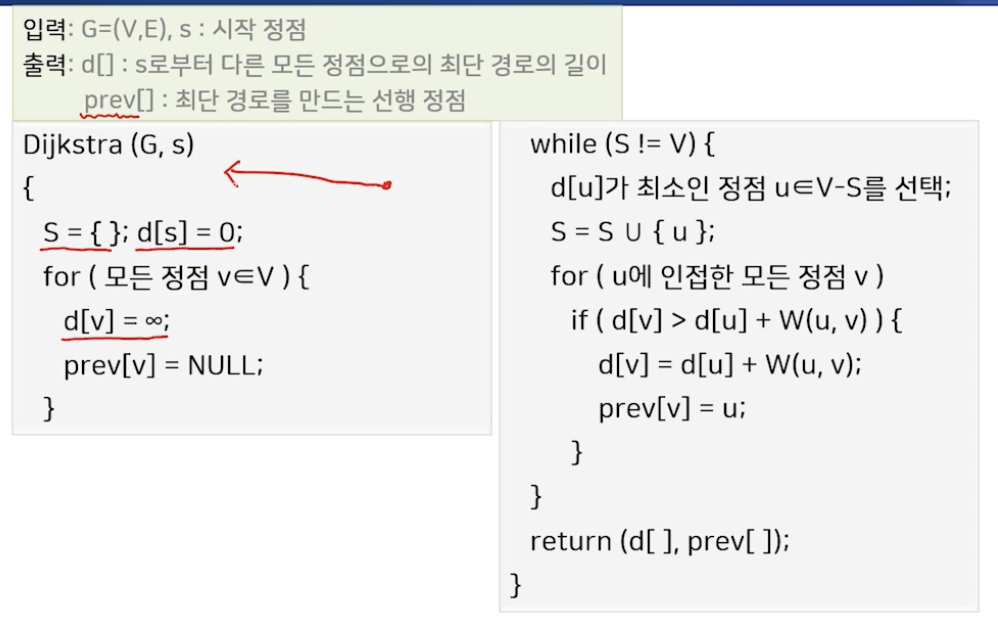

# 9강. 그래프

## 0. 최소 신장 트리

### 신장 트리

- 신장 트리
  - 가중 무방향 그래프에서 모든 정점을 포함하는 트리
  - 정점의 갯수를 n개라고 하면, 트리에는 정확히 (n-1)개의 간선 존재
- 최소 신장 트리
  - 모든 정점들이 연결되어있고, 사이클이 없다
  - 신장 트리 중 가중치의 합이 가장 작은 것

### 최소 신장 트리를 구하는 알고리즘

- 모든 간선 중 정점을 모두 연결하면서, 가중치의 합을 가장 작게 만드는 (n-1)개의 간선을 고르는 과정
- 최선의 간선
  - 사이클을 형성하지 않으면서
  - 최소의 가중치를 갖는 간선
- 욕심쟁이 방법 적용
  - 크루스칼 알고리즘, 프림 알고리즘

## 1. 크루스칼(Kruskal) 알고리즘

### 크루스칼 알고리즘 개념

- 간선이 하나도 없는 상태에서 시작해서, 가중치가 가장 작은 간선부터 하나씩 골라서 사이클을 형성하지 않으면 해당 간선을 추가하는 방식 (형성하면 버리고)

- 사이클 형성 여부 판단은 어떻게?
  - 간선의 두 정점 u, v가 서로 다른 연결 성분에 속하면 사이클을 형성하지 않음
- |V|=n개의 정점이 각각의 서로 다른 연결 성분으로 구성된 상태에서 시작해서, 간선을 추가할 때마다 연결 성분들이 하나씩 합쳐지고 최종적으로 하나의 연결 성분을 형성

### 크루스칼 알고리즘

### 크루스칼 알고리즘의 성능

## 2. 프림(Prim) 알고리즘

### 프림 알고리즘 개념

- 임의의 한 정점에서 시작해서 연결된 정점을 하나씩 선택해 나가는 방법

  - 이미 선택된 정점들에 부수된 가중치가 가장 작은 간선을 선택해 추가

  - 어떤 순간에 이미 **선택된 정점의 집합 S와, 선택되지 않은 정점의 집합 V-S를 잇는 간선** 중 가중치가 가장 작은 간선을 선택해 추가하는 방법

    - 임의의 정점 하나를 S로 지정한 후 시작해서, **S=V가 될 때까지** S를 점점 키워 나가는 방법

    

### 프림 알고리즘

### 프림 알고리즘의 성능

## 3. 데이크스트라(Dijkstra) 알고리즘

### 최단 경로란?

- 두 정점 u와 v간의 최단 경로
  - 가중 그래프에서 두 정점 u에서 v를 연결하는 경로 중 간선의 가중치의 합이 가장 작은 경로
- 최단 경로 문제 유형
  - 단일 출발점 최단 경로 문제
    - 다익스트라(Dijkstra) 알고리즘
    - 벨만-포드(Bellman-Ford) 알고리즘
  - 단일 도착점 최단 경로 문제
  - 단일 쌍 최단 경로 문제
  - 모든 쌍 최단 경로 문제 (all pairs shortest path)
    - Floyd 알고리즘

### 다익스트라/데이크스트라 알고리즘

- 단일 출발점 최단 경로 알고리즘
  - 하나의 출발 정점에서 다른 모든 정점으로 최단 경로를 찾는 알고리즘
  - 욕심쟁이 방법
  - 가정 => 음의 가중치를 갖는 간선 없음
- 거리 d[v]
  - 출발점에서 현재까지 선택된 정점 집합 S를 경유하여 정점 v에 이르는 최소 경로의 길이

### 데이크스트라 알고리즘

- **출발점에서 시작해 거리 d[]가 최소인 정점을 차례대로 선택해 최단 경로를 구하는 방법**
- **초기화** 
  - 출발점 s 의 거리 d[s]=0
  - 나머지 모든 정점 v의 거리 d[v] = ∞
  - 선택된 정점의 집합 S = {}
- **S=V가 될 때까지 반복**
  - 미선택 정점 집합 V-S 에서 **거리 d[]가 가장 작은 정점 u**를 선택
  - u의 인접 정점에 대해 u를 경유하는 거리와 기존 거리를 비교해서 작은 값을 새로운 거리값으로 조정

### 코드

### 데이크스트라 알고리즘의 성능과 특징

- 프림알고리즘과 동일

  

- 음의 가중치를 갖는 간선이 없어야 함

  - 벨만 포드 알고리즘!