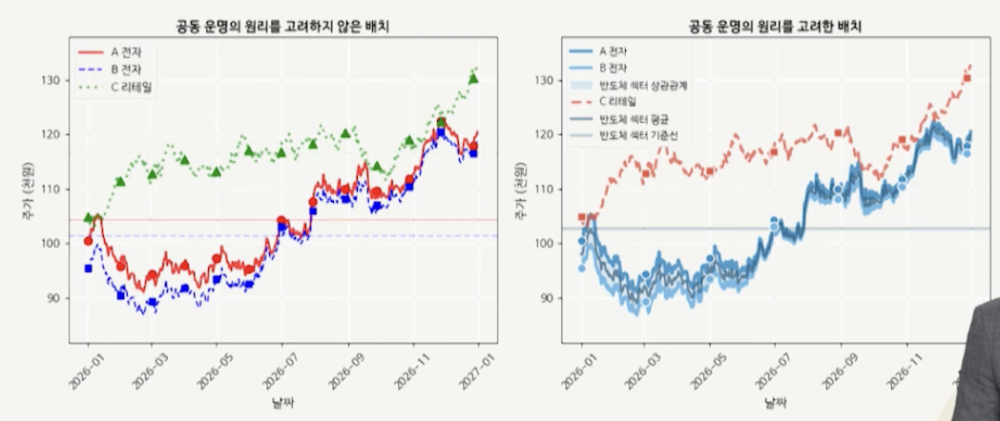
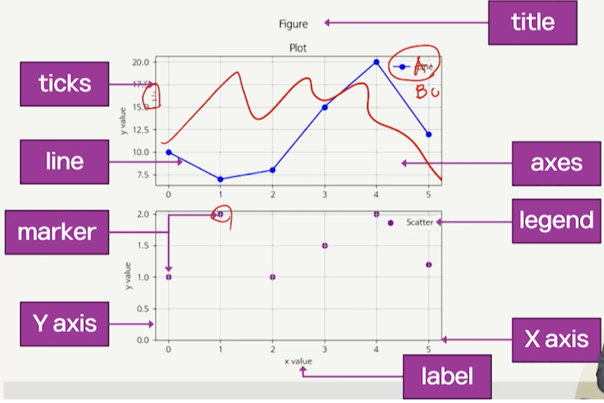

# 10강. 데이터 시각화 1

## 1. 데이터 시각화의 이해

### 데이터 시각화의 개념과 필요성

- 복잡한 데이터를 시각적인 형태로 표현하는 과정
- 데이터 시각화의 필요성
  - 데이터 이해도 향상 - 패턴과 추세 한눈에 파악
  - 효과적 의사소통 - 정보 빠르게 전달, 직관적 이해 촉진
  - 의사 결정 지원 - 데이터 기반 의사 결정에 필요한 인사이트 제공
  - 탐색적 데이터 분석에 응용


### 게슈탈트 원리와 데이터 시각화

- 데이터 시각화는 인간의 시각 인지 체계에 기반해 설계 시 효과성 및 전달력 향상
- 게슈탈트 원리
  - 1920년 독일 심리학자(베르트하이머, 볼프강 쾰러, 코프카, 쿠르트 레빈) 들이 20세기 전반에 걸쳐 완성한 이론
  - 전체는 부분의 합보다 크다는 철학 바탕
  - 개별 데이터 포인트보다 이들이 형성하는 패턴과 관계를 통해 더 깊은 통찰을 얻을 수 있음 강조
  - 인간이 시각적 정보를 어떻게 인식하는지 설명


### 게슈탈트 원리 8요소


### 근접성(proximity)


- 서로 가까운 위치의 요소는 하나의 그룹으로 인식
- 데이터, 제목, 범례 등은 관련된 차트와 인접 배치 권장


### 유사성(similarity)


- 색상, 모양, 크기 등이 유사하면 동일 그룹으로 인식
- 유사한 데이터 요소를 일관된 시각 속성으로 표현 권장


### 폐쇄성(closure)

- 불완전한 형태도 완전하게 인식하려는 인지적 특성
- 최소한의 시각 정보로도 이해 가능한 구성 설계


### 연속성(continuity)


- 정렬된 요소는 하나의 흐름으로 인식
- 시간 순 정렬, 오름차순/내림차순 정렬로 데이터 패턴 강조


### 공동 운명(common fate)



- 같은 방향으로 움직이거나 변화하는 요소들을 동일한 그룹으로 인식


### 대칭성(symmetry)


- 대칭적으로 배치된 형태를 보다 안정적이고 정돈된 구조로 인식


### 단순성(pragnanz)


- 복잡하고 모호한 시각적 정보를 가장 단순하고 안정적이며 의미 있는 형태로 해석


### 전경-배경(figure-ground)


- 중심(전경, figure)에 대한 명확한 초점이 형성돼야 사람들이 어떤 요소에 주목해야 하는지 판단
  - 배경(ground)은 이를 보완하거나 강조하는 역할


### 데이터 유형에 따른 시각화 방법


### 지리 데이터 시각화의 예


- 공간에 대한 데이터
- 공간 자체를 직접적으로 나열


## 2. Matplotlib 라이브러리

### Matplotlib 소개

- 파이썬에서 가장 많이 사용되는 데이터 시각화 라이브러리
  - 2003년 John D. Hunter에 의해 개발
  - MATLAB의 그래프 작성 기능에서 영감을 받아 설계
  - 과학, 공학 분야에서 데이터 표현을 위한 강력한 도구
- 주요 기능
  - 광범위한 유형의 시각화 지원 및 복합 시각화 가능
  - 그래피를 세밀하게 조정 가능한 사용자 정의 기능 제공
  - PDF, PNG, SVG, JPEG 등 다양한 이미지 형식 지원
  - Colab, GUI 애플리케이션 등 다양한 환경에서 동작


### Matplotlib 기본 구조




### Colab 한글 폰트 설정

- 한글 대응하지 않는다 

- matplotlib에서 한글을 사용하기 위해서는 특별한 설정 필요

  - 단계 1. 나눔 폰트 설치

  ```bash
  유닉스..
  !sudo apt-get install -y fonts-nanum
  !sudo fc-cache -fv
  !rm ~/.cache/matplotlib -rf
  
  맥..
  brew tap homebrew/cask-fonts
  brew install --cask font-nanum 
  ```

  - 단계 2. 런타임 > 세션 다시 시작
  - 단계 3. matplotlib의 폰트를 나눔 폰트로 지정

  ```python
  import matplotlib.pyplot as plt
  plt.rc('font', family='NanumBarunGothic')
  ```

  - 런타입 연결 시 마다 재수행


### 표와 선 그래프

- 표

- 선 그래프

- 막대 그래프

- 히스토그램

  

  - 연속형 데이터를 구간별로 나누어 분포를 시각적으로 표현하는 그래프
  - 데이터의 중심 경향, 분산, 왜도 등 분석에 효과적

- 산점도

- 박스 플롯

  

  - 데이터 분포를 시각적으로 표현
  - 중앙값, 사분위수, 이상치를 효과적으로 나타내는 분포를 한눈에 파악 가능

- 파이 차트

- 히트맵

  

  - 행렬 형태의 데이터를 색상으로 표현
  - 데이터간 패턴을 쉽게 파악

- 레이더 차트

  

  - 여러개의 변수를 방사형으로 배치

- 3D 차트