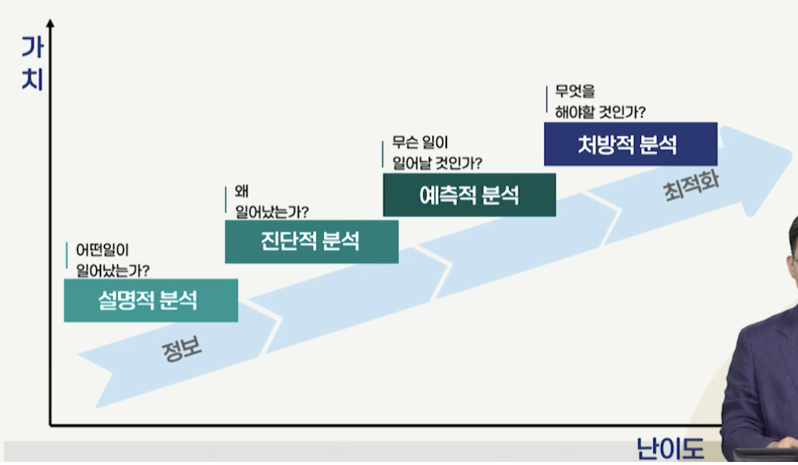
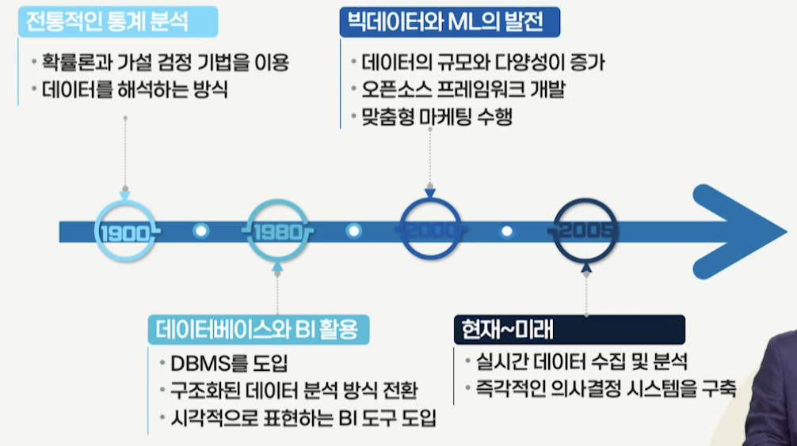
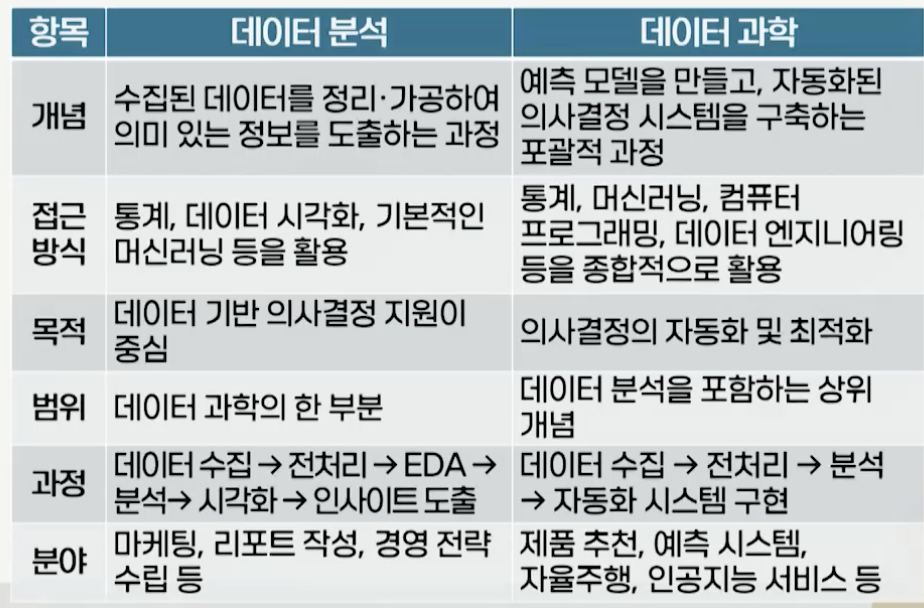

# 1강. 데이터 분석과 오픈소스의 이해

## 1. 데이터분석의 이해

### 데이터와 정보

- 데이터 정의
  - 현상에 대한 관찰이나 실험, 조사로 얻어지는 사실이나 자료
  - 관찰 및 측정을 통해 수집
- 정보의 정의
  - 정보는 데이터를 목적에 맞게 가공한 결과물

### 데이터 분석의 개념

- 데이터에 숨겨진 의미를 발견하고, 이를 바탕으로 의사결정에 활용할 수 있는 인사이트를 도출하는 일련의 과정
  - 데이터를 정리, 처리, 변환하여 **유의미한 정보**를 도출
  - 데이터를 구조화하고 패턴을 파악하며, 특정 현상의 원인을 찾거나, 미래를 예측하기 위한 논리적이고 체계적인 접근
  - 데이터에 감춰진 가치와 인사이트 발견
- 의사결정의 질 향상 및 비즈니스 문제의 근본 원인 파악
- 데이터 품질 문제, 데이터의 규모와 복잡성, 적절한 분석 방법론 선택, 분석 결과 해석과 커뮤니케이션, 데이터 윤리와 개인정보 보호 등 다양한 도전 과제 존재

### 데이터 분석의 4단계

- 설명 > 진단 > 예측 > 처방

### 데이터 분석 적용 사례: PHM

- PHM: Pro Health Management
- 장비나 시스템의 상태를 실시간으로 감시하고, 고장 가능성을 예측하여 최적의 유지보수 및 관리 방안 제공
  - 계측 > 모니터링 > 진단 > 예측 > 개선

- 개인 맞춤형 마케팅, 금융, 스포츠, 공공 정책, 운영, 의료, 도시 행정 및 치안

### 데이터 분석의 발전 과정

### 데이터 분석의 3요소

- 컴퓨터과학/IT 기술
- 수학/통계
- 도메인 지식

### 데이터 분석과 데이터 과학

## 2. 데이터의 특징과 데이터 분석 과정

### 데이터 분석 과정

- 데이터를 적절한 방법으로 수집하고 정제한 후, 패턴을 탐색하고 모델링을 수행하여 결과를 해석하는 체계적인 접근이 필요
- 데이터 수집 및 저장 > 데이터 전처리 > 데이터 분석 > 데이터 시각화

### (1) 데이터 수집 및 저장

- 수집한 데이터를 효율적으로 보관, 분석 목적에 적합한지 검토
- 데이터 수집 과정
  - 데이터 분석 목표를 기반으로 데이터 수집 목적 설정
  - 데이터 출처 결정
    - 내부 데이터: 기업이나 기관 내부에서 생성된 데이터
    - 외부 데이터: 공공 데이터, 소셜 미디어 데이터, 연구 기관의 통계자료 등
  - 데이터 수집 방법 결정
    - 파일 다운로드, 데이터베이스, 웹 스크래핑, API, 센서(IoT)

### (2) 데이터 전처리 단계

- 데이터를 정리하고 변환하여 분석이 가능하도록 가공하는 과정
- 측정 > 정제 > 통합 > 축소 > 변환

### (3) 데이터 분석 단계

- 통계 기법, 데이터 간 관계 파악, 예측 모델 구축 등의 데이터 분석 기법 적용

### (4) 데이터 시각화 단계

- 데이터셋의 정보와 관계를 그래프, 차트, 다이어그램 등의 시각적 요소를 활용해 직관적으로 표현
- 데이터 시각화의 역할
  - 데이터 탐색과 패턴 발견
  - 복잡한 데이터 요약
  - 데이터 분석 결과 전달

### 데이터의 속성 분류

- 명목형 데이터의 대표적인 예
  - 혈액형 등
- 순서형 데이터
  - 성적
- 이산형 데이터
  - 고객 수
- 연속형 데이터
  - 키, 몸무게

### 데이터 형태에 따른 분류

- 정형 데이터(structured data)
  - 일정한 규칙과 구조를 갖춘 데이터
  - 행과 열로 구성된 **표 형태**로 관계형 데이터베이스에 저장
- 비정형 데이터(unstructured data)
  - 정해진 구조 없이 **자유로운 형태**로 존재하는 데이터
  - 문장, 이미지, 영상, 음성 등 다양한 형식
  - 분석이 어려운 반면, 소비자 감정 및 행동 패턴 등 많은 정보량

- 반정형 데이터(semi-structured data)
  - 정형 데이터 - 비정형 데이터의 중간 형태
  - 데이터 항목 간 일정한 규칙이나 구조가 존재하나, 완전히 테이블 형태로 고정 불가능

## 3. 오픈소스의 이해