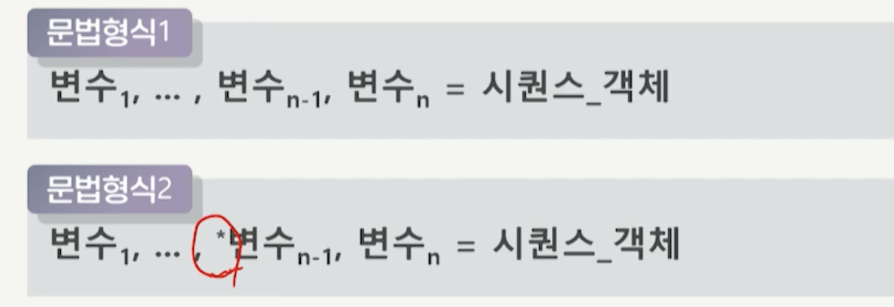
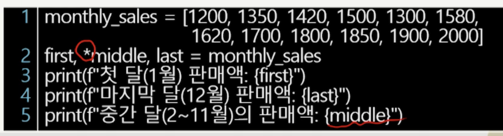
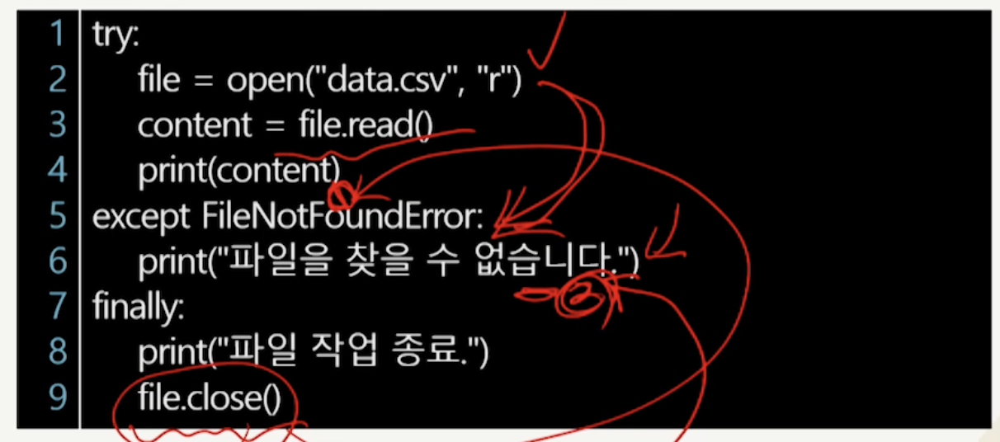
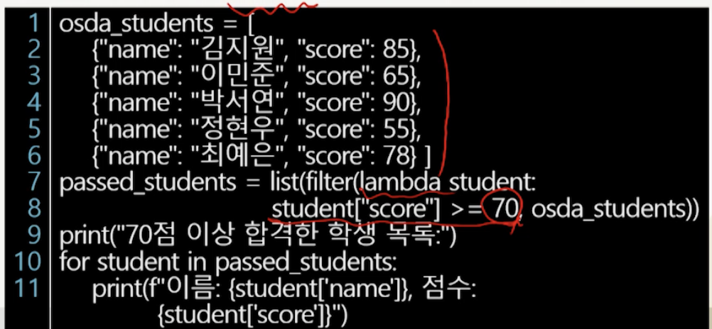

# 3강. 데이터 분석을 위한 파이썬 프로그래밍 2

## 1. 파이썬 문법 요소

### 언패킹의 개념

- 정의
  - 시퀀스 자료형(리스트, 튜플, 문자열 등)에서 여러 개의 값을 개별 변수에 분리해 할당하는 기능
  - 하나의 데이터 묶음에서 개별 요소들을 추출해 각각의 변수에 직접 할당하는 것

- 형식

  


### 언패킹 활용

- 시퀀스 언패킹

  

- 확장 언패킹

  


### 언더스코어

- 시퀀스 데이터는 일반적으로 반복문을 사용해 처리

- 언더스코어(_)는 반복 변수의 값이 필요하지 않을 때 이를 대체하는 역할

  ```python
  for _ in range(5):
    print("Hello, Data Analysis with Open Source!")
  ```

  

  - 이럴 때 언더스코어 사용 가능

  ```python
  for _, name, _, _, grade in students:
    print(f"{name}의 성적: {grade}")
  ```

  

### 예외처리의 이해

- 코드실행 중 예기치 않은 오류가 발생할 경우 대비하는 기능 필요
  - 오류를 별도 처리하지 않는 경우 프로그램이 즉시 종료
  - 사용자 경험 저하, 데이터 손실, 리소스 누수, 디버깅 어려움 등 추가적 문제 발생
- 예외 및 예외 처리
  - 예기치 않은 오류를 예외로 정의
  - 예외 처리는 프로그램이 비정상적 종료를 방지
  - try-except 문과 finally 블록 사용


### try-except 문의 사용


- 오류가 발생할 가능성이 있는 코드 블록을 감싸서 오류가 발생했을 때 프로그램이 강제 종료되지 않도록 처리
- 여러 종류의 예외가 발생할 가능성이 있는 경우, except 블록을 여러 개 지정해 각 예외를 개별적으로 처리


### finally 블록의 사용

- 예외 발생 여부와 관계없이 반드시 실행되는 코드 블록


## 2. 함수형 프로그래밍

### 함수형 프로그래밍의 이해

- 파이썬은 절차적 프로그래밍, 객체지향 프로그래밍 외 함수형 프로그래밍 방식을 지원
- 데이터 변경을 최소화하고, 순수 함수(pure function)를 활용해 부작용(side effect)을 줄이는 것을 목표로 함
  - 순수 함수: 같은 입력에 대해 항상 같은 출력을 반환하는 함수
  - 부작용: 함수가 단순히 값을 계산하는 것 외에 외부에 영향을 미치는 모든 행위
- 코드의 가독성을 높이고, 디버깅을 용이하게 하며, 병렬 처리를 효율적으로 수행


### 람다 함수

- 이름이 없는 익명 함수(anonymous function)
  - 한 줄의 표현식으로 작성 가능한 간결함수
- 람다 함수의 문법적 특징
  - 단 하나의 표현식만 허용
  - 표현식의 결과 자동으로 함수의 반환값이 되므로 return 키워드 사용하지 않음


### 람다 함수의 사용

- 일반 함수

  ```python
  def add(x):
    return x + 2
  print(add(3))
  ```

- 람다 함수

  ```python
  add_lambda = lambda x: x+2
  print(add_lambda(3))
  ```

- 람다 함수의 활용

  ```python
  employees = { "이지혜": 3000000, 
              	"구민준": 5000000,
              	"방서연" : 4100000 }
  adjust_salary = lambda salary: salary * 1.1
  updated_salaries = { name: adjust_salary(salary) for 
                     name, salary in employes.items()}
  ```


### map, filter, reduce 함수

- 대표적인 함수형 프로그래밍 기법을 사용하는 함수
- 반복문을 사용하지 않고 리스트나 다른 반복 가능한 객체의 요소를 손쉽게 조작할 수 있도록 지원
  - 데이터 변환, 필터링, 누적 연산 수행


### map 함수


- 반복 가능한 객체의 모든 요소에 특정 함수를 적용해 새로운 값을 생성하는 함수
  - 리스트, 튜플 같은 자료구조의 요소를 변경할 때 유용


### filter 함수



- 반복 가능한 객체의 요소 중 특정 조건을 만족하는 요소만 남기는 함수
  - True 또는 False를 반환하는 함수(조건 함수)를 인자로 받고 조건 함수가 True를 반환하는 요소만 컬렉션에 포함


### reduce 함수


- 반복 가능한 객체의 모든 요소를 누적해 하나의 값으로 축소하는 함수
  - 반복문을 사용하지 안혹도 데이터를 하나의 값으로 집계 
  - functools 모듈에서 제공(기본제공 아님)