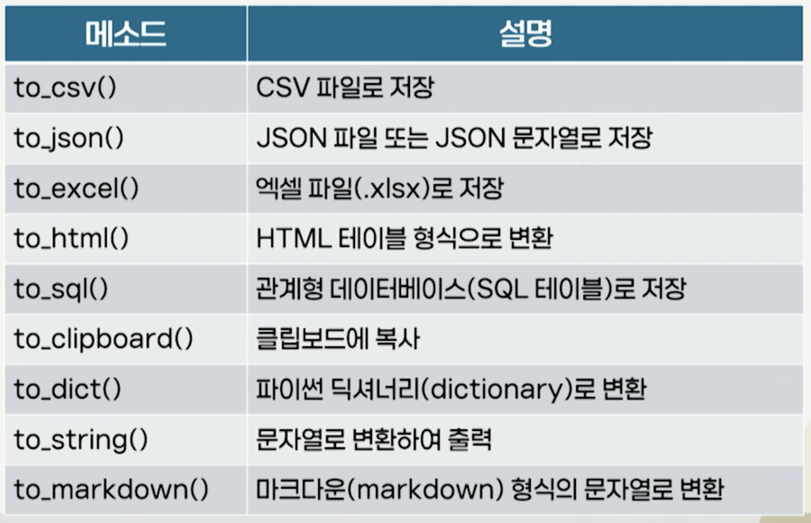

# 5강. 데이터 저장

## 1. 데이터 저장의 이해 

### 데이터 저장의 필요성

- 수집한 데이터를 영구적으로 사용할 수 있도록 적절하게 관리하는 과정
  - 저장 방식은 데이터의 크기, 형태, 접근 빈도, 분석 목적 등에 따라 상이
  - 저장 방식 별 특징, 장단점에 대해 구체적 이해 필요
- 데이터 저장 방식: 파일
  - OS의 파일 시스템 상에서 데이터를 독립적인 단위로 저장
  - 텍스트 파일, CSV 파일, JSON 파일 등 다양한 형태 가능
  - 호환성이 뛰어나고 여러 환경에서 파일 읽기/쓰기 간으
  - 대규모 데이터 처리에 비효율적이고 데이터 무결성과 보안 측면에서 취약

### CSV(Comma Separated Version)

- MS 엑셀, 구글 스프레드시트, 데이터베이스 등 다양한 프로그램과 연동 용이
- DataFrame은 CSV와 구조적 유사성으로 CSV 파일로 변환해 저장하는 방법을 제공

### JSON(JavaScript Object Notation)

- 계층 구조를 가진 데이터를 저장하는데 유용
- json 또는 pandas 라이브러리를 사용해 데이터를 JSON 파일로 저장 가능

### 데이터 저장 방식: 데이터베이스

- 수집한 정보를 효율적으로 보관하고 필요할 때 신속하게 활용하기 위한 체계적인 저장 시스템
- 데이터베이스의 종류
  - RDBMS
    - 데이터를 행과 열로 구성된 테이블 형태로 저장하고 SQL을 통해 데이터의 CRUD 수행
  - 비RDBMS
    - 문서, 키-값이 쌍, 그래프 등 다양한 유연한 방식의 저장 구조를 지원하고 유사 SQL 및 API를 통해 조작
      - MongoDB, Cassandra, Redis, Elasticsearch 등이 대표적인 비관계형 데이터베이스

## 2. PandasDataFrame의 이해

### DataFrame의 구조

- 2차원 테이블 형태의 자료구조
  - 표 형태 그 이상으로 데이터를 효율적으로 처리하고 분석할 수 있도록 설계
  - 

### DataFrame의 인덱스

- DataFrame 생성 시 정수형 인덱스가 자동 부여
  - set_index() 메소드를 사용해 문자열, 날짜 등 특정 컬럼을 인덱스로 설정 가능
  - 특정 행을 빠르게 찾고, 데이터를 조작하는데 사용

- 데이터는  DataFrame 내부에 NumPy의 배열 형태로 저장
  - 데이터를 효율적으로 젖아하고 고속의 수치 연산 수행

### DataFrame 활용 예

### DataFrame 생성 함수

- 딕셔너리, JSON, CSV, 데이터베이스 등 다양한 형태의 원시 데이터(raw data)를 DataFrame으로 변환

### DataFrame의 저장

- 데이터 수집하고 데이터 분석 후
  - 데이터 분석 결과를 적절한 형태로 저장해 보관
  - 다른 시스템과 공유하는 과정 필요
- DataFrame 객체는 저장된 데이터를 다양한 형식으로 저장하여 분석 결과를 활용하는데 필요한 메소드 제공
  - to_로 시작하는 저장 메소드
  - csv, json, 엑셀, 데이터베이스 등 각기 다른 파일 형식이나 데이터 구조로 변환, 저장
  - 파일 형식 별 특징과 장단점 이해 필요

### 개념 정리 실습

- 공공데이터포털 API 활용 예정
- API 키
  - 외부 서버에 접근할 수 있도록 허가받는 고유한 문자열
- 주의사항
  - 외부에 노출되면 안됨(사용량 제한 초과)
  - 사용량 모니터링하고 적절한 수준에서 관리
  - 깃허브에 업로드 하지 않기

