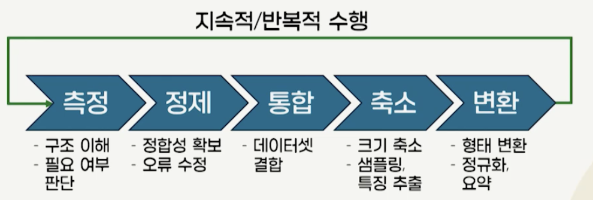
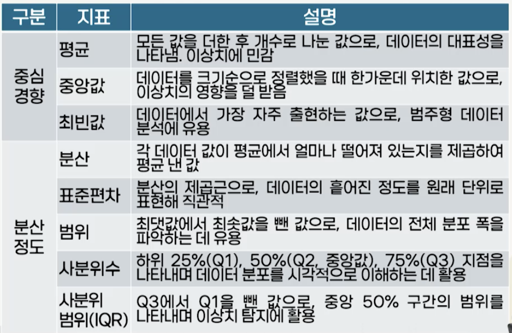
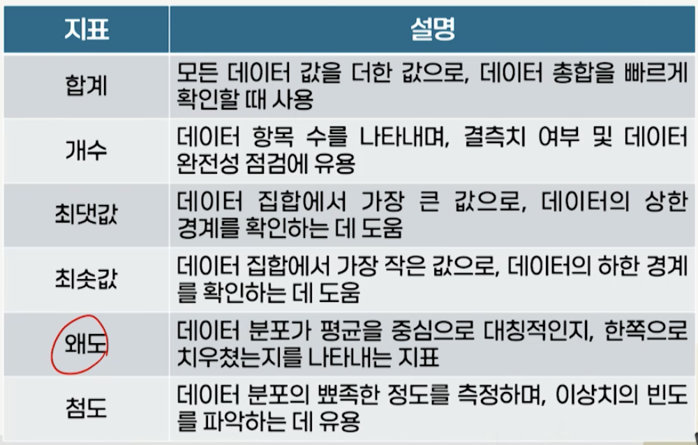
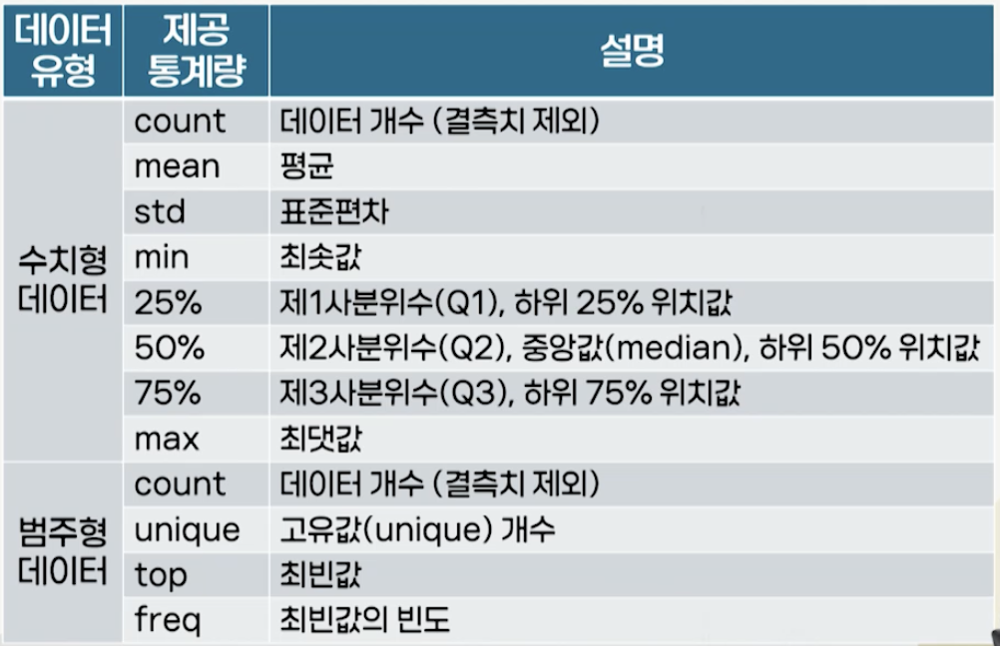

# 6강. 데이터 전처리1

## 1. 데이터 전처리의 이해

### 데이터 전처리의 필요성

- GIGO(Garbage In, Garbage Out)
- 잘못되거나 부정확한 데이터를 입력하면 어떤 정교한 분석 기법을 적용하더라도 잘못된 결과가 출력된다는 사실을 함축
- 데이터의 품질 향상을 통해 분석 결과의 질을 향상시키기 위한 방안이 요구
- 정교한 데이터 분석 결과를 얻기 위해 데이터 분석에 다양한 변화 발생
  - 사용되는 데이터의 규모가 점차 증가
  - 신기술의 대중화로 다양하고 새로운 유형의 데이터 수집
  - 여러 이질적인 소스로부터 데이터 수집
- 불일치/불필요/중복 데이터, 결측치, 이상치 등이 포함
- 데이터 품질 향상을 통한 분석 결과의 질을 향상
  - 결측치, 이상치, 값 불일치 등 데이터의 품질을 저하시키는 요인 제거
  - 데이터 정제, 통합, 축소, 변환과 같은 전처리 과정을 통해 데이터의 정확성과 일관성 향상

### 데이터 전처리의 위상

- 2021년 Forbes가 데이터 과학자 80명에게 설문
  - Cleaning Big Data: Most Time-consuming, Least Enjoyable Data Science Task, Survey Says
- 많은 시간이 소요되는 단계, 가장 힘든 단계는?
  - 데이터 전처리

### 데이터 전처리의 정의

- 데이터 분석에 앞서 원시 데이터(raw data)를 정제하고 변환하여 분석에 적합한 형태로 만드는 일련의 작업
  - 데이터 분석의 전 단계에서 수행되며, 데이터의 정확성과 신뢰성 확보

### 데이터 전처리의 어려움

- 방대한 데이터의 양
  - 수치형 데이터 뿐만 아니라 텍스트, 이미지, 로그 파일 등 다양한 형식 존재
- 주관적 판단의 개입 여지
  - 정해진 정답이 없으며, 상황에 따라 적절한 결정

- 다양한 처리 방법
  - 처리 방법이 고정되어 있지 않고, 다양한 접근법 존재
- 시간과 노력 소모
  - 여러 단계를 반복적으로 확인하고 검토하는 과정

### 데이터 측정과 정제

- 데이터 측정
  - 다양한 측정 요소들을 활용해 데이터의 구조와 특징을 정량적으로 파악
- 데이터 정제
  - 불완전성을 보완하고, 이상치를 탐지 및 완화하며, 데이터간의 불일치성을 수정하는 일련의 과정
  - 결측치(missing values) 처리
    - 데이터셋 내 특정 관측값이 누락되어 있는 상태
  - 이상치(outlier) 처리
    - 불규칙한 변동이나 오류

### 데이터 통합, 축소 및 변환

- 데이터 통합(integration)
  - 서로 다른 데이터 저장소로부터 데이터 결합
  - 하나의 일관된 데이터 집합을 구축하는 작업으로, 중복과 불일치 제거
- 데이터 축소(data reduction)
  - 방대한 데이터를 효율적으로 처리하기 위해 데이터의 크기를 줄이면서도 중요한 정보를 보존하는 과정
- 데이터 변환(data transformation)
  - 데이터의 구조나 값을 규칙에 따라 변환해 분석이 효율적으로 수행되도록 지원

## 2. Pandas를 이용한 데이터 측정

### 데이터 측정

- 데이터 형태, 값의 분포, 평균, 중앙값 같은 대표값 등 데이터 특성과 구조를 파악하는 과정
  - 이를 통해 데이터 전처리 및 분석의 방향을 결정
- pandas 라이브러리의 역할
  - 데이터의 저장 뿐만 아니라 평균, 분산, 최솟값, 최댓값 등 다양한 통계량 계산을 위한 기능 제공
  - 데이터 상태 요약을 위한 describe(), info() 메소드 사용
- 데이터 측정 요소
  - 데이터 측정 기준: 전체/레코드/그룹별 측정
  - 요약 통계 지표: 데이터 특징을 간단히 정리, 이해
  - 기타 통계 지표: 데이터 분포 파악

### 요약 통계 지표

### 기타 통계 지표

### describe() 메소드

