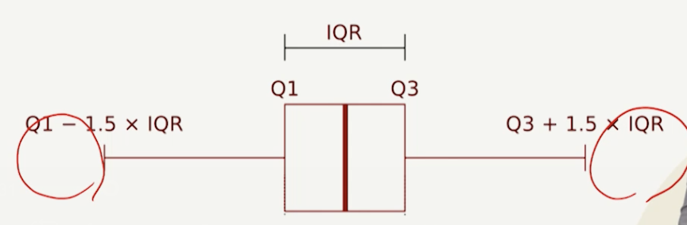
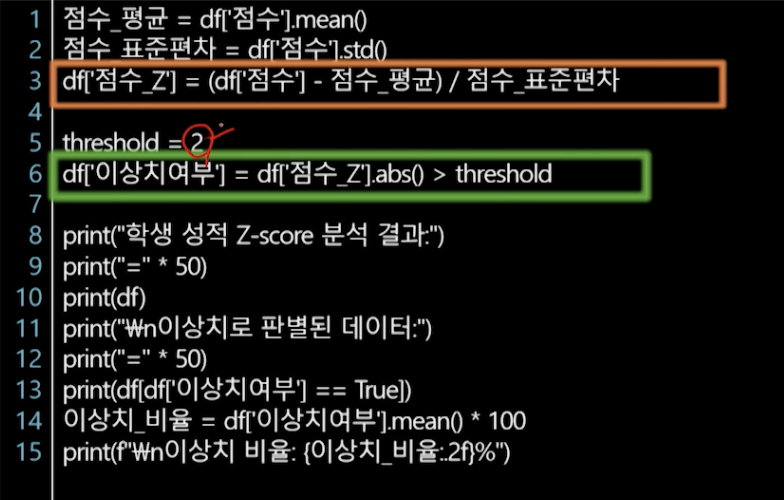
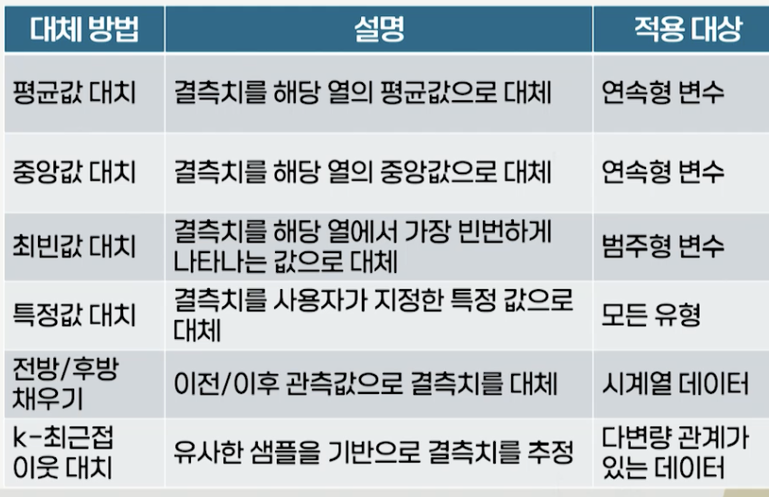
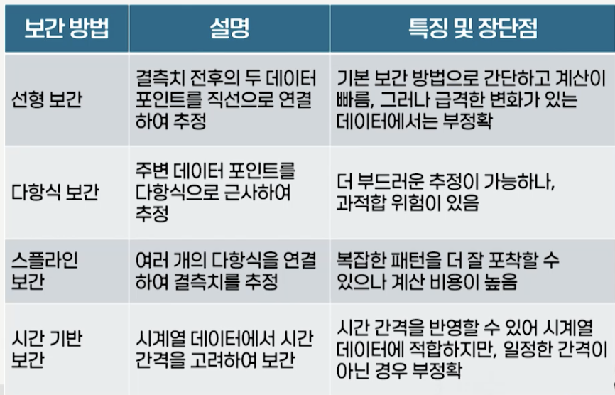
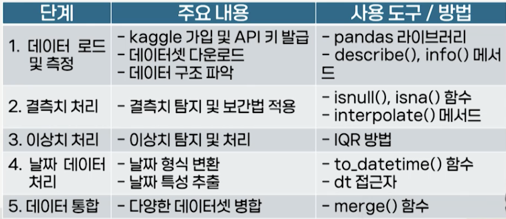
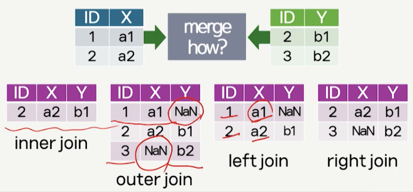

# 7강. 데이터 전처리 2

## 1. pandas를 이용한 데이터 정제

### 데이터 정제

- 데이터 정제(data cleansing)의 정의
  - 결측치, 이상치, 중복값, 오류값 등 데이터 분석에 방해가 되는 불완전하거나 부정확한 데이터를 탐지하고 수정, 제거하는 과정
  - 대표적으로 데이터 전처리 과정에서 수행
- 주료 결측치, 이상치를 식별하고 적절하게 처리 하는 과정으로 구성
  - 결측치
  - 이상치

### 결측치 찾기

- Pandas에서 결측치는 NaN(Not a Number)로 표현
  - NumPy에 포함
- Pandas의 isnull(), isna() 메소드
  - 각 요소가 결측치인지 여부를 나타내는 불리언 값을 반환
  - sum() 메소드와 결합, DataFrame 내 결측치 개수 파ㅏㅇㄱ
  - any() 메소드와 결합
    - DataFrmae내 결측치 포함 여부 파악
    - 결측치의 완전한 처리 여부 파악
- notnull() 메서드
  - isnull()의 반대 결과 제공

### 시각화를 통한 결측치 찾기

- 히트맵

  

  - seaborn 라이브러리의 heatmap() 함수 사용
  - 변수간의 결측치 관계를 한눈에 확인 가능

- 매트릭스

  

  - missingno 라이브러리의 matrix() 함수 사용
  - 데이터의 누락 여부를 행렬 형태로 표현

### 이상치 찾기

- 통계적 방법

  - IQR(사분위범위)
  - Z-Score 등 통계값 사용

- 시각적 방법

  - 박스플롯, 산점도 등 그래프 사용

  

### IQR(Interquartile Range)를 이용한 이상치 찾기

- 사분위수를 기준으로 해 데이터 분포의 중심 50% 범위를 계산하고, 이 범위를 벗어나는 데이터를 이상치로 간주
- 정규분포를 따르지 않는 데이터 또는 이상치가 많은 데이터 처리에 적합

### Z-Score(Z-점수)를 이용한 이상치 찾기

- 정규분포를 가정하고 각 데이터가 평균으로부터 얼마나 떨어져 있는지를 표준편차 단위로 측정하는 방식

- 정규분포에서 강력하나 평균/표준편차에 민감

  Z-Score = | (데이터 값 - 평균) / 표준편차 |

## 2. pandas를 이용한 데이터 문제 해결

### 데이터 문제 해결 전략

- 데이터 특성, 문제 유형, 분석 목적, 데이터 크기 등 여러 요소 고려해 선택
- 주요 문제 해결 전략
  - 제거
    - 결측치, 이상치를 포함하는 행/열 삭제
    - dropna() 메소드
    - 정보의 손실 가능성으로, 데이터셋의 규모가 작거나 결측치가 특정 패턴을 가지고 있는 경우 사용에 신중
  - 대치
    - 결측치나 이상치를 적절한 값으로 대체
    - 데이터 손실을 최소화하면서 데이터 활용도 향상
  - 보간
    - 여러 상황을 고려해 가장 적절하다고 판단되는 값을 넣어주는 것
    - 주변 데이터 포인트의 관계를 이용해 결측치 추정
    - 대치 보간 차이는 - 보간은 상황에 따라 값이 다이내믹하게 변함(대치는 고정값)

### 대치 전략

### 보간 전략

### pandas 데이터 값 변경 메소드

- replace()
  - 특정 값을 다른 값으로 바꿈
- map()
  - 각 요소에 함수나 딕셔너리를 적용해 값 적용
- apply()
  - 데이터 각 요소에 함수 적용
- loc 인덱서
  - 특정 조건을 만족하는 행이나 열을 선택하고, 값을 변경
- where()
  - 특정 조건을 만족하는 값만 유지하거나, 다른 값으로 변경

### 날짜 데이터 다루기

- 데이터 분석 시작 전, 모든 날짜 데이터를 일관된 형식으로 변환
  - 국가, 조직, 문화별 다른 날짜 표현식 및 패턴 사용
  - 윤년이나 월별 일 수 차이와 같은 복잡한 특성

### 개념 정리 실습

- Kaggle 의 Store Sales - Time Seriese Forecasting
  - Kaggle은 데이터 과학 플랫폼, 데이터 과학자들이 경쟁하고 지식을 공유하는 생태계

- 데이터 통합: 서로 다른 DataFrame을 결합
  - merge 메소드는 SQL의 JOIN과 유사한 방식으로 두 DataFrame을 특정 키를 기준으로 결합

