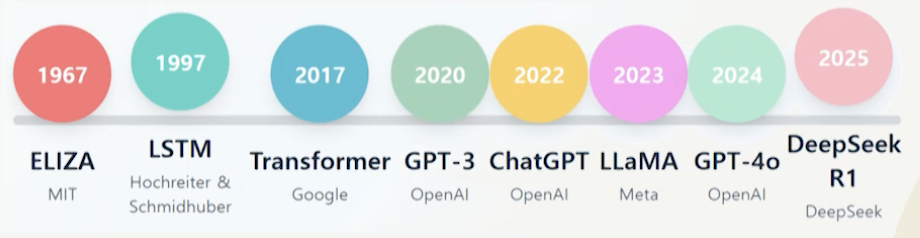

# 8강. 데이터 분석 1

## 1. 데이터 분석의 이해

### 데이터 분석의 이해

- 데이터에서 의미 있는 패턴과 통찰을 발견해 합리적인 의사결정을 지원하는 기술
- 데이터 분석의 필요성
  - 의사결정 질의 향상
  - 비즈니스 문제의 근본 원인 파악
  - 미래 예측 능력
- 데이터 분석 응용 분야 예
  - 비즈니스 환경: 고객 행동 이해, 시장 트렌드 파악, 운영 효율성 개선, 리스크 관리 등
  - 공공 부문: 정책 효과 평가, 자원 배분 최적화, 사회 문제 해결 등

### 데이터 분석의 어려움과 과제

- 결측치, 오류, 중복, 불일치 등 품질 문제 존재
- 규모와 복잡성
  - 빅데이터 시대의 5V(Volume, Velocity, Variety, Veracity, Value) 문제
  - 기존 분석 도구와 방법론의 한계 초과
  - 구조화된 데이터 뿐 아니라 비구조화 데이터 처리의 어려움과 고성능 컴퓨팅 환경 요구
- 방법론 선택의 난제
  - 다양한 분석 방법론 중 최적 선택의 어려움
  - 과도하게 복잡하거나 단순한 모델 적용의 위험성
  - 데이터 특성과 분석 목적에 맞는 방법 결정 필요

### 데이터 분석의 과정

## 2. 데이터 분석 과정

### 데이터 분석 방법론의 발전

- 1960년대 - 규칙 기반 분석의 시작
- 1980년대 - 통계적 방법론
- 2000년대 초 - 기계학습
- 2010년 초 - 딥러닝
- 2015년 - 자동화된 기계학습
- 2020년 - 대규모 언어 모델

### 규칙 기반 분석

- 전문가의 경험과 직관에 기반한 분석
  - 특정 조건과 규칙을 명시적으로 프로그래밍
  - If-then 형태의 논리적 규칙 적용
  - 분석가의 도메인 지식이 직접적으로 분석 과정에 반영
- 장점
  - 투명성과 해석 가능성 높음
  - 복잡한 통계나 수학적 지식 없어도 구현 가능
- 단점
  - 복잡하고 비선형적인 패턴 포착 어려움
  - 새로운 상황이나 예외적 경우에 대한 일반화 능력 부족

### 통계적 모형을 활용한 분석

- 데이터에서 패턴과 관계를 발견하고 이를 수학적으로 모델링하는 접근 방식
- 기술통계
  - 중심 경향(평균, 중앙값, 최빈값), 분산 정도(표준편차, 분산, 범위), 분포 형태(정규성, 왜도, 첨도) 
- 추론통계
  - 표본 데이터를 바탕으로 모집단에 대한 일반화된 결론을 도출하는데 중점
  - 가설검정, 신뢰구간 추정, 회귀 분석 등
- 데이터가 특정 분포(예: 정규분포)를 따른다는 가정이 성립하지 않을 경우 모형의 정확성과 신뢰성이 저하

### 기계학습을 활용한 분석

- 지도학습
  - 입력값과 정답(레이블)을 함께 학습
  - 분류(이메일 스팸 필터링, 이미지 인식 등), 회귀(주택 가격 예측, 판매량 예측 등)에 활용
- 비지도학습
  - 정답(레이블) 없이 데이터의 패턴과 구조를 발견하는 방법
  - 군집화(이상 탐지 등), 차원 축소, 연관 규칙 학습(상품 추천 등)에 활용
- 강화학습
  - 환경과 상호작용하는 에이전트가 **보상을 최대화**하는 행동 정책을 학습하는 방법

### 딥러닝과 인공지능 모형을 활용한 분석

- 인간의 뇌를 모방한 인공신경망을 기반으로 하는 기계학습의 한 분야
- 다층 구조의 인공 신경망
  - 각 층은 전 층의 출력을 입력으로 받아 추상적인 특징 추출
  - 계측정 표현 학습을 통해 복잡한 패턴 학습
  - 저수준의 특징부터 고수준의 특징까지 자동으로 학습 가능

### 딥러닝 모델

- 비정헝 데이터 분석에 새로운 가능성 제시
- 데이터 유형에 따라 다양한 구조로 발전
  - CNN: 컴퓨터 비전 분야에 적합
  - RNN, LSTM, GRU: 텍스트나 시계열 데이터
  - 트랜스포머: 자연어 처리 분야(LLM)

## 3. 탐색적 데이터 분석

### 탐색적 데이터 분석(EDA)의 개념과 중요성

- 데이터가 무엇을 말하는지 들어보라는 철학에서 시작
- 데이터의 기본적 특성, 구조를 이해하기 위한 분석 과정
  - 데이터에 내재된 패턴, 변수간 관계, 이상점, 트렌드 등을 발견하는 체계적인 접근법
- EDA의 중요성
  - 데이터 품질 문제를 조기에 발견하고, 변수 간의 관계와 패턴을 파악
  - 분석 방향과 가설을 수립하는데 기여
- EDA의 접근법
  - 기술통계랑 분석과 데이터 시각화

### 자동화된 EDA 도구

- 자동화 EDA의 필요성

  - 새로운 데이터셋은 데이터 탐색에 많은 시간과 노력을 요구
  - 반복적이고 기계적인 작업들이 많아 효율성이 저하

- 자동화 EDA 도구의 기능

  

  - 기본적 통계 분석, 변수 간 상관관계 파악, 데이터 시각화 등 몇 줄의 코드로 수행
  - 고차원적 분석과 모델링에 집중할 수 있도록 보조