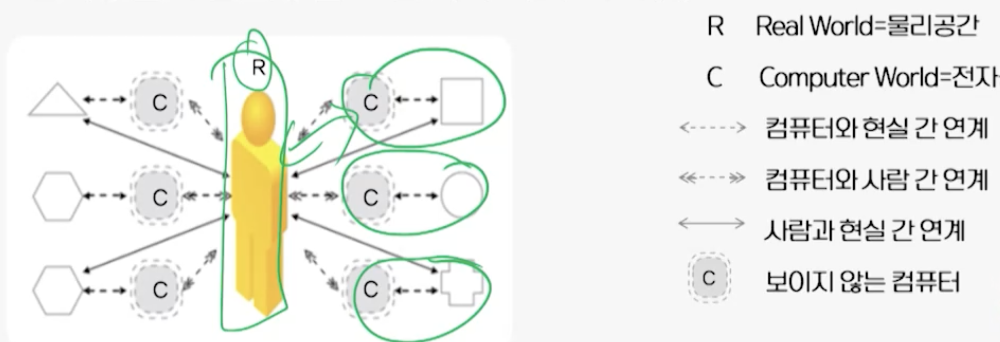

# 1강. 유비쿼터스 혁명

## 1. 공간의 발전 역사

| 도시혁명         | 산업혁명         | 인터넷혁명         | 유비쿼터스 혁명 |
| ---------------- | ---------------- | ------------------ | --------------- |
| 물리공간         | 물리공간         | 전자공간           | 융합공간        |
| 생활 공간의 발전 | 생산 공간의 발전 | 서비스 공간의 발전 | 융합 공간       |

- **도시혁명**
  - 대규모의 도시사회를 기반으로 복합적인 사회 서비스를 제공하는 사회 구조
  - 사회적 거리와 시간을 줄이기 위한 측면의 발전
- **산업혁명**
  - 생산의 기계화를 통해 대량 생산과 대량 소비를 기반으로 하는 산업 구조 및 사회 구조
  - 운송수단의 발달로 인한 물리적 이동 범위의 확대 및 소식과 정보의 유통이 가능해짐
- **인터넷 혁명**
  - 정보 기술의 발달로 인한 인터넷과 웹 서비스의 탄생
  - 단순히 전선으로 연결된 통신네트워크 개념을 초월하여 사람과 사람, 관계와 관계를 통해 사회/경제적 활동을 수행할 수 있는 실체적 공간으로서 전자공간을 탄생시킴
    - 인터넷을 기반으로 하는 전자통신기술이 발전하면서 생활의 기반을 전자공간으로 이동시킴
  - 인터넷을 기반으로 하는 전자공간은 접근성과 활용성이 뛰어남
  - 반면, 물리공간(현실공간)과 전자공간(사이버 공간)의 분리 현상 발생

- **유비쿼터스 혁명**
  - 서로 이질적인 물리공간(제1공간)과 전자공간(제2공간)이 제 3의 가치공간인 유비쿼터스 공간으로 통합/진화되는 것
  - 사람-컴퓨터-삼루이 하나로 연결되어 기능적이며 유기적으로 가장 최적화된 증강 현실(augmented reality) 공간을 쥐향하는 공간 혁명

## 2. 물리공간, 전자공간, 유비쿼터스 공간

### 물리, 전자, 유비쿼터스 공간

- **물리공간(Physical Space)**
  - 실제 세상과 사물 같은 '만질 수 있는 공간'
  - 물리공간에서 기능을 갖는 사물은 용도가 정해진 공간에 놓여짐(예: 놀이공간과 놀이시설)
  - 물리공간에서의 사물은 만지거나 보면서 지각할 수 있음
- **전자공간(Electronic Space)**
  - **전자**를 기반으로 하여 만질 수 없는 공간
  - 논리적으로만 존재하는 가상적 공간
  - 인터넷과 웹 서비스 같은 전자적 요소로 구성됨
  - 실제적 공간의 위치와 상관없이 통신네트워크에서 관리되는 통신프로토콜을 사용하여 연결되고 위치를 결정함
- **유비쿼터스 공간(Ubiquitous Space)**
  - 공간 구성요소로서 **원자와 비트**가 연계되어 형성됨
  - 만지지 않아도 공간에 존재하거나 공간에 관한 정보를 사용자가 알 수 있는 '현실체가 지능적으로 증강된 공간'으로 인식함
  - 무한하게 많은 사람들과 사물들에 주소를 부여할 수 있게 됨으로써 물리공간이나 전자공간이 갖는 주소체계의 한계를 뛰어넘을 수 있게 됨
  - **사물 속에 내재된 컴퓨터**들은 주변의 사물들 속에 내재된 컴퓨터들과 무선네트워크(IoT)로 연결되어 있어 사람이 인식하지 못하는 상황에서 의사 소통을 할 수도 있음
  - 사용자가 들고 다니는 다양한 형태의 단말기에 실시간으로 가장 유용한 정보를 제공하거나 필요한 의사결정을 내려줄 수도 있음
  - 물리공간과 전자공간이 최적으로 연계, 통합된 기능을 형성하고, 서비스를 제공할 수 있는 지능적인 공간

### 물리-전자-유비쿼터스 공간의 비교

| 구분               | 물리공간                                           | 전자공간                                  | 유비쿼트스                                                   |
| ------------------ | -------------------------------------------------- | ----------------------------------------- | ------------------------------------------------------------ |
| 공간지각           | 만질 수 있는 공간                                  | 만질 수 없는 공간                         | 만지지 안항도 지각 가능한 공간                               |
| 공간구성(소비방식) | 토지 + 사물(소유)                                  | 인터넷 + 웹(접속)                         | 유비쿼터스 네트워크 + 지능화된 환경 + 사물                   |
| 기능 형성          | 물릭오간에 사물이 심어짐                           | 전자공간에 가상 사물이 심어짐             | 유비쿼터스 기술이 사물에 내재됨                              |
| 기반 네트워크      | 도로망, 철도망                                     | 인터넷 및 통신 네트워크                   | 사물과 사물을 연결하는 유비쿼터스 네트워크                   |
| 공간개발 기술      | 토목, 건축                                         | IT(컴퓨터 + 통신 + 방송융합)              | IT + NT + BT 융합                                            |
| 산업경제           | 유형의 1, 2, 3차 산업(부동산, 제조업 등 물질 재화) | 정보의 가공 및 전달을 통한 산업(정보재화) | 환경 및 사물에 대한 식별, 인식, 추적에 관한 전방위 공간산업(공간재화) |

## 3. 전자공간과 물리공간의 연계

### 전자공간과 물리공간의 연계에 대한 시각

- 전자공간과 물리공간의 연계에 대한 시각(I)
  - 증강된 상호작용 또는 증강현실을 전자공간과 물리공간의 연계로 보는 시각
- 전자공간과 물리공간의 연계에 대한 시각(II)
  - 사람(유비쿼터스 컴퓨팅 개념)을 중심으로 하는 시각

### 유비쿼터스 컴퓨팅 개념을 토대로 하는 접근 방법

- 유비쿼터스 컴퓨팅 개념을 토대로 하는 접근 방법(I)
  - 물리 공간의 사물 이미지를 해석하여 사용자의 주변을 분석하고 주위의 특정 사물의 존재를 컴퓨터가 인식할 수 있도록 함
  - 전자공간과 물리공간간의 연계를 위한 비디오 중심의 분석
- 유비쿼터스 컴퓨팅 개념을 토대로 하는 접근 방법(II)
  - 다양한 컴퓨터(칩, 센서, 태그, 구동체 등)를 사물 속에 심고 이들은 네트워크로 연결하여 물리공간의 상황을 사물과 사물, 사물과 컴퓨터, 컴퓨터와 사물 간의 지능적인 상호작용을 통해 유비쿼터스 공간(전자공간-물리공간)으로 인식함
  - 사물 - 컴퓨터 - 사람이 네트워크로 연결되어 의사 소통하며, 물리공간에서의 상황을 지각, 추적, 감시, 구동하는데 있음

### 유비쿼터스 환경

- 사물, 컴퓨터, 사람의 네트워크 연결
  - 사물-컴퓨터-사람의 연결은 물리공간(사물)에 내재된 센서, 칩, 태그와 구동체들은 전자공간에서 서비스 제공에 필요한 물리적 속성(ID, 유일 이름 등)과 물리적 상태(속도, 기울기 등)를 가지고 통신 및 구동할 수 있어야 함
- 물리적 속성과 전자적 속성 간의 연계 차원
  - 특정 물리적 객체(사물, 도로, 건물 등)의 상태는 전자적 객체(Web, Java, XML, Physical Markup Language)와 상호작용 할 수 있어야 함
- 유비쿼터스 환경
  - 물리공간의 사물(센서/칩/태그), 전자공간의 컴퓨터, 양쪽에 존재하는 사람 간의 제한 없는 통신네트워크를 기반으로 하며,
  - 물리공간에 존재하는 장소, 사물, 사람의 물리적 속성에 대한 인식이 가능하고
  - 이러한 물리적 속성과 전자공간상의 전자적 속성이 양방향으로 상호작용 할 수 있는 기능 중심의 환경