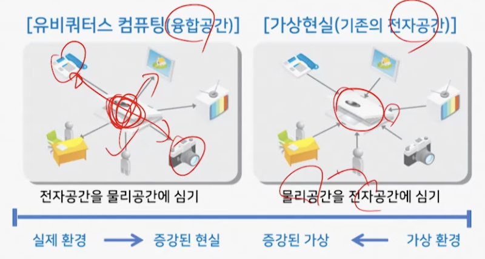

# 2강. 유비쿼터스 컴퓨팅 개념과 주요 이슈

## 1. 유비쿼터스 컴퓨팅의 정의

### 유비쿼터스 컴퓨팅 개요

- 미록 제록스사 PARC(Palo Alto Research Center)에서 컴퓨터와 네트워크에 대한 근본적인 모습의 연구로부터 시작
  - 사람 중심의 서비스
  - 사람 중심의 서비스 환경을 변화시킬 수 있는 기술
  - 공간과 사회를 변경할 수 있는 기술
- 마크 와이저
  - PARC의 CTO
  - The Computer for the 21st Century
    - 일상생활에서 더 투명하게 통합된 컴퓨팅 환경을 경험할 수 있도록 하는 것
    - 유비쿼터스 컴퓨팅의 개념과 서비스 환경에 대해 구체적으로 정의
- PARC는 이와 관련한 연구 사업을 Ubiquitous Computing(Ubicomp) 라고 명명
- 유비쿼터스 컴퓨팅의 요구사항(기본전제)
  - 사용자 인터페이스가 인간 친화적이어야 함
  - 통신 네트워크이 연결되어 있어서 언제든지 응답을 받을 수 있어야 함
  - 무선 통신 등(이동 네트워크) - 와이파이 아니고, LTE 같은거

### 유비쿼터스 컴퓨팅의 정의

- 사람을 포함한 현실공간에 존재하는 모든 대상물을 기능적, 공간적으로 연결하여 사용자에게 필요한 정보나 서비스를 즉시에 제공할 수 있는 기반 기술

### 유비쿼터스 컴퓨팅의 단말기

- Tabs
  - a wearable device that is approximately a centimeter in size
- Pads
  - a hand-held device that is approximately a decimeter in size
- Boards
  - an interactive larger display device that is approximately a meter in size

### 유비쿼터스 컴퓨팅이 지향하는 모습: 유비쿼터스 환경

- 우리의 일상생활 속으로 스며들어 밖으로 드러나 보이지 않는 조용한 상태(calm)에서
- 서로 유기적으로 연결(connectivity)되어 협조함으로써
- 언제 어디서나 컴퓨팅(computing) 기능을 활용할 수 있으며
- 우리들에게 필요한 정보나 서비스(contents)를 맞춤 방식으로 즉시 제공하여
- 사람-사물은 물론 사물-사물 통신(communication)도 가능하여 우리의 삶의 질을 향상시키는 새로운 컴퓨터 환경
  - AI/기계학습/블록체인 등의 기술도 함께 고려해야 함

### 유비쿼터스 컴퓨팅의 발전 방향

- 유비쿼터스 공간의 구축
  - 유비쿼터스 공간에서는 모든 물리공간에 컴퓨팅 능력을 심는 것이 주된 목표
- 기존의 전자공간의 구축
  - 가상공간 개념이 주축을 이루어 물리공간을 가상공간에 옮기는 것이 주된 목표

- 마크와이저의 예측
  - 보이지 않는 인터페이스
  - 사물에 대한 인간화 기술
  - 새로운 문화: 유비쿼터스 컴퓨팅의 출현

### 마크 와이저의 유비쿼터스 컴퓨팅 전개 시나리오

## 2. 유비쿼터스 컴퓨팅의 특징

### 유비쿼터스 컴퓨팅

- 목적
  - 모든 사물에 컴퓨팅 능력을 심는 것
  - 이를 위해서 모든 사물에 극소형의 컴퓨터 칩을 내재시키고(embeded) 이들을 지능화 시켜야 함
- 결과
  - 사물의 일부가 된 컴퓨터들은 주변 상황을 인식할 수 있고, 지리적으로 떨어진 곳에서도 사용자가 대상 사물과 그 주변 환경의 변화를 지각하거나 추적할 수 있도록 함

### 유비쿼터스 컴퓨팅 환경 제공 방법

- 모든 곳에 컴퓨터를 내장시켜 가장 가까운 컴퓨터를 언제나 사용할 수 있는 방식
  - 모든 곳에 항상 편재하는 컴퓨터를 이용..
- 사용자의 컴퓨터가 항상 네트워크에 연결되어 있고, 언제나 정보 서비스를 제공받는 형식
  - 사용자가 항상 네트워크와 통신 가능한 솧여 컴퓨털르 가지고 다니면서..
  - 휴대 가능한 컴퓨터 혹은 스마트폰이 보급되면서 유비쿼터스 컴퓨팅의 의미가 크게 확장됨

### 유비쿼터스 컴퓨팅의 실현

- 언제나 어디서나 컴퓨터를 사용할 수 있다(모든 장소에 컴퓨터가 존재하여 자유롭게 사용할 수 있다)
- **컴퓨터를 항상 가지고 다니면서 사용하거나, 사용자 주위에 컴퓨터가 내장된 다양한 기기가 네트워크로 제어된다** (의미 확장)

### 유비쿼터스 컴퓨팅의 대표적인 사례

- 인공지능 비서
- 스마트홈 시스템
- 차량 내 임베디드 시스템(주행 보조 시스템, 엔터테인먼트, 주차 보조 기능 등)

### 유비쿼터스 컴퓨팅의 특징(마크 와이저)

- 네트워크에 연결되지 않은 컴퓨터는 유비쿼터스 컴퓨팅이 아니다
  - 항상 네트워크에 접근 가능해야 한다
- 인간화된 인터페이스로서 눈에 보이지 않아야 한다
  - 내장형 또는 소형마이크로컴퓨터칩으로 사물에 내재되고 인간 중심의 지능형 인터페이스 기능을 가져야 한다는 의미
- 가상 공간이 아닌 현실 세계 어디서나 컴퓨터 사용이 가능해야 한다
  - 현실 세계의 구체화된 어떠한 장소에서도 컴퓨터 사용이 가능해야 한다는 의미

## 3. 유비쿼터스 컴퓨팅의 개념적 기술 전개 환경

### 유비쿼터스 컴퓨팅의 개념적 기술전개 방향

- 증강현실 기술은 국제적 표준화와 사용자 중심의 개인화의 양면성을 가지며 발전
- 범용성과 특수성의 조화와 통합 측면의 기술 발전 양상을 보임

### 유비쿼터스 컴퓨팅의 개념적 기술전개

- 첫번째 파장
  - 서버 기술과 유무선통신 기술 영역이 끊김 없는 네트워크를 기반으로 통합된 정보 서비스를 제공하는 방향으로 진화됨
- 두번째 파장
  - 클라이언트와 PostPC 기술, 무선 및 유무선 통합망 기술은 초고속, 대용량의 멀티미디어 데이터에 대한 광대역 접속 서비스를 제공하게 됨
- 세번째 파장
  - 내장된 초소형컴퓨팅 객체와 미세 전자기계 시스템(MEMS) 기술, 센서 기술 및 근거리 무선통신 기술, NFC 등의 기술 발전으로 **전자공간과 물리공간**의 융합이 가능해짐
- 네번째 파장
  - 딥러닝, 클라우드 컴퓨팅, 스마트 자동차 기반 기술 등의 상업적 적용으로 인한 **개인 맞춤형 자율 서비스**로 진화

### 유비쿼터스 컴퓨팅의 개념적 기술전개 예측

- 인공지능 기술의 융합으로 개인화된 유비쿼터스 서비스의 수준 향상
- 빅데이터 처리 능력, 적용 범위, 수집 등의 확대로 인한 다양한 유비쿼터스 서비스의 발전

### 성장 동인의 이동 시나리오

## 4. 유비쿼터스 컴퓨팅의 주요 이슈

### 지피티

- 해킹으로 인한 보안 문제
- 노동력의 변화(로봇으로 대체되는 노동력)

### 유비쿼터스 네트워크 기반의 유비쿼터스 컴퓨팅 기술 이슈

- 가시성(Visibility) 측면
  - 복잡하고 방대한 결과에 대한 시각적 편리성을 지향하며, 정보서비스 제공이 구체화되어야 한다
- 복잡도(complexity) 측면
  - 구체화된 컴퓨터의 운영체제, 응용 등에 대한 협력 작업과 분산 작업을 통한 효율적인 협력 시스템과 서로 다른 기능을 갖는 다양한 시스템들의 융합 컴퓨팅 모델이 제시되어야 한다

- 추상화(abstraction) 측면
  - 가상화나 클러스터링 기술을 통해 스마트폰이나 PC를 단말기로 사용하는 슈퍼 컴퓨터 사용 환경을 제공한다

- 연결성(connection) 측면
  - 인터넷 통신 속도의 고속화, 안정성, 효율성, 광대역 채널의 확보를 통해 데이터나 컴퓨팅 능력 면에서 보다 큰 스케일의 컴퓨팅 공간을 구축해야 한다
- 비가시성(invisibility) 측면
  - 인간 중심의 사용자 인터페이스를 통해 편리한 인터페이스를 제공하기도 하고, 개인화된 인터페이스를 제공할 수 있는 서비스가 창출되어야 한다