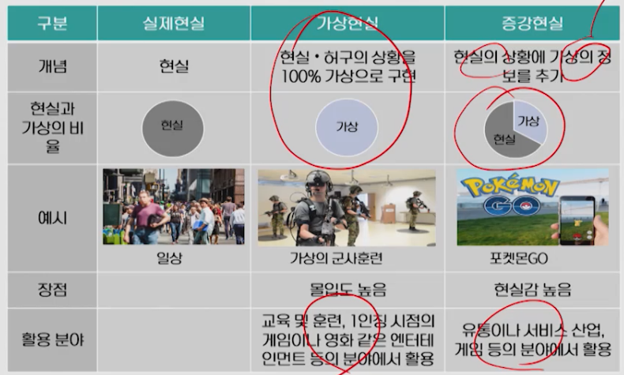
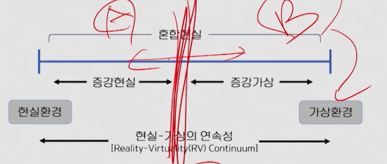
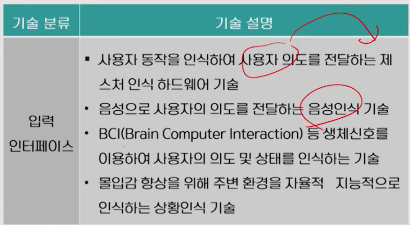
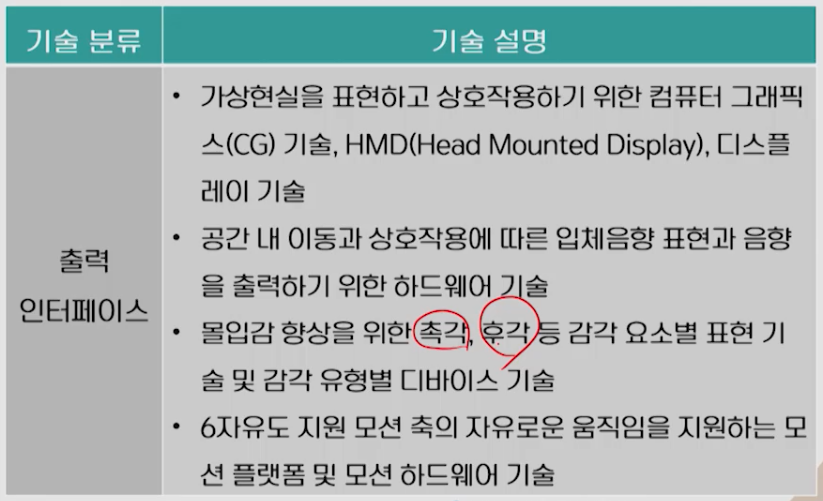
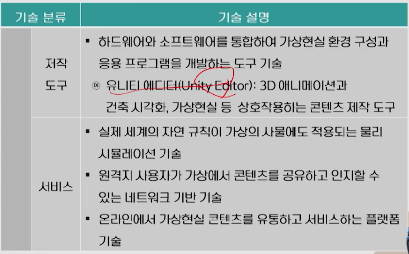
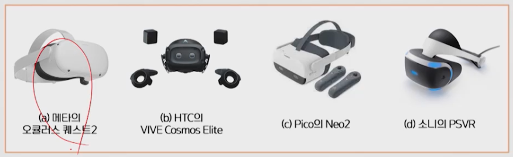
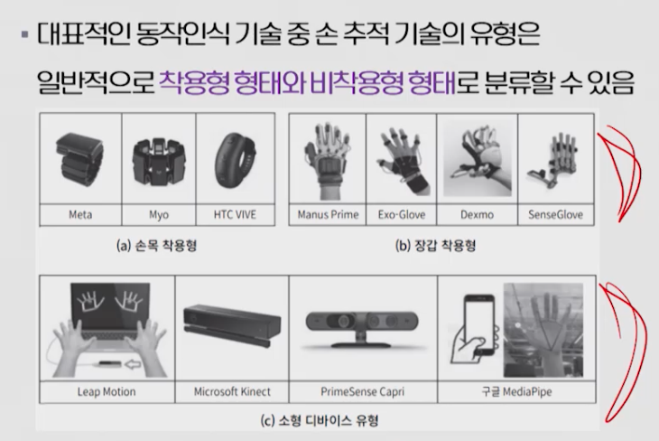
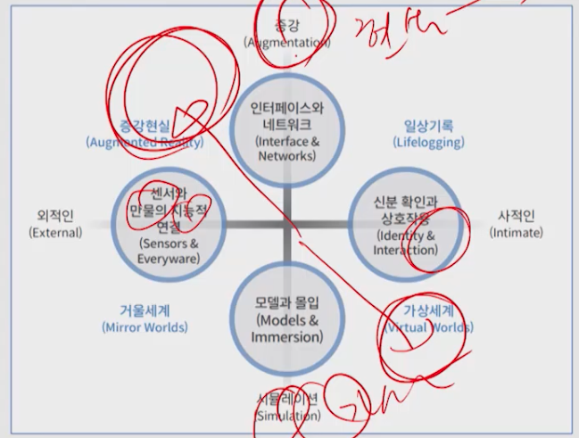

# 3강. 가상현실 및 메타버스

## 1. 가상현실

- 가상현실(VR: Virtual Reality)
  - 실제로 존재하지 않은 환경이나 상황을 컴퓨터 등으로 구현한 후 인간의 감각을 이용하여 체험하게 하는 기술
  - 실제로 존재하지 않는 완전히 허구적 환경이나 상황을 가능하게 하는 기술
  - 유비쿼터스 컴퓨팅 기술을 활용하여 실제로 얻기 힘들거나 혹은 아예 얻을 수 없는 경험이나 환경을 제공해 인체의 오감을 자극함으로써 실제와 같이 체험하게 하는 기술
- 증강현실(AR: Augmented Reality)
  - 단말 소프트웨어 등을 활용해 현실에 가상의 정보를 추가한 '실재와 허구가 혼합된' 환경을 구현하는 기술
  - 포켓몬GO - 증강현실 게임의 대표적 예

- 가상현실과 증강현실

  

  - 기술의 발달은 가상현실 속에 구현된 것들과 상호작용을 가능하게 만듦
  - 가상현실 내 사용자와 상호작용이 가능하고, 그 과정에서 사용자가 새로운 경험을 할 수 있으므로 의도한 대로만 보여주는 시뮬레이션과는 구분된

- 가상현실과 증강현실의 구분

  - 가상현실에서 사용자는 현실과 단절되어 가상세계에 몰입
    - 집중이 필요한 교육훈련 등
  - 증강현실은 실제 현실 속에서 현실과 연계되어 사용자를 보조
    - 현실 개체 간 상호작용이 필요한 유통이나 서비스 산업에 주로 활용됨

- 가성성의 연속성(Virtuality Continuum)

  

  - 현실과 가상세계 사이에서 가상성의 정도를 구분하기 위해 제시된 개념
  - 현실에 얼마나 많은 가상적인 요소가 포함되어 있는지를 의미하는데, 이는 단계적 개념이라기보다는 현실과 가상세계 간 연속적인 속성을 보임

- 증강가상(Augmented Virtuality)

  - 디스플레이에 보여지는 내용이 컴퓨터 그래픽으로 만든 가상 요소의 활용이 상대적으로 더 많은 단계를 의미
  - 컴퓨터 그래픽으로만 제공된 환경을 가상현실이라고 하며, 이에 반해 증강현실은 현실적 요소에 비해 컴퓨터 그래픽의 활용이 상대적으로 적은 환경을 말함

- 혼합현실(MR: Mixed Reality)

  - 현실과 가상환경 사이에 존재하는 모든 것을 의미
  - 증강 현실은 혼합현실의 한 부류
  - 현실세계와 가상의 대상물이 함께 존재하는 것을 의미

- 360도 카메라

  - 360도 전방위를 촬영한 영상
  - 가상의 대상물로 구성된 동영사잉 아닌, 현실을 360도로 재현한 동영상이며 새로운 영상정보 전달 방식이지만 가상현실은 아님

## 2. 가상현실 주요 기술

### 가상현실 기술

- 입출력 인터페이스 기술
- 콘텐츠 기술

### 가상현실 입출력 기술의 특징

### 가상현실 기술: 콘텐츠 관련

- 개발 엔진
- 저작 도구
- 서비스 기술

### 가상현실 콘텐츠 기술의 특징

### 가상 현실을 위한 입출력 인터페이스

- 몰입감을 위한 입체감을 표현하기 위해 3D 입체 기술의 활용도 높음
- 상호작용을 위한 영상 기반의 제스처 인식, 하드웨어 센서를 이용한 동작인식 및 상황인지 기술의 복합 활용
- 다양한 하드웨어와의 호환성을 가진 모션 플랫폼 기술 
- 네트워크 기반 기술을 활용한 지리적 공간의 제약 극복
- 스마트폰 이용한 사용자 지원
- HMD(Head Mounted Display)와 같은 착용형 디스플레이
- 제스처나 생체신호 인식을 위한 센서 디바이스 등 하드웨어 기술

- 사물인터넷과 기술적으로 겹치는 부분이 많음

### 가상 현실을 위한 출력 기술

- 현장감과 몰입감을 위해 시각효과에서 어지러움과 모션블러 현상을 제거하기 위한 방향으로 기술 개방
- HMD, 증강현실 안경, 프로젝션 매핑, 홀로그램 등의 기술 개발

### 가상 현실 관련 음향 기술

- 헤드폰 방식
  - 음향 출력되는 공간 제어 가능, 3D 실감음향 표현이 쉬움
- 스피커 방식
  - 공간 내 음향 출력을 움직임에 따라 제어하는 기술
  - 기술적으로 어려움, 헤드폰 방식에 비해 입체감이 좋음(돈 많이 듬)

### 가상현실 관련 오감 기술

- 시각, 청각 외 촉각, 후각, 미각 기관 등
  - 오감 자극해 정보 전달하는 인터페이스 기술
  - 착용형 기기로 발전
- 햅틱 인터페이스
  - 스마트폰의 진동 표현
- 에어리얼(Aireal)
  - 디즈니 연구팀
    - 인터페이스 장치로부터 사용자의 손이나 얼굴 같은 대상까지의 거리를 계산하여 링 형태의 압축 공기를 분사함으로 촉각을 느끼게 함

### 가상 현실 관련 모션 기술

- 모션 플랫폼

### 가상현실 관련 입력 기술

- 내추럴 사용자 인터페이스(NUI)로 진화중
- 상호작용 인터페이스는 단일 기능을 이용하는 방식에서 음성, 독작 등의 여러 기능을 복합적으로 활용하는 멀티모델 형태로 진화
- 3D 센싱
- 착용형 형태
- 비착용형 형태

## 3. 메타버스

### 메타버스 개요

- 기존 가상현실보다 진보된 개념, 지금도 발전중
- 웹, 인터넷 등의 가상세계가 현실세계에 흡수된 형태
- 가상현실의 몰입감을 높이기 위해 시각적 요소 뿐만 아니라 청각, 촉각, 후각 등 인간의 여러 감각 정보로 확장하는 기술도 포함

- 온라인 회의, 공연, 전시회, 온라인 교육, 학회, 게임이나 엔터테인먼트 분야에서 이전과 다른 접근 방식으로 사용자층 넓히는 중

### 개념

- 메타(가상, 추상) + 유니버스(현실 세계)
- 가상의 인물이 가상의 사물을 이용하여 다양한 활동을 할 수 있음! (상호작용)

- 일반적으로는 현실세계와 같은 사회적, 경제적 활동이 통용되는 3차원 가상공간
- 미래 가속화 연구재단(ASF)은 초기에 메타버스를 '증강과 시뮬레이션', '외적인 것과 사적인 것' 이라는 두 가지 기준에 따라 네 가지 시나리오로 구분
  - 현실과 가상을 결합한 증강현실(Augmented Reality)
  - 창조된 가상세계(Virtual Worlds)
  - 현실을 복제한 거울 세계(Mirror Worlds)
  - 사람의 일상생활을 통해 인생을 기록하는 일상기록(Lifelogging)

### 메타버스에 포함된 4개의 시나리오와 결합 관계

## 4. 메타버스 플랫폼

### 메타버스 플랫폼

- HTC의 메타버스 플랫폼인 바이버스(Viverse)
  - 인게이지(ENGAGE), VR챗(VRCHAT) 등 다른 회사의 메타버스 플랫폼과 연동되는 개방형으로 개발되었음
- SKT - 이프랜드
- LGU+ 아이돌 라이브

### 유형

- 소셜 기반 메타버스
- 게임 기반 메타버스
- 생활, 산업 기반의 메타버스

### 소셜 기반 메타버스

- 제페토, 게더타운, 호라이즌월드, 위버스 등
- 게더타운
  - 줌, 팀즈 같은 온라인 회의 솔루션 

### 게임 기반 메타버스

- 모바일, 컴퓨터, 콘솔용 게임이 확장해 탄생
- 로블록스, 마인크래프트, 포트나이트 등이 있음

### 생활, 산업 기반의 메타버스

- 홀로렌즈2, 링피트니스
- 가장 발전이 느림