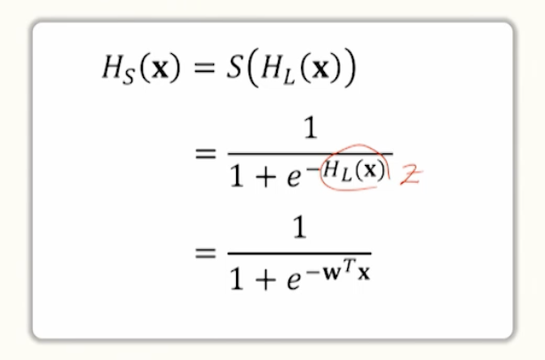
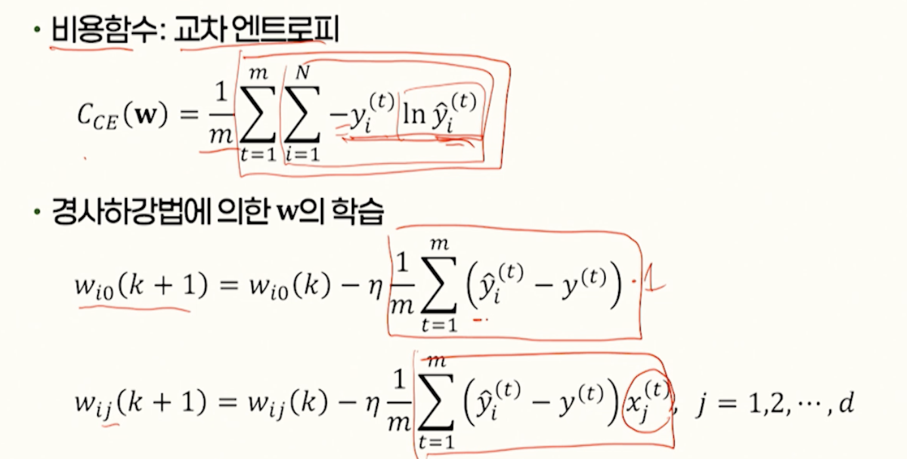

# 11강. 머신러닝(2)

## 1. 선형회귀

### 선형회귀의 개념

- 회귀분석
  - 독립변수와 종속변수 사이의 상관관계를 추정하는 기법
  - 독립변수: 입력
  - 종속변수: 독립변수에 따른 출력
- 선형회귀란?
  - 독립변수와 종속변수 사이의 상관관게를 **선형함수**로 모델링하는 것
  - 선형회귀 목표
    - 오차에 대한 비용함수가 최소가 되는 w0와 w1을 구하는 것

### 선형가설의 학습

- 선형가설과 비용함수
  - 선형가설
  - 비용함수: 평균제곱오차(MSE)
- 비용함수의 최소화
  - 경사하강법
    - w0, w1을 임의의 값으로 초기화한 후 비용함수 기울기의 음의 방향으로 경사면을 따라 내려가도록 조금씩 변화시키는 것을 반복

### 다중 선형회귀

- 다중 선형회귀란?
  - 독립변수가 2개 이상인 경우의 선형회귀
- 비용함수의 최소화

## 2. 로지스틱 회귀

### 로지스틱 회귀의 개념

- 로지스틱 회귀(logistic regression)란?

  - 독립변수의 값에 대해 종속변수가 0 또는 1이라는 값을 낼 수 있는 가설을 구하는 것

    - 종속변수가 독립변수에 따른 유형을 구분하는 값일 경우

  - 로지스틱 함수(logistic function) `S(z)`

    

 

### 로지스틱 회귀의 가설 Hs(x)

- 독립변수의 값에 대해 종속변수의 값이 1일 확률을 계산

  - 선형함수 HL(x)를 로지스틱 함수의 로짓으로 사용해 0과 1 사이의 값을 구함

  

### 가설의 학습

- 비용함수의 정의

  - 교차 엔트로피(cross entropy)

    

    - 이진 교차 엔트로피(binary cross entropy)

- 경사하강법에 의한 학습

  

- 가설 Hs(x)와 결정경계

  - 

  

### 다항 로지스틱 회귀

- 다항(multinominal) 로지스틱 회귀란?
  - 식별하려는 클래스가 3개 이상인 경우에 대한 로지스틱 회귀
- 소프트맥스
  - N개의 0부터 1사이의 값, 이들의 합은 1

### 다항 로지스틱 회귀의 학습

## 3. 군집화

### 군집화의 개념

- 군집화(clustering)
  - 패턴 집합이 주어졌을 때, 같은 종류라고 생각할 수 있는 몇 개의 서브클래스로 분할하는 것
  - 비지도학습 방식으로 학습함

- k-평균 군집화(k-means clustering)
  - k개의 평균벡터 구함
  - 임의의 값으로 초기화한 평균벡터를 반복적으로 수정하여 적절한 위치로 수렴하도록 하는 방법을 사용
  - 알고리즘의 기본 골격
    - 각각의 학습표본을 가장 가까운 평균벡터가 무엇인가에 따라 k개의 군집으로 분류
    - 각각의 평균벡터에 해당되는 군집으로 분류된 표본들의 평균을 구해 그 평균벡터를 수정
  - k-평균 군집화의 특성
    - 평균벡터의 수를 지정해야 함
    - 모든 표본에 대해 그 표본과 가장 가까운 평균벡터 사이의 거리의 합이 최소인 평균벡터를 구함
    - 평균벡터의 초깃값에 따라 군집화 결과가 다를 수 있음