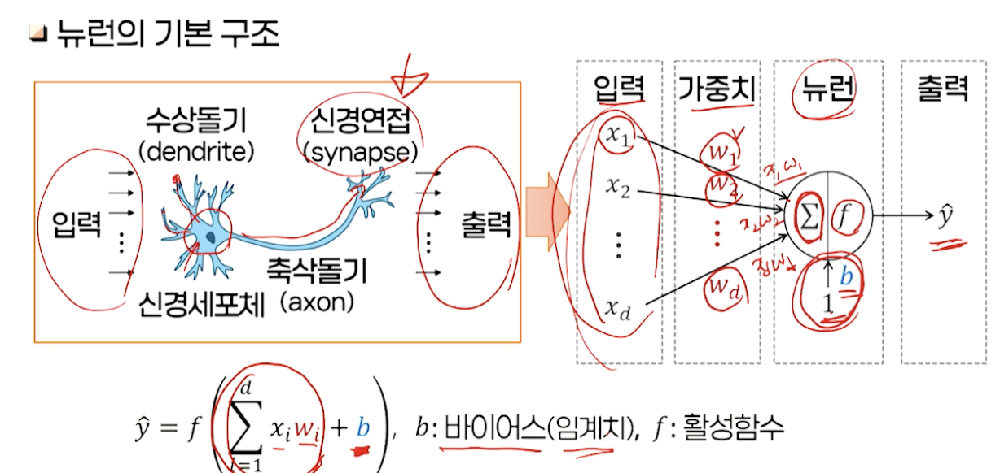

# 12강. 인공 신경망(1)

## 1. 인공 신경망의 개념

### 인공 신경망의 기본 구조

- 인공 신경망이란?

  - 두뇌 속의 신경 구조

    - 약 10억~100억 개의 신경세포(뉴런, neuron)로 구성
    - 신경세포는 매우 간단한 처리만 담당
    - 각 신경세포는 약 1천~10만 개의 다른 신경세포와 신경연접(synapse)을 통해 연결
    - 신경연접을 지나가는 신호는 신경연접의 특성에 따라 증폭되거나 감쇄되어 전달됨

  - 컴퓨터와 신경계통의 처리 방법 특성 비교

    - 신경 구조를 모델링하여 지능적 처리에 응용하려고 시도함
      - 인공 신경회로망(ANN: Artificial Neural Network)

    

- 인공 신경망의 특성
  - 간단한 연산기능을 가지고 있는 많은 수의 뉴런
  - 대단위 병렬처리
  - 정보 저장
    - 신경연접의 연결 가중치 벡터를 통해 저장
    - 분산저장됨
  - 학습능력
    - 학습 데이터에 따라 자동적으로 연결 가중치 조정
  - 결함내성
    - 일부 뉴런에 고장이 발생해도, 전체 시스템의 성능이 급격하게 저하되는 것은 아님

- 활성함수(activation function)
  - 비선형 특성을 갖는 함수를 사용함
    - 단위 계단함수
    - 시그모이드
    - TanH
    - ReLU

- 연결 형태

  - 흥분성 연결 및 금지 연결

    

  - 층내연결 및 층간연결

    

  - 피드포워드 연결 및 순환 연결

    

### 신경망의 학습

- 신경망 학습의 개념

  - 학습(learning): 신경망이 주어진 목적에 맞게 동작할 수 있도록 연결 가중치 w의 값을 결정하는 제반 과정을 의미

    

- 학습 데이터 집합의 활용

  - 학습 데이터의 구성: 입력 데이터와 레이블(지도학습)
  - 훈련, 검증, 테스트를 위한 데이터 활용

- 훈련의 진행 단위

  - 개별 학습표본 단위의 파라미터 업데이트
    - 확률적 경사하강법(stochastic gradient descent, SGD): 매 학습 단계에서 학습표본을 무작위로 섞어 훈련을 진행함
  - 배치학습(batch learning)
    - 학습표본 집합 내의 각각의 표본에 의한 파라미터 변화량 누적
    - 전체 학습표본에 대한 변화량의 평균으로 파라미터를 업데이트함
  - 미니배치(mini-batch) SGD
    - 전체 학습표본 집합을 작은 부분집합(미니배치)으로 분할
    - 미니배치 단위의 파라미터 변화량 평균으로 파라미터를 업데이트함

## 2. 퍼셉트론 학습

### 퍼셉트론 모델

- 퍼셉트론 모델 개요(Perceptron)
  - Frank Rosenblatt - Cornell 대학
    - 1957년
    - 선형분리가 가능한 입력벡터의 집합에 대한 선형 결정경계를 학습할 수 있음을 입증
  - 뉴런의 기능
    - 입력벡터의 각각의 요소는 연결 가중치를 거쳐 합산되며, 그 결과에 활성함수를 가해 출력
    - 활성함수: 단위 계단 함수(unit step function)
  - 지도학습방식
- 퍼셉트론의 학습

### 퍼셉트론의 학습의 특성

- 성과
  - 학습 데이터를 이용해 반복 학습하면 이를 분리할 수 있는 선형 결정경계를 형성
- 한계
  - 선형분리가 되지 않는 문제는 해결 불가

- XOR 문제의 해법: 2단계 처리
  - 1단계: 동일한 입력에 2개의 퍼셉트론을 구성해 각각의 출력에 대해 새로운 2차원 공간 형성

