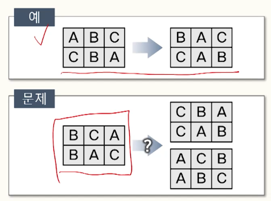
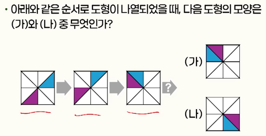
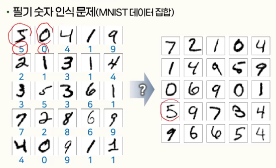
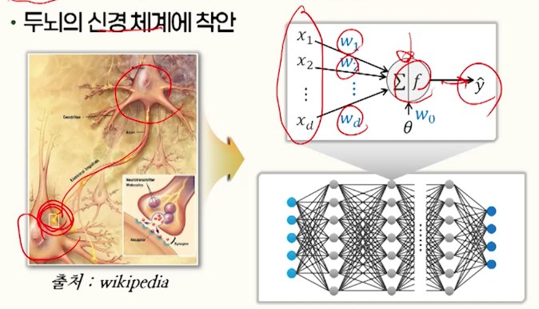

# 1강. 인공지능의 개요

## 1. 생각하는 컴퓨터

### 컴퓨터가 생각을 할 수 있을까?

- 튜링 테스트(Turing Test)
  - Alan Turing이 컴퓨터가 생각을 할 수 있는가를 입증하기 위한 방법으로 제안한 테스트
  - "Can machines think?" - "imitation game"
- 인간과 컴퓨터의 체스 대결
  - Deep Blue vs Garry Kasparov
  - 1차 대결(1996): 3승 2무 1패 카스파로프 승
  - 2차 대결(1997): 2승 3무 1패로 딥블루 승
  - Deep Blue
    - IBM의 RS/6000 SP 병렬 슈퍼컴퓨터에 체스 전용 보조프로세서를 장착하여 초당 2억개의 행마를 검토할 수 있음
- 인간과 컴퓨터의 퀴즈 대결
  - Jeopardy! 쇼에서 2명의 퀴즈 달인과 IBM의 Watson 컴퓨터가 대결(2011년)
  - 2011년 압도적인 승리
  - IBM Watson
    - Deep QA: 100가지가 넘는 서로 다른 기술을 이용해 자연어를 처리하고, 가설을 설정하여 증거에 점수를 매긴 다음, 가설을 설정하여 증거에 점수를 매긴 다음, 가설들을 병합하고 순위를 정해 답변
    - 총 2,880개의 POWER7 프로세스 스레드가 동작하는 대단위 병렬 시스템을 이용해 고속으로 처리
- 인간과 컴퓨터의 바둑 대결
  - 프로기사 이세돌과 대국(2016년)
  - 1승 4패로 알파고에 패배
  - 딥마인드의 AlphaGO
    - Monte-Carlo 트리 탐색, 딥러닝을 이용한 머신러닝
    - 다수의 CPU와 GPU를 이용한 대단위 병렬 컴퓨터 사용
      - 단일 버전: 48개의 CPU와 48개의 GPU로 계산
      - 분산 버전: 1,202. 1,920개의 CPU와 176280개의 GPU를 이용하여 계산

- 생성형 인공지능(Generative AI)
  - 대규모 데이터 집합을 대상으로 학습함으로써 이를 일반화하여 데이터에 내재한 패턴이나 구졸르 습득
    - 이를 바탕으로 새로운 데이터를 생성할 수 있음
  - 사례
    - 챗봇: ChatGPT, Copilolt, Gemini
    - Text-to-image: DALL-E, Midjourney, Stable Diffusion
    - Text-to-video: Sora, Runway
  - 문제점
    - 윤리적 문제: 훈련 데이터에 따른 편향된 콘텐츠 생성, 실제와 구분하기 어려운 거짓 정보의 생성, 딥페이크
    - 환각: 사실과 다르거나 비논리적인 정보의 생성
    - 책임소재의 불분명: 생성된 정보가 부정확하거나 해로운 내용을 담고 있는 경우
    - 설명 가능성: 정보를 생성하거나 결정을 내리는 과정이나 근거의 투명성이나 신뢰성이 부족


### 인간을 능가하는 인공지능?

- 지능적 시스템에 요구되는 능력
  - 지식을 바탕으로 동작
  - 데이터를 분석해 예측
  - 학습할 수 있는 능력
  - 사물을 인지할 수 있는 능력
  - 자연어를 이해하고 구사할 수 있는 능력
  - 창조할 수 있는 능력
  - 감성지능

- 약한 인공지능(Weak AI)
  - 좁은 인공지능(Narrow AI)
  - 특정 작업이나 한정된 범위의 작업을 수행하도록 설계뙨 인공지능 시스템
- 인공 일반지능(Artificial General Intelligence: AGI)
  - 강한 인공지능(Strong AI)
  - 사람이 할 수 있는 어떠한 지적인 작업이든 사람만큼, 혹은 사람보다 더 잘 해낼 수 있는 능력을 갖춘 인공지능


## 2. 인공지능의 탄생과 발전

### 인공지능의 태동

- 다트머스 회의(Dartmouth workshop)

  - 1956년 Dartmouth 대학교의 마빈 민스키, 존 메카시, 너새니얼 로체스터, 클로드 섀넌 등의 제안으로 개최된 학술대회

    ```
    이 연구는 학습의 모든 측면이나 그 외의 지능에 대한 모든 특징이 원칙적으로 정밀하게 표현될 수 있어 기계가 이를 시뮬레이션 할 수 있다는 추측에 근거하여 진행될 것이다. 기계가 언어를 사용하고, 추상화 및 개념을 형성하고, 현시점에서는 인간만 해결할 수 있는 문제를 해결하고, 스스로를 개선하는 방법을 찾기 위한 시도가 이루어질 것이다.. (1995)
    ```

  - Artificial Intelligence 라는 용어가 청므 사용

  - 자동적 컴퓨터, 컴퓨터가 언어를 사용하도록 프로그램하는 방법, 가상 신경세포의 개념 형성, 계산의 규모에 대한 이론, 자기 개선, 추상화, 무작위성과 창의성 등의 인공지능 관련 주제에 대해 브레인스토밍

    - 기호처리 기법, 제한된 영역에 집중한 시스템(초기 전문가 시스템), 연역 시스템과 귀납 시스템 등에 관심
    - 초기 인공지능의 주류를 형성한 주제

- 초기 인공지능 연구

  - 기호처리 기법, 제한된 영역에 집중한 시스템(초기 전문가 시스템), 연역 시스템과 귀납 시스템 등
  - 인공 신경망의 초기 모델 연구
    - 프랭크 로젠블랫의 퍼셉트론 모델
    - ADALINE, 홉필드(Hopfield) 네트워크 등
  - Herbert A. Simon의 예측
    - 디지털 컴퓨터가 세계 체스 챔피언이 될 것
    - 기계가 사람이 할 수 있는 어떤 일이든 할 수 있게 될 것
  - 일반문제풀이기(Geenral Problem Solver: GPS)
    - 1959년 Herbert A.Simon 등이 어느 문제에든 적용할 수 있는 문제풀이 기계를 만들기 위해 개발한 프로그램
    - 간단한 문제의 경우 풀이 가능
    - 실 세계의 문제에는 중간 상태 조합 가지의 폭발적 증가로 인해 적용할 수 없음

- 지식 중심형 연구로 전환

  - 광범위한 지식과 문제 풀이 방법이 필요한 일반 문제를 풀이하려는 시도에서, 
  - 특정한 분야의 지식을 이용한 인공지능 시스템 구현으로 변화됨
  - 전문가 시스템(Expert System)
    - 해결하려는 문야의 전문가가 가지고 있는 지식을 논리적 규칙으로 표현하고, 이를 바탕으로 추론하여 특정 지식 영역의 문제를 해결하는 인공지능 시스템
  - 전문가 시스템의 사례
    - Dendral(1965)
      - 질량 분석 데이터와 화학 지식을 사용해 유기화학자가 미지의 유기 분자를 식별하는 것을 보조
    - MYCIN(1972)
      - 감염을 유발하는 세균을 식별하고, 이에 맞는 항생제와 투여량 등의 처방에 참고할 수 있는 조언을 제공함
  - 범용 문제 풀이가 아닌, 특정 분야의 지식을 획득하고, 조직화하여 문제풀이 활용하는 방향으로 전환하는 계기가 됨

- 전문가 시스템의 주요 구성 요소

  - 지식 베이스
    - 지식을 구조화하여 컴퓨터 내부에 저장
  - 추론기관
    - 지식 베이스의 지식과 외부에서 일어난 사실을 표현하고 있는 정보 조합방법을 탐색
  - 지식공항
    - 지식을 어떻게 체계화하고 지식 베이스에 축적하며, 축적된 지식을 어떻게 이용하는가를 연구
    - 지식의 표현 및 추론에 적합한 프로그래밍언어(5GL), 인공지능용 컴퓨터의 개발(FGCS) 등의 연구

- 인공지능의 겨울(AI winter)
  - 인공지능 연구의 성과에 의문을 갖게 되면서 상당 기간 침체기르 겪게 됨(1970년대 중후반, 1990년대)
  - 민스키: 퍼셉트론과 같은 신경망 모델은 XOR과 같은 단수한 문제도 해결할 수 없음을 비판
  - 일반적인 지능적 행동의 대상에 해당되는 문제 영역의 규모나 난이도가 예상했던 것에 비해 매우 크고 높다는 것을 인식
  - 원인: 컴퓨터 성능의 한계나 결과물의 성능, 유용성, 유연성, 경제성이 뒷받침되지 못함
- 인공지능에 대한 새로운 관심
  - 머신러닝 기술의 획기적인 발전
    - 실용적 수준의 응용이 가능한 다양한 딥러닝 모델의 등장
    - 거대 언어 모델(LLM)을 기반으로 한 자연어 처리의 획기적인 발전
  - 웹, 스마트폰 활용, 다양한 SNS 서비스 등으로 인공지능 학습을 위한 풍부한 데이터 생성
  - GPGPU 등의 기술을 활용한 계산능력의 비약적 증대


## 3. 지능이란 무엇인가?

### 지능의 정의

- 사전적 정의

  - The ability to learn or understand or to deal with new or trying situations
  - 새로운 대상이나 상황에 부딪혀 그 의미를 이해하고 합리적인 적응 방법을 알아내는 지적 활동의 능력
  - 문제 해결 능력, 학습 능력, 지식 활용 능력, 인지 능력, 다양한 상황에 대한 적응 능력

- 지능이 사용되는 문제의 예

  

  

  

  

### 인공지능의 접근 방향

- 인공지능
  - 지능적 행동의 일반적 의미에 대한 컴퓨터 관점에서의 이해 및 지능적 행동을 할 수 있는 인공물의 생성을 다루는 컴퓨터 과학 및 컴퓨터 공학 분야
  - 계산 심리학 관점의 접근
    - 사람과 동일한 방식으로 행동하는 컴퓨터 프로그램을 만듦으로써 인간의 지능적 행동을 이해하고자 함
  - 기계지능 관점의 접근 ✅
    - 컴퓨터를 이용해 프로그램이할 수 있는 영역을 인간이 수행할 수 있는 작업영역으로 확장하고자 함

- 기호 처리 인공지능(Symbolic AI)

  - 물리적 기호 시스템 가설
    - `물리적 기호 시스템은 일반적인 지능적 행동을 위한 필요 충분한 수단을 가지고 있다`
    - 물리적 기호 시스템을 통해 인간이 행하는 지능적 작업을 수행하는 프로그램을 작성할 수 있다는 믿음의 근원
    - 초기 인공지능의 많은 연구가 이 가설에 근거해 수행됨
      - 일반문제 풀이기, 전문가 시스템 등

- 확률 및 통계 이론의 활용

  - 추론의 근거가 되는 사실이나 규칙에 불확실성이 내재하는 문제
  - 주어진 데이터 집합을 바탕으로 미래의 현상을 예측하거나 객체를 분류하는 문제
    - 자연언어 처리, 머신러닝, 패턴인식 등의 분야에 활용
      - 회귀분석, 베이즈 분류기, 결정트리, 서포트 벡터 머신 등

- 연결주의(connectionism) 접근 방법

  

  - 두뇌의 신경 체계에 착안
  - 인공 신경망(artificial neural network), 딥러닝(deep learning)

- 머신 러닝(Machine Learning)
  - 수집된 정보로부터 문제풀이에 필요한 지식을 습득함으로써 시스템 스스로 행동을 향상시키는 과정
  - 학습 방법
    - 직접적인 지식의 전달
    - 귀납적 지식 형성
    - 외부의 긍정적 반응과 부정적 반응


## 정리하기

- 지능은 **문제해결능력, 학습 능력, 지식 활용 능력, 인지 능력, 다양한 상황에 대한 적응 능력** 등 다양한 능력을 포괄
- 기계 지능(Machine intelligence) 관점에서 인공지능은 **컴퓨터를 이용하여 프로그래밍 할 수 있는 영역을 인간이 수행할 수 있는 작업영역으로 확장하고자 하는 것**이다
- 인공지능을 구현하기 위해 **기호처리 방식, 통계적 접근, 연결주의 접근** 등 다양한 시도가 이루어지고 있다
- 머신러닝을 통해 문제풀이에 필요한 지식을 습득함으로써 **시스템 스스로 지능을 향상**시킨다