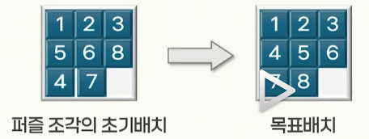
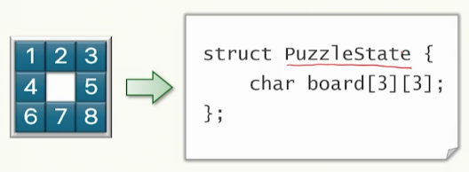
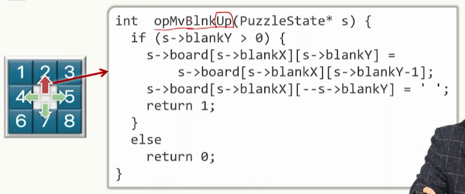
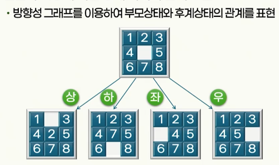
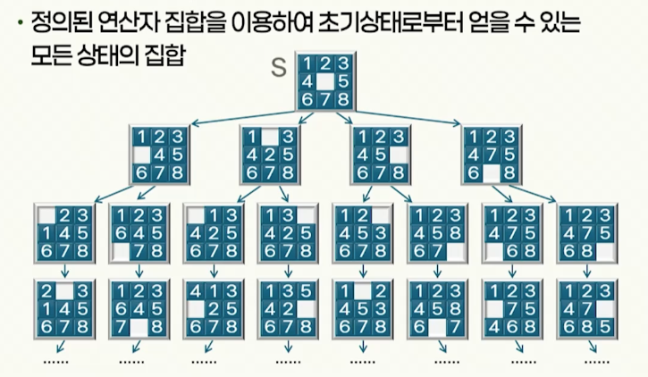
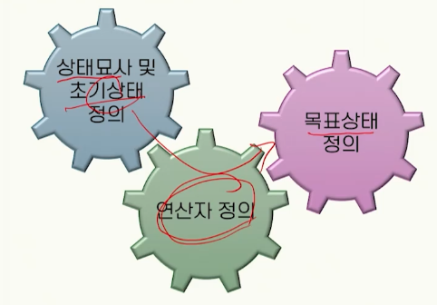
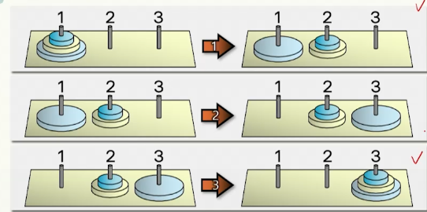
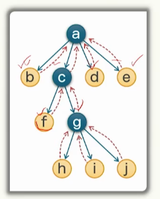

# 2강. 문제풀이(1)

## 1. 문제풀이의 개념

### 문제풀이란 무엇인가?

- 문제풀이

  - 직관적으로 단순하게 해결할 수 없는 문제에 대해 문제를 파악하고 문제의 해에 이르는 방법을 찾아내는 일련의 과정
  - 문제 풀이에 사용될 수 있는 전략
    - 알고리즘
    - 시행착오
    - 경험적 방법

- 8-퍼즐 문제

  

- 8-퍼즐 문제의 풀이
  - 퍼즐 조각의 배치나 조각의 이동 방식 등을 컴퓨터로 표현
  - 여러 가지 방향으로 조각을 이동하는 것을 시도하는 과정에서 시행착오를 거쳐 문제 해결

### 문제의 표현

- 문제의 상태를 컴퓨터로 표현
- 8 퍼즐 문제
  - 상태(state): 퍼즐 판에 나열된 퍼즐 조각 배치 형태
    - 최초에 주어진 문제의 상태: 초기 상태
    - 풀이된 결과에 해당되는 문제의 상태: 목표 상태
  - 적절한 자료구조를 이용하여 컴퓨터를 통해 상태 표현
    - 상태묘사(state description)
  - 상태를 변화시키기 위한 도구의 표현
    - 연산자(operator)

- 상태 묘사

  - 풀이하고자 하는 문제의 상태를 컴퓨터로 처리하기 위한 적절한 자료구조로 표현한 것

  - 문제에 따라 적절한 자료구조를 선택

    - 문제의 상태를 표현하는데 보다 자연스러운 표현 방법
    - 하나의 상태묘사에서 다른 상태묘사로 변화시키는 연산이 용이한 표현
      - 기호 열, 벡터, 다차원 배열, 트리, 리스트 등

  - 예: 8-퍼즐 문제

    - 2차월 배열로 표현
    - 효율적인 처리를 할 수 있는 자료구조 설 

    

- 연산자

  - 역할: 어느 한 상태로부터 변화할 수 있는 다른 상태로 변환함
  - 연산자의 정의
    - 변환 테이블을 정의하는 방법
      - 모든 '입력' 상태 묘사에 대해 각각의 상태로부터 변화할 수 있는 모든 '출력' 상태묘사를 저장하는 목록을 만듦
    - 일반화된 변환 규칙으로 정의하는 방법
      - 하나의 상태묘사를 다른 상태묘사로 변화시키는 일종의 연산 능력을 지닌 함수로 정의
  - 예: 8-퍼즐 문제(빈칸의 상, 하, 좌, 우 이동)
    - 
    - 위로 올릴 수 있는 상황에 대한 예외 확인 먼저 하기

- 연산자 적용에 의한 상태 사이의 관계 표현

  - 방향성 그래프를 이용하여 부모상태와 후계상태(변화 후)의 관계를 표현
  - 예
    - 

- 상태공간(state space)

  - 정의된 연산자 집합을 이용하여 초기 상태로부터 얻을 수 있는 모든 상태의 집합
  - 

- 상태공간에서 문제풀이를 위한 문제의 표현
  - 

### 상태공간 탐색에 의한 문제풀이

- 초기상태에서 시작하여 목표상태에 도달할 수 있는 일련의 연산자를 찾는 것
  - 그래프에서 경로의 탐색 문제
- 시행착오를 거치면서 목표 상태에 도달하는 탐색 과정
- 탐색에 유용한 지식을 사용함으로써 방대한 상태 공간에서 탐색 범위를 좁히려고 함

### 문제 축소에 의한 문제풀이

- 문제 축소(problem reduction)

  - 주어진 문제를 부분문제로 분할하여 풀이하는 방식

- 예. 하노이탑 문제

  

  

## 2. 상태공간 탐색에 의한 문제풀이

### 상태공간 탐색에 의한 문제풀이 개요

- 탐색 과정
  - 정해진 기준에 따라 노드를 선택
  - 선택된 노드(상태)에 적용할 수 있는 모든 연산자를 가하여 모든 후계노드(후계상태)를 생성
    - **노드의 확장**
    - 
  - 후계노드에 부모노드를 가리키는 포인터를 첨부
    - **탐색에 성공한 후 풀이 경로를 알 수 있게 함**
  - 목표노드가 있는지 검사함
  - 원하는 목표를 찾지 못했다면, 정해진 기준에 따라 다음 노드를 선택하여 탐색 과정 반복

## 3. 깊이우선 탐색 및 너비우선 탐색

## 4. 균일비용 탐색