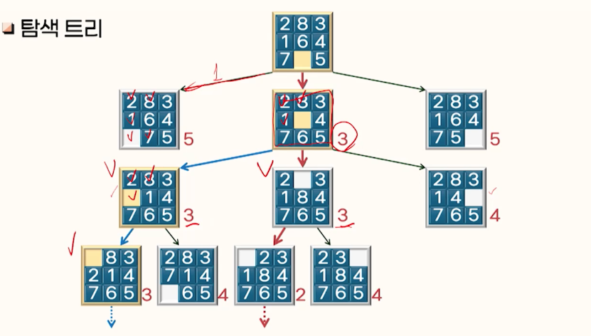
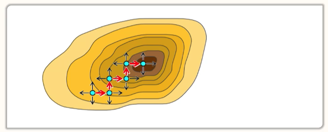

# 3강. 문제풀이(2)

## 1. 경험적 탐색의 개념

### 1. 경험적 탐색(heuristic search)이란?

- 목표 상태를 보다 신속하게 탐색하기 위해 경험적 규칙을 사용하는 탐색 방법
  - **경험적 규칙**(rule of thumb): 항상 옳은 것은 아니지만, 대부분의 경우에 잘 맞는 규칙
- 경험적 규칙을 평가함수에 반영
  - **평가함수**(evaluation  function): 어떤 상태가 목표 상태의 탐색에 바람직한 정도를 평가하기 위한 척도
  - 해를 향해 가는데 필요한 비용, 해로 향하는 경로상에 존재할 가능성 등

## 2. 평가함수의 구성 요소

- 출발노드 S에서 출발하여 노드 n까지 도착하였을 때, 노드 n의 평가함수의 정의에 포함될 수 있는 비용
- g(n): 출발노드 S로부터 현재상태를 나타내는 노드 n까지 도달하는데 소비한 경로비용
- h(n): 노드 n으로부터 목표노드 G까지 도달하는데 필요한 경로비용

​	: 경험적 지식을 이용해 h(n)을 예측한 비용

## 2. 언덕오르기 탐색

### 언덕오르기 탐색 알고리즘

- 탐색 순서
  - 현재 상태를 확장하여 생성된 후계노드들 중에서 다음 확장할 노드를 선택함(깊이우선 탐색과 유사한 순서로 탐색)
    - 선택 기준: 평가함수로 계산한 비용이 최소인 노드를 선택
  - 평가 함수 = 
    - 후계노드 n으로부터 목표노드 G에 도달하는 비용을 예측한 값
    - 후계노드까지 도달하는데 사용된 비용 g(n)은 고려하지 않음

### 탐색 트리

### 계수 최적화 문제

- 등산 문제

- 등산 문제의 풀이

  

  - 상태: 등산가의 좌표 및 고도
  - 연산자: 동, 서, 남, 북 방향으로 정해진 거리만큼 이동
  - 목표상태: 모든 후계상태의 고도가 현재상태보다 낮은 상태
  - 최급상승법(steepest ascent method)

- 최급상승법의 난제

  - 지역최대치 문제
  - 고원문제
  - 능선문제

## 3. 모의 담금질

### 1. 모의담금질의 개념

- 모의 담금질(simulated annealing)이란?
  - 평가함수의 값이 전역최소치(또는 전역최대치)에 해당하는 해를 구하기 위한 확률적 접근방법
  - annealing

## A* 알고리즘

