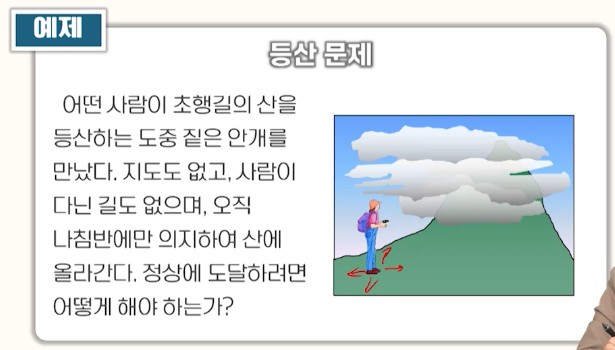

# 3강. 문제풀이(2)

## 1. 경험적 탐색의 개념

### 1. 경험적 탐색(heuristic search)이란?

- 목표 상태를 보다 신속하게 탐색하기 위해 경험적 규칙을 사용하는 탐색 방법
  - **경험적 규칙**(rule of thumb): 항상 옳은 것은 아니지만, 대부분의 경우에 잘 맞는 규칙
- 경험적 규칙을 평가함수에 반영
  - **평가함수**(evaluation  function): 어떤 상태가 목표 상태의 탐색에 바람직한 정도를 평가하기 위한 척도
  - 해를 향해 가는데 필요한 비용, 해로 향하는 경로상에 존재할 가능성 등

## 2. 평가함수의 구성 요소

- 출발노드 S에서 출발하여 노드 n까지 도착하였을 때, 노드 n의 평가함수의 정의에 포함될 수 있는 비용
- g(n): 출발노드 S로부터 현재상태를 나타내는 노드 n까지 도달하는데 소비한 경로비용
- h(n): 노드 n으로부터 목표노드 G까지 도달하는데 필요한 경로비용

​	: 경험적 지식을 이용해 h(n)을 예측한 비용

## 2. 언덕오르기 탐색

### 언덕오르기 탐색 알고리즘

- 탐색 순서
  - 현재 상태를 확장하여 생성된 후계노드들 중에서 다음 확장할 노드를 선택함(깊이우선 탐색과 유사한 순서로 탐색)
    - 선택 기준: 평가함수로 계산한 비용이 최소인 노드를 선택
  - 평가 함수 = 
    - 후계노드 n으로부터 목표노드 G에 도달하는 비용을 예측한 값
    - 후계노드까지 도달하는데 사용된 비용 g(n)은 고려하지 않음

### 탐색 트리

### 계수 최적화 문제

- 등산 문제

- 등산 문제의 풀이

  

  - 상태: 등산가의 좌표 및 고도
  - 연산자: 동, 서, 남, 북 방향으로 정해진 거리만큼 이동
  - 목표상태: 모든 후계상태의 고도가 현재상태보다 낮은 상태
  - 최급상승법(steepest ascent method)

- 최급상승법의 난제

  - 지역최대치 문제
  - 고원문제
  - 능선문제

## 3. 모의 담금질

### 1. 모의담금질의 개념

- 모의 담금질(simulated annealing)이란?

  - 평가함수의 값이 전역최소치(또는 전역최대치)에 해당하는 해를 구하기 위한 확률적 접근방법

    

  - annealing(풀림): 금속이나 유리를 일정한 온도로 가열한 다음에 천천히 식혀서 내부 조직을 고르게 하고 응력을 제거하는 열처리 조작

- 모의담금질 알고리즘

  

  

  

  

## 4. A* 알고리즘

###  A* 알고리즘의 평가함수

- 해에 도달하는 가장 좋은 길 찾기
- **평가함수의 구성 요소**
  
  
  
  - 노드 n까지 도달한 상태에서 출발노드 S에서 노드 n을 거쳐 목표노드 G까›지 도달하는 전체 경로의 비용 계산
  - g(n): 출발 노드 S로부터 현재상태를 나타내는 노드 n까지 도달하는데 소비한 경로비용
  - h(n): 노드 n으로부터 목표노드 G까지 도달하는데 필요한 경로비용
  -  노드 n으로부터 목표노드 G 까지 도달하는데 드는 비용의 예측치
  - 전체 경로비용 f(n)
    - f(n) = g(n) + h(n)
  - 평가함수 : f(n)의 **예측치**
    -  

 

### A* 알고리즘

- 기본 알고리즘

- 중복 생성된 노드()의 처리

  - **동일한 상태( )가 OPEN에 존재하는 경우**

    

    - 아직 어느 노드도 확장되지 않은 상태이므로 평가함수 f^이 큰 노드를 제거하면 됨

  - **동일한 상태(n_old)가 CLOSED에 존재하는 경우**

    -  인 경우, n_new를 제거하면 됨

    

    -  의 경우

      

      - n_new를 제거하되, n_old의 부모노드 포인터가 n_new의 부모노드를 가리키도록 수정
      - n_old및 n_old의 후계노드들의 평가함수 값을 갱신

- 탐색된 경로가 최소비용경로가 되기 위한 조건

  

  - 만일 어느 경우에도 h^을 h보다 큰 값으로 예측하지 않는다면, A* 알고리즘은 최소비용 경로를 탐색하는 것을 보장한다
  - 즉, 항상  이 성립함

### 예제: 8-퍼즐 문제의 풀이

### 예제2: 경로 탐색 문제의 풀이

a, b, c, d, e, f, g 라는 7개의 도시를 연결하는 도로망이 건설되어 있다. 어떤 여행자가 도시 a를 출발하여 도시 g까지 가는 경로를 찾고자 한다. [그림1]은 각 도시를 연결하는 도로와 그 거리르 표현한 그래프이고, [그림2]는 각 도시로부터 목적지인 g까지의 직선거리이다. A* 알고리즘을 이용하여 최단길이 경로를 탐색하라.

- 직선 거리라는 것은 실제 도로보단 실제 거리가 작음
  - 이렇게 계산한 h^은 h 보다 작거나 같다는 것이 명확하므로 -> 최단 거리의 기준 만족됨

### 정리하기

- 경험적 탐색은 목표상태를 보다 효과적으로 탐색하기 위해 경험적 지식을 평가함수에 반영
- 언덕오르기 탐색은 현재 상태를 확장하여 생성된 후계노드 중에서 평가함수로 계산한 비용이 최소인 노드를 다음 확장할 노드로 선택. 이 때 노드의 비용은 그 노드로부터 목표 노드에 도달하는 비용을 예측한 값
- 언덕오르기 탐색과 같은 계수 최적화 방법에선느 지역최대치 문제, 고원 문제, 능선 문제 등으로 인해 최적의 해에 해당되는 목표상태에 도달하지 못할 가능성이 있다. 
- 모의담금질은 시간에 따라 감소하는 확률에 따라 평가함수의 값이 개선되지 않는 후계상태로도 이동할 수 있게 하는 확률적 접근방법
- A* 알고리즘에서 노드의 평가함수는 출발노드로부터 그 노드에 도달하기 위한 비용과 그 노드로부터 목표 노드에 도달하는데 필요한 예측비용의 합으로 정의
- A* 알고리즘에서는 평가함수가 최소인 노드를 선택해 확장. 예측 비용이 항상 실제 비용 이하로 예측되도록 정의된다면, 탐색된 경로는 최소비용 경로이다. 
