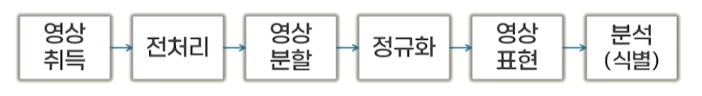
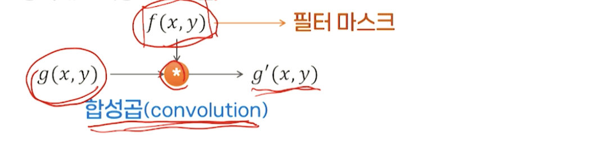
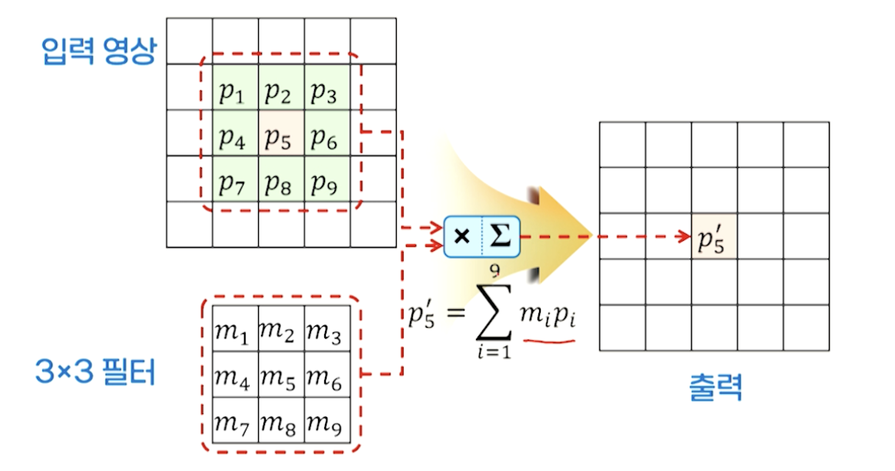
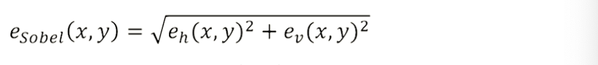
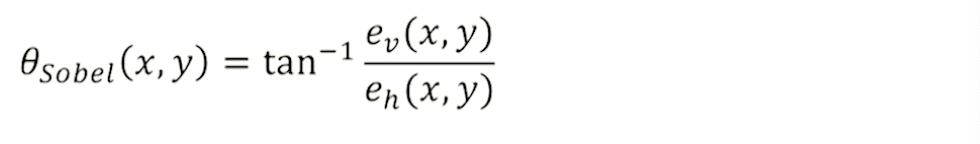

# 8강. 컴퓨터 시각과 패턴인식(1)

## 1. 컴퓨터 시각의 개념

### 컴퓨터 시각

- 컴퓨터 시각이란?
  - 인간의 시각체계에 해당되는 능력을 넣기 위해 연구하는 인공지능의 한 분야

### 컴퓨터 시각 시스템

- 컴퓨터 시각 시스템의 처리 단계

  

  - 영상 취득
    - 다양한 유형의 센서를 이용해 디지털 영상 취득
    - 영상 센서, 적외선 센서, 레인지 센서, X선 단층촬영 등
  - 전처리
    - 취득한 영상을 보다 처리하기 좋은 형태로 가공
    - 훼손이나 잡음 제거, 영상 개선(명암, 대비 개선), 영상의 변환
  - 영상 분할
    - 유사한 성격을 갖는 부분은 하나의 영역, 상이한 특성을 갖는 부분은 다른 영역
  - 정규화
    - 변형을 회복해 기준이 되는 형태로 변환
    - 객체의 크기, 위치, 방향, 밝기, 대비 등
  - 영상 표현
    - 각각의 영역을 적절한 방법으로 컴퓨터 내 묘사(특징)
    - 유용한 속성, 고유한 속성 유지할 수 있는 표현방법이 바람직, 선, 엣지(edge), 모서리(corner), 덩어리(blob) 등
  - 분석(식별)
    - 대상 물체의 인식, 크기 측정, 위치 계산, 결함 검사 등

### 컴퓨터 시각의 활용

- 시각 인식
- 의료 진단을 위한 영상 분석
- 제품 결함 검사
- 보안(객체 검출 및 추적)
- 로봇, 자율주행 
- 입력 장치

## 2. 디지털 영상

### 디지털 영상

- 색 정보의 표현(RGB)
- 사각형 픽셀 구조 및 연결성
  - 4-이웃 연결성
  - 8-이웃 연결성

### 디지털 영상의 입력

- 표본화(sampling)

  - 연속적으로 변환하는 아날로그 신호를 이산신호(discrete)로 변환하는 것

  

  - Nyquist-Shannon 표본화 이론

- 양자화(Quantization)

  - 이산신호의 값에 정해진 정밀도로 분할된 구간의 대푯값을 부여하는 과정

  

## 3. 전처리

### 영상 필터링

- 필터(filter)

  - 입력 신호에서 불필요한 요소를 제거하여 시스템에 필요한 요소만으로 구성된 신호를 출력하는 장치

  

- 필터의 적용 방법

  - 주파수 영역에서 적용하는 방법

    

  - 공간 영역에서 적용하는 방법

    

- 합성곱과 필터 마스크

  

### 공간 영역 필터링의 예 - 가우시안 잡음의 평활화

- 영상의 잡음(잡영)
  - 관측 과정에서 발생하는 불규칙한 영상 신호 성분
  - 가우시안 잡음(Gaussian noise), 점 잡음(salt-and-pepper noise)
- 잡음 제거 필터
  - 저역통과 필터(low-pass filter): 고주파 성분을 억제하여 불규칙하게 변화하는 잡음을 억제
  - 평활화(smoothing): 잡음으로 인한 영상의 급격한 변화를 완화해 영상 품질을 개선하는 처리
- 평활화를 위한 필터
  - 평균 필터(상자 필터, box filter)
  - 가우시안 저역통과 필터(Gaussian LPF)

### 점 잡음의 평활화

- 점 잡음(salt-and-pepper)이란?
  - 흰 점과 검은 점이 무작위로 나타나는 잡음
  - 가우시안 필터로 효과적인 잡음 제거를 할 수 없음
- 중간값 필터(median filter)
  - 각각의 픽셀 위치에서 정해진 크기의 영역 내의 픽셀값들 중 중간값을 선택
  - 점 잡음에 효과적

### 딥러닝을 이용한 영상 잡음 제거

- DnCCN(Denoising Convolutional Neural Network)
  - 잔차 학습(Residual learning) 기반 모델
- SwinIR(Swim Transformer for Image Restoration)
  - 트랜스포머(transformer) 기반 모델

## 4. 영상 분할

### 영상 분할의 개념

- 영상 분할(image-segmentation)이란?
  - 영상을 구성하는 물체의 영역을 구분해 분할하는 것
    - 유사한 속성(영상의 밝기, 색, 텍스처 등)을 갖는 부분으로 분할

### 임계치에 의한 이진화

- 이진화(binarization)
  - 영상의 밝기에 따라 두 영역으로 구분하는 것
  - 배경으로부터 전경 객체를 구분하기 위한 적절한 임계치를 선택함(thresholding)

### 영역분할 방법

- 영상의 공간적 특성을 이용한 방법
  - 어떤 영역이 인접 영역과 유사한 속성을 갖는다면 이들을 하나의 영역으로 결합
  - 영역의 내부가 균일하지 않다면 이를 분할
  - 알고리즘
    - 영역 성장(region growing)
    - 분할과 합병(split and merge)

- 분할과 합병
  - 4분트리(quad tree) 분할을 이용한 알고리즘
  - 분할 및 합병 과정을 반복
  - 분할 및 합병 반복 후 모든 영역을 인접 영역과 균일성 검사를 하고, 균일하다면 이를 하나의 영역으로 합병

### 경계검출 방법

- 에지(edge)

  - 밝기가 다른 두 영역 사이에서 픽셀의 그레이 레벨이 크게 변하는 부분

  

- 소벨(Sobel) 연산자

  - 1차 미분으로 에지를 검출하는 연산자

  - 2개의 마스크로 정의됨

    

  - 에지의 강도

    

  - 에지의 방향

    

- 라플라스(Laplace) 연산자

### 심층 신경망 모델을 이용한 영상 분할

- 객체 검출
  - 영상 안에 포함된 객체의 유형 및 위치를 찾아 내는 처리
  - 대표적 모델: R-CNN, YOLO 등

- 인스턴스 분할

  - 영상 안에 포함된 개별 인스턴스들의 영역을 구분하는 처리
  - 대표적 모델: Mask R-CNN, SegFormer 등

  