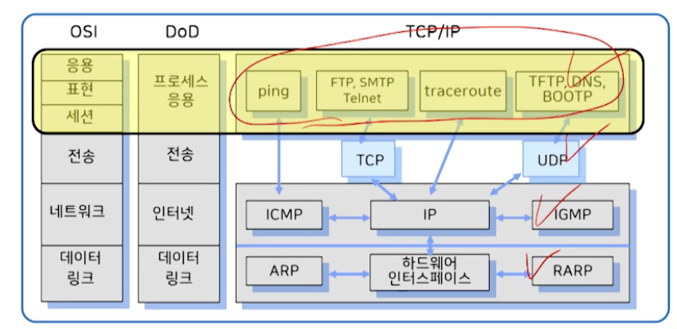
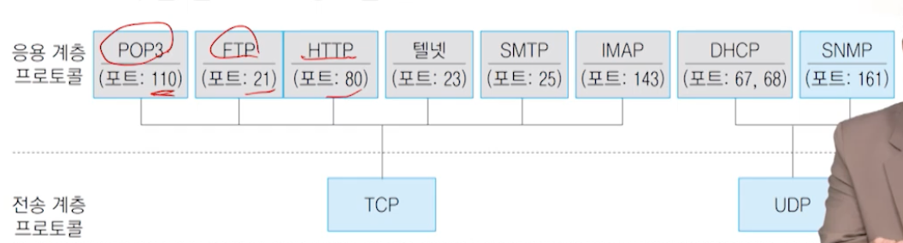
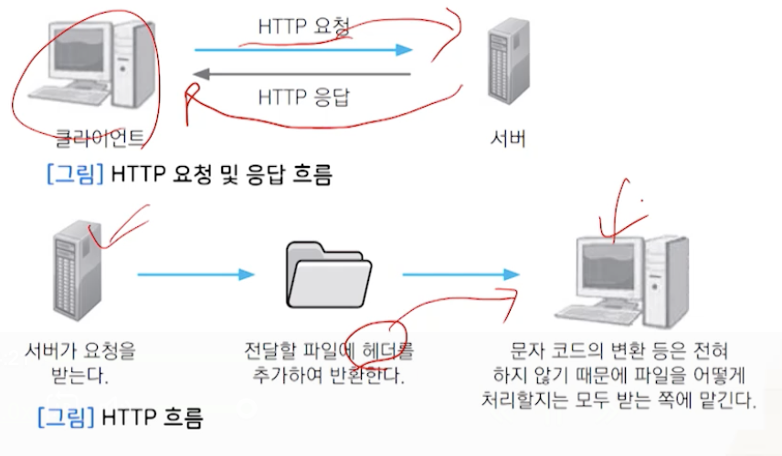

# 10강. TCPIP 응용 계층

## 1. 응용 계층

### 응용 계층 개요

- 웹 사이트에 접속할 때 필요한 프로토콜과 프로그램(서비스)이 있는 계층
- 클라이언트의 요청을 전달하기 위해 서버가 이해할 수 있는 메시지(데이터)로 변환하고, 전송 계층으로 전달
- 클라이언트-서버 계층

### 프로토콜의 종류

- 응용 계층 프로토콜은 TCP, UDP를 통해 유용한 기능 수행
- 일반 사용자들은 TCP/UDP에 직접 접속하지 않고, 응용 계층을 통해 통신 서비스 사용

- TCP 응용 계층 프로토콜
  - HTTP
  - FTP
  - TELNET
  - SMTP
  - POP3
  - IMAP
- UDP
  - DHCP
  - SNMP

#### 응용 계층 프로토콜

- 포트 번호가 있어야 사용 가능
- HTTP의 경우는 너무 잘 알려져있어서, 안 붙여도 됨

## 2. 웹 서비스

### 1. HTTP 프로토콜

- 웹서비스
  - 1989년 팀 버너스리가 www 개발
  - 웹은 TCP/IP에 의해 동작하며, HTTP 프로토콜 사용
  - HTML 문서 전송
- 클라이언트가 사이트 정보를 요청하는 것에 대해 서버가 응답하는 방식
- HTML 파일 등 정보를 얻고 싶은 파일의 URL(Uniform Resource Locator) 요청 정보 전송
- MIME(Multipurpose Internet Mail Extensions) 정보
  - 파일, 사진 등

- 흐름

  

- 특징

  - 무상태, 비연결성
  - 무상태 단점을 보완하기 위해 쿠키, 세션 사용
  - 불특정 다수 대상으로 하는 서비스에 적합

  

### 

- 메시지 형식

  - 요청 메시지

  

  - 응답 메시지

    

### 2. HTTPS 프로토콜

- HTTPS(HyperText Transfer Protocol over Secure Socket Layer)
- 보안 강화
- SSL, TLS 프로토콜을 통해 세션 데이터 암호화
- 기본 포트 443(생략가능)

#### 보안키

- 대칭키
  - 암호화키, 복호화키 같음
  - 클라이언트, 서버 모두 공유키 가짐
- 공개키
  - 공개키, 개인키 함께 사용
  - 암호화 할 때는 공개키, 복호화 할 때는 개인키
- SSL(Secure Socket Layer)
  - 인증서 필요
  - 서비스의 정보 및 서버측의 공개키가 포함
- CA(Certificate Authority)
  - 인증서 발급 기업
  - 브라우저가 CA 리스트 가짐 - 존재 확인하고 CA 공개키 이용해 인증서 복호화 해서 전달

#### 동작 방식

- 대칭키와 공개키 모두 사용
  - 데이터 전송을 위해 대칭키 사용
  - 대칭키를 안전하게 전달하기 위해 공개키 사용

## 3. 파일 전송 서비스(FTP)

- FTP(File Transfer Protocol)
- TCP/IP를 통해 파일을 전송하기 위한 프로토콜
- MIME(HTTP), 클라우드, 웹하드 서비스로 인해 점점 줄어듦 

#### 동작 과정

- 21번, 20번 포트 사용

#### 능동 모드(active mode)

- 21번 포트로 접속한 후 사용할 두 번 째 포트를 서버에 알려줌
  - 서버는 ACK(응답 문자)로 응답
  - 서버는 클라이언트가 알려 준 두번째 포트로 접속
  - 클라이언트에서는 ACK로 응답
- 서버가 클라이언트에 접속 시도
  - 클라이언트의 방화벽 및 외부 환경 요인에 따라 FTP에 접속 불가능 혹은 에러 발생

#### 수동 모드(passive mode)

- 1024~65535 사이의 랜덤 비특권 포트 사용

  

  

#### SFTP(SSH File Transfer Protocol) 프로토콜

- SSH(Secure Shell) 파일 전송 프로토콜
- 신뢰할 수 있는 데이터 흐름을 통해 파일 접근, 전송, 관리 제공
- SFTP는 하나의 연결만 필요(연결이 안정적)
- SSH키의 유효성 검사 및 관리 복잡
- 소프트웨어간 호환성 문제 발생

## 4. 원격 접속 서비스

- 클라에서 사용권한을 가진 서버 시스템에 접속해 작업을 수행하는 서비스
- 예: TELNET, SSH

### 1. TELNET 프로토콜

- 텔넷은 원격지의 컴퓨터를 이용하는 가상 단말 기능을 실현하기 위한 프로토콜
- 클라이언트 일부 기능이 추가된 소프트웨어로도 사용
- 모든 플랫폼에 사용
- 포트 23번
- 사용자 아이디/패스워드 필요

### 동작 방식

#### NVT 동작 방식

- NVT(Netwrork Virtual Terminal)
- 터미널 에뮬레이션 프로토콜
- 터미널과 호스트와의 일대일 대칭적 관계
- 클라와 서버 시스템 버전이 다르더라도 원할히 통신

#### TELNET 동작 방식

### 3. SSH 프로토콜

- 기존 유닉스 시스템 셸은 보안에 취약
- SSH(Secured SHell)
- 셸에 암호화 추가된 버전
- 강력한 인증 방법과 안전하지 못한 네트워크에서 안전하게 통신할 수 있는 기능 제공
- rsh, rcp rlogin, rexec, telnet, ftp 등의 서비스를 안전하게 사용하도록 제공

## 5. 메일 서비스

### 1. 메일 서비스 개요

- TCP/IP 이전에 이메일 주고 받을 수 있도록
- 대형컴퓨터(메인프레임)에서 사용
- 사용자마다 편지함이 있고, 이동을 통해 전달
- 같은 메인프레임에서만 사용 가능

### 2. 메일 관련 프로토콜

- 이메일을 전달하고, 읽을 수 있게 하는 프로토콜

#### (1) SMTP(송신)

#### (2) POP3(전송 받을 때)

#### (3) IMAP(전송 받을 때)

- POP3의 비동기성을 보완한 방식