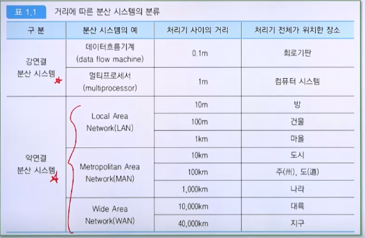
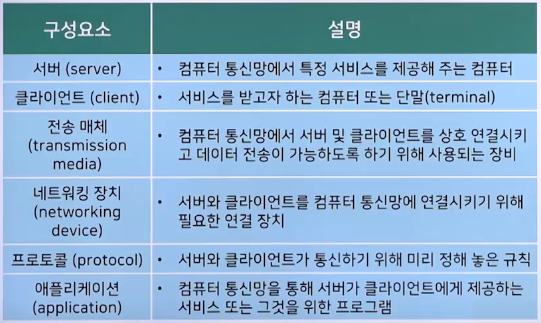
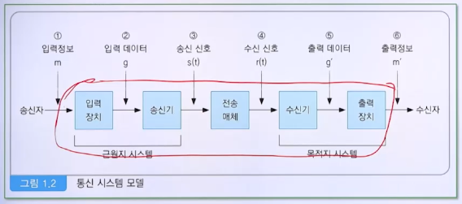
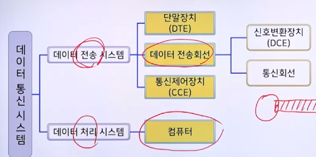
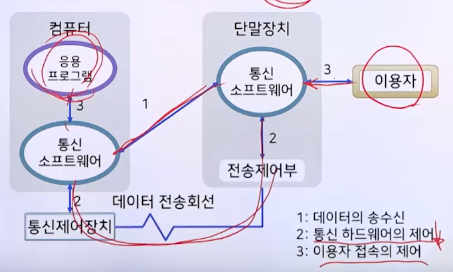
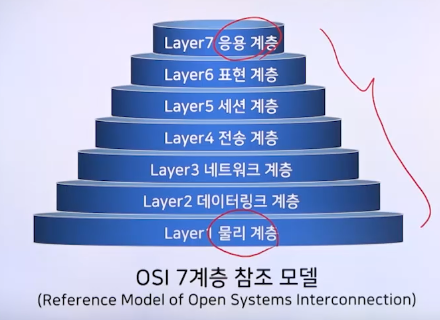

# 1강. 컴퓨터통신망의 소개

> **학습목표**
>
> - 컴퓨터 통신망에 대해 설명할 수 있다
>   - What, Why, How, History
> - 데이터 통신 시스템의 **구성 요소**를 설명할 수 있다
> - 데이터 통신에 필요한 **프로토콜 종류**를 나열할 수 있다

## 1. 컴퓨터 통신망 개관

### 1. 컴퓨터와 통신

- EDPS(Electronic Data Processing System)

### 2. 통신 기술과 데이터 처리 기술

- 컴퓨터와 컴퓨터 사이에 있는 데이터 통신

### 3. 분산시스템

- Distributed Systems
  - 컴퓨터 자원을 **공유**하고, 그들의 **확장과 축소**를 용이하도록 하며 **오류에 대한 신뢰도**를 높일 수 있도록 **컴퓨터 자원을 분산**시켜 작업을 처리하는 시스템

- 분산의 정도
  - 강연결(strongly coupled) 분산시스템
  - 약연결 (Loosely coupled) 분산시스템 ✅ 이것만 다룰 것
    - 대규모 컴퓨터 통신망 WAN
    - 중규모 컴퓨터 통신망 MAN
    - 소규모 컴퓨터 통신망 LAN

### 4. 컴퓨터통신망의 정의

- 통신(communication)
  - 광의: 서로 떨어진 지점, 사람 또는 장치들 사이에 다양한 매개체를 이용해 정보를 전달하는 과정
  - 협의: 원격통신(telecommunication)
    - 전자거 정보의 전송
- 데이터 통신(data communication)
  - 기계에 의해 처리되는 정보의 전송
  - CCITT: Consultative Committee on Telegraphy and Telephony
  - 컴퓨터 시스템에 의한 데이터 처리 기술과 통신 시스템에 의한 데이터 전송 기술이 결합된 것
- 데이터 통신망(data communication network)
  - 데이터 통신 기술과 망 기술이 융합된 개념
  - 컴퓨터 통신망(computer communication network)
  - 정보통신망(information and communication network)
  - 약연결 분산시스템

### 5. 컴퓨터통신망의 구성요소

### 6. 컴퓨터통신망의 역사

- 통신의 역사
  - 봉화, 서신 교환 등
  - 전기적 방식의 통신(전보, 전화기 등)

- 데이터 통신의 역사

  

  - 원격 계산기에 데이터 통신(G. Stibitz, 1940년)
  - SAGE 시스템(1958년)
    - Semi-Automatic Ground Environment
    - 컴퓨터와 통신을 결합시킨 최초의 컴퓨터 통신 시스템
  - SABRE
    - Semi-Automatic Business Research Environment
    - American Airline 사의 여객기 좌석 예약 업무 처리
  - ARPA Network ✅⭐️
    - Advanced Research Project Agency
    - TCP/IP 개발(인터넷의 전신)
    - 패킷 교환 네트워크
  - ALOHA(1968년)
    - Additive Links Online Hawaii Area
    - 하와이 대학, 실험적 무선 패킷 교환 네트워크
  - TELNET(1974년)
    - 최초의 대중화된 상용 패킷 교환 네트워크

### 7. 컴퓨터 통신망의 목적

- 자원의 공유
- 신뢰도 향상
- 처리기능 분산
- 안전성 보장
- 호환성 확대

## 2. 데이터 통신 시스템

### 1. 통신 시스템 모델

### 2. 통신 시스템 구성

- 단말 장치
  - DTE(Data Terminal Equipment)
- 데이터 전송회선
  - 신호변환장치(Data Communication Equipment)
    - Modem, DSU(Digital Service Unit)
  - 통신회선
- 통신제어장치
  - CCE(Communication Control Equipment), CCP
- 컴퓨터

### 3. 통신 시스템 기능

1. 전송 시스템 활용
2. 접속
3. 동기화
4. 교환관리
5. 오류검출 및 정정
6. 흐름제어
7. 주소 지정
8. 라우팅
9. 복구
10. 메시지 형식화
11. 보호
12. 시스템관리

## 3. 통신 소프트웨어

### 1. 통신 소프트웨어의 기능

- 데이터 전송회선과 통신제어장치를 이용하여 컴퓨터와 단말ㅈ아치 사이에서 정보를 송수신하기 위한 프로그램

### 2. 통신소프트웨어의 조건

- 고려사항: 통신 시스템의 특징
  - 수시 입력
  - 데이터의 다양성
    - 동시에 다수의 이용자의 업무 처리
    - transaction / time sharing / batch processing
  - 신속한 응답
  - 비동기 처리

## 4. 통신 프로토콜

### 1. 통신 프로토콜의 필요성

- 도입 - 통신에 관련한 약속들
  - 외국 사람과의 대화
  - 전화 통화
  - 우편 시스템

### 2. 통신 프로토콜의 정의

- 통신 프로토콜(communication protocol)
  - 통신을 원하는 두 개체 간에 무엇을, 어떻게, 언제 통신할 것인지를 서로 정한 규약
- 통신 프로토콜의 주요 요소
  - 구문(syntax)
    - 데이터 형식이나 신호 수준 등을 포함
    - (어떻게 보낼 것인지)
  - 의미(semantic)
    - 전송의 조정, 오류 관리를 위한 제어정보를 포함
  - 타이밍(timing)
    - 전송속도 조절 및 전송순서 조정 등을 포함

### 3. 컴퓨터 통신망의 구조

- Computer Network Architecture

  - 모든 통신 기능을 담고 있는 하나의 프로토콜을 사용하는 대신 통신 기능을 구현하는 프로토콜의 구조적 집합
    - IBM, SNA(System Network Architecture)
    - DEC, DNA(Digital Network Architecture)
    - OSI(Open Systems Interconnection)
      - 7-layered reference model
      - 교재 제7장 (컴퓨터 통신망 구조)

- OSI 7계층 참조 모델

  

### 4. 통신 프로토콜의 종류

- OSI 모델을 바탕으로 구현된 다양한 통신 프로토콜
  - TCP(Transmission Control Protocol)
  - IP(Internet Protocol)
  - SMTP(Simple Mail Transfer Protocol)
  - POP3(Post Office Protocol version3)
  - HTTP(Hyper-Text Transfer Protocol)
  - UDP(User Datagram Protocol)
  - ICMP(Internet Control Message Protocol)
