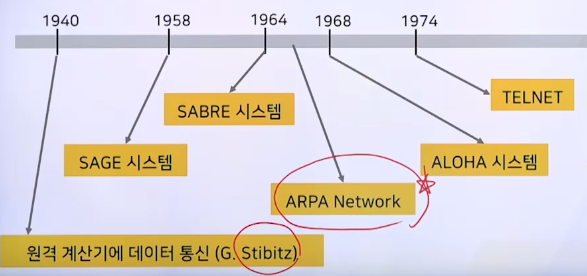

# 1강. 컴퓨터통신망의 소개

> **학습목표**
>
> - 컴퓨터 통신망에 대해 설명할 수 있다
>   - What, Why, How, History
> - 데이터 통신 시스템의 **구성 요소**를 설명할 수 있다
> - 데이터 통신에 필요한 **프로토콜 종류**를 나열할 수 있다

## 1. 컴퓨터 통신망 개관

### 1. 컴퓨터와 통신

- EDPS(Electronic Data Processing System)

### 2. 통신 기술과 데이터 처리 기술

- 컴퓨터와 컴퓨터 사이에 있는 데이터 통신

### 3. 분산시스템

- Distributed Systems
  - 컴퓨터 자원을 **공유**하고, 그들의 **확장과 축소**를 용이하도록 하며 **오류에 대한 신뢰도**를 높일 수 있도록 **컴퓨터 자원을 분산**시켜 작업을 처리하는 시스템

- 분산의 정도
  - 강연결(strongly coupled) 분산시스템
  - 약연결 (Loosely coupled) 분산시스템 ✅ 이것만 다룰 것
    - 대규모 컴퓨터 통신망 WAN
    - 중규모 컴퓨터 통신망 MAN
    - 소규모 컴퓨터 통신망 LAN

### 4. 컴퓨터통신망의 정의

- 통신(communication)
  - 광의: 서로 떨어진 지점, 사람 또는 장치들 사이에 다양한 매개체를 이용해 정보를 전달하는 과정
  - 협의: 원격통신(telecommunication)
    - 전자거 정보의 전송
- 데이터 통신(data communication)
  - 기계에 의해 처리되는 정보의 전송
  - CCITT: Consultative Committee on Telegraphy and Telephony
  - 컴퓨터 시스템에 의한 데이터 처리 기술과 통신 시스템에 의한 데이터 전송 기술이 결합된 것
- 데이터 통신망(data communication network)
  - 데이터 통신 기술과 망 기술이 융합된 개념
  - 컴퓨터 통신망(computer communication network)
  - 정보통신망(information and communication network)
  - 약연결 분산시스템

### 5. 컴퓨터통신망의 구성요소

### 6. 컴퓨터통신망의 역사

- 통신의 역사
  - 봉화, 서신 교환 등
  - 전기적 방식의 통신(전보, 전화기 등)

- 데이터 통신의 역사

  

  - 원격 계산기에 데이터 통신(G. Stibitz, 1940년)
  - SAGE 시스템(1958년)
    - Semi-Automatic Ground Environment
    - 컴퓨터와 통신을 결합시킨 최초의 컴퓨터 통신 시스템
  - SABRE
    - Semi-Automatic Business Research Environment
    - American Airline 사의 여객기 좌석 예약 업무 처리
  - ARPA Network ✅⭐️
    - Advanced Research Project Agency
    - TCP/IP 개발(인터넷의 전신)
    - 패킷 교환 네트워크
  - ALOHA(1968년)
    - Additive Links Online Hawaii Area
    - 하와이 대학, 실험적 무선 패킷 교환 네트워크
  - TELNET(1974년)
    - 최초의 대중화된 상용 패킷 교환 네트워크

### 7. 컴퓨터 통신망의 목적

- 자원의 공유
- 신뢰도 향상
- 처리기능 분산
- 안전성 보장
- 호환성 확대

## 2. 데이터 통신 시스템

### 1. 통신 시스템 모델

### 2. 통신 시스템 구성

- 단말 장치
  - DTE(Data Terminal Equipment)
- 데이터 전송회선
  - 신호변환장치(Data Communication Equipment)
    - Modem, DSU(Digital Service Unit)
  - 통신회선
- 통신제어장치
- 컴퓨터

#### 통신 시스템 기능

## 3. 통신 소프트웨어

## 4. 통신 프로토콜

