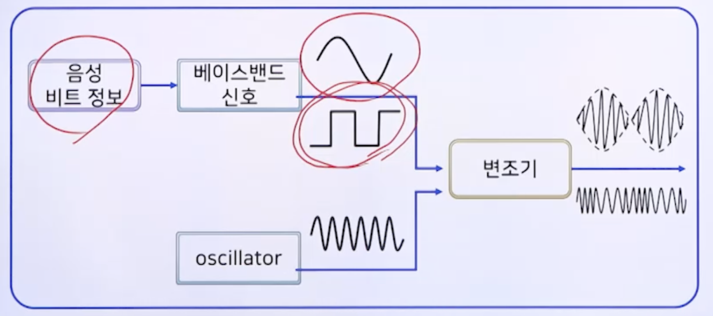

# 2강. 데이터 통신의 기초

## 1. 데이터 통신의 개요

### 통신의 예

### 통신의 공통점 및 3대 요소

- 통신의 공통점

  - 한 점으로부터 다른 저믕로 어떤 정보(data 또는 message)의 전달

- 통신의 3대 요소

  

  - 정보원(데이터 소스)
  - 전송매체
  - 수신체(receiver)

### 통신 성능의 요인

- 통신 성능의 요인
  - 메시지가 서로 이해되어야 함
    - Coding
  - 통신상의 간섭 현상이 있을 수 있음
    - noise

## 2. 변조 및 복조

### 변조 및 복조 정의

- 변조(modulation)
  - 전송 신호(baseband signal)를 높은 주파수 대역의 반송파 신호(carrier signal)에 싣는 과정
    - 고주파는 멀리까지 감 - 여기에다가 실어 보내는 것
    - 반송파(==운송파)
- 변조의 종류
  - 아날로그 변조
  - 디지털 변조
- 변조 방식
  - 진폭 변조(Amplitude Modulation, AM)
  - 주파수 변조(Frequency Modulation, FM)
  - 위상 변조(Phase Modulation, PM)

### 변조 및 복조 과정

- 변조(modulation) 과정의 예

  

- 위의 곡선을 변조하는 것이 아날로그 변조

- 아래 직선을 변조하는 것이 디지털 변조

### 아날로그 변조

- 아날로그 변조의 종류
  - 진폭 변조
  - 주파수 변조
  - 위상 변조

#### (1) 진폭 변조(AM)

- 베이스밴드 신호의 순간 진폭에 비례하여 반송파 신호의 순간 진폭을 변화시키는 방법

  - Carrier(반송파 신호)
  - Modulating Signal(베이스밴드 신호)
  - Modulated SIgnal(변조된 신호)

  

#### (2) 주파수 변조(FM)

- 반송파 신호의 진폭은 일정하게 한 채로, 베이스밴드 신호를 주파수 변화로 변화시키는 방법

  - 베이스밴드가 양수일 때는 빠른 주파수로 변조(빼곡하게)
  - 베이스밴드가 음수일 때는 느린 주파수로 변조(널널하게)

  

#### (4) 위상 변조(PM)

- 반송파 신호의 진폭은 일정하게 한 채로 베이스밴드 신호를 주파수 위상각의 변화로 변환시키는 방법

  - 위상각 변화

  - 0 ↔️ 1이 되는 border에서 위상각을 변경시킴

    

  

### 디지털 변조

#### (1) 진폭편이 변조(Amplitude Shift Keying, ASK)

- On-Off Keying(OOK) 라고도 불림

  - 1(On), 0(Off)

  

#### (2) 주파수편이 변조(Frequency Shift Keying, FSK)

- 0일때는 낮게(100hz), 1일때는 높게(200hz)

#### (3) 위상편이 변조(Phase Shift Keying, PSK)

- 정현파, 사인파 == 반송파의 파를 의미
- 다른 두 가지 파 보다 전송 효율이 더 높음

#### 정리

### 정보의 디지털화

- 펄스(Pulse)

  - 매우 짧은 시간 동안 진행되는 네모꼴의 전자기 파형

  - 펄스의 3대 요소

    - 진폭, 폭, 위치

    

#### (1) 펄스 코드 변조(Pulse Code Modulation)

- 아날로그 신호를 디지털 신호로 바꾸는 과정
  - **표본화(sampling) 과정**
  - **양자화(quantization) 과정**
  - **부호화(encoding) 과정**
- Nyquist's sampling theorem
  - 신호는 그 신호에 포함된 가장 높은 주파수의 2배에 해당하는 빈도로 샘플링하면 원래의 신호로 복원할 수 있음
  - 가청 주파수: 20~20kHz(2만 헤르츠) → Audio CD sampling rate: 44.1kHz

- 펄스 코드 변조 이미지

  

## 3. 전송 코드

### 코드의 개념

- 코드(Code)
  - 암호, 부호
  - 코드(프로그램 코드)
  - 규칙, 관례
  - 법규, 규정
    - A moral code, the dress code, the Morse code, the code of Hammurabi...

### 1. Baudot 코드(5비트)

- Murray code
- CCITT Alphabet No.2(국제 표준기구)
- International Alphabet No.2
- Telex code
- 5 bit → 32개 문자 표현
  - 2^5 라서

### 2. ASCII 코드(7비트 + 1 패리티비트)

- American Standard Code for Information Interchange
- CCITT Alphabet No.5
- International Alphabet No.5
- ISO Seven-Bit Coded Character Set
  - for Information Processing Interchange
- 7비트 → 128개 문자 표현
  - Parity Bit, 즉 8비트긴 함
  - 정보 표현하는 비트는 7개

#### (1) ASCII - SYN code

- Synchronize

  

#### (2) ASCII - Parity bit

- 전송 오류 제어를 위한 비트

- 홀수 패리티, 짝수 패리티

- 패리티 검사

  

   

### 3. BCD 코드(4비트)

- Binary Coded Decimal
- 컴퓨터 내부 코드
- 10진 숫자의 표현
  - 예: 5 → 0101
  - 9 → 1001
  - 159 → 0001 0101 1001

### 4. EBCD 코드(8비트)

- Extended BCD Interchange Code
- 8 bit → 256개 문자 표현
- IBM 컴퓨터 내부 데이터 전송용

### 5. 유니코드(Unicode)(16비트)

- 데이터, 프로그램, 시스템의 호환성과 확장성
- ISO/IEC Universal Multi-Octet Coded Character Set
- 2바이트(**16bit**)계 만국 공통 국제 문자 코드 
  - 현재 4바이트계
- 26개 언어의 문자 및 특수 기호
  - 현재 159개 언어(2022.09)
- IBM, Microsoft, Lotus, Sun Microsystems

## 4. 데이터 전송 방식

### 전송 방향

- 단방향 전송
  - simplex transmission
  - 정보의 전달 방향이 한 방향인 데이터 전송 방식
  - 예
    - 라디오, 텔레비전
    - 키보드, 모니터

- 반이중 전송
  - Half- duplex transmission
  - 정보의 전달 방향이 교대로 이루어지는 데이터 전송 방식
  - 특징
    - 각 방향별로 통신 채널이 필요하므로 2개의 통신 채널을 사용
    - 정보흐름의 방향을 바꾸기 위해서 일정량의 시간이 필요
  - 예
    - 무전기
- 전이중 전송
  - Full-duplex transmission
  -  동시에 양방향 모두 전송이 가능한 데이터 전송 방식
  - 예
    - 전화기
    - 채팅

### 전송 모드

- 병렬 전송(parallel transmission)

  

  - 부호화된 코드의 모든 비트가 동시에 전송
  - 근거리 데이터 전송

- 직렬 전송(serial transmission)

  

  - 원거리 데이터 전송

### 전송 동기

- 직렬 전송의 경우, 수신되는 비트들을 문자 단위로 구분할 수 있어야 함

- 동기
  - 비트 동기(bit synchronization)
  - 문자 동기(character synchronization)

#### (1) 비트 동기

- 송수신측에 동일한 클록 사용

  

- 비트 검출 위치는 각 비트의 중앙

  

#### (2) 문자 동기

- 비트 동기로 정확한 비트들을 검출한 다음, 비트들을 그룹지어 원하는 문자를 구성하는 방법
- 문자의 비트 수와 전송 속도를 알면 정확하게 비트들을 세어서 각 문자를 구성함
- 어떤 비트가 문자의 첫 번째인지 결정하는 문제
- 문자 동기를 위한 두 가지 전송 방법
  - 동기식 전송(synchronous transmission)
  - 비동기식 전송(asynchronous transmission)

- **동기식 전송**

  - 데이터 블록을 한꺼번에 전송

    

  - 예

    - ASCII 문자 전송

    - 전송제어 문자: SYN(1/06: 0 0010110) 사용  

      

    - 오동기 생길 수 있음 이유

      

    - 따라서 오동기를 막기 위해서 SYN을 여러 개 보냄

- 비동기식 전송

  

  - start/stop transmission
  - 한 문자식 전송하며, 문자 사이에는 특별한 시간적 제약이 없음
  - 문자의 첫 번째 비트 검출
    - 시작 펄스(start pulse) 이용
  - 문자의 끝
    - 정지 펄스(stop pulse) 이용

## 5. 전송 효율

### 전송 효율

- 정보 비트 수 / 총 전송 비트 수 * 100

### 동기식 전송의 전송 효율

- 동기식 전송

  - 1000개의 ASCII 문자 블록의 전송 효율

  - 블록 앞에 SYN 3개 사용

  - 총 전송 비트 수

    `= (1000+3) 문자 * 8비트 / 문자 = 8024비트`

  - 정보 비트 수 

    `= 1000 문자 * 8비트 / 문자 = 8000비트`

  - 전송 효율

    `8000/8024 * 100 = 99.70%`

- 비동기식 전송

  - 1000개의 ASCII 문자 블록의 전송 효율

    - 각 글자마다 오버헤드 비트 2개 사용 (시작 펄스 1개, 정지 펄스 1개)

    - 총 전송 비트 수

      `= 1000 문자 * 10비트 / 문자 = 10000비트`

    - 정보 비트 수

      `= 1000 문자 * 8비트 / 문자 = 8000비트`

    - 전송 효율

      `= 8000 / 10000 * 100 = 80.0%`