# 3강. 데이터 통신의 요소

## 1. 통신선로

### 1. 점대점 선로

- 통신 네트워크의 기본 요소로 점대점으로 두 단말기를 연결하는 통신선로(point-to-point line; 전용선)
- 점대점 선로의 확장
  - 성형(start) 네트워크 

### 2. 멀티드롭 선로

#### (1) 멀티드롭 선로

- Multidrop [multipoint] line
- 한 라인에 여러 단말기가 연결되어 라인을 공유하는 것
- 점대점 선로는 상대적 통신비용이 비쌈
- 복수개의 단말기가 연결된 하나의 선로

#### (2) 선로 통신용량의 공유

- 전용선보다 통신선로의 **효율성 높음**
- 데이터 충돌(data collision) 가능 => **선로제어 프로토콜** 필요
  - 참고: 전용선: 연속적 데이터 전송에 적합

#### (3) 멀티드롭 선로 연결 단말기

- 단말기 수의 제한 요인
  - 하드웨어와 소프트웨어의 처리 능력
  - 단말기에서 발생하는 트래픽(traffic)
  - 선로의 통신 속도(대역폭) 
    - 대역폭이 넓을 수록 데이터가 많이 보낼 수 있고, 통신 속도가 높다
  - 통신사업자에 의한 강제적 제약(통신선로에 과부하게 발생하지 않도록)

### 집선 선로

#### (1) 집선(line concentration)

- 다수 회선으로부터의 호출을 집약하여 그보다 적은 수의 중계선으로 전송하는 것(예: 전화 교환망)
  - 라인은 한정되어 있지만, 해당 라인 수 보다 많은 사람들이 씀

#### (2) 집선 선로

- 중심 부분에 집선장치(line concentrator)를 설치한 후 여기에 단말기를 여러 대. ㅕㄴ결함
- 출력 채널 수 < 입력 채널 수

- 그림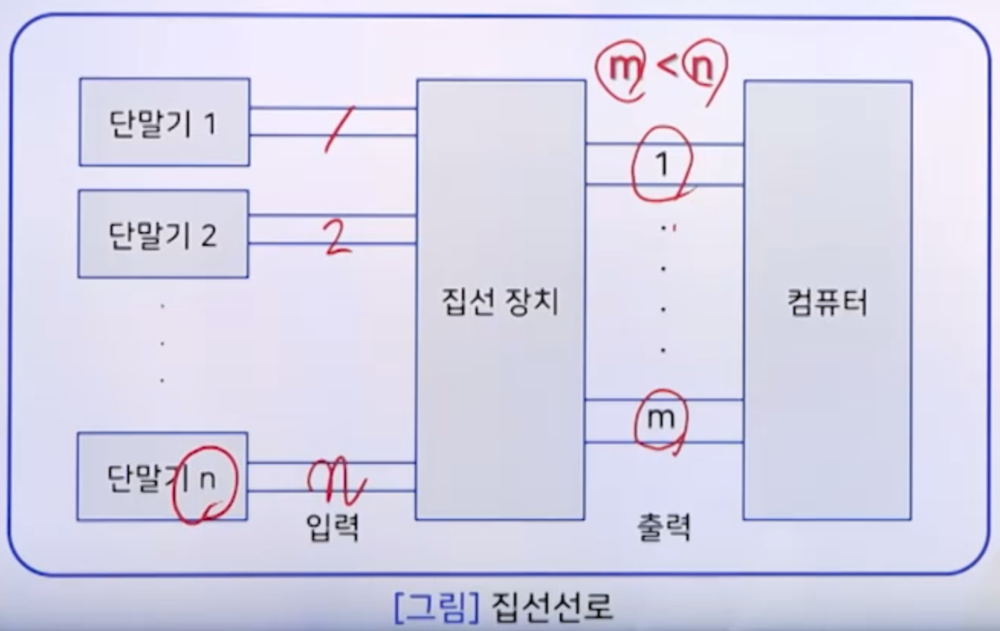

## 2. 전송매체

### 1. 전송 매체

- 정의
  - 컴퓨터 통신망에서 송신기와 수신기 간에 **물리적인 데이터 전송로**의 역할
- 종류
  - 하드와이어 매체(유선매체)(hardwired medium)
    - 꼬임선 케이블, 동축 케이블, 광섬유 케이블
  - 소프트와이어 매체(무선매체)(softwired medium)
    - 공기, 해수, 진공
    - 지상마이크로파, 위성 마이크로파, 라디오파, 적외선

### 2. 꼬임선 케이블

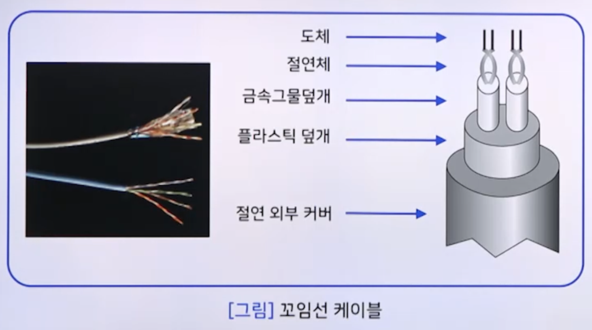

- 형태

  - 두 가닥의 절연된 구리선이 쌍으로 균일하게 꼬여 있음
    - 간섭 현상을 감소시킴
    - 한 선은 정보 전송, 다른 선은 접지로 사용됨
    - 전선의 굵기는 0.0150.056인치 정도
  - 하나의 쌍이 하나의 통신선로의 역할을 함
  - 여러 개의 쌍이 다발로 묶어져 하나의 케이블을 형성함

- 종류

  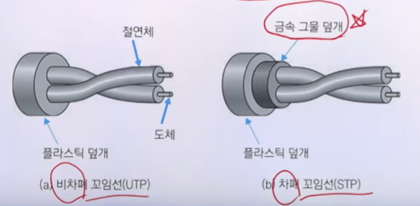

  - 비차폐 꼬임선(Unshielded Twisted Pair, UTP)
  - 차폐 꼬임선(Shielded Twisted Pair, STP)

### 3. 동축 케이블(coaxial cable)

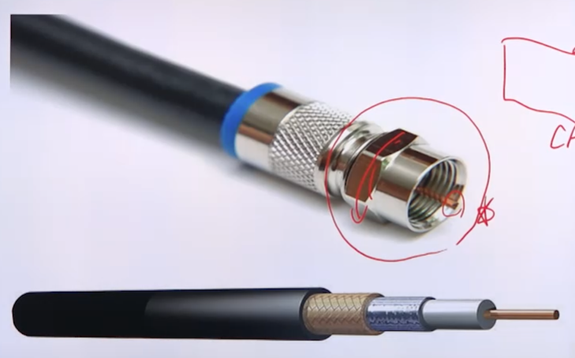

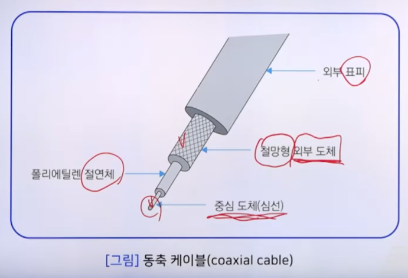

- 형태

  - 중심 도체(심선)와 외부 원형 도체가 서로 절연된 상태로 동일한 축을 형성
  - 중심 도체의 굵기는 0.4~1인치 정도

- 용도

  - 다양(장거리 전화망, Cable TV 전송, LAN 등)

- 리피터(repeater)

  - 아날로그 전송(수 km), 디지털 전송(1km)

- 종류

  - 기저대역 동축 테이블(저항값 50Ω)
  - 광대역 동축 케이블(저항값 70Ω)

  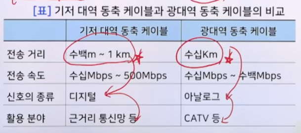

### 4. 광섬유(optical fiber)

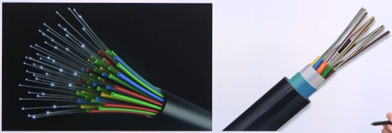

- 종류

  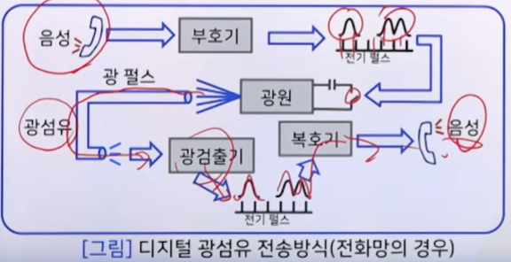

  - 복호화 단계(정보 → 광)
  - 광 전송 단계
  - 복호화 단계(광 → 정보)

- optical fiber

  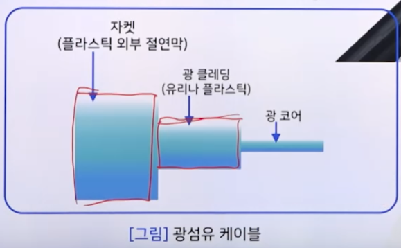

  - optical core, optical cladding

- 전송 모드

  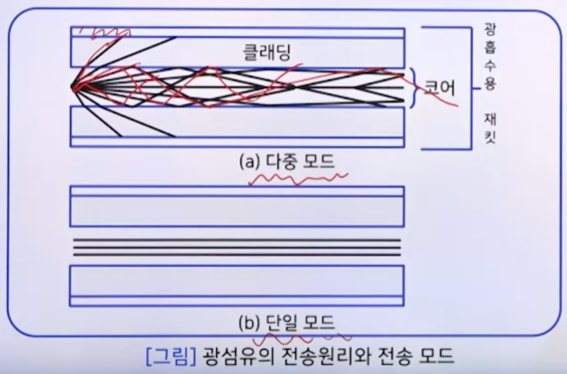

  | 다중 모드                           | 단일 모드                              |
  | ----------------------------------- | -------------------------------------- |
  | 코아의 지름이 커 빛을 잘 모음       | 코아의 지름이 작아 빛을 잘 모으지 못함 |
  | 빛의 산란이 심함                    | 빛의 산란이 적음                       |
  | 가격이 싸고, 저속 전송에 용이       | 가격이 비싸고, 고속 전송에 용이        |
  | 단거리 전송에 적합                  | 장거리 전송에 적합                     |
  | 광섬유끼리의 접속이 상대적으로 쉬움 | 광섬유끼리의 접속이 상대적으로 어려움  |

- 장점

  - 넓은 대역폭
    - 꼬임선 케이블 (1km 거리에서 수 Mbps)
    - 동축 케이블 (1km 거리에서 수백 Mbps)
    - 광섬유 케이블 (수십km 거리에서 2Gbps)
  - 작은 크기와 적은 무게
  - 적은 감쇠율
  - 전자기적 영향의 최소화
  - 리피터 설치 간격의 확대
    - 50km 까지는 리피터 불필요

- 단점

  - 접속의 전문성 요구
  - 단방향 전송
    - 양방향을 위해서는 2개의 광섬유가 필요
  - 가격이 비싸 설치 비용의 증대

### 5. 무선 통신 매체

#### 무선 통신 매체

- 공기, 진공, 해수 등

- 무선 통신의 무선 주파수
  - 반송파(carrier) 신호로 사용되는 전자파의 주파수
- 무선 통신의 종류
  - 지상 마이크로파 통신
  - 위성 마이크로파 통신
  - 라디오파 통신
  - 적외선 통신

#### (1) 지상 마이크로파

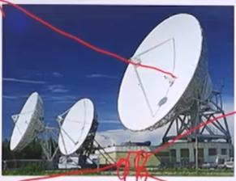

- 접시형 안테나(고지대에 위치)
- 주요 용도: 장거리 통신
- 주파수: 2 ~ 40 GHz
- 정보 손실 요인
  - 감쇠 현상: 거리의 제곱에 비례
  - 간섭 현상: 주파수 영역의 할당이 중요

#### (2) 위성 마이크로파

- 통신 위성: 중계국
  - 정지 위성, 임의 위성, 위상위성 등
- 주요 용도: 장거리 전화, 위성 TV
- 최상 주파수:  1 ~ 10 GHz
  - 1 GHz 이하 → 심각한 잡음 발생
  - 10 GHz 이상 → 심각한 감쇠 현상
- 장점
  - 대량의 통신 용량 제공(Bandwidth가 크다)
    - 주파수 다중화 방식으로 많은 대역폭 구성
  - 오류율의 감소
    - `1 * 10^-8` (비교: 지상 마이크로파: `1 * 10^-5` )
  - 통신 비용의 감소
    - 거리에 무관한 가격
- 단점
  - 전송 지연
    - 장거리 통신으로 수백 ms의 지연
  - 점대점 통신만 가능
    - 지상국과 지상국 사이의 통신
  - 복구 불가능
    - 통신위성의 고장은 모든 통신선로이ㅡ 단절
  - 지상의 무선통신과의 혼선, 통신 보안 등의 문제점

#### (3) 라디오파

- 다방향성 → 접시형 안테나 불필요
- 주요 용도: 방송통신용
- 주파수: 20 MHz ~ 1 GHz
- 문제점: 다중경로 간섭
  - 물체에 의한 라디오파의 반사

#### (4) 적외선

- 적외선(Infra Red)

- 300 ~ 500 GHz 의 전자기파
  - 단거리 통신용
  - 주파수가 높아 벽을 통과할 수 없음
  - 건물 내부에서만 사용(태양빛에도 적외선이 있음)

## 3. 네트워크 형태

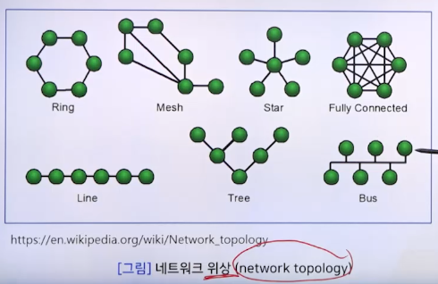

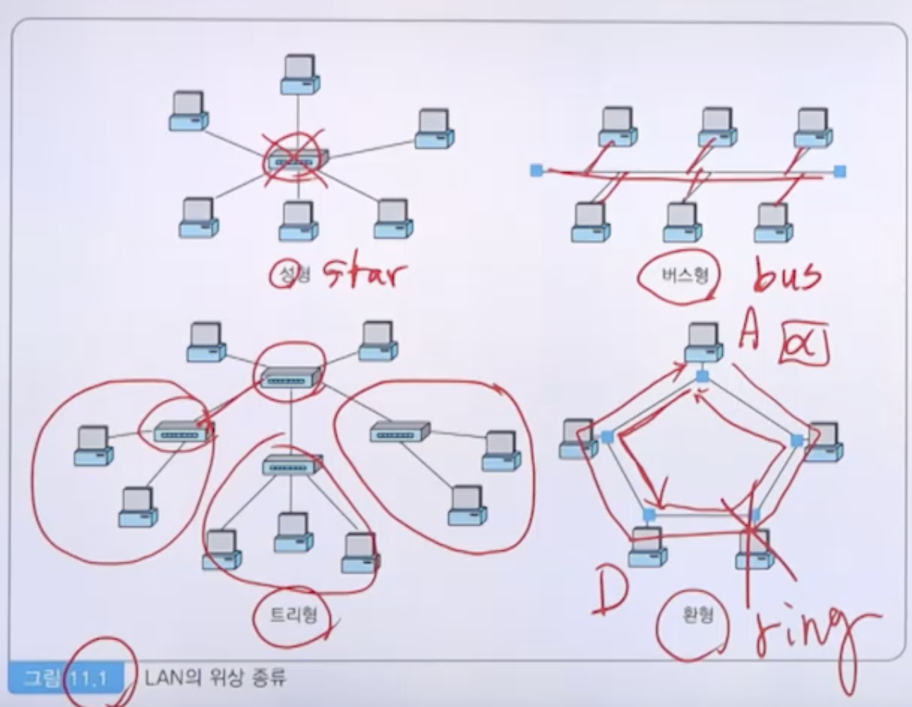

### 1. 성형(star) 네트워크

### 2. 환형(ring) 네트워크

### 3. 버스형(bus) 네트워크

### 4. 그물형(mesh) 네트워크

### 5. 계층형(hierarchical) 네트워크

## 4. 네트워크 장치

### 1. 리피터

- 정의 
  - 전송되는 신호가 약해지거나 잡음 등에 대처하기 위해 **원래의 신호를 재생**시켜 다음 구간으로 재전송하는 장치
    - "**to regenerate the signal** over the same network before the signal becomes too weak"
  - 단순한 신호 증폭이 아니라 신호를 구분하여 재생함
    - "they copy the signal **bit by bit** and regenerate it"
  - 여러 대의 repeater를 사용하면 장거리 데이터 전송 가능함
    - (repeater를 통과할 때 시간지연이 발생; **보통 4개** 이하)

### 2. 허브

- 정의
  - 단순히 하나의 노드에서 수신한 신호를 정확히 재생하여 다른 노드로 보내느 ㄴ장치
    - "A hub is a basically multi-port repeater." (e.g. 8-port)
- 허브의 종류
  - 더미 허브(dumb hub)
  - 스위칭 허브(switching hub)
  - 스태커블 허브(stackable hub)

#### (1) 더미 허브

#### (2) 스위칭 허브

#### (3) 스태커블 허브

- **여러 개의 허브를 연결**하여 사용하는 허브
- **캐스케이드(cascade) 케이블**이라는 전용 케이블로 허브와 허브를 연결
- 여러 대의 허브를 한 대의 허브로 인식시켜 줌
- 대부분의 **스위칭 허브에 스태커블 허브의 기능이 내장**되어 출시됨

### 3. 브리지

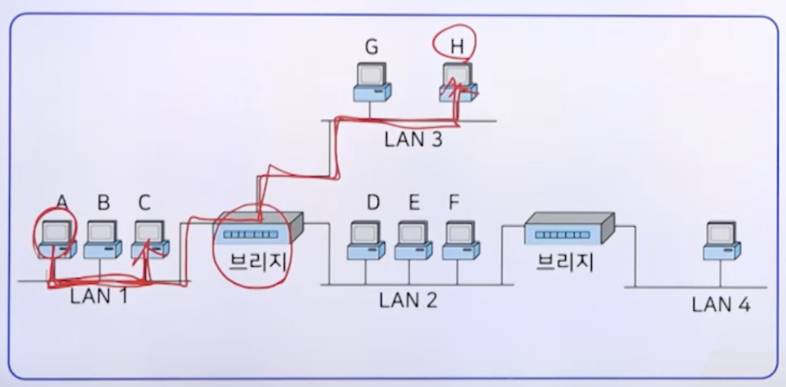

- 정의
  - 복수의 LAN을 연결하기 위한 장치로 데이터링크 계층에서 동작하는 통신장치
    - **LAN과 LAN 사이를 연결**
    - 2계층
  - 브리지는 자신이 수신한 데이터의 전송 주소(네트워크 카드의 물리 주소)를 검사해서 목적지가 송신지와 다른 LAN인 경우에는 다른 LAN으로 전송해줌

### 4. 라우터

- 정의
  - 일반저긍로 Router는 IP 네트워크들 간을 연결하거나 IP 네트워크와 인터넷을 연결하기 위해 사용하는 장치로 네트워크 계층(제3계층)에서 동작함
    - MAC 주소를 쓰지 않고 IP 주소를 씀
- 라우터의 기능
  - Routing 기능
    - 송신지에서 수신지로 가장 최적의 경로를 선택하여 데이터 패킷을 전송해줌
  - 오류 제어
    - 오류가 있는 패킷을 검출하여 폐기함
- 라우팅 방법
  - 정적 라우팅(static routing): 수동적인 방법으로 라우팅 테이블을 관리
  - 동적 라우팅(dynamic routing): 라우터 간의 라우팅 정보교환을 통해 라우팅 테이블을 자동적으로 관리
- 라우터와 브리지의 비교
  - 브리지
    - 물리 주소(네트워크 카드의 MAC 주소) 사용
    - Router보다 패킷 전송 속도가 빠르며, 가격도 저렴
    - Routing 기능이 없음
  - 라우터
    - 네트워크 주소(IP 주소) 사용
    - Bridge보다 패킷 전송 속도가 느리고 가격이 비쌈
    - Routing 기능이 있음

### 5. 게이트웨이

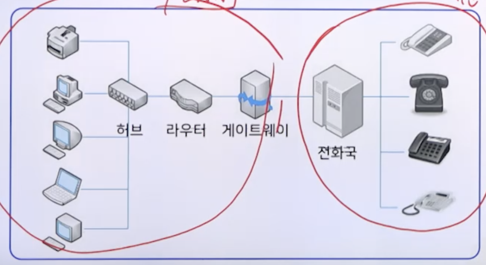

- 정의
  - 서로 다른 통신 프로토콜을 사용하는 **2개의 완전히 다른 네트워크 사이**에서 상호 연결을 제공해주는 통신장치
  - 통신 프로토콜의 전환
  - 데이터 형식의 변환
  - Gateway는 Router에 비해 전송속도가 느리며, 가격이 비싸고 설치가 어렵다는 단점이 있음
  - 이미 구축되어 있는 두 네트워크가 서로 다른 구조의 Network Architecture로 이루어져있다면 Gateway를 이용하여 하나의 네트워크처럼 사용할 수 있음

### 6. 네트워크 장치 비교

| 장치       | OSI 계층   | 특징                                              | 적용                                                        |
| ---------- | ---------- | ------------------------------------------------- | ----------------------------------------------------------- |
| 리피터     | 물리       | 전기 신호                                         | **LAN의 길이 연장**                                         |
| 브릿지     | 데이터링크 | 네트워크 카드의 물리 주소(MAC) 사용               | 네트워크 카드의 **하드웨어 주소**에 의한 데이터 프레임 전송 |
| 라우터     | 네트워크   | 라우터가 지원 가능한 네트워크 주소(IP, IPX)사용   | **네트워크 주소**에 의해 데이터 패킷을 전송                 |
| 게이트웨이 | 응용       | 완전히 다른 두 네트워크 사이의 데이터 전송에 사용 | **데이터 형식의 변환**에 의한 데이터 전송                   |

## 5. 네트워크 소프트웨어

### 1. 네트워크 소프트웨어 정의

- 정의
  - 유선 또는 무선 환경의 주어진 네트워크 계층에서 단말기들이 서로 약속된 프로토콜 매커니즘을 이용해 데이터를 교환할 수 있도록 하는 통신 소프트웨어

- 분류
  - 네트워크 애플리케이션(network application)
    - 네트워크를 통해 데이터를 보내고, 전송된 데이터를 받는 것을 담당
    - 예. 웹 브라우저, FTP, 텔넷
  - 네트워크 운영체제(Network Operating System: NOS)
    - 네트워크와 네트워크 메시지를 트래픽과 대기열(큐)을 제어하고, 여러 명의 사용자가 파일과 같은 네트워크 자원에 접근할 수 있게 해 줌

### 2. 네트워크 소프트웨어 분류

- NOS의 기능들
  - 프로세서, 프로토콜, 자동 하드웨어 감지, 응용 프로그램에 대한 멀티프로세싱 지원과 같은 기본적인 운영체제 기능
  - 관리, 로그온 제한, 접근 제어와 같은 보안 기능
  - 이름과 디렉터리 서비스
  - 파일, 인쇄, 웹 서비스, 백업 및 복원 서비스