# 4강. 데이터 통신의 전송 기술(1)

## 1. 데이터 교환 방식

### 1. 회선 교환

- 회선 교환 방식
  - Circuit switching
  - 회선(curcuit): 설정된 통신경로의 집합
  - 전화교환국 같은데서 전화 스위칭하는 것
- 회선 교환 방식의 특징
  - 연결지향형 전송(connection-oriented transmission)
    - 연결 설정 ==> 데이터 전송 ==> 연결 해제
  - 연결 설정 후 **전용선처럼 회선을 사용**하므로 **대량의 실시간 데이터 전송**에 적합

### 2. 패킷 교환

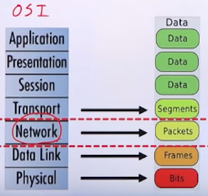

- **패킷 교환 방식**

  - Packet switching(package + bucket)

  - Packet: 보통 128바이트(MTU: Maximum Transmission Unit) of a TCP Packet = 64KByte)

  - 인터넷: 패킷 통신망

  - 선로를 공평하게 공유하기 위해 데이터를 패킷으로 분할

  - Packet = 데이터(payload) + 제어 정보(header, tail)

    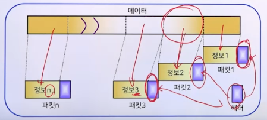

  - 패킷 교환 방식은 메시지를 일정한 크기로 **분할하여 전송**하는 방법으로, **주기억장치**를 사용하여 **store-and-forward**하므로 전송 지연을 줄일 수 있음

    - *메시지 교환 방식은 메시지를 크기에 관계없이 전송하는 방법으로 **보조기억장치**를 사용하는 경우가 발생하여 전송 지연이 큼*

  - 각 패킷마다 헤더(header)가 붙기 때문에 오버헤드가 있음

  - 짧은 실시간 전송에 많이 사용되는 교환 방식

- 구분

  - 가상회선(virtual circuit) 패킷 교환
  - 데이터그램(datagram) 패킷 교환

- **가상 회선 방식**

  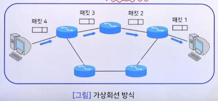

  - 가상 회선(논리적 경로)
    - 회선교환과 유사(연결지향형 전송)
    - 3개 : 연결 설정, 데이터 전송, 연결 해제 

- **데이터그램 방식**

  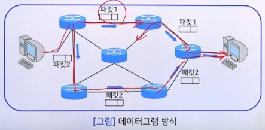

  - 비연결형 전송(connectionless transmission)
    -  일단 하나씩 보내놓고, 어디로 갈지를 그때 그때 결정

### 3. 메시지 교환

- 메시지 교환(message switching)
  - 데이터의 **크기에 관계 없이 데이터를 그대로** 전송
  - 전용선 불필요하지만 **헤더(목적지 주소)**가 필요
  - 각 노드에서 수신 후 **잠시 저장**하면서 적절한 선로를 찾아 송신함
  - **전송지연이 길어**서 실시간 서비스에는 부적절함
  - **대용량 데이터 전송**에 적합함
- 메시지 교환의 장점
  - 메시지를 분할하고 재조립하는 과정이 필요 없으므로 시간이 절약된다
  - 메시지 교환은 메시지의 분할 없이 전송하므로 오버헤드가 패킷 교환보다 훨씬 적다
- 메시지 교환의 단점
  - 저장 후 전송(store-and-forward) 방식으로 전체 메시지를 보내야 하므로 중간의 모든 노드가 주기억장치는 물론 보조기억장치까지 사용하게되어 패킷 교환에 비해 전체 메시지를 전송하는데 더 많은 시간이 소요됨
  - 전송 시에 **오류가 발생하면 전체 메시지를 폐기하고 재전송**해야하므로 **대역폭의 낭비가 심함**

### 4. 교환 방식의 비교

- 데이터 교환 방식에 대한 타이밍도

  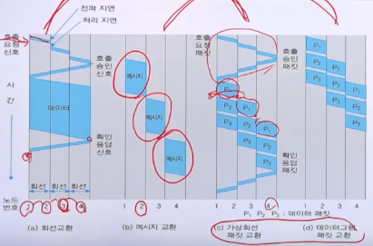

- 데이터 교환 방식의 정리
  - 회선 교환
    - 연결형 전송 방식
    - 대용량 데이터 전송
    - 메시지 분실 가능성
  - 메시지 교환
    - 비연결형 전송 방식
    - 대용량 데이터 전송
    - 메시지 분실 가능성 없음
    - 전송 시간 김
  - 가상회선 패킷 교환
    - 연결형 전송 방식
    - 실시간 소용량 데이터 전송
    - 메시지 재구성 불필요
  - 데이터그램 패킷 교환
    - 비연결형 전송 방식
    - 실시간 소용량 데이터 전송
    - 메시지 재구성 필요

## 2. 다중화

### 1. 다중화의 개념과 목적

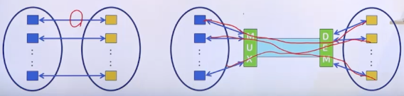

- Multiplexing: 여러 단말기들이 하나의 통신 선로의 용량을 나누어 쓸 수 있도록 해주는 투명한 방법
  - 투명한 방법(transparent): **데이터에 어떠한 조작도 가하지 않음**. 즉, 데이터가 바뀌지 않는다
  - **하나의 물리적 통신 선로**를 **여러 개의 논리적 채널**로 나누어 공유하는 방식
- 목적: 전송 자원 이용의 효율성 및 통신만 구축 비용의 절감

### 2. 다중화 방식(TDM, FDM, WDM) ⭐️

#### (1) 시분할 다중화 방식

- Time Division Multiplexing(TDM)(STDM: Synchronous TDM)
  - 복수의 데이터를 각각 **일정한 시간(time slot)**으로 분할하여 전송함으로써 하나의 통신선로를 복수의 채널로 공유하는 방식(디지털 채널 구성)
    - 주파수 분할 다중화(FDM): 복수의 아날로그 채널로 공유
  - 구분
    - 비트 다중화, 문자 다중화 (time slot의 정보량에 따라 구분)
    - **비동기식 시분할 다중화(Asynchronous TDM; ATDM)**
    - **통계적 시분할 다중화(Statistical TDM; STDM or STATDM)**

- 4개의 단말기가 시분할 다중화 방식으로 고속의 통신서로를 통하여 컴퓨터에 연결

  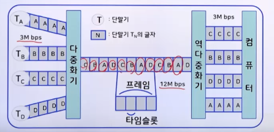

#### (2) 주파수 분할 다중화 방식

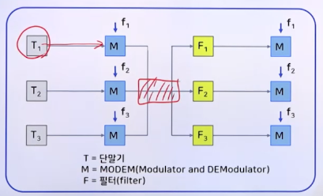

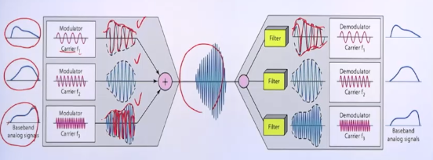

- Frequency Division Multiplexing(FDM)
  - 여러 개의 낮은 속도의 데이터를 서로 다른 **반송파 주파수**에 각각 변조하여 통신 선로에 보내는 방식
- 예: 라디오 방송(AM, FM)

#### (3) 파장 분할 다중화 방식

- Wavelength Division Multiplexing(WDM)
- **광섬유**의 고속 데이터 전송률을 이용하기 위해 설계됨
- 신호가 **빛**이라는 점 이외에는 **주파수 분할 다중화와 동일**한 개념

### 비교: TDM과 FDM

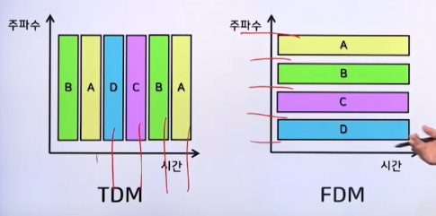

## 3. 동기화

### 1. 동기화의 정의 및 필요성

#### (1) 동기와 오동기

- 오동기 - 잘못된 표준화 위치

  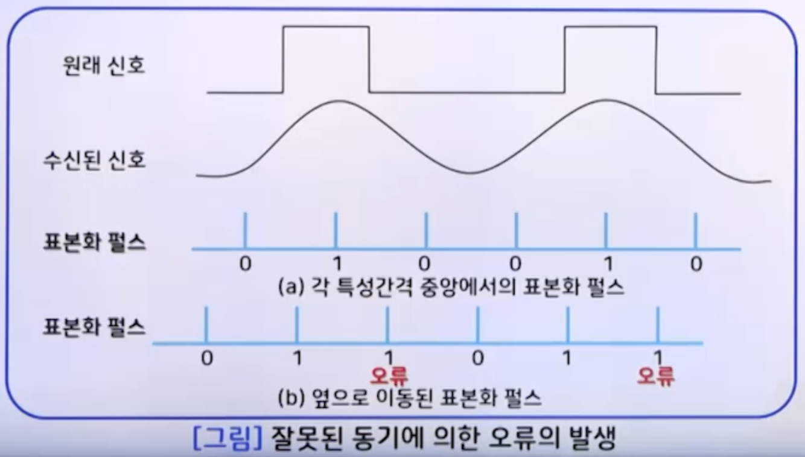

#### (2) 동기화(synchronization)

- 정의: 송수신자가 서로 동일한 속도로 데이터를 송신하고 수신하도록 해주는 데이터 통신 기능
- 서로 다른 시점에 데이터를 송수신하여 발생되는 오류 문제를 해결
- 송신자와 수신자 사이에 데이터를 송수신하는 시점을 일치시킴
- 표본화 펄스의 정확한 위치를 송수신자 사이에 맞추는 기술

### (3) 동기화의 필요성

- 작은 회로망 내부
  - 발진된 하나의 주파수로 회로 전체의 소자들이 동기화되기 용이함
- 정보통신망
  - 원격의 송신기와 수신기 사이의 동기가 어려움
  - 동기화 기술이 필요함

### 2. 동기화 방법(비트 동기, 프로세스 동기)  ⭐️

#### (1) 비트 동기

1. 두 지국이 독립된 각각의 클록을 가지고 있는 경우
   - 제어지국의 동기정보를 이용하여 종속지국의 클록 속도를 수정함
2. 한 지국만 클록을 가지고 있는 경우
   - 송신하는 데이터 앞에 동기를 맞출 수 있도록 동기 신호를 함께 송신함
   - 이 동기 신호를 이용하여 종속지국은 표본화 위치를 결정함
3. 두 지국이 모두 클록을 가지고 있으나, 종속지국에서는 초기 몇 비트 동안만 클록을 사용하는 경우
   - 클록을 동기시키고 난 뒤 종속지국은 자기의 클록을 사용함

#### (2) 문자 동기

- 나중에 다룸

#### (3) 프로세스 동기

- process: a series of events to produce a result

- 두 개의 비동기 프로세스

  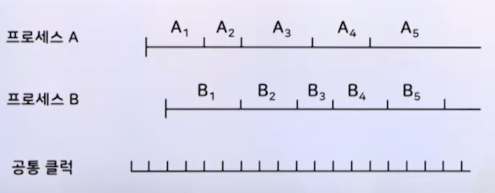

- 예

  - 단계 A4와 B2에서의 동기

    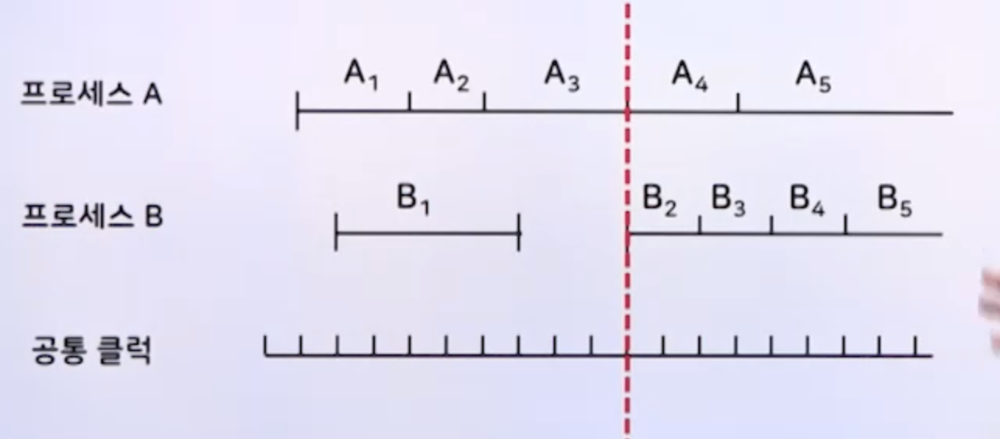

  - 두 개의 동기 프로세스

    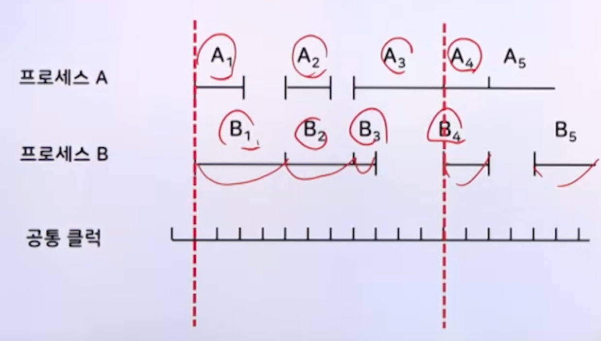
