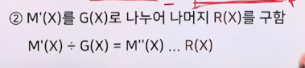

# 5강. 데이터 통신의 전송 기술(2)

## 1. 주소지정

### 주소지정(addressing)

- 명명(naming), 식별(identification)
- 컴퓨터통신망에서 사용자(컴퓨터, 파일 등)를 식별하는 방법
- 문자 또느 수를 이용
- 배경
  - 모든 통신 지국의 쌍이 전용 링크르 갖으면 주소 지정은 필요 없음
  - 그러나 컴퓨터 통신망은 **ICT 자원(resource)을 공유**함
  - 따라서 ICT 자원의 공유를 위해 주소지정이 필요함

### 주소지정 방식

- 계층의 수
  - 단일 계층, 복수 계층
- 부 네트워크가 제공하는 주소 서비스
- 같은 주소를 갖는 지국의 수
  - 단일 지국
  - 복수 지국
    - 복수 목적지 주소, 그룹 주소, broadcasting 주소, flooding 주소
- 주소할당 모드
  - 정적주소, 동적 주소

### 논리 주소 및 물리주소

- 예: 한국방송통신대학교
  - 논리주소: 203.232.172.105 [32비트, 10진수]
    - domain name: www.knou.ac.kr
  - 물리주소: 00:13:77:52:67:78 [48비트, 16진수]

## 2. 오류제어

### 오류와 오류제어

- **오류(error)**

  - 송신 데이터 != 수신 데이터

  - 송신 데이터가 주어진 시간 안에 수신측에 도착하지 못한 경우

- 오류 발생 이유 

  - 열, 자기장, 간섭, 고장 등

- 잔류오류율(RER: Residual Error Rate)

  - 오류가 있는 비트[문자, 블록] 수 / 전송된 총 비트[문자, 블록] 수

- 오류제어

  - 잡음, 고장 등의 영향에 대비하여 잔류오류율(RER)을 주어진 한계 이내로 유지하는 통신 기능
  - QoS(Quality of Service)

- **오류 제어 방식**

  - **후진 오류 제어(backward error control)**
    - 오류 검출 후 재전송 요청
    - ARQ
  - 전진 오류 정정(forward error correction)
    - 오류 검출 및 수정

### 오류검출 방식

- 패리티(parity) 검사
- 검사합(checksum) 검사
- 순환잉여검사(CRC: Cyclic Redundancy Check)

#### (1) 패리티 검사

- 홀수 패리티(odd parity) 전략

  - 보내는 곳에서 1의 갯수가 홀수개가 되도록 패리티 비트 값을 정하는 것
  - 예를 들어 1010을 보내는데, 홀수 패리티 전략을 사용한다면 패리티 비트는 1이 되고

- 짝수 패리티(even parity) 전략

  - 101을 보내는데 짝수 패리티 전략을 사용한다면 패리티 비트는 0이 됨

- 단순 패리티 검사(홀수 패리티 이용) - 1차원 패리티 검사

  - 동시에 짝수개의 비트 오류가 있는 경우 오류 검출을 할 수 없음

  

- 2차원 패리티 검사(짝수 패리티 이용)

  

  - 오류가 났음에도 불구하고 오류 검출을 못하는 경우

    

#### (2) 검사합(Check Sum)

- 검사합 생성 ==> 검사합 검사

- 검사합 생성기

  - 데이터를 세그먼트로 분할
  - 세그먼트들을 **2진수로 간주**하고 합함
  - **carry bit도 합함**
  - 합한 결과를 **1의 보수**로 만듦 (==> check sum)

- 검사합 생성기 예시

  - 데이터(Networks)의 전송

  

  

- 검사합 검사기

  - 비트열을 수신하여 세그먼트로 분할
  - 세그먼트들을 2진수로 간주하고 합함
  - carry bit도 합함
  - 합한 결과를 1의 보수로 만듦
  - **이 결과가 0이면 오류 없음**

- 검사합 검사기 예

  

  

#### (3) 순환잉여검사(Cyclic Redundancy Check)

- 패리티 검사: 문자 단위 검사

- 순환 잉여 검사: 비트의 블록(block) 단위 검사

  - 사진, 소리, 영상 등의 데이터의 전송에서 활용
  - Block[또는 frame] 끝에만 오류제어정보 첨가
    - BCC(Block Check Character)
    - FCS(Frame Check Sequence)

- BCC 생성 과정

  - 비트의 다항식 표현 ==> M(X)

    

  - 생성다항식(G(X))에 의한 부호화

    

- BCC 생성 과정(예시)

  - 비트의 다항식 표현 ==> M(X)
  - 생성 다항식(G(X))에 의한 부호화
    - M'(X) = M(X) x X^m (m은 G(X)의 최상위 차수)
    - M'(X)를 G(X)로 나누어 나머지 R(X)를 구함
      - M'(X) / G(X) = M''(X) ... R(X)
      - ==> **M'(X) = G(X) x M''(X) + R(X)**
    - **F(X) = M'(X) + R(X)** <== BCC
      - 송신자의 입장에서 보내는 마지막 데이터에 해당되는 방정식을 F(X)
    - 단, 모듈로 -2 연산 사용

- 오류 검사 과정

  - 수신된 BCC(F(X))를 이용한 오류 검사

  - BCC를 동일한 생성다항식(G(X))로 나누어 

    - 나머지가 없으면 ==> 오류 없음
    - **나머지가 있으면 ==> 오류 있음**

  - 이유

    - **F(X) / G(X) = {M'(X) + R(X)} / G(X)**

      ​		= {G(X) x M''(X) + **R(X) + R(X)**} / G(X)

      ​		= {G(X) x M''(X)} / G(X)

- 예시

  - 전송 데이터

  

  - 생성다항식에 의한 부호화

    

    

    - R(X) 구하기

      

      

      

  - 오류 검사 과정(예)

    - 원래 BCC(00010111) ==> 수신된 BCC(10100111)
      - F(X) = 
      - 
      - 따라서 전송에 오류가 있었음

### 귀환오류 제어(결정귀환[ARQ], 정보귀환, 복합귀환)

- 오류제어 방법의 분류

  

- 귀환오류 제어

  - 지구 사이의 역방향 채널을 이용하는 오류제어 방법

  - 귀환오류제어의 분류(오류검출 위치)

    

- 결정귀환

  - 오류 검출 위치가 수신측에 있는 경우
  - ARQ(Automatic Repetition reQuest)

  

  - ACK: Acknowledged(잘 받았다)
  - REJ: Reject(잘못됐다)

- 정보 귀환

  - 오류 검출의 위치가 송신측에 있는 경우

    

- 복합 귀환
  - 오류율을 줄이기 위해 오류제어방법을 복합적으로 이용
    - 결정귀환 및 정보귀환을 이용
      - 수신측에서 오류 검출하면 ==> REJ 송신
      - 수신측에서 오류 검출 못하면 ==> 정보귀환방식으로 BCC 송신
    - 결정귀환 및 전진오류정정(FEC)을 이용
      - 수신측에서 오류 검출하면 ==> REJ 송신
      - ==> 송신측에서는 전진오류 정정방식으로 송신

- **ARQ: Automatic Repeat reQuest** ⭐️
  - Stop-and-wait ARQ
  - continuous ARQ
    - go-back-N ARQ
    - Selective-repeat ARQ
  - adaptive ARQ

#### (1) 정지-대기(stop-and-wait) ARQ

- 1개의 데이터 프레임을 송신하고 기다림
  - ACK를 수신하면 다음 프레임을 송신하고 기다림
  - REJ을 수신하면 처음 프레임을 재송신후 기다림
  - 대기시간을 초과하면 처음 프레임을 재송신후 기다림
- 특징
  - 구현이 단순, 비용(버퍼)이 저렴
  - 전송효율이 떨어짐(기다리는 시간)

#### (2) 연속적(Continuous) ARQ

- 여러 개의 데이터 프레임을 송신하고 기다림

- **go-back-N ARQ**

  - N번째 프레임으로 되돌아 가세용

  - sliding window

    

- Selective-Repeat ARQ

  - 여러 개의 데이터 프레임을 송신하고 기다림
    - REJ가 수신된 프레임만 재전송
  - 특징
    - 전송 효율이 go-back-N ARQ보다 높음
    - 프레임의 송수신 순서가 달라 재배열이 필요한 문제 등 복잡

#### (3) 적응적(Adaptive) ARQ

- 프레임의 길이를 동적으로 변경시키는 방법
  - 수신측은 통신오류발생률을 송신측에 통보
  - 송신측은 그에 적합한 프레임 길이로 전송함
- 전송 효율을 높이기 위하여
  - 오류 발생률이 높을 때 짧은 프레임으로 전송
  - 오류 발생률이 낮을 때 긴 프레임으로 전송
- 구현이 매우 복잡함

### 전진오류정정(Forward Error Correction)

- 수신측에서 오류 검출 및 정정까지 할 수 있는 방식
- 연속적인 데이터의 흐름이 필요하고 역방향 채널의 제공이 어려울 때 많이 사용
- 오류정정코드를 전송
  - 데이터 프레임에 잉여 비트를 추가하여 만듦
    - 해밍(Hamming) 코드
    - 리드-뮬러(Reed-Muller) 코드
    - 리드-솔로몬(Reed-Solomon) 코드 등
  - 잉여 비트의 크기만큼 전송 효율이 떨어지는 단점