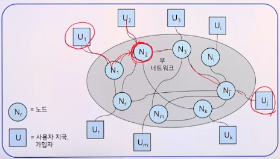
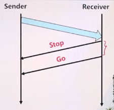
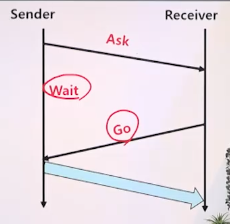
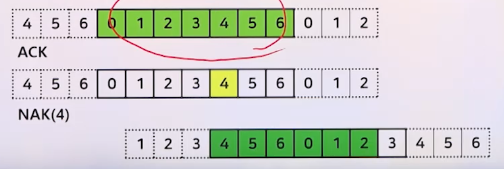
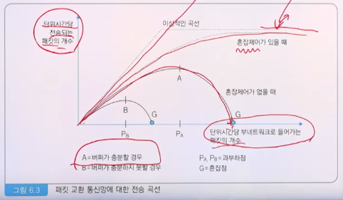
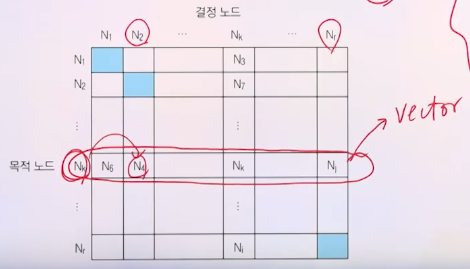
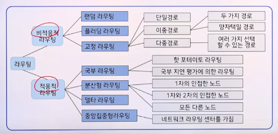

# 6강. 데이터 통신의 전송 기술(3)

## 1. 흐름제어, 혼잡제어, 라우팅의 개요

### 1. 내용, 정의 및 상호관계

#### 정의

- 관련이 깊은 통신 기능
  - **흐름제어(flow control)**
  - **혼잡제어(congestion control)**
  - **경로선택(routing)**
  - **오류제어(error control; sliding window, stop-and-wait ARQ)**
  - **접근제어(access control)**
- 목적
  - 부 네트워크(subnetwork)의 내부 환경에 관계없이 통신망의 성능을 유지 ==> 성능 향상 및 혼잡 방지
  - 

#### 부 네트워크의 참조 모델

#### 목적별 통신 기능의 구분

- 라우팅, 흐름제어 및 혼잡 제어의 구분

|                  | 성능향상         | 혼잡방지                   |
| ---------------- | ---------------- | -------------------------- |
| 지국쌍           | 흐름제어         | 혼잡제어(흐름제어)         |
| 전체 부 네트워크 | 라우팅(흐름제어) | 혼잡제어, 흐름제어(라우팅) |

## 2. 흐름제어

### 1. 흐름제어 정의 및 목적

#### 흐름제어(flow control)

- 송신 블록 수, 수신 블록 수, 통신 매체의 조절
- 흐름제어의 목적
  - 통신망 성능 최적화
  - 혼잡 방지

### 2. 흐름제어의 네 가지 원칙

#### 흐름제어의 네 가지 원칙

1. 속도 조절

   - 블록 간의 도착 간격 변경
   - 예
     - 감속 방법(choke packet 이용)

2. 거부(rejection)

   - 송신 측에 대한 거부 상태 통지

   - 예

     - 무시 방법(송신 측에 대한 거부)

     - stop-and-go 방법(송신 이전의 수신 거부)

       

3. 단일 승낙(single permission)

   - 매번 송신 허락을 받아야 함

   - 예

     - wait-before-go 방법

     - Ask-and-wait 방법

       

4. 다중 승낙(multiple permission)

   - 정해진 개수의 블록만 송신 가능

   - 예

     - sliding window 방법

       

## 3. 혼잡제어

### 1. 혼잡제어 정의

#### 혼잡(congestion) 현상

- 전송 데이터의 급격한 증가로 인하여 통신망에 과부하가 발생하고, 데이터 전송속도가 급감하거나 전송불가 상태가 되는 경우
- 단계적 발생(과입력 전송징겨 ==> 전체 부네트워크)
  - 버퍼 혼잡
    - 여러 버퍼들의 오버플로우
  - 노드 혼잡
    - 한 노드
  - 국부 혼잡
    - 특정 노드들
  - 전체 혼잡
    - 전체 부네트워크

### 2. 혼잡제어 방법

#### 혼잡제어 방법

1. 전송량의 제한
   - 허가증(permit)을 이용하여 전송량을 일정 수준 이하로 유지
   - 예
     - Isarithmic 흐름 제어 방법
2. 부네트워크 내의 부하 감소
   - 어떤 패킷을 버림
   - 흐름 제어(거부원칙) 방법 이용
3. 국부적 전송량의 재분배
   - 국부적인 체증 방지 및 국부적 과다 교통량 해소
   - 경로 선택 방법 이용

## 4. 라우팅

### 1. 라우팅의 개요

#### 정의

- 데이터 블록이 목적 노드로 전달되도록 출발노드에서 목적노드까지의 경로를 결정하는 기능

- 목적 
  - 네트워크 성능 최적화
  - 임계값(경계조건)의 유지
    - 평균 패킷전송시간의 최소화
    - 네트워크 자원 활용도의 최대화
  - 네트워크 전부 또는 일부 혼잡 방지
  - 네트워크 전송 신뢰도 증대

#### 라우팅 테이블 구조

#### 라우팅 방법의 분류

### 2. 라우팅 방법

#### 비적응적 라우팅

- 랜덤 라우팅(random routing)
  - 다음 노드를 임의로 결정함
  - 모든 경로를 동일한 확률로 선택 가능
  - 루프(loop)는 허용되지 않음
- 플러딩 라우팅(flooding routing)
  - 블록이 들어온 노드만 제외한 모든 노드에 전송
  - 매우 큰 트래픽 형성 가능
- 고정 라우팅(fixed routing)
  - 다음 노드가 일단 정해지면 환경이 변해도 유지
  - 대표적 비적응적 경로선택
  - 고정 단일 경로 선택
    - 다음 노드가 오직 하나 고정된 경우
    - 범람 경로선택(flooding routing)과 정반대
    - 노드가 선로 고장의 경우 경로가 완전 차단
  - 고정 이중[다중] 경로 선택

#### 적응적 라우팅

- 국부 라우팅(local routing)
  - 라우팅 정보를 한 노드에서만 활용
  - 다음 노드의 결정은 해당 노드에서 수행
  - hot potato 경로선택(=shortest queue routing method)
    - 가장 짧은 큐를 가진 출력선로를 선택하여 데이터 전송

  - 국부지연평가(local delay estimate)에 의한 경로선택
    - 과거의 정보를 이용하는 방식
    - 데이터를 반대 방향으로 전송하는데 걸리는 시간을 계산하여 다음 노드를 결정(backward routing)

- 분산형 라우팅(distributed routing)
  - 라우팅 정보를 인접 노드 사이에서만 교환
  - 각 노드에서는 제한된 크기의 전송지연표를 이용하여 목적 노드까지의 최소 지연의 다음 노드를 결정
  - 최소 지연 벡터는 주기적으로 갱신되며 인접 노드끼리 공유
  - 종류:
    - 1차 인접 노드
    - 1차, 2차 인접 노드
    - 모든 다른 노드

- 중앙집중형 라우팅(centralized routing)
  - Network Routing Center(NRC)
    - 모든 노드는 경로 선택에 관련 정보를 NRC에 제공
    - NRC는 라우팅 벡터를 갱신하여 각 노드에게 제공

  - 분산형 경로선택과 정반대
  - 각 노드는 편리하나, NRC는 복잡함

- 델타 라우팅(delta routing)
  - 분산형 경로선택과 중앙집중형 경로선택의 결합
    - 인접 노드 사이의 경로선택 → 분산형 경로선택
    - 통신망 전체의 경로선택 → 중앙집중형 경로선택

