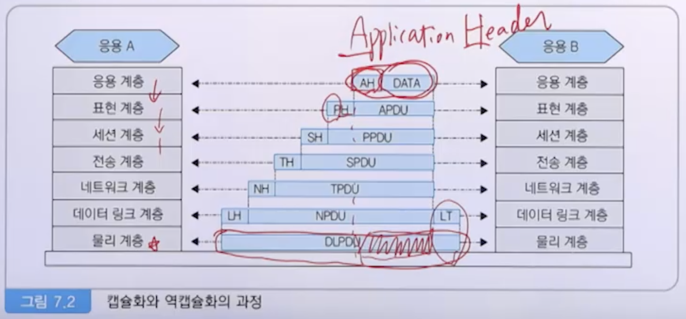

# 7강. 컴퓨터 통신망 구조

## 1. 컴퓨터 통신망 구조의 개요

### 1. 컴퓨터 통신망 구조

- 네트워크 아키텍처
  - 기본 뼈대를 이루는 컴퓨터 통신망 핵심
  - 컴퓨터 통신망의 물리적 요소들과 기능, 구성, 동작 원칙, 절차, 통신 프로토콜을 위한 프레임워크
  - IBM의 SNA, DEC의 DNA, Honeywell의 DSA
    - SNA(System Network Architecture)
      - 폐쇄형 네트워크
    - DNA(Digital Network Architecture)
      - 최초의 P2P 네트워크 
    - DSA(Distributed System Architecture)
      - SNA와 경쟁하기 위해 개발

### 2. 통신망 구조의 개요

- 개요
  - 초기에는 보안상 문제로 자원 공유하지 않았지만, 자원공유 이점 활용을 못함
  - 개방형 네트워크 아키텍처가 등장
- 개방형 네트워크 아키텍처
  - OSI 참조구조
  - TCP/IP

### 3. 개방형 구조의 비교

## 2. OSI (7계층) 참조 모델

### 1. OSI 모델의 목적

- 목적

  - ISO 7498(1983)
    - 개방형 시스템의 상호접속을 위한 참조 모델

  - 이기종 시스템간의 통신이 가능하도록 표준 제정

  - 개방형 시스템: 적용 가능한 표준을 상호 인정하고 지원

### 2. OSI 모델의 계층

- 7계층의 OSI 참조 모델

  

- 중계 개방 시스템을 갖는 계층

  

  

### 3. 각 계층이 필요한 이유

- 물리 계층
  - end-to-end를 연결하려면, 다양한 물리적 매체를 사용하는 구조 필요(광섬유 등)
- 데이터링크 계층
  - 물리적 통신 매체를 사용할 경우에, 서로 다른 데이터 링크 제어 절차가 필요
- 네트워크 계층
  - 전송 주체(송신자, 수신자) 사이에 중간 노드가 있는 경우에도, 전송 주체 간 연결 통로(네트워크 연결) 제공 
- 전송 계층
  - 발신지-목적지 시스템까지 신뢰성 있는 데이터 이동
- 세션 계층
  - 대화를 조직, 동기화하거나 데이터 교환을 관리할 필요가 있음
- 표현 계층
  - 응용 프로그램의 구조화된 데이터를 표현하고 조정하는 기능이 필요
- 응용 계층
  - 응용프로그램을 위한 프로토콜을 함께 관리할 필요가 있음

### 4. 계층의 분리 원칙

- 원칙
  - 너무 많은 계층으로 분리함으로써 각 계층에 대한 설명과 이들에 대한 조합이 필요 이상으로 많지 않아야 함
  - 서비스 양이 적고, 경계를 중심으로 최소의 상호 작용이 일어나도록 경계를 정해야 함
  - 수행하는 일의 측면이나, 필요로 하는 기술의 측면에 있어서 명백히 서로 다른 기능들을 다룰 수 있또록 계층을 설정한다
  - 비슷한 기능들은 같은 계층에 존재하도록 한다
  - 과거의 경험에 의해 성공적이라고 판단되는 곳에 경계를 설정한다
  - 쉽게 세분화되는 기능을 하나의 계층으로 한다
  - 필요한 경우, 표준화된 인터페이스를 가질 수 있는 곳에 경계를 설정한다
  - 데이터에 대한 조작, 즉 구문(syntax), 의미(semantic) 등의 추상적 개념에 대해 서로 다른 수준을 필요로 하는 곳에서 계층을 설정한다
  - 각 계층은 단지 상위 계층과 하위 계층에 경계를 갖도록 한다. 즉, 다른 계층과는 전혀 무관하도록 한다

### 5. 캡슐화

- 캡슐화(Encapsulation)

  - 데이터에 각 계층의 제어정보를 추가하는 것
  - Service data unit + protocol control information => Protocol Data Unit

  

## 3. 인터넷 통신망 구조(TCP/IP)

### 1. TCP/IP의 등장

- Internetworking Technology
  - 네트워크들을 상호 연결하는 기술
  - 서로 다른 네트워크에 연결되어 있는 컴퓨터 사이의 통신이 가능
  - DoD ARPA(Advanced Research Project Agency)
- Transmission Control Protocol/Internet Protocol
  - TCP/IP Internet Protocol Suite
  - 1982년 미군 컴퓨터 네트워킹의 표준으로 제정

### 2. TCP/IP의 기본 구조

- DOD 모델(DARPA 모델)
- 

- TCP/IP 주요 특징
  - 연결형 서비스 및 비연결형 서비스 제공
  - 패킷 교환
  - 동적 경로 할당
  - 공통의 응용 프로그램 제공
    - CASE(Commom Application Service Element)
    - 응용에 무관하게 개방 시스템 접속을 위한 방법을 제공
- TCP/IP 계층의 역할
  - 데이터링크 계층
    - 네트워크 인터페이스
    - device driver와 interface card로 데이터 통신 처리
    - 대표적 프로토콜
      - ARP(Address Resolution Protocol)
        - [IP주소 -> 물리주소]
      - RARP(Reverse ARP)
        - [물리 주소 -> IP 주소
  - 인터넷 계층
    - 네트워크 상에서 패킷의 이동 처리(패킷 라우팅)
    - 대표적 프로토콜
      - IP(Internet Protocol)
      - ICMP(Internet Control Message Protocol)
      - IGMP(Internet Group Managment Protocol)
  - 전송 계층
    - 호스트 컴퓨터 사이의 데이터 전송 서비스
    - 대표적 프로토콜
      - TCP(Transmission Control Protocol) - 연결형
      - UDP(User Datagram Protocol) - 비연결형
  - 응용 계층
    - 응용 프로세스를 위한 프로토콜
    - 대표적 프로토콜
      - TCP 이용: FTP, SMTP(Simple Mail Transfer Protocol), Telnet 등
      - UDP 이용: TFTP(Trivial FTP), DNS(Domain Name System), BOOTP(Bootstrap Protocol) 등
      - IP 직접 이용: traceroute 프로그램
      - ICMP 직접 이용: ping 프로그램

### 3. 인터넷 주소

- 호스트 식별

  - 인터넷에 연결되어 있는 호스트 식별
  - 3가지 종류의 주소
    - 물리주소
      - 물리적 하드웨어 주소(LAN 카드 주소 등)
      - 네트워크 인터페이스 주소
    - 인터넷 주소(IP 주소)
      - 서로 다른 네트워크 간에 호스트를 식별하는 논리주소
    - 포트 주소
      - 프로세스를 식별하는 포트 번호

- IP 주소

  - 4바이트(32비트)로 구성

    

- 포트 주소

  - 포트 번호(port number)

    - TCP 및 UDP에 의해 응용 프로그램을 식별

    - 2바이트(16비트)로 구성

      

### 4. 캡슐화

- 캡슐화(Capsulation)

  

  -  데이터에 각 계층의 제어정보를 추가하는 것
  - Service Data Unit + Protocol Control Information
    - Protocol Data Unit

- 역캡슐화(Decapsulation)

  - 수신측 시스템의 해당 계층에서 수행되는 캡슐화의 반대 과정
  - 물리 계층 이외의 모든 계층에서 수행됨