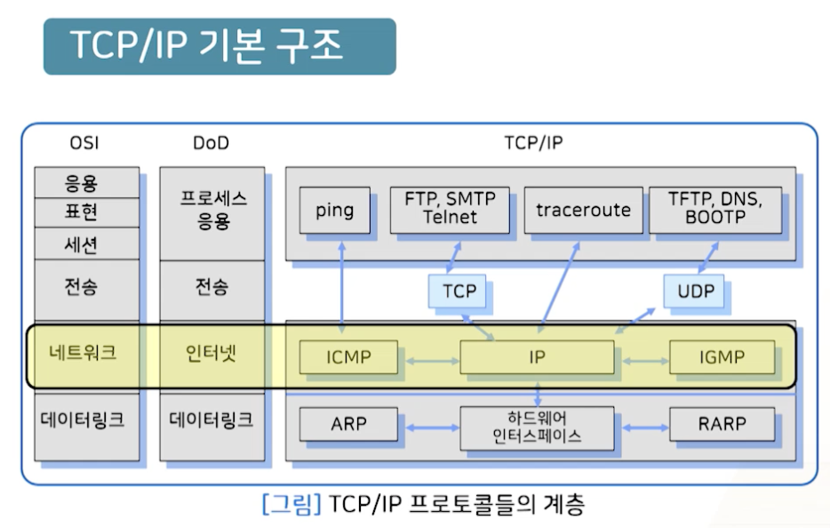
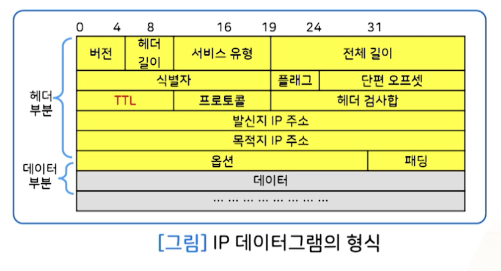
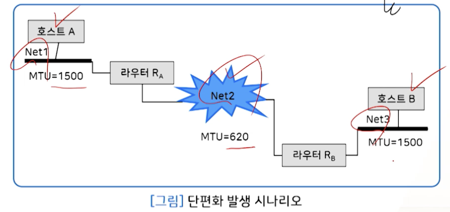
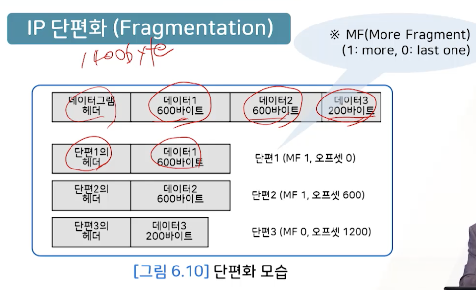
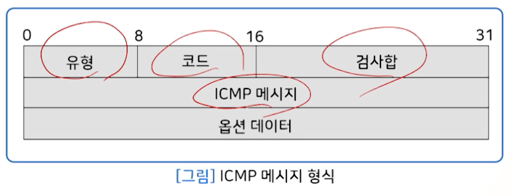
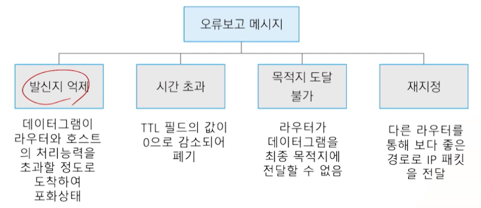
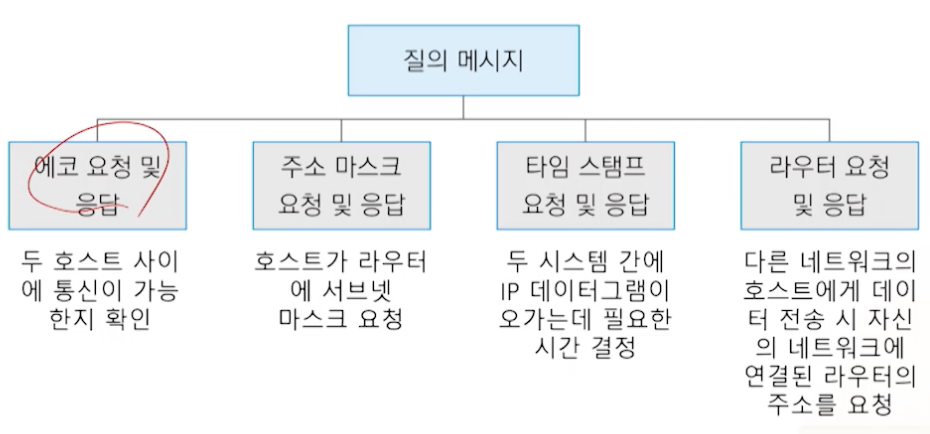
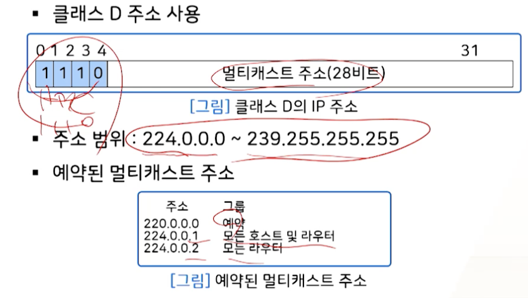
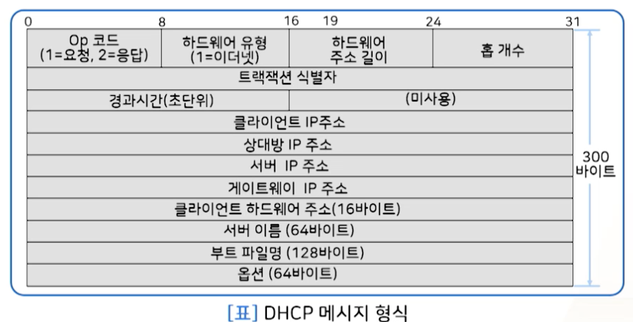
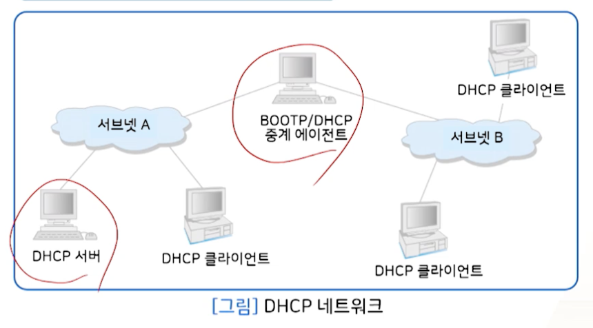

# 8강. TCP/IP: 네트워크 계층

## 1. IP

### IP 개요

- Internet Protocol: OSI 모델의 네트워크 계층의 기능
- 네트워크 계층의 투명성 제공

### 비연결형 서비스

- 비연결형 서비스
  - 인터넷 계층의 투명성
  - IP 역할은 호스트 주소 지정 및 데이터 그램 전송
  - 경유해야 하는 데이터 링크 및 라우터 정보 무시
  - 신뢰성 없는 데이터 전송

### 데이터그램

- 1 word == 4 bytes

### IP 단편화

- IP 데이터그램의 분할

- MTU(Maximum Transfer Unit)

  - 네트워크 링크에서 허용하는 프레임당 데이터의 최대 길이
  - Ethernet LAN
    - 1,500 byte
  - CCITT X.25
    - 128 byte

- IP 데이터그램은 전송 중 각 네트워크의 MTU에 적합한 크기로 분할되었다가, 목적지 호스트에서 각 fragment를 재조립함

  

  - MF: 단편화가 더 있다

### 인터넷상에서의 라우팅

- IP 데이터그램이 목적지 호스트까지 진행하면서 경로한 경로를 결정하는 것

- 호스트는 라우터에 대한 정보를 자신의 **라우팅 테이블**에 관리

  

- 동일한 물리적 네트워크에서 데이터그램 전송

  

- 다른 물리적 네트워크에서 데이터그램 전송

  - hop by hop

  

## 2. 주소변환

### 1. ARP

#### ARP 개념

- 링크 계층에 포함되어 있지만, 엄밀히 말하면 링크계층에만 포함되어 있다고 말하기는 어렵다. 네트워크/인터넷 계층에도 같이 포함되어 사용됨
- IP 주소만 알고, 물리주소를 모르는데, 물리주소를 알기 위해 사용하는 프로토콜

- 동적 바인딩
  - IP 주소: 32bit(4byte) IPv4
  - 물리 주소: 48bit(6byte) MAC
  - ARP 요청: broadcasting
  - ARP 응답: unicasting

#### ARP 프로토콜

#### 프락시 ARP

### 2. RARP

#### RARP 개념

- Reverse Address Resolution Protocol
- 물리주소만 알고 있는 호스트가 자신의 IP주소를 찾을 때 사용되는 프로토콜
- 일반적으로, 호스트의 IP 주소는 디스크에 저장된 구성 파일이 확인
  - 디스크가 없는 호스트는 물리 주소만 알고 있으므로 이를 이용해 IP 주소를 얻고자 함

#### RARP 프로토콜

| RARP 동작(request)                                           | RARP 응답(reply)                                             |
| ------------------------------------------------------------ | ------------------------------------------------------------ |
|  |  |

## 3. ICMP

### 1. ICMP 프로토콜(v4)

- Internet Control Message Protocol
- 인터넷 계층 프로토콜
- 전송 오류 제어
  - IP 데이터그램 전송의 오류가 발생할 경우 오류 메시지 또는 제어 메시지를 제공해 주는 프로토콜
  - IP 데이터그램의 전송과정에서 발생하는 오류를 라우터나 발신자 호스트에게 보고하는 매커니즘 제공
    - 즉, IP 전송 실패를 대신 처리

#### 메시지 형식

#### 메시지 유형

1. 오류 보고 메시지(error reporting)
   - ICMP는 오류 수정하는건 아니고, 보고만
   - IP 주소를 이용해 **발신지에 오류 전송**
2. 질의 메시지(simple query)
   - 일부 네트워크 문제 진단

#### 오류보고 메시지

#### 질의 메시지

## 4. IGMP

### IP 멀티캐스트

- Internet Group Management Protocol
  - 인터넷 계층 프로토콜
  - 인터넷에서 multicast 서비스를 위해 사용되는 프로토콜
  - IP 호스트가 어떤 멀티캐스트 그룹에 참가하고 있는지를, 멀티캐스트 라우터에 통보하는 프로토콜
- Multicast
  - 하나의 그룹에 속한 호스트들에게 메시지 전송(1-to-many)

### IP Multicast

- 클래스 D 

  

### IGMP(v2) 메시지

### IGMP 동작

### 

## 5. DHCP

### 1. IP 주소관리

- IP 주소(32비트) 관리 방법
  1.  Host Table
  2. DNS(Domain Name System)
  3. BOOTP(Bootstrap Protocol)
  4. DHCP(Dynamic Host Configuration Protocol)
- 호스트 테이블
  - 장점: 간단, 중앙집중형
  - 단점: 호스트 너무 많아지면 어려움(일관성 유지 어려움), 평면적 구조(중복 정보 포함)

#### DNS

- 계층적 구조 및 분산 관리 특성
- 분산 관리 문제
  - Name server는 특정 네트워크 영역만의 정보를 가지며, 다른 영역에 대해서는 다른 name server 정보를 참조
- name server 데이터의 복잡성
  - 수작업에 의한 데이터의 오류 가능성

#### BOOTP(Bootstrap Protocol)

- 동적으로 IP 주소 할당
- 디스크 없는 호스트(물리주소만 알고, IP주소는 모를 때)에 대해 주소 및 설정 정보를 자동으로 할당하고 관리하는 프로토콜

### 2. DHCP

#### Dynamic Host Configuration Protocol 

- 응용 계층 프로토콜
- BOOTP에서 발전된 프로토콜, IP 주소 사용 가능
- 메시지 형식은  BOOTP와 동일
- 동적 주소 할당 프로토콜
  - IP주소 Pool에서 사용 가능한 IP 주소를 선택해 원하는 호스트에게 일정기간 임대

#### 형식

#### 네트워크 구성

#### IP주소 자동 할당

- DHCPDISCOVER
  - broadcast

- DHCPOFFER
  - offer
- DHCPREQUEST
  - request

- DHCPPACK
  - pack