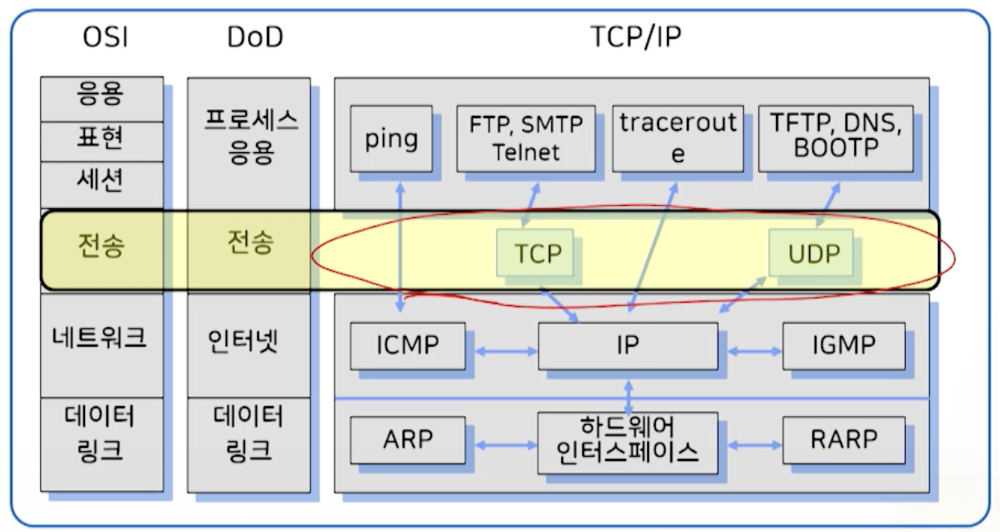
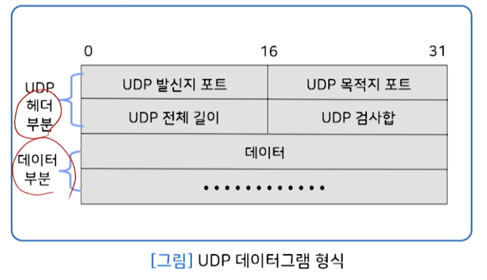
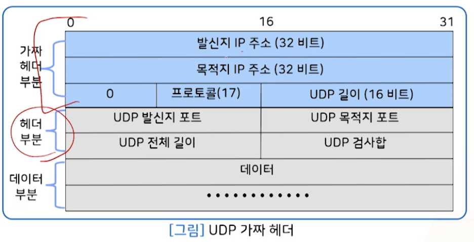
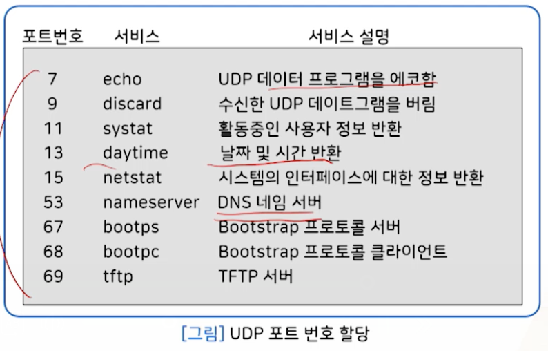
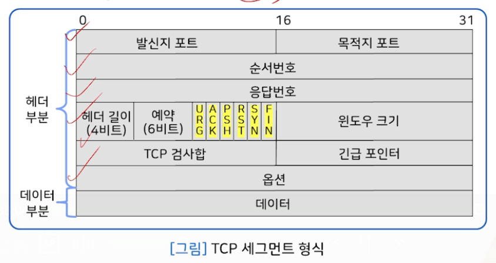
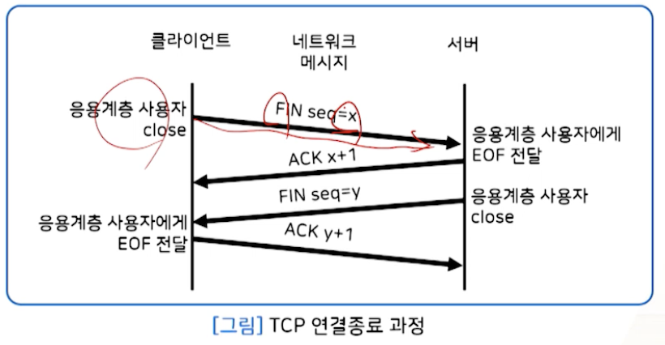

# 9강. TCPIP 전송 계층

## 1. 전송 계층

### 개요

- 시스템 종단에서 투명한 데이터를 양방향으로 전달
- 오류 점검해 오류 발생시 재전송 요청해 **신뢰성** 제공
  - 네트워크 계층은 데이터 전송에 대한 신뢰성 보장하지 않음

### 프로토콜

- 인터넷에서 가장 많이 사용되는 프로토콜
- UDP(User Datagram Protocol)
- TCP(Transmission  Control Protocol )
- 연결형 통신 vs 비연결형 통신

### 통신 방식

- 연결형 vs 비연결형

  

## 2. UDP

### 1. 비연결형 서비스

- 전송 계층 프로토콜
- 비연결성, 비신뢰성
- 기본적인 IP 데이터 전달 서비스에 프로세스 간 통신이 추가된 형태
- 오버헤드가 없음
- 간단한 메시지를 송수신하는데 유리

#### 응용 프로세스의 데이터 전송

-  UDP(비연결형, 비신뢰성), TCP(연결형, 신뢰성) 를 이용해 데이터를 다른 응용 프로세스로 전송 가능
- 포트 번호 사용

#### 특징

- 데이터 손실 가능성
  - 최종 목적지의 데이터 수신 여부 확인하지 않음
- 데이터의 순서가 틀릴 가능성
  - 메시지의 도착 순서를 재조정하지 않음
- 수신자 처리 용량을 초과하는 데이터 발생 가능성
  - 호스트 사이에 데이터 흐름 제어 없음

- UDP = 비연결형 IP 전달 서비스 + 검사합(checksum) 기능

- 장점
  - 전송속도가 빠르고, 응용 프로그램이 간단
- 단점
  - 메시지 손실, 중복 수신, 수신 지연, 잘못된 순서를 처리하기 위한 신뢰성 제어 기능을 제공해야 함

### 2. UDP 사용자 데이터그램

### 3. UDP 가짜 헤더(pseudo header)

- 검사합 계산을 위해 12비트 가짜 헤더 사용
- UDP 데이터그램이 정확히 목적지에 도착했는지를 2중으로 인증하려고.(IP주소 확인, 오류 검증)
  - UDP 헤더는 단지 포트번호만 가지고, IP 주소 정보는 없음
- 가짜 헤더의 값은 IP 헤더로부터 얻음
- 데이터그램이 16비트의 배수가 되도록 0으로 패딩한 후, 전체 UDP 데이터그램의 검사합 계산
- 가짜 헤더와 패딩은 실제로 전송안되므로 길이에 포함 안됨
- 수신자는 검사합 필드를 0으로 저장해 가짜헤더, UDP 헤더 및 사용자 데이터를 모두 포함해 검사합 계산

### 4. UDP 포트 번호

- Process-to-process 통신

  

- 포트 번호

  - 서버 프로세스는 잘 알려진 포트 번호 사용
  - 클라이언트 프로세스는 임시 포트 번호 사용

  

- Well-known Ports

  

## 3. TCP

### 1. 전송 제어 프로토콜

- Transmission Control Protocol
- 전송 계층 프로토콜
- 연결지향(connection oriented) 전송 서비스
  - 연결 설정 - 데이터 전송 - 연결 해제
  - TCP 연결 식별자: 송신측 TCP 종점 주소, 수신측 TCP 종점 주소
- 신뢰성
  - 흐름제어(sliding window protocol)
  - 오류제어(응답 패킷, 시간초과, 재전송 방식)

- 방대한 양의 데이터 전송(TCP)

### 2. 신뢰성 제공

- 연결 지향(connection-oriented) 데이터 전송
  - Segment 단위의 전송(MSS: Maximum Segment Size)
  - 흐름 제어(flow control, sliding window 사용)
  - 오류 제어(응답 패킷, 시간 초과, 재전송 방식)
    - 타이머 관리
    - Checksum, 순서 보장, 중복 패킷 방지

#### 신뢰성 제공 방법

- 오류제어 - 재전송(타이머 이용)

- 한정된 버퍼 용량으로 흐름 제어 - 슬라이딩 윈도우

  

### 3. 세그먼트 형식

- 헤더(20-60 바이트) + 데이터

### 4. 연결형 서비스

- TCP는 연결-지향 프로토콜
- 발신지와 목적지 간 가상경로 설정하고, 데이터 전송 후 해제
- TCP 모든 세그먼트는 가상경로를 통해 전송
  - 이에 따른 손상 또는 손실된 세그먼트의 재전송 및 확인 응답 처리 가능

#### 연결

- 종단(endpoint) 식별자(=socket address)

- **호스트 IP 주소**와 **포트 번호**로 정의

- 예

  

- 전이중(full-duplex) 데이터 전송 서비스

  

- 3-way handshaking

  

- 연결 종료

  - 양방향 모두 연결 종료 해야 함

    

